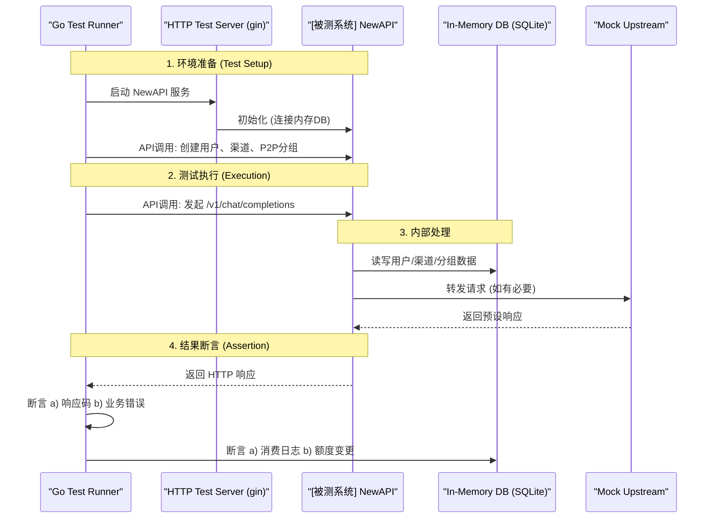

# NewAPI-Wquant 集成 - 分组与路由机制 测试设计与分析说明书

| 文档信息 | 内容 |
| :--- | :--- |
| **模块名称** | *NewAPI - Group & Routing Decoupling* |
| **文档作者** | *QA Team* |
| **测试环境** | *SIT / UAT* |
| **版本日期** | *2025-11-30* |

---

## 一、 测试方案原理 (Test Scheme & Methodology)

> **核心策略**: 采用**代码驱动的自动化集成测试**。所有测试场景的构建、执行与验证均在 **Go** 测试框架内完成。我们将利用 **HTTP Test Server** 启动被测 NewAPI 实例，通过程序化 API 调用来预设用户、渠道及分组关系，并使用**内存数据库 (In-Memory SQLite)** 确保测试环境的纯净与隔离。

### 1.1 测试拓扑与控制流 (Topology & Control)
测试流程完全自动化，通过 Go 测试代码控制所有变量，消除手动操作。



### 1.2 关键测试组件 (Key Components)

*   **测试运行器 (Test Runner)**: 基于 `go test`，负责编排测试生命周期 (`Setup`, `Teardown`) 和定义测试用例。
*   **HTTP Test Server**: 使用 `net/http/httptest` 包启动一个临时的 NewAPI 服务实例，监听本地端口，用于接收测试请求。
*   **内存数据库**: 使用 `gorm.io/driver/sqlite` 的内存模式 (`file::memory:?cache=shared`)，确保每个测试套件都有一个干净、独立的数据库环境，测试结束后自动销毁。
*   **Mock Server**: 对于需要模拟上游渠道（如 OpenAI, Anthropic）返回特定错误（如`429`, `500`）的场景，将启动一个独立的 `httptest.Server` 作为 Mock，并在测试渠道中配置其地址。

---

## 二、 测试点分析列表 (Test Point Analysis)

### 2.1 核心路由与鉴权测试 (Routing & Authorization)
**核心风险**: 验证 `BillingGroup` 和 `RoutingGroups` 解耦后，用户能否且仅能访问其有权访问的渠道。

| ID | 测试子项 | 变量控制 (用户、渠道、分组关系) | 预期路由结果 | 预期计费分组 | 优先级 |
| :--- | :--- | :--- | :--- | :--- | :--- |
| **R-01** | **基线-仅系统分组** | 用户A (group: vip), 渠道Ch1 (group: vip) | 成功路由到 Ch1 | vip | **P0** |
| **R-02** | **基线-跨系统分组** | 用户A (group: vip), 渠道Ch2 (group: default) | **无可用渠道** | - | **P0** |
| **R-03** | **P2P-基础共享** | 用户A (group: default), 用户B (group: vip)<br>渠道Ch-B (owner: B, P2P-Group: G1)<br>用户A **加入** G1 | 成功路由到 Ch-B | **default** | **P0** |
| **R-04** | **P2P-无权限访问** | 同上, 但用户A **未加入** G1 | **无可用渠道** | - | P1 |
| **R-05** | **P2P-私有渠道隔离** | 渠道Ch-B 设置为**私有** (is_private=true) | **无可用渠道** (即使A加入G1) | - | P1 |
| **R-06** | **Token-P2P组限制** | 用户A (group: vip), 加入G1, G2<br>渠道Ch1(G1), Ch2(G2)<br>Token **仅允许** G1 (`allowed_p2p_groups: [G1]`) | **只能**路由到 Ch1 | vip | **P0** |
| **R-07** | **Auto分组扩展** | 用户A (group: auto), 加入 P2P-Group G1<br>渠道Ch-vip(vip), 渠道Ch-G1(G1)<br>系统 auto 配置为 `[vip, svip]` | 可路由到 **Ch-vip** 或 **Ch-G1** | auto | P1 |

### 2.2 计费正确性测试 (Billing Correctness)
**核心风险**: 确保用户通过P2P分组使用他人渠道时，计费倍率严格遵循用户自身的`BillingGroup`。

| ID | 测试子项 | 场景描述 | 预置费率 | 预期扣费 | 优先级 |
| :--- | :--- | :--- | :--- | :--- | :--- |
| **B-01** | **高费率用户用低费率渠道** | 用户A(vip, rate=2) 通过P2P组使用用户B(default, rate=1)的渠道 | - | 按 **rate=2** 计费 | **P0** |
| **B-02** | **低费率用户用高费率渠道** | 用户B(default, rate=1) 通过P2P组使用用户A(vip, rate=2)的渠道 | - | 按 **rate=1** 计费 | **P0** |
| **B-03** | **Token覆盖计费分组** | 用户A(vip, rate=2) 使用了指定`group=default`的Token | - | 按 **rate=1** (default费率) 计费 | P1 |
| **B-04** | **Token降级约束** | 用户A(vip, rate=2) Token指定`group=default`(rate=1)<br>系统开启**防降级** | `can_downgrade=false` | 按 **rate=2** (用户自身费率) 计费 | P2 |

### 2.3 P2P分组管理API测试 (Group Management)
**核心风险**: 验证分组创建、加入、审批、退出等全生命周期管理的正确性。

| ID | 测试子项 | 操作步骤 | 预期DB状态/API响应 | 优先级 |
| :--- | :--- | :--- | :--- | :--- |
| **G-01** | **创建私有/共享分组** | POST /api/groups, `type`=1 & `type`=2 | `groups` 表新增记录, `owner_id` 正确 | P1 |
| **G-02** | **密码加入** | POST /api/groups/apply, 密码正确/错误 | 正确: `user_groups` status=1<br>错误: 报错 | P1 |
| **G-03** | **申请与审批** | 1. 申请加入(审核制)<br>2. Owner审批通过/拒绝 | 1. status=0 (Pending)<br>2. status=1(Active) / status=2(Rejected) | **P0** |
| **G-04** | **成员退出/被踢** | POST /api/groups/leave 或 PUT /api/groups/members | `user_groups` 记录被删除或状态变更 | P1 |
| **G-05** | **删除分组** | DELETE /api/groups | `groups` 和 `user_groups` 关联记录被级联删除 | P2 |

### 2.4 缓存一致性测试 (Cache Consistency)

| ID | 测试子项 | 操作步骤 | 观测点 | 预期结果 | 优先级 |
| :--- | :--- | :--- | :--- | :--- | :--- |
| **C-01** | **加入分组后权限即时生效** | 1. 用户A无法访问渠道Ch-G1<br>2. 将A加入G1<br>3. 用户A再次请求 | Redis/内存缓存 & API响应 | 步骤1失败, 步骤3**成功** (缓存被主动失效) | **P0** |
| **C-02** | **被踢出后权限即时失效** | 1. 用户A可访问渠道Ch-G1<br>2. 将A从G1踢出<br>3. 用户A再次请求 | Redis/内存缓存 & API响应 | 步骤1成功, 步骤3**失败** (缓存被主动失效) | **P0** |
---

## 三、 测试数据准备 (Test Data Preparation)

为了执行上述测试，需要在测试开始前通过 API 预置以下数据实体：

1.  **用户 (Users)**:
    *   `User-A`: 系统分组 `vip` (倍率: 2.0), 作为渠道和P2P分组的所有者。
    *   `User-B`: 系统分组 `default` (倍率: 1.0), 作为渠道的使用者。
    *   `User-C`: 系统分组 `svip` (倍率: 0.8), 用于测试特殊费率。

2.  **系统分组 (System Groups)**:
    *   `default`: `ratio=1.0`
    *   `vip`: `ratio=2.0`
    *   `svip`: `ratio=0.8`
    *   `auto`: 包含 `vip` 和 `svip`。
    *   **特殊组间倍率**: `svip` 用户使用 `default` 分组渠道时，费率 `ratio=0.5`。

3.  **P2P 分组 (P2P Groups)**:
    *   `G1_public`: Owner: User-A, 类型: 共享, 加入方式: 公开审核。
    *   `G2_private`: Owner: User-A, 类型: 私有。
    *   `G3_password`: Owner: User-C, 类型: 共享, 加入方式: 密码(`123456`)。

4.  **渠道 (Channels)**:
    *   `Ch_A_private`: Owner: User-A, 模型: `gpt-4`, 系统分组: `vip`, **私有**。
    *   `Ch_A_shared_G1`: Owner: User-A, 模型: `gpt-4`, 系统分组: `vip`, **P2P授权**: G1_public。
    *   `Ch_C_public`: Owner: User-C, 模型: `gpt-4`, 系统分组: `default`, **公开**。

5.  **令牌 (Tokens)**:
    *   `Token_B_unlimited`: 属于 User-B, 无 P2P 分组限制。
    *   `Token_B_limited_G1`: 属于 User-B, `allowed_p2p_groups` 仅包含 `G1_public`。
    *   `Token_B_billing_override`: 属于 User-B (vip), 但 `group` 字段强制设为 `default`。
## 四、 自动化测试实现方案 (Automated Test Implementation Plan)

为确保测试的效率、稳定性和可重复性，我们将采用纯代码驱动的自动化测试方案，集成在项目的 `scene_test` 目录下。

### 4.1 测试目录结构

所有场景化集成测试将统一存放在 `scene_test/` 目录中，并按被测核心模块进行组织：

```
new-api/
├── scene_test/
│   ├── main_test.go                  # 测试主入口, 负责编译和管理被测程序生命周期
│   ├── new-api-data-plane/
│   │   ├── billing/
│   │   │   └── billing_test.go       # 计费正确性测试
│   │   └── routing-authorization/
│   │       └── routing_test.go       # 核心路由与鉴权测试
│   └── new-api-management-plane/
│       ├── group-management/
│       │   └── group_management_test.go # P2P分组管理API测试
│       └── cache-consistency/
│           └── cache_test.go          # 缓存一致性测试
└── ... (其他项目源码)
```

### 4.2 测试生命周期与环境管理

我们将利用 `go test` 的 `TestMain` 函数来统一管理被测应用的生命周期。

1.  **编译 (Compilation)**:
    *   在 `scene_test/main_test.go` 的 `TestMain` 函数中，测试开始前，首先调用 Go 编译器 (`go build`) 编译 `main.go`，生成一个用于测试的、临时的可执行文件（如 `new-api.test.exe`）。

2.  **启动 (Setup)**:
    *   启动编译好的被测程序。通过设置**环境变量**的方式，强制其连接到**内存 SQLite 数据库**并监听一个随机的本地端口。
        *   `GIN_MODE=release`
        *   `SQL_DSN="file::memory:?cache=shared"`
        *   `PORT=0` (由系统自动选择可用端口)
    *   程序启动后，测试框架会捕获其实际监听的端口地址，用于后续的 API 调用。

3.  **运行测试 (Run)**:
    *   `TestMain` 调用 `m.Run()` 来执行 `*_test.go` 文件中定义的所有测试用例。

4.  **关闭 (Teardown)**:
    *   所有测试用例执行完毕后，`TestMain` 负责向被测程序进程发送终止信号 (`SIGTERM`)，确保其优雅退出。
    *   清理编译生成的可执行文件。

#### **`scene_test/main_test.go` 伪代码**
```go
package scene_test

import (
    "os"
    "os/exec"
    "testing"
)

var (
    testAppPath string
    serverCmd   *exec.Cmd
)

func TestMain(m *testing.M) {
    // 1. 编译被测程序
    testAppPath = "./new-api.test.exe"
    buildCmd := exec.Command("go", "build", "-o", testAppPath, "../main.go")
    if err := buildCmd.Run(); err != nil {
        panic("Failed to build test app: " + err.Error())
    }

    // 2. 启动服务 (在每个测试子目录的 Setup 中完成)
    // serverCmd = startTestServer()

    // 3. 运行所有测试
    exitCode := m.Run()

    // 4. 清理
    // if serverCmd != nil && serverCmd.Process != nil {
    //     serverCmd.Process.Kill()
    // }
    os.Remove(testAppPath)

    os.Exit(exitCode)
}
```

### 4.3 测试套件与用例实现

每个具体的测试目录（如 `billing/`, `routing-authorization/`）将遵循相似的结构：

1.  **套件级 Setup/Teardown**:
    *   使用 `testing` 包的功能或 `testify/suite` 框架，在每个测试文件（或套件）的 `SetupTest` / `BeforeTest` 方法中，启动和关闭被测服务。这确保了每个测试文件都在一个独立、干净的环境中运行。
    *   `SetupTest`:
        *   调用 `main_test.go` 中定义的函数，以预设的环境变量（内存DB、随机端口）启动 `new-api.test.exe`。
        *   通过 API 调用，准备该测试场景所需的基础数据（如创建用户、渠道）。
    *   `TearDownTest`:
        *   关闭被测服务进程。

2.  **测试用例 (Test Functions)**:
    *   每个 `TestXxx` 函数负责一个具体的测试场景。
    *   **Arrange**: 准备该场景的特定输入（如构建一个 `v1/chat/completions` 的请求体）。
    *   **Act**: 使用 Go 的 `net/http` 客户端向测试服务器发送请求。
    *   **Assert**:
        *   使用 `testify/assert` 库断言 HTTP 响应码、响应体内容是否符合预期。
        *   直接连接到内存数据库（因为是 `cache=shared` 模式），查询 `logs`, `users` 等表，断言数据变更是否正确。

#### **`billing_test.go` 伪代码**
```go
package billing_test

import (
    "net/http"
    "testing"
    "github.com/stretchr/testify/assert"
)

// (SetupTest / TeardownTest 在这里启动和关闭服务)

func TestBilling_HighRateUserUsesLowRateChannel(t *testing.T) {
    // Arrange: 准备用户A(vip), B(default), 渠道Ch-B(owner B), A加入B的分组
    // ... 通过 API 调用预置数据 ...
    // 获取用户A的Token

    // Act: 用户A使用其Token请求一个通过Ch-B路由的模型
    req, _ := http.NewRequest("POST", testServerURL+"/v1/chat/completions", ...)
    req.Header.Set("Authorization", "Bearer "+tokenOfUserA)
    resp, _ := http.DefaultClient.Do(req)

    // Assert:
    assert.Equal(t, http.StatusOK, resp.StatusCode)
    
    // 连接到内存数据库，查询消费日志
    log := queryLatestLogFromDB(userA.ID)
    
    // 预期扣费应基于用户A的vip费率(rate=2)，而不是渠道B的default费率(rate=1)
    expectedQuota := calculateQuota(baseTokens, 2.0)
    assert.Equal(t, expectedQuota, log.Quota)
}
```
通过这种方式，整个测试流程实现了完全的自动化和代码化，保证了测试的一致性和高效率。