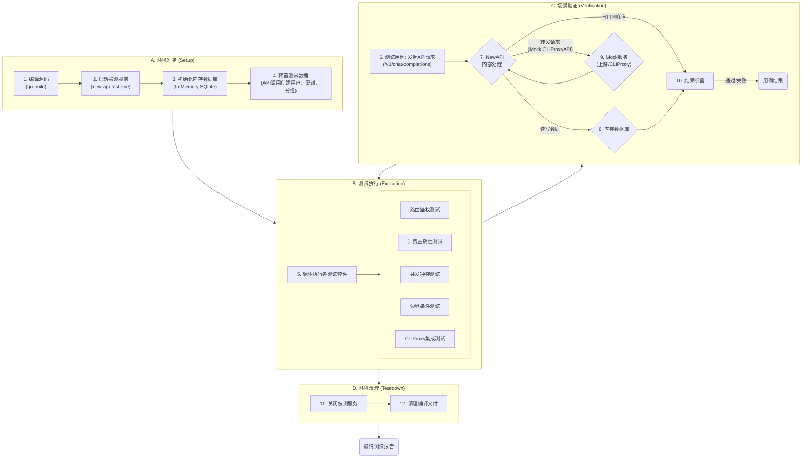

# NewAPI-Wquant 集成 - 分组与路由机制 测试设计与分析说明书

| 文档信息 | 内容 |
| :--- | :--- |
| **模块名称** | *NewAPI - Group & Routing Decoupling* |
| **文档作者** | *QA Team* |
| **测试环境** | *SIT / UAT* |
| **版本日期** | *2025-11-30* |

---

## 一、 测试方案原理 (Test Scheme & Methodology)

> **核心策略**: 采用**代码驱动的自动化集成测试**。所有测试场景的构建、执行与验证均在 **Go** 测试框架内完成。我们将利用 **HTTP Test Server** 启动被测 NewAPI 实例，通过程序化 API 调用来预设用户、渠道及分组关系，并使用**内存数据库 (In-Memory SQLite)** 确保测试环境的纯净与隔离。

### 1.1 自动化测试流程总览 (Automated Test Flow)

测试流程遵循“编译-启动-测试-清理”的生命周期，确保每次运行都在一个隔离、纯净的环境中进行，从而保证测试结果的稳定性和可信性。




### 1.2 关键测试组件 (Key Components)

*   **测试运行器 (Test Runner)**: 基于 `go test`，负责编排测试生命周期 (`Setup`, `Teardown`) 和定义测试用例。
*   **HTTP Test Server**: 使用 `net/http/httptest` 包启动一个临时的 NewAPI 服务实例，监听本地端口，用于接收测试请求。
*   **内存数据库**: 使用 `gorm.io/driver/sqlite` 的内存模式 (`file::memory:?cache=shared`)，确保每个测试套件都有一个干净、独立的数据库环境，测试结束后自动销毁。
*   **Mock Server**: 对于需要模拟上游渠道（如 OpenAI, Anthropic）返回特定错误（如`429`, `500`）的场景，将启动一个独立的 `httptest.Server` 作为 Mock，并在测试渠道中配置其地址。

---

## 二、 测试点分析列表 (Test Point Analysis)

### 2.1 核心路由与权限测试 (Routing & Authorization)
**核心风险**: 验证 `BillingGroup` (计费分组) 和 `RoutingGroups` (路由分组) 解耦后，用户能否且仅能访问其有权访问的渠道集合。

| ID | 测试场景 | 变量控制 (用户、渠道、分组关系) | 预期路由结果 | 预期计费分组 | 优先级 |
| :--- | :--- | :--- | :--- | :--- | :--- |
| **R-01** | **基线-仅系统分组** | 用户A (group: vip), 渠道Ch1 (group: vip) | 成功路由到 Ch1 | vip | **P0** |
| **R-02** | **基线-跨系统分组** | 用户A (group: vip), 渠道Ch2 (group: default) | **无可用渠道** | - | **P0** |
| **R-03** | **P2P-基础共享** | 用户A (group: default), 用户B (group: vip)<br>渠道Ch-B (owner: B, 授权给 P2P-Group G1)<br>用户A **加入** G1 | 成功路由到 Ch-B | **default** | **P0** |
| **R-04** | **P2P-无权限访问** | 同上, 但用户A **未加入** G1 | **无可用渠道** | - | P1 |
| **R-05** | **P2P-私有渠道隔离** | 渠道Ch-B (owner: B, 授权给 G1) 设置为**私有** (`is_private:true`)<br>用户A **加入** G1 | **无可用渠道** (即使A加入G1, 私有渠道仅Owner可见) | - | **P0** |
| **R-06** | **P2P-私有渠道自用** | 渠道Ch-A (owner: A, **私有**)<br>用户A访问 | **成功**路由到 Ch-A | 用户A的分组 | P1 |
| **R-07** | **Token-P2P组限制** | 用户A (group: vip), 同时加入 G1, G2<br>渠道Ch1(授权G1), 渠道Ch2(授权G2)<br>Token **仅允许** G1 (`allowed_p2p_groups: [G1]`) | **只能**路由到 Ch1 | vip | **P0** |
| **R-08** | **Auto分组与P2P叠加** | 用户A (group: auto), 加入 P2P-Group G1<br>渠道Ch-vip(vip), 渠道Ch-G1(G1)<br>系统 `auto` 配置为 `[vip, svip]` | 可路由到 **Ch-vip** (通过auto) 或 **Ch-G1** (通过P2P) | auto | P1 |

### 2.2 计费正确性测试 (Billing Correctness)
**核心风险**: 确保用户通过P2P分组使用他人渠道时，计费倍率严格遵循 **消费者** 自身的 `BillingGroup`，而非渠道提供者的分组。

| ID | 测试场景 | 场景描述 | 预置费率 | 预期扣费 | 优先级 |
| :--- | :--- | :--- | :--- | :--- | :--- |
| **B-01** | **消费者费率原则-1 (高用低)** | 用户A(vip, rate=2) 通过P2P组使用用户B(default, rate=1)的渠道 | - | 按消费者A的 **rate=2** 计费 | **P0** |
| **B-02** | **消费者费率原则-2 (低用高)** | 用户B(default, rate=1) 通过P2P组使用用户A(vip, rate=2)的渠道 | - | 按消费者B的 **rate=1** 计费 | **P0** |
| **B-03** | **Token强制计费分组** | 用户A(vip, rate=2) 使用了一个强制指定 `group=default` 的Token | - | 按Token指定的 **rate=1** (default费率) 计费 | P1 |
| **B-04** | **Token计费防降级** | 用户A(vip, rate=2) 使用了强制`group=default`(rate=1)的Token<br>但系统开启**防降级** (`can_downgrade=false`) | `can_downgrade=false` | 按用户A自身的 **rate=2** 计费 (Token降级无效) | P2 |
| **B-05** | **P2P分享收益** | 用户B(消费者)使用用户A(提供者)的共享渠道。<br>假设消费1000额度。 | `ShareRatio` = 0.5 | **消费者(B)**: 正常扣费1000<br>**提供者(A)**: `share_quota`增加 `500` | **P0** |

### 2.3 计费与P2P分组正交测试 (Orthogonal Test for Billing & P2P)
**核心风险**: 深入验证当渠道同时归属于系统分组和P2P分组时，路由与计费的决策是否依然遵循“**计费看自己，路由看交集**”的核心原则。

| 消费者<br>系统分组 | 渠道<br>系统分组 | 渠道<br>P2P授权 | 消费者<br>P2P状态 | **预期路由结果** | **预期计费分组** | **逻辑说明** |
| :--- | :--- | :--- | :--- | :--- | :--- | :--- |
| `default` | `vip` | *无* | *未加入* | **失败** | - | 消费者(`default`)与渠道(`vip`)的系统分组不匹配。 |
| `vip` | `vip` | *无* | *未加入* | **成功** | `vip` | 消费者(`vip`)与渠道(`vip`)的系统分组匹配。 |
| `default` | `default` | G1 | **已加入 G1** | **成功** | `default` | **与关系**: 消费者与渠道的系统分组(`default`)匹配, **且** P2P分组(G1)也匹配。 |
| `default` | `vip` | G1 | **已加入 G1** | **失败** | - | **与关系**: P2P分组(G1)匹配, 但系统分组不匹配(`default` vs `vip`)。 |
| `vip` | `default` | *无* | **已加入 G1** | **失败** | - | 渠道未授权P2P分组，且系统分组不匹配。 |
| `vip` | `default` | G1 | **已加入 G1** | **失败** | - | **与关系**: P2P分组(G1)匹配, 但系统分组不匹配(`vip` vs `default`)。 |
| `vip` (Token覆盖为`default`) | `default` | G1 | **已加入 G1** | **成功** | `default` | **与关系**: 消费者的计费分组被Token覆盖为`default`，与渠道系统分组匹配, **且** P2P分组(G1)也匹配。 |
| `default` (Token限制P2P为`G2`) | `default` | G1 | **已加入 G1, G2** | **失败** | - | **与关系**: 系统分组匹配, 但Token将P2P权限限制为`G2`，与渠道的`G1`授权不匹配。 |

### 2.4 P2P分组管理API测试 (Group Management)
**核心风险**: 验证分组创建、加入、审批、退出等全生命周期管理的正确性。

| ID | 测试子项 | 操作步骤 | 预期DB状态/API响应 | 优先级 |
| :--- | :--- | :--- | :--- | :--- |
| **G-01** | **创建私有/共享分组** | POST /api/groups, `type`=1 & `type`=2 | `groups` 表新增记录, `owner_id` 正确 | P1 |
| **G-02** | **密码加入** | POST /api/groups/apply, 密码正确/错误 | 正确: `user_groups` status=1<br>错误: 报错 | P1 |
| **G-03** | **申请与审批** | 1. 申请加入(审核制)<br>2. Owner审批通过/拒绝 | 1. status=0 (Pending)<br>2. status=1(Active) / status=2(Rejected) | **P0** |
| **G-04** | **成员退出/被踢** | POST /api/groups/leave 或 PUT /api/groups/members | `user_groups` 记录被删除或状态变更 | P1 |
| **G-05** | **删除分组** | DELETE /api/groups | `groups` 和 `user_groups` 关联记录被级联删除 | P2 |

### 2.5 缓存一致性测试 (Cache Consistency)

### 2.5 并发与数据一致性测试 (Concurrency & Consistency)
**核心风险**: 验证在数据面请求处理过程中，控制面发生变更时的系统鲁棒性。

| ID | 测试场景 | 并发操作步骤 | 预期行为 | 优先级 |
| :--- | :--- | :--- | :--- | :--- |
| **CON-01** | **请求中被踢出分组** | 1. 用户A通过P2P分组G1发起一个**长耗时**的流式请求。<br>2. 在请求返回**期间**，Owner将用户A从G1中踢出。 | a) 正在进行的请求**正常完成**并按原权限计费。<br>b) 后续新请求立即**无法访问**该渠道。 | **P0** |
| **CON-02** | **请求中渠道被禁用** | 1. 用户A发起一个长耗时请求。<br>2. 在请求返回**期间**，渠道Owner或管理员**禁用**该渠道。 | a) 正在进行的请求**正常完成**计费。<br>b) 后续新请求立即**无法访问**该渠道。 | P1 |
| **CON-03** | **请求中渠道被删除** | 1. 用户A发起一个长耗时请求。<br>2. 在请求返回**期间**，渠道Owner或管理员**删除**该渠道。 | a) 正在进行的请求**正常完成**计费。<br>b) 后续新请求立即**无法访问**该渠道。 | P1 |

### 2.6 边界与极端场景测试 (Boundary & Edge Cases)
**核心风险**: 验证系统在处理大量分组、复杂权限组合等极端配置下的性能和正确性。

| ID | 测试场景 | 极端条件描述 | 预期行为 | 优先级 |
| :--- | :--- | :--- | :--- | :--- |
| **E-01** | **用户加入大量分组** | 用户A加入100个P2P分组，请求一个在第100个分组里才有的渠道。 | a) 路由选择正确，能找到目标渠道。<br>b) 首次请求的路由耗时在可接受范围 (<500ms)。 | P2 |
| **E-02** | **渠道授权大量分组** | 一个渠道Ch-X被授权给100个P2P分组。用户A仅属于其中一个分组。 | a) 用户A能正确访问到Ch-X。<br>b) 路由性能无明显下降。 | P2 |
| **E-03** | **Token拥有全部权限** | 用户A加入所有（100+）P2P分组，其Token不设任何P2P限制。 | a) 路由逻辑能正确处理“全集”权限。<br>b) 请求路由性能无明显下降。 | P2 |

### 2.8 令牌与安全测试 (Token & Security)
**核心风险**: 验证令牌级别的访问控制（如模型、IP白名单）是否按预期生效。

| ID | 测试场景 | 变量控制 | 预期行为 | 优先级 |
| :--- | :--- | :--- | :--- | :--- |
| **TKN-01** | **令牌模型白名单** | 1. 创建令牌，`model_limits` 设置为 `['gpt-4o']`。<br>2. 使用该令牌请求 `claude-3-opus`。 | 请求被拒绝，返回权限错误。 | P1 |
| **TKN-02** | **令牌IP白名单** | 1. 创建令牌，`ip_whitelist` 设置为 `['192.168.1.100']`。<br>2. 从 `192.168.1.101` 发起请求。 | 请求被拒绝，返回IP受限错误。 | P2 |

### 2.9 数据看板接口测试 (Dashboard API)
**核心风险**: 验证 `/api/dashboard/*` 接口返回的聚合数据是否准确，与底层明细日志保持一致。

| ID | 测试场景 | 操作步骤 | 预期行为 | 优先级 |
| :--- | :--- | :--- | :--- | :--- |
| **DASH-01** | **核心指标一致性** | 1. 记录初始看板数据 D1。<br>2. 执行一次消费1000额度的操作，并产生500的分享收益。<br>3. 再次查询看板数据 D2。 | a) D2.总消耗 = D1.总消耗 + 1000<br>b) D2.总收益 = D1.总收益 + 500<br>c) D2.模型分布图表中对应模型消耗增加。 | P2 |

---

## 三、 测试数据准备 (Test Data Preparation)

所有测试均基于以下预置实体及其关系。测试代码应在 `Setup` 阶段通过 API 动态创建这些实体，确保环境纯净。

1.  **用户 (Users)**:
    *   `User-A`: 系统分组 `vip` (倍率: 2.0), 作为渠道和P2P分组的所有者。
    *   `User-B`: 系统分组 `default` (倍率: 1.0), 作为渠道的使用者。
    *   `User-C`: 系统分组 `svip` (倍率: 0.8), 用于测试特殊费率。

2.  **系统分组 (System Groups)**:
    *   `default`: `ratio=1.0`
    *   `vip`: `ratio=2.0`
    *   `svip`: `ratio=0.8`
    *   `auto`: 包含 `vip` 和 `svip`。
    *   **特殊组间倍率**: `svip` 用户使用 `default` 分组渠道时，费率 `ratio=0.5`。

2.5 **收益分享配置 (Share Ratio Config)**:
    *   `ShareRatio`: `0.5` (全局分享收益倍率)。

3.  **P2P 分组 (P2P Groups)**:
    *   `G1_public`: Owner: User-A, 类型: 共享, 加入方式: 公开审核。
    *   `G2_private`: Owner: User-A, 类型: 私有。
    *   `G3_password`: Owner: User-C, 类型: 共享, 加入方式: 密码(`123456`)。

4.  **渠道 (Channels)**:
    *   `Ch_A_private`: Owner: User-A, 模型: `gpt-4`, 系统分组: `vip`, **私有** (`is_private:true`)。
    *   `Ch_A_shared_G1`: Owner: User-A, 模型: `gpt-4`, 系统分组: `vip`, **P2P授权**: G1_public。
    *   `Ch_C_public`: Owner: User-C, 模型: `gpt-4`, 系统分组: `default`, **公开** (无授权限制)。
    *   `Ch_CLI_1`: 类型: `CLIProxyAPI`, 模型: `gemini-pro`, `account_hint`: `user1.json`。
    *   `Ch_CLI_2`: 类型: `CLIProxyAPI`, 模型: `gemini-pro`, `account_hint`: `user2.json`。

5.  **令牌 (Tokens)**:
    *   `Token_A`: 属于 User-A, 用于测试私有渠道自用等场景。
    *   `Token_B_unlimited`: 属于 User-B, 无 P2P 分组限制。
    *   `Token_B_limited_G1`: 属于 User-B, `allowed_p2p_groups` 仅包含 `G1_public`。
    *   `Token_B_billing_override`: 属于 User-B (vip), 但 `group` 字段强制设为 `default`。

6.  **Mock 服务 (Mock Servers)**:
    *   `Mock_CLIProxyAPI`: 一个独立的 `httptest.Server`，模拟 CLIProxyAPI 的管理接口 (如 `/v0/management/gemini-cli-auth-url`) 和数据平面接口，用于测试 OAuth 流程和 `account_hint` 路由。
## 四、 自动化测试实现方案 (Automated Test Implementation Plan)

为确保测试的效率、稳定性和可重复性，我们将采用纯代码驱动的自动化测试方案，集成在项目的 `scene_test` 目录下。

### 4.1 测试目录结构

所有场景化集成测试将统一存放在 `scene_test/` 目录中，并按被测核心模块进行组织：

```
new-api/
├── scene_test/
│   ├── main_test.go                  # 测试主入口, 负责编译和管理被测程序生命周期
│   ├── new-api-data-plane/
│   │   ├── billing/
│   │   │   └── billing_test.go       # 计费正确性测试
│   │   └── routing-authorization/
│   │       └── routing_test.go       # 核心路由与鉴权测试
│   └── new-api-management-plane/
│       ├── group-management/
│       │   └── group_management_test.go # P2P分组管理API测试
│       └── cache-consistency/
│           └── cache_test.go          # 缓存一致性测试
└── ... (其他项目源码)
```

### 4.2 测试生命周期与环境管理

我们将利用 `go test` 的 `TestMain` 函数来统一管理被测应用的生命周期。

1.  **编译 (Compilation)**:
    *   在 `scene_test/main_test.go` 的 `TestMain` 函数中，测试开始前，首先调用 Go 编译器 (`go build`) 编译 `main.go`，生成一个用于测试的、临时的可执行文件（如 `new-api.test.exe`）。

2.  **启动 (Setup)**:
    *   启动编译好的被测程序。通过设置**环境变量**的方式，强制其连接到**内存 SQLite 数据库**并监听一个随机的本地端口。
        *   `GIN_MODE=release`
        *   `SQL_DSN="file::memory:?cache=shared"`
        *   `PORT=0` (由系统自动选择可用端口)
    *   程序启动后，测试框架会捕获其实际监听的端口地址，用于后续的 API 调用。

3.  **运行测试 (Run)**:
    *   `TestMain` 调用 `m.Run()` 来执行 `*_test.go` 文件中定义的所有测试用例。

4.  **关闭 (Teardown)**:
    *   所有测试用例执行完毕后，`TestMain` 负责向被测程序进程发送终止信号 (`SIGTERM`)，确保其优雅退出。
    *   清理编译生成的可执行文件。

#### **`scene_test/main_test.go` 伪代码**
```go
package scene_test

import (
    "os"
    "os/exec"
    "testing"
)

var (
    testAppPath string
    serverCmd   *exec.Cmd
)

func TestMain(m *testing.M) {
    // 1. 编译被测程序
    testAppPath = "./new-api.test.exe"
    buildCmd := exec.Command("go", "build", "-o", testAppPath, "../main.go")
    if err := buildCmd.Run(); err != nil {
        panic("Failed to build test app: " + err.Error())
    }

    // 2. 启动服务 (在每个测试子目录的 Setup 中完成)
    // serverCmd = startTestServer()

    // 3. 运行所有测试
    exitCode := m.Run()

    // 4. 清理
    // if serverCmd != nil && serverCmd.Process != nil {
    //     serverCmd.Process.Kill()
    // }
    os.Remove(testAppPath)

    os.Exit(exitCode)
}
```

### 4.3 测试套件与用例实现

每个具体的测试目录（如 `billing/`, `routing-authorization/`）将遵循相似的结构：

1.  **套件级 Setup/Teardown**:
    *   使用 `testing` 包的功能或 `testify/suite` 框架，在每个测试文件（或套件）的 `SetupTest` / `BeforeTest` 方法中，启动和关闭被测服务。这确保了每个测试文件都在一个独立、干净的环境中运行。
    *   `SetupTest`:
        *   调用 `main_test.go` 中定义的函数，以预设的环境变量（内存DB、随机端口）启动 `new-api.test.exe`。
        *   通过 API 调用，准备该测试场景所需的基础数据（如创建用户、渠道）。
    *   `TearDownTest`:
        *   关闭被测服务进程。

2.  **测试用例 (Test Functions)**:
    *   每个 `TestXxx` 函数负责一个具体的测试场景。
    *   **Arrange**: 准备该场景的特定输入（如构建一个 `v1/chat/completions` 的请求体）。
    *   **Act**: 使用 Go 的 `net/http` 客户端向测试服务器发送请求。
    *   **Assert**:
        *   使用 `testify/assert` 库断言 HTTP 响应码、响应体内容是否符合预期。
        *   直接连接到内存数据库（因为是 `cache=shared` 模式），查询 `logs`, `users` 等表，断言数据变更是否正确。

#### **`billing_test.go` 伪代码**
```go
package billing_test

import (
    "net/http"
    "testing"
    "github.com/stretchr/testify/assert"
)

// (SetupTest / TeardownTest 在这里启动和关闭服务)

func TestBilling_HighRateUserUsesLowRateChannel(t *testing.T) {
    // Arrange: 准备用户A(vip), B(default), 渠道Ch-B(owner B), A加入B的分组
    // ... 通过 API 调用预置数据 ...
    // 获取用户A的Token

    // Act: 用户A使用其Token请求一个通过Ch-B路由的模型
    req, _ := http.NewRequest("POST", testServerURL+"/v1/chat/completions", ...)
    req.Header.Set("Authorization", "Bearer "+tokenOfUserA)
    resp, _ := http.DefaultClient.Do(req)

    // Assert:
    assert.Equal(t, http.StatusOK, resp.StatusCode)
    
    // 连接到内存数据库，查询消费日志
    log := queryLatestLogFromDB(userA.ID)
    
    // 预期扣费应基于用户A的vip费率(rate=2)，而不是渠道B的default费率(rate=1)
    expectedQuota := calculateQuota(baseTokens, 2.0)
    assert.Equal(t, expectedQuota, log.Quota)
}
```
通过这种方式，整个测试流程实现了完全的自动化和代码化，保证了测试的一致性和高效率。

## 五、测试实现与集成说明

为确保测试的效率、稳定性和可重复性，我们将采用纯代码驱动的自动化测试方案，并集成在项目的 `scene_test` 目录下。

### 5.1 测试目录结构

所有场景化集成测试将统一存放在 `scene_test/` 目录中，并按被测核心模块进行组织：
```
new-api/
├── scene_test/
│   ├── main_test.go                  # 测试主入口, 负责编译和管理被测程序生命周期
│   ├── new-api-data-plane/
│   │   ├── billing/
│   │   │   └── billing_test.go       # 计费正确性测试
│   │   └── routing-authorization/
│   │       └── routing_test.go       # 核心路由与鉴权测试
│   └── new-api-management-plane/
│       ├── group-management/
│       │   └── group_management_test.go # P2P分组管理API测试
│       └── cache-consistency/
│           └── cache_test.go          # 缓存一致性测试
└── ... (其他项目源码)
```

### 5.2 测试生命周期与环境管理

我们将利用 `go test` 的 `TestMain` 函数来统一管理被测应用的生命周期。
1.  **编译 (Compilation)**: 在 `scene_test/main_test.go` 中，测试开始前调用 Go 编译器 (`go build`) 生成一个临时的可执行文件。
2.  **启动 (Setup)**: 通过设置环境变量，强制被测程序连接到内存 SQLite 数据库并监听随机端口。
3.  **运行测试 (Run)**: 执行 `*_test.go` 中定义的所有测试用例。
4.  **关闭 (Teardown)**: 终止被测程序进程并清理编译产物。