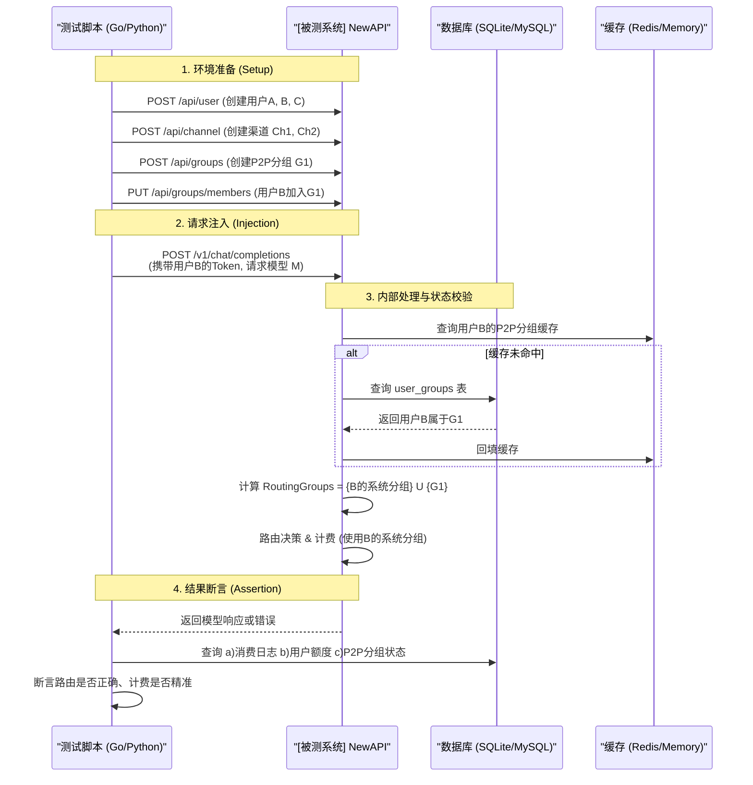

# NewAPI-Wquant 集成 - 分组与路由机制 测试设计与分析说明书

| 文档信息 | 内容 |
| :--- | :--- |
| **模块名称** | *NewAPI - Group & Routing Decoupling* |
| **文档作者** | *QA Team* |
| **测试环境** | *SIT / UAT* |
| **版本日期** | *2025-11-30* |

---

## 一、 测试方案原理 (Test Scheme & Methodology)

> **核心策略**：围绕 **P2P 分组与路由/计费解耦** 的核心改动，采用 **API 驱动的灰盒测试** 模式。通过调用 NewAPI 的管理接口预设用户、渠道及分组关系，然后模拟终端用户发起 AI 请求，验证在不同权限组合下，系统的路由、鉴权和计费行为是否符合设计预期。

### 1.1 测试拓扑与控制流 (Topology & Control)
测试将完全通过 API 调用来控制，不依赖 UI 操作。核心控制点包括用户/渠道/分组的**预置数据**和**发起请求的参数**。

### 1.2 关键检测点设计 (Checkpoints)

*   **输入注入点**:
    *   **管理API**: `/api/user`, `/api/channel`, `/api/groups`, `/api/token` 等，用于构造测试场景。
    *   **数据平面API**: `/v1/chat/completions`，用于触发核心业务逻辑。
*   **中间态观测点**:
    *   `user_groups` 表：验证成员关系、状态是否正确。
    *   `channels` 表：验证 `allowed_groups` 字段是否按预期工作。
    *   `tokens` 表：验证 `allowed_p2p_groups` 限制是否生效。
    *   `Redis/Memory Cache`: 验证用户 P2P 分组缓存的创建与失效。
*   **输出观测点**:
    *   **API 响应**: 请求是成功路由到预期渠道，还是返回权限错误。
    *   **消费日志 (`logs` 表)**: 验证 `model`, `channel_id`, `group`, `quota` 等字段是否正确，特别是 `group` 字段是否为 `BillingGroup`。
    *   **用户额度 (`users` 表)**: 验证计费是否精准。

---

## 二、 测试点分析列表 (Test Point Analysis)

### 2.1 核心路由与鉴权测试 (Routing & Authorization)
**核心风险**: 验证 `BillingGroup` 和 `RoutingGroups` 解耦后，用户能否且仅能访问其有权访问的渠道。

| ID | 测试子项 | 变量控制 (用户、渠道、分组关系) | 预期路由结果 | 预期计费分组 | 优先级 |
| :--- | :--- | :--- | :--- | :--- | :--- |
| **R-01** | **基线-仅系统分组** | 用户A (group: vip), 渠道Ch1 (group: vip) | 成功路由到 Ch1 | vip | **P0** |
| **R-02** | **基线-跨系统分组** | 用户A (group: vip), 渠道Ch2 (group: default) | **无可用渠道** | - | **P0** |
| **R-03** | **P2P-基础共享** | 用户A (group: default), 用户B (group: vip) 渠道Ch-B (owner: B, P2P-Group: G1) 用户A **加入** G1 | 成功路由到 Ch-B | **default** | **P0** |
| **R-04** | **P2P-无权限访问** | 同上, 但用户A **未加入** G1 | **无可用渠道** | - | P1 |
| **R-05** | **P2P-私有渠道隔离** | 渠道Ch-B 设置为**私有** (is_private=true) | **无可用渠道** (即使A加入G1) | - | P1 |
| **R-06** | **Token-P2P组限制** | 用户A (group: vip), 加入G1, G2 渠道Ch1(G1), Ch2(G2) Token **仅允许** G1 (`allowed_p2p_groups: [G1]`) | **只能**路由到 Ch1 | vip | **P0** |
| **R-07** | **Auto分组扩展** | 用户A (group: auto), 加入 P2P-Group G1 渠道Ch-vip(vip), 渠道Ch-G1(G1) 系统 auto 配置为 `[vip, svip]` | 可路由到 **Ch-vip** 或 **Ch-G1** | auto | P1 |

### 2.2 计费正确性测试 (Billing Correctness)
**核心风险**: 确保用户通过P2P分组使用他人渠道时，计费倍率严格遵循用户自身的`BillingGroup`。

| ID | 测试子项 | 场景描述 | 预置费率 | 预期扣费 | 优先级 |
| :--- | :--- | :--- | :--- | :--- | :--- |
| **B-01** | **高费率用户用低费率渠道** | 用户A(vip, rate=2) 通过P2P组使用用户B(default, rate=1)的渠道 | - | 按 **rate=2** 计费 | **P0** |
| **B-02** | **低费率用户用高费率渠道** | 用户B(default, rate=1) 通过P2P组使用用户A(vip, rate=2)的渠道 | - | 按 **rate=1** 计费 | **P0** |
| **B-03** | **Token覆盖计费分组** | 用户A(vip, rate=2) 使用了指定`group=default`的Token | - | 按 **rate=1** (default费率) 计费 | P1 |
| **B-04** | **Token降级约束** | 用户A(vip, rate=2) Token指定`group=default`(rate=1) 系统开启**防降级** | `can_downgrade=false` | 按 **rate=2** (用户自身费率) 计费 | P2 |

### 2.3 P2P分组管理API测试 (Group Management)
**核心风险**: 验证分组创建、加入、审批、退出等全生命周期管理的正确性。

| ID | 测试子项 | 操作步骤 | 预期DB状态/API响应 | 优先级 |
| :--- | :--- | :--- | :--- | :--- |
| **G-01** | **创建私有/共享分组** | POST /api/groups, `type`=1 & `type`=2 | `groups` 表新增记录, `owner_id` 正确 | P1 |
| **G-02** | **密码加入** | POST /api/groups/apply, 密码正确/错误 | 正确: `user_groups` status=1 错误: 报错 | P1 |
| **G-03** | **申请与审批** | 1. 申请加入(审核制) 2. Owner审批通过/拒绝 | 1. status=0 (Pending) 2. status=1(Active) / status=2(Rejected) | **P0** |
| **G-04** | **成员退出/被踢** | POST /api/groups/leave 或 PUT /api/groups/members | `user_groups` 记录被删除或状态变更 | P1 |
| **G-05** | **删除分组** | DELETE /api/groups | `groups` 和 `user_groups` 关联记录被级联删除 | P2 |

### 2.4 缓存一致性测试 (Cache Consistency)

| ID | 测试子项 | 操作步骤 | 观测点 | 预期结果 | 优先级 |
| :--- | :--- | :--- | :--- | :--- | :--- |
| **C-01** | **加入分组后权限即时生效** | 1. 用户A无法访问渠道Ch-G1 2. 将A加入G1 3. 用户A再次请求 | Redis/内存缓存 & API响应 | 步骤1失败, 步骤3**成功** (缓存被主动失效) | **P0** |
| **C-02** | **被踢出后权限即时失效** | 1. 用户A可访问渠道Ch-G1 2. 将A从G1踢出 3. 用户A再次请求 | Redis/内存缓存 & API响应 | 步骤1成功, 步骤3**失败** (缓存被主动失效) | **P0** |
---

## 三、 测试数据准备 (Test Data Preparation)

为了执行上述测试，需要在测试开始前通过 API 预置以下数据实体：

1.  **用户 (Users)**:
    *   `User-A`: 系统分组 `vip` (倍率: 2.0), 作为渠道和P2P分组的所有者。
    *   `User-B`: 系统分组 `default` (倍率: 1.0), 作为渠道的使用者。
    *   `User-C`: 系统分组 `svip` (倍率: 0.8), 用于测试特殊费率。

2.  **系统分组 (System Groups)**:
    *   `default`: `ratio=1.0`
    *   `vip`: `ratio=2.0`
    *   `svip`: `ratio=0.8`
    *   `auto`: 包含 `vip` 和 `svip`。
    *   **特殊组间倍率**: `svip` 用户使用 `default` 分组渠道时，费率 `ratio=0.5`。

3.  **P2P 分组 (P2P Groups)**:
    *   `G1_public`: Owner: User-A, 类型: 共享, 加入方式: 公开审核。
    *   `G2_private`: Owner: User-A, 类型: 私有。
    *   `G3_password`: Owner: User-C, 类型: 共享, 加入方式: 密码(`123456`)。

4.  **渠道 (Channels)**:
    *   `Ch_A_private`: Owner: User-A, 模型: `gpt-4`, 系统分组: `vip`, **私有**。
    *   `Ch_A_shared_G1`: Owner: User-A, 模型: `gpt-4`, 系统分组: `vip`, **P2P授权**: G1_public。
    *   `Ch_C_public`: Owner: User-C, 模型: `gpt-4`, 系统分组: `default`, **公开**。

5.  **令牌 (Tokens)**:
    *   `Token_B_unlimited`: 属于 User-B, 无 P2P 分组限制。
    *   `Token_B_limited_G1`: 属于 User-B, `allowed_p2p_groups` 仅包含 `G1_public`。
    *   `Token_B_billing_override`: 属于 User-B (vip), 但 `group` 字段强制设为 `default`。