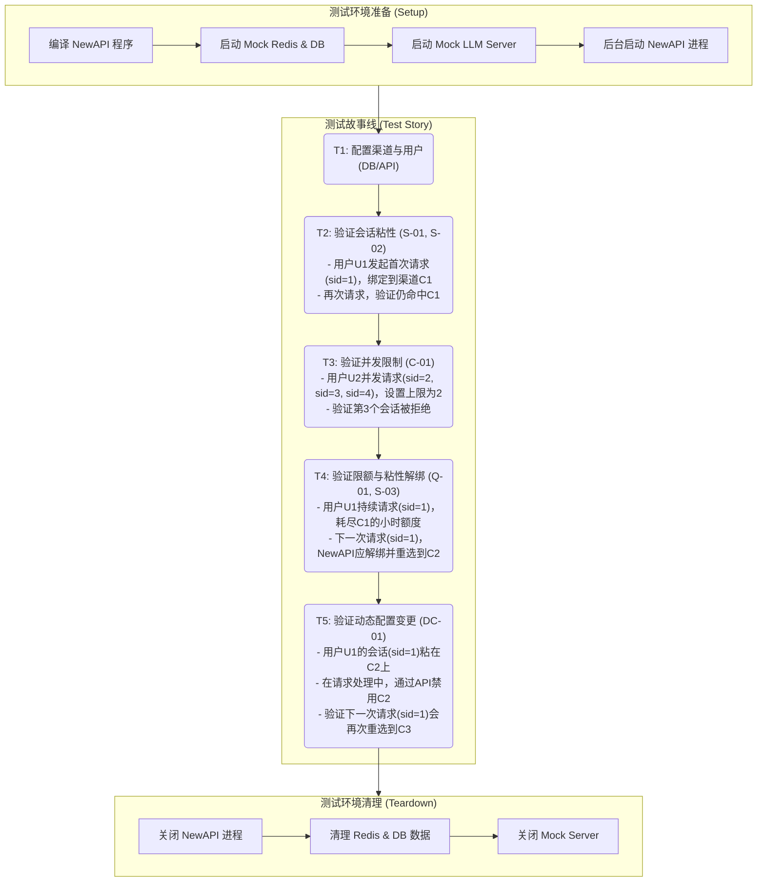
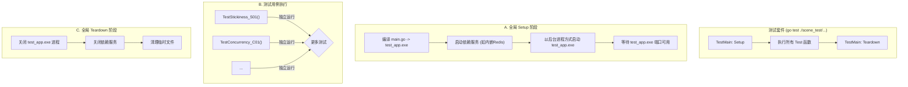

# NewAPI - 会话粘性与分时限额 测试设计与分析说明书

| 文档信息 | 内容 |
| :--- | :--- |
| **模块名称** | *Relay - Session Stickiness & Time-based Quota* |
| **文档作者** | *Gemini* |
| **测试环境** | *SIT (Mock Mode) / UAT (Real Channel)* |
| **版本日期** | *2025-12-07* |

---

## 一、 测试方案总览 (Test Scheme Overview)

> **核心策略**：本次测试将采用**端到端（E2E）的灰盒测试**模式。我们将把编译后的 `new-api` 程序作为一个黑盒实体进行部署和测试，完全通过其对外暴露的 HTTP API 进行交互，模拟真实的用户请求。同时，为了精确验证内部状态和逻辑的正确性，测试代码将拥有访问**数据库（DB）**和 **Redis** 的“上帝视角”，通过直接读写这些后端存储来设置测试前提、注入系统状态和断言最终结果。所有上游依赖（如 LLM API）都将由 **Mock Server**（`httptest.Server`）模拟。

### 1.1 端到端业务测试流程 (End-to-End Business Test Flow)

我们将各个独立的测试用例（Test Case）串联成一个完整的“测试故事线”，以模拟一个用户在一段时间内的真实交互场景。这不仅能独立验证每个功能点，更能有效地测试功能之间的**交互影响**和系统的**状态一致性**。
测试代码将通过控制**输入参数**（如 `session_id`、请求模型）和**Mock Server 的响应处理器**来驱动被测系统的逻辑流转，并在 Redis 和最终响应中设立断言。



### 1.2 关键检测点设计 (Checkpoints)
在业务流中，我们将设立以下关键检测点：

*   **代码注入点**：
    *   在测试函数中，构造 `http.Request` 对象，并设置其 Header、Query Param 和 Body，用于注入不同的 `session_id`。
    *   在测试的 `Setup` 阶段，通过代码直接调用渠道管理 API 或操作数据库，来配置分时限额和用户并发数限制。
*   **中间态断言 (Redis)**：
    *   **会话绑定**: 使用 Redis 客户端（如 `go-redis`）直接执行 `HGETALL`，断言 `session:{...}` HASH 键的内容与预期一致。
    *   **用户并发**: 执行 `SCARD` 命令，断言 `session:user:{id}` 集合的大小。
    *   **渠道额度**: 执行 `GET` 命令，断言 `channel_quota:{id}:{period}` 计数器的值。
*   **外部模拟 (Mock Server)**：
    *   每个测试用例启动一个 `httptest.Server`，其处理器 `HandlerFunc` 按需返回指定的 HTTP 状态码和响应体。
    *   通过 `time.Sleep` 或 `context.WithTimeout` 模拟网络超时。
*   **输出断言**：
    *   检查 HTTP 响应的状态码、业务码，并对响应体进行断言。
    *   对于监控API，反序列化返回的 JSON 并断言其各字段的准确性。

### 1.3 Mock Server 实现策略 (Mock Server Strategy)
Mock Server 将在测试代码中通过 `httptest.NewServer` 创建，其处理器函数根据测试场景动态配置。

| 场景分类 | Mock 处理器行为 (HandlerFunc) | 模拟返回数据 (Payload Example) | 目的 |
| :--- | :--- | :--- | :--- |
| **标准成功** | 写入 HTTP 200，并返回 JSON 报文。 | `w.Write([]byte(`{"id": "...", "usage": {"completion_tokens": 20}}`))` | 验证主流程、会话绑定创建与额度累加。 |
| **渠道失败** | 写入 HTTP 503 状态码。 | `w.WriteHeader(http.StatusServiceUnavailable)` | 验证会话绑定在渠道失败时的自动解绑与重试。 |
| **可识别渠道**| 在响应头中写入自定义标识。 | `w.Header().Set("X-Mock-Channel-ID", "mock-channel-A")` | 用于在测试代码中断言请求是否命中了预期的粘性渠道。 |
| **额度超限** | 返回业务错误码。 | `w.Write([]byte(`{"error": {"code": "insufficient_quota"}}`))` | 验证渠道因上游额度耗尽而被动禁用的场景。 |

---

## 二、 核心功能与场景测试 (Core Function & Scenario Tests)

### 2.1 会话粘性与生命周期测试 (Session Stickiness & Lifecycle)

| ID | 测试子项 | 变量控制 (输入 & Mock) | 中间状态检测 (Redis) | 预期结果 (输出) | 优先级 |
| :--- | :--- | :--- | :--- | :--- | :--- |
| **S-01** | **首次请求成功绑定** | 输入：请求携带 `X-NewAPI-Session-ID` <br>Mock：返回 200 OK | 1. 成功创建 `session:{...}` HASH，包含正确的 `channel_id`。 <br> 2. `session:{...}` 键设置了 TTL。 | 接口返回成功，用户获得响应。 | **P0** |
| **S-02** | **后续请求命中粘性** | 输入：使用与 S-01 相同的 `session_id` <br>Mock：所有渠道均返回可识别的 `X-Mock-Channel-ID` | Redis HASH 键被访问，TTL 被刷新。 | 第二次请求的响应头包含与第一次相同的 `X-Mock-Channel-ID`，证明命中了同一渠道。 | **P0** |
| **S-03** | **渠道失败自动解绑与重路由** | 1. 请求A，绑定到渠道-1。<br>2. Mock 渠道-1 返回 503 错误。<br>3. 请求B（同会话），再发一次。 | 1. 请求B后，`session:{...}` HASH 键被删除。<br>2. 请求B成功后，创建了指向新渠道（非渠道-1）的新绑定。 | 1. 请求B被路由到其他可用渠道（例如渠道-2）。<br>2. 后续请求将粘滞在渠道-2。 | **P0** |
| **S-04** | **粘性渠道失效后恢复** | 1. 请求A，绑定到渠道-1。<br>2. Redis 中手动修改绑定，指向一个已禁用的 `channel_id`。<br>3. 请求B（同会话）发出。 | `session:{...}` HASH 键被删除，并重新创建了指向可用渠道的新绑定。 | 请求B被重新路由到健康的渠道，而不是卡在已失效的绑定上。 | P1 |
| **S-05**| **会话ID提取优先级**| 依次在 Header, Query Param, Body 中设置不同的 `session_id`。 | - | 系统应按 `Header > Query > Body` 的优先级使用正确的 `session_id` 进行绑定。 | P1 |
| **S-06**| **会话超时自动失效**| 1. 请求A成功，创建绑定。<br>2. 等待超过 TTL 时间。<br>3. 请求B（同会话）发出。 | `session:{...}` HASH 键已因 TTL 过期而被 Redis 删除。 | 请求B会触发新的负载均衡选路，而不是使用旧的绑定。 | P2 |

### 2.2 用户并发会话与监控测试 (User Concurrency & Monitoring)

| ID | 测试子项 | 变量控制 (输入 & 配置) | 中间状态检测 (Redis) | 预期结果 (输出) | 优先级 |
| :--- | :--- | :--- | :--- | :--- | :--- |
| **C-01** | **超出并发会话数限制** | 1. 用户组 `max_concurrent_sessions` 设为 2。<br>2. 并发发送3个**不同** `session_id` 的新会话请求。 | `SCARD session:user:{id}` 结果为 2。 | 前2个请求成功，第3个请求返回 `429 Too Many Requests` 错误，提示并发超限。 | **P0** |
| **C-01-Boundary**| **边界：并发数为0或1** | 1. 用户组 `max_concurrent_sessions` 设为 0，然后设为 1。<br>2. 发送新会话请求。 | `SCARD` 结果应与配置匹配。 | 1. 设置为0时，任何新会话请求都应返回429。<br>2. 设置为1时，第一个成功，第二个失败。 | P1 |
| **C-02** | **复用已有会话不计入并发**| 1. 用户组 `max_concurrent_sessions` 设为 1。<br>2. 请求A (sid=1) 成功。<br>3. 请求B (sid=1) 再次发送。 | `SCARD session:user:{id}` 结果为 1。 | 请求A和B均成功，请求B不因并发限制被拒绝。 | P1 |
| **C-03** | **会话过期后并发数恢复**| 1. 并发会话数达到上限 (2/2)。<br>2. 等待其中一个会话的 Redis 绑定过期。<br>3. 发送一个新的会话请求 (sid=3)。 | 过期会话的 `session_id` 从 `session:user:{id}` SET 中被移除。 | 新会话请求(sid=3)成功，不被拒绝。 | P2 |
| **C-04** | **监控API数据准确性** | 1. 创建多个用户的多个会话。<br>2. 调用 `GET /api/admin/sessions/summary`。 | - | 1. `total_active_sessions` 总数正确。<br>2. `sessions_by_channel` 中各渠道的会话计数正确。<br>3. `top_users_by_session` 列表按会话数降序排列且数据准确。 | P1 |

### 2.3 渠道分时额度与风控测试 (Time-based Quota & Risk Control)

| ID | 测试子项 | 变量控制 (输入 & 配置) | 中间状态检测 (Redis) | 预期结果 (输出) | 优先级 |
| :--- | :--- | :--- | :--- | :--- | :--- |
| **Q-01** | **小时额度精确控制** | 1. 设置渠道 `hourly_quota_limit` 为 1000。<br>2. Mock Server 每次返回 `usage` 消耗 400。<br>3. 发送3次请求。 | `GET channel_quota:{id}:hourly:{ts}` 的值依次为 400, 800。第3次请求前检查值为800。 | 1. 前2次请求成功。<br>2. 第3次请求时，因 `800+400 > 1000`，该渠道被过滤，请求被路由到其他渠道或返回无可用渠道。 | **P0** |
| **Q-01-Boundary**| **边界：额度限制为0或1** | 1. 设置渠道 `hourly_quota_limit` 为 0，然后为 1。<br>2. Mock Server 消耗 > 0。 | - | 1. 设置为0时，任何请求都应被拒绝或重路由。<br>2. 设置为1时，第一个消耗为1的请求成功，后续失败。| P1 |
| **Q-02** | **请求后额度原子累加** | 1. 设置渠道 `daily_quota_limit` 为 5000。<br>2. 并发发送 5 个请求，每个消耗 1000。 | `GET channel_quota:{id}:daily:{ts}` 的最终值应为 5000，不多不少。 | 所有请求都成功（因为预检查时额度均未超限）。 | P1 |
| **Q-03** | **时间窗口滚动与重置** | 1. 设置渠道 `hourly_quota_limit`。<br>2. 在当前小时内耗尽额度，验证渠道不可用。<br>3. 等待进入下一个小时。 | `channel_quota:{...}` 键因 TTL 过期而消失，或新小时的键值为0。 | 在新的一小时内，首次请求该渠道能够成功。 | P1 |
| **Q_04** | **Redis不可用时降级** | 1. 停止 Redis 服务。<br>2. 发送请求。 | - | 系统应降级为不限流或使用内存限流（取决于设计），服务不应崩溃，并打印明确的警告日志。 | P2 |

### 2.4 动态配置与并发场景测试 (Dynamic & Concurrent Scenarios)

> **测试核心**：验证数据面（请求处理中）与控制面（配置变更）交互时的系统鲁棒性和一致性，这些是分布式系统中常见的脆弱点。

| ID | 测试子项 | 变量控制 (输入 & Mock & 并发操作) | 中间状态检测 (Redis) | 预期结果 (输出) | 优先级 |
| :--- | :--- | :--- | :--- | :--- | :--- |
| **DC-01**| **请求中禁用粘性渠道** | 1. 会话A粘滞在渠道C1。<br>2. 发起一个长耗时请求到C1（Mock Server `sleep` 5秒）。<br>3. 在请求处理期间，通过API禁用渠道C1。 | - | 1. 当前请求应正常完成（或失败，取决于禁用策略）。<br>2. **下一次**该会话的请求应自动解绑并重路由到健康的渠道C2。 | **P0** |
| **DC-02**| **请求中耗尽渠道限额** | 1. 渠道C1小时限额为1000。<br>2. 请求A（消耗400）成功。<br>3. 发起长耗时请求B（消耗400）。<br>4. 在请求B处理期间，通过API将渠道C1的小时限额**修改为600**。 | `channel_quota` 键在请求B结束后，值应为800。 | 1. 请求B应成功，因为预检查时额度充足。<br>2. **下一次**请求会因额度不足（800 > 600）而被拒绝或重路由。 | P1 |
| **DC-03**| **并发创建会话** | 1. 用户并发上限为1。<br>2. 几乎同时发送两个**不同** session_id 的新会话请求（sid=1, sid=2）。 | `SCARD session:user:{id}` 最终应为1。 | 只有一个请求成功创建会话并返回200，另一个因并发竞争失败而返回429。 | P1 |

---

## 三、 测试数据与环境准备 (Test Data & Environment)

> 所有测试数据和环境配置均应在测试代码的 `Setup` / `BeforeEach` 钩子中以编程方式动态创建，在 `Teardown` / `AfterEach` 中清理，确保测试的独立性和可重复性。

1.  **数据库预置 (Programmatic Seeding)**:
    *   **渠道 (Channels)**: 在测试开始前，通过代码向数据库中插入 `channel-A`, `channel-B`, `channel-C`, `channel-D` 等测试渠道，并设置其属性。
    *   **用户与分组 (Users & Groups)**: 创建 `user-normal` 和 `user-concurrent-limit` 等测试用户，并设置其所属分组的 `max_concurrent_sessions` 属性。

2.  **Mock Server 动态配置**:
    *   每个测试用例根据需要，在 `httptest.NewServer` 的处理器函数中编写特定的响应逻辑。例如，为 `Q-01` 用例配置 Mock Server 返回 `{"usage": {"completion_tokens": 400}}`。

3.  **Redis 状态控制**:
    *   在每个测试用例开始前，执行 `FLUSHDB` 命令清空 Redis 数据库，避免数据污染。
    *   在需要构造特定场景时（如 `S-04`），通过代码执行 `HSET` 等命令，直接修改 Redis 中的数据来创建测试前提。

---

## 四、 自动化测试实现方案 (Automated Test Implementation)

> 本方案遵循代码驱动的原则，利用 Go 语言的 `testing` 标准库和辅助工具，构建一个可重复、可维护的全自动场景化测试框架。

### 4.1 目录结构与职责

我们将在项目根目录下创建一个 `scene_test` 目录，用于存放所有场景化测试代码。

```
new-api/
├── scene_test/
│   ├── main_test.go                  # 测试入口与全局Setup/Teardown
│   ├── new-api-data-plane/
│   │   ├── channel-stickiness/       # 会话粘性测试
│   │   │   └── stickiness_test.go
│   │   └── limited-quota/            # 限额功能测试
│   │       └── quota_test.go
│   └── ...                           # 其他场景测试
└── ...
```

*   **`scene_test/main_test.go`**:
    *   **职责**：作为整个测试套件的入口。
    *   **实现**：利用 `func TestMain(m *testing.M)`，在所有测试运行**前**执行全局初始化（编译被测程序、启动后台服务如 Redis），在所有测试运行**后**执行全局清理（关闭被测程序、清理资源）。
*   **`..._test.go` (各场景测试文件)**:
    *   **职责**：实现具体的测试用例。
    *   **实现**：每个 `TestXxx` 函数代表一个独立的测试场景。在函数内部，它将负责：
        1.  **数据准备**：通过代码创建用户、渠道等测试数据。
        2.  **Mock Server 配置**：启动 `httptest.Server` 并定义其响应逻辑。
        3.  **执行与断言**：发起 HTTP 请求到被测程序，并断言其响应、数据库状态和 Redis 状态是否符合预期。

### 4.2 测试生命周期管理

每个测试模块将遵循清晰的“编译-启动-测试-关闭”生命周期，由 `TestMain` 统一调度。



### 4.3 测试用例实现伪代码

以下是一个具体的测试用例（如 `S-01`）的实现骨架，展示了其内部逻辑。

```go
// scene_test/new-api-data-plane/channel-stickiness/stickiness_test.go

package channel_stickiness

import (
    "net/http"
    "net/http/httptest"
    "testing"
    
    "github.com/go-redis/redis/v8"
    "github.com/stretchr/testify/assert"
)

// TestStickiness_S01_FirstRequestShouldCreateBinding tests the session stickiness feature.
func TestStickiness_S01_FirstRequestShouldCreateBinding(t *testing.T) {
    // 1. 数据与环境准备 (Setup)
    redisClient := redis.NewClient(&redis.Options{Addr: "localhost:6379"})
    defer redisClient.FlushDB(context.Background())

    // 创建 Mock Server
    mockServer := httptest.NewServer(http.HandlerFunc(func(w http.ResponseWriter, r *http.Request) {
        w.Header().Set("X-Mock-Channel-ID", "channel-A")
        w.WriteHeader(http.StatusOK)
        w.Write([]byte(`{"id": "test-completion", "usage": {"completion_tokens": 10}}`))
    }))
    defer mockServer.Close()
    
    // 通过 API 或数据库创建测试渠道，并将其 baseURL 指向 mockServer.URL
    setupTestChannel("channel-A", mockServer.URL)


    // 2. 执行测试 (Act)
    sessionID := "test-session-123"
    req, _ := http.NewRequest("POST", "http://localhost:3000/v1/chat/completions", createTestBody())
    req.Header.Set("Authorization", "Bearer sk-test-token")
    req.Header.Set("X-NewAPI-Session-ID", sessionID)

    resp, err := http.DefaultClient.Do(req)


    // 3. 结果断言 (Assert)
    assert.NoError(t, err)
    assert.Equal(t, http.StatusOK, resp.StatusCode)
    
    // 检查 Redis 中的会话绑定
    bindingKey := "session:1:gpt-4:" + sessionID // 假设 user_id=1, model=gpt-4
    channelID, err := redisClient.HGet(context.Background(), bindingKey, "channel_id").Result()
    assert.NoError(t, err)
    assert.NotEmpty(t, channelID, "会话绑定应在 Redis 中创建")
}
```
