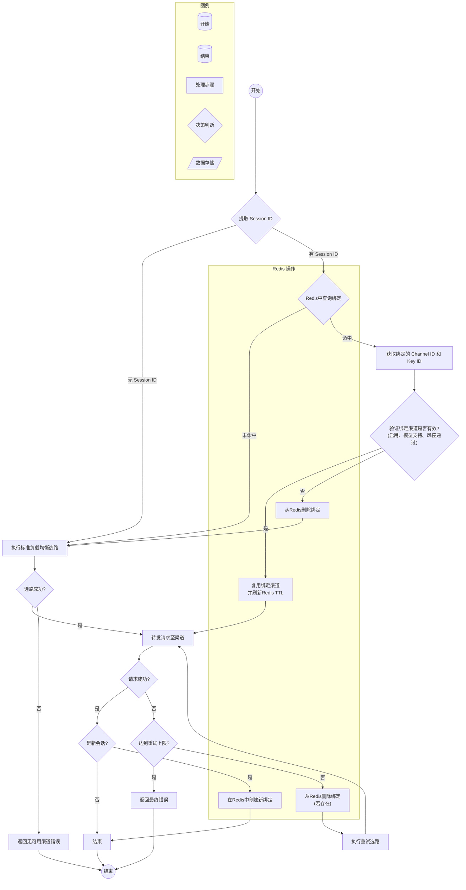
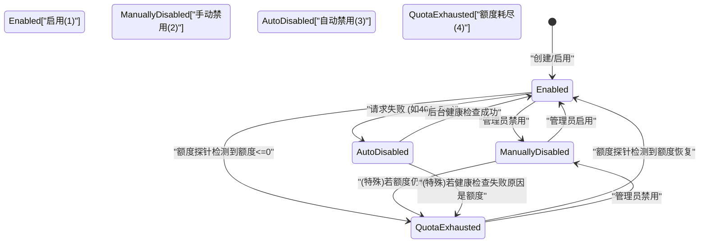

# NewAPI 数据面转发渠道粘性和限量问题解决方案

## 1. 背景与目标
- 依据《docs/NewAPI-总体设计.md》的“无状态架构 + 智能路由”原则，当前数据面由路由层将请求分发到具体渠道，并在 `relay` 模块完成协议转换与扣费。现有逻辑未覆盖“会话级粘性、会话监控、用户会话并发上限、渠道分时额度”四个诉求，导致缓存失效与风控缺口。
- 目标：在保持现有负载均衡与重试机制的前提下，为单会话提供渠道粘性、补齐会话监控与用户并发限制，并扩展渠道的小时/天/周/月额度控制能力。

## 2. 当前数据面流程梳理
当前数据面的核心请求转发逻辑始于 Gin 路由，经由一系列中间件，最终由 `relay` 控制器完成。
- **统一入口与鉴权**: 所有对 `/v1/*` 的请求均由 `router/relay-router.go` 接收。`middleware.TokenAuth()` 中间件负责验证令牌有效性、用户状态及余额，并将用户信息（如用户分组 `user_group`）注入请求上下文。
- **渠道选路 (`Distribute` 中间件)**:
  - **核心位置**: `middleware/distributor.go` 是实现负载均衡与渠道选择的核心。
  - **模型解析**: 从请求体中解析出 `model` 名称。
  - **分组计算**: 通过 `ComputeRoutingGroups` 函数计算出请求的有效路由分组。此逻辑合并了用户的系统分组（`BillingGroup`）和其加入的所有 P2P 分组，是实现多分组选路的基础。
  - **渠道获取**: 调用 `service.CacheGetRandomSatisfiedChannelMultiGroup`，该函数结合 P2P 优先级（私有 > 共享 > 公共）与渠道权重，从缓存或数据库中为当前模型和路由分组集合选择一个最合适的渠道。
  - **上下文设置**: 将选中的渠道信息（ID、类型、密钥、模型映射等）写入请求上下文，供后续步骤使用。
- **请求转发与重试 (`Relay` 控制器)**:
  - **核心位置**: `controller/relay.go` 的 `Relay` 函数。
  - **首次尝试**: 使用 `Distribute` 中间件选定的渠道进行首次请求转发。
  - **失败重试**: 若首次请求失败（如网络错误、上游服务5xx），`Relay` 函数会捕获错误，并根据渠道的 `Priority`（优先级）和 `Weight`（权重）进行**重新选路**。值得注意的是，此重试逻辑与 `Distribute` 中间件的首次选路逻辑是独立的，且同样缺乏会话维度的上下文。
- **风险控制 (`Risk Control`)**:
  - **P2P渠道限制**: `model/channel_risk_control.go` 中定义了针对 P2P 渠道的风控检查，包括总额度、并发数以及基于“请求数”的小时/天限流。
  - **执行时机**: 这些检查在 `service.CacheGetRandomSatisfiedChannelMultiGroup` 内部被调用，不满足风控条件的渠道会被提前过滤掉。
  - **局限性**: 当前风控不覆盖平台渠道，缺少按“额度”而非“请求数”的限流，且无周/月维度。
- **监控 (`Monitoring`)**:
  - `middleware/StatsMiddleware` 仅记录了全局的活跃连接数。
  - `GetChannelConcurrencySnapshot` 提供了渠道级的并发快照。
  - 系统当前缺少从“用户”或“会话”维度出发的监控视图。

## 3. 问题与根因
1.  **会话渠道粘性缺失**:
    - **根因**: `Distribute` 中间件的渠道选择算法是无状态的。对于同一个会话中的多个连续请求，每个请求都会独立触发一次随机选路，无法保证它们落在同一个渠道实例上。
    - **影响**: 对于需要上下文缓存的模型（如 Claude、Codex），这会导致上游缓存频繁失效，增加推理成本和延迟。对于多 Key 渠道，请求甚至可能在同一渠道的不同 Key 之间跳跃，破坏了上游服务的会话一致性。
2.  **无法监控用户会话数**:
    - **根因**: 系统日志和统计指标主要围绕“渠道”和“请求”这两个维度，缺少对“会话”（`conversation` 或 `session`）这一业务概念的抽象和追踪。
    - **影响**: 运维人员无法得知当前有多少用户的会话正在进行中，也无法按用户或渠道维度分析会话活跃度，缺少关键的运营和监控数据。
3.  **用户并发会话无法限制**:
    - **根因**: 现有的 `ModelRequestRateLimit` 是基于用户ID的时间窗口“请求数”限流，而渠道并发控制是针对渠道而非用户。系统没有机制来限制一个用户能同时发起的“会话”数量。
    - **影响**: 恶意或无意的用户可能会通过开启大量并行会话来攻击或滥用服务，耗尽平台资源。
4.  **渠道分时额度缺口**:
    - **根因**: `channel_risk_control` 中的限流机制仅支持按“请求次数”进行小时/日限流，并且只对 P2P 渠道生效。
    - **影响**: 无法实现更精细的、基于“消耗额度”的预算控制（例如，限制渠道每小时最多消耗 $10）。此外，缺少周/月维度的限额，使得长期预算管理难以实现。
5.  **渠道剩余额度感知缺失**:
    - **根因**: 系统对渠道的管理是被动的。它只知道一个渠道是否被手动或自动禁用，但无法主动感知渠道在上游服务商处的实际剩余额度。
    - **影响**: 当一个渠道的额度在上游耗尽时，系统只能通过不断重试并收到“额度不足”的错误来被动发现。这期间会浪费大量请求和时间。理想情况下，系统应能主动探测或通过回调感知额度变化，并在额度耗尽时自动暂停该渠道，额度恢复后自动启用。

## 4. 方案设计

### 4.1 会话渠道粘性 (Session Stickiness)

#### **4.1.1 实现原理**
核心思想是引入一个外部的、共享的状态存储（首选Redis）来记录一个“会话（Session）”与其首次成功路由的“渠道（Channel）”之间的绑定关系。当后续属于同一会话的请求进入时，系统优先使用已绑定的渠道，从而绕过标准的随机负载均衡逻辑，实现会话粘性。

#### **4.1.2 会话标识提取 (Session ID Extraction)**
为了识别属于同一会话的请求，我们需要一个统一的会话标识符。我们将实现一个解析器，按以下优先级从请求的各个部分提取 `session_id`。解析时应忽略头部字段的大小写（case-insensitive）。

1.  **HTTP 请求头 (Header)**:
    - `X-NewAPI-Session-ID`
    - `Session-ID`
    - `Conversation-ID`
    - `X-Gemini-Api-Privileged-User-Id`
    - *示例 1: `codex_cli_rs` 客户端会发送 `Conversation_id: 019af39a-...` 和 `Session_id: 019af39a-...`，这些都将被正确捕获。*
    - *示例 2: Gemini CLI 可能会发送 `X-Gemini-Api-Privileged-User-Id: 703ed9b0-...`，我们同样可以将其作为会话标识。*
2.  **URL 查询参数 (Query Parameter)**:
    - `session_id`
3.  **请求体 (JSON Body)**:
    - `session_id`
    - `conversation_id`
    - `chat_id`
4.  **元数据对象 (Metadata Object)**:
    - `metadata.session_id`
    - `metadata.conversation_id`

如果所有位置都未找到 `session_id`，则该请求被视为无状态请求，沿用现有的负载均衡逻辑，不实现粘性。

#### **4.1.3 Redis 绑定数据结构**
我们将使用 Redis 的 `HASH` 结构来存储会话与渠道的绑定信息。

- **键 (Key)**: `session:{user_id}:{model_name}:{session_id}`
  - `user_id`: 用户ID，确保会话隔离。
  - `model_name`: 请求的模型名，因为不同模型的会话上下文不通用。
  - `session_id`: 提取到的会话标识。

- **值 (Value)**: 一个存储了以下字段的 `HASH`：
  - `channel_id`: (整型) 绑定的渠道 ID。
  - `key_id`: (整型, 可选) 对于多 Key 渠道，记录具体使用的 Key 的索引。这确保了请求不仅粘在同一个渠道上，还粘在同一个上游账户上。
  - `group`: (字符串) 选路时所使用的分组名，用于调试和追溯。
  - `created_at`: (时间戳) 绑定创建时间。

- **过期时间 (TTL)**: 我们会为每个会话绑定键设置一个滑动过期时间（例如，30分钟）。每次请求成功命中并复用此绑定时，都会刷新其 TTL，确保活跃的会话能持续保持粘性。

**Note on Multi-Key Stickiness**:
For channels configured with multiple keys, storing the `key_id` (index of the key) is crucial. When a session binding is hit, the `relay` logic will use this `key_id` to directly select the specific key, bypassing the standard `GetNextEnabledKey()` round-robin or random selection. This ensures that all requests within the same session are sent to the exact same upstream account, preserving session consistency and respecting upstream rate limits.


#### **4.1.4 带有粘性会G话的请求处理流程**



**Note on Retry Logic**:
The `Relay` controller's retry mechanism is enhanced by this design. As shown in the diagram, if a request fails (`L` node), and it is not the final retry attempt (`P` node), the system **must** delete the existing session binding from Redis (`R` node) before re-executing the channel selection logic (`S` node). This critical step ensures that the session is not "locked" to a failed or temporarily unavailable channel, allowing the retry to select a new, healthy channel.

#### **4.1.5 边界条件与降级策略**
- **多节点一致性**: 依赖 Redis 作为集中式存储，是保证多节点部署时会话粘性一致的关键。
- **无 Redis 降级**: 如果部署环境中未启用 Redis，会话粘性功能将自动降级。系统会退化到使用本地内存缓存（如 LRU + TTL），但这仅在单节点部署或测试时有效。系统应在启动时检测并打印日志，明确提示此限制。
- **渠道状态变更**: 当一个渠道被手动禁用、自动熔断或删除时，需要有一个机制来**主动失效**所有与该渠道相关的会话绑定，避免后续请求被粘滞到已不可用的渠道上。这可以通过发布/订阅消息或在状态变更时扫描并清理相关 Redis 键来实现。


### 4.2 会话监控与用户并发上限

#### **4.2.1 实现原理**
在实现会话粘性的基础上，我们可以进一步利用 Redis 的数据结构来跟踪和聚合会话信息，从而实现对活跃会话的实时监控和对用户并发数的限制。

#### **4.2.2 会话跟踪数据结构 (Redis)**
为了有效地进行监控，我们将引入以下几个 Redis 数据结构：

1.  **用户活跃会话集合 (Redis `SET`)**:
    - **键**: `session:user:{user_id}`
    - **值**: 一个集合（`SET`），其中每个成员都是该用户当前活跃的 `session_id`。
    - **用途**: 快速查询和统计单个用户的所有活跃会话。使用 `SCARD` 命令可以高效地获取并发会话数。

2.  **渠道活跃会话数计数器 (Redis `HASH`)**:
    - **键**: `session:channel:stats`
    - **字段 (Field)**: `channel_id`
    - **值 (Value)**: (整型) 该渠道当前承载的活跃会话总数。
    - **用途**: 快速获取每个渠道的会话负载情况。使用 `HINCRBY` 命令原子地增减计数。

3.  **全局活跃会话总数计数器 (Redis `STRING`)**:
    - **键**: `session:global:count`
    - **值**: (整型) 整个平台当前的活跃会话总数。
    - **用途**: 提供一个宏观的系统负载指标。

#### **4.2.3 会话生命周期管理**
- **创建**: 当一个新会话的绑定关系首次在 Redis 中创建时（见 4.1.4 流程），我们**原子地**执行以下操作：
  1.  `SADD session:user:{user_id} {session_id}`
  2.  `HINCRBY session:channel:stats {channel_id} 1`
  3.  `INCR session:global:count`
- **销毁/过期**: 当一个会话的绑定关系从 Redis 中因 TTL 过期或被主动删除时，我们需要一个机制来同步扣减上述计数。
  - **方案A (惰性清理)**: 在每次创建新会话时，随机清理一小部分已过期的旧会话，并更新统计。
  - **方案B (后台任务)**: 启动一个后台 Go routine，定期扫描并清理过期键，同步更新计数器。
  - **方案C (Redis Keyspace Notifications)**: （推荐，但需 Redis 配置支持）监听键过期事件 (`__keyevent@*__:expired`)，在事件处理器中精确地扣减计数。这是最准确但对 Redis 配置有要求的方式。

#### **4.2.4 用户并发会话限制**
此功能允许为不同用户或用户组设置不同的并发会话上限。

- **配置**:
  1.  **系统默认值**: 在系统配置中增加 `SystemMaxConcurrentSessions`（例如，默认为 5）。
  2.  **分组覆盖**: 在用户分组（`groups`）的设置中，增加 `max_concurrent_sessions` 字段，其优先级高于系统默认值。
  3.  **用户级覆盖**: 在用户（`users`）表中增加 `max_concurrent_sessions` 字段，优先级最高。
- **校验逻辑**:
  - **时机**: 在`Distribute`中间件中，当一个请求被识别为**新会话**（即 Redis 中不存在其绑定关系）时，在创建绑定之前执行此检查。
  - **步骤**:
    1. 获取当前用户的并发会话数限制。
    2. 使用 `SCARD session:user:{user_id}` 命令获取该用户当前的活跃会话数。
    3. 如果 `当前会话数 >= 并发会话数限制`，则直接拒绝本次请求，返回 HTTP `429 Too Many Requests` 错误，并附带清晰的错误信息（如“并发会话数已达上限”）。
  - **例外**: 如果一个请求携带的 `session_id` 已经存在于 Redis 中（即，这是一个**复用会话**的请求），系统将**跳过**并发数检查，直接允许请求通过。这确保了同一会话的后续请求不会被错误地计入新的并发。

#### **4.2.5 监控接口**
为了让管理员能够实时了解系统会话状态，我们将新增一个只读的管理 API 端点。

- **API 端点**: `GET /api/admin/sessions/summary`
- **权限**: 仅限管理员访问。
- **返回数据结构**:
  ```json
  {
    "total_active_sessions": 1234, // 全局活跃会话总数
    "sessions_by_channel": {
      "1": 50,  // channel_id: count
      "8": 120,
      "...": "..."
    },
    "top_users_by_session": [
      { "user_id": 101, "username": "user_a", "session_count": 15 },
      { "user_id": 205, "username": "user_b", "session_count": 12 },
      // ... more users
    ],
    "recent_sessions": [
      {
        "session_id": "conv_xyz...",
        "user_id": 101,
        "model": "claude-3-opus",
        "channel_id": 8,
        "created_at": "2025-12-06T10:00:00Z",
        "expires_in_seconds": 1780
      }
      // ... more recent sessions
    ]
  }
  ```
- **实现**: 该接口将直接从 Redis 中读取 `session:global:count`、`session:channel:stats` 等键，并结合查询用户表来聚合数据，实现高效的实时监控。


### 4.3 渠道额度分时限额（统一风控机制）

#### **4.3.1 设计目标**
将原先仅针对P2P渠道的、基于“请求数”的简单限流，升级为一套统一的、适用于**所有渠道类型**的、基于“消耗额度”的精细化预算管理体系，覆盖小时、天、周、月四个时间维度。风控检查将前置到渠道选择阶段，确保在选路前就过滤掉不满足条件的渠道。

#### **4.3.2 统一风控入口**
`CheckChannelRiskControl` 函数将被重构，以支持所有渠道类型，并集中处理所有类型的限额检查。它将在 `service.CacheGetRandomSatisfiedChannelMultiGroup` (或其DB实现)内部，对每一个候选渠道进行调用。这确保了无论是平台渠道还是P2P渠道，都在统一的入口点应用一致的风控逻辑。

#### **4.3.3 数据模型扩展**
在 `model/channel.go` 的 `Channel` 结构体中统一增加以下字段，用于支持额度型分时限额。这些字段的单位与 `UsedQuota` 保持一致，为0则表示不限制。

```go
// in model/channel.go
type Channel struct {
    // ... existing fields

    // 新增的分时额度限制字段
    HourlyQuotaLimit   int64 `json:"hourly_quota_limit" gorm:"type:bigint;default:0"` // 每小时额度限制
    DailyQuotaLimit    int64 `json:"daily_quota_limit" gorm:"type:bigint;default:0"`  // 每日额度限制
    WeeklyQuotaLimit   int64 `json:"weekly_quota_limit" gorm:"type:bigint;default:0"` // 每周额度限制
    MonthlyQuotaLimit  int64 `json:"monthly_quota_limit" gorm:"type:bigint;default:0"`// 每月额度限制

    // ... existing fields
}
```
- **数据库迁移**: 需要提供相应的数据库迁移SQL脚本以应用这些字段变更。

#### **4.3.4 Redis 额度计数器设计**
我们将使用 Redis 的 `INCRBY` 命令来原子地累加每个时间窗口的消耗额度，并利用 `EXPIRE` 为每个键设置等于其窗口长度的 TTL，实现窗口的自动滚动。

- **键 (Key) 格式**: `channel_quota:{channel_id}:{period}:{timestamp_bucket}`
  - `channel_id`: 渠道的唯一ID。
  - `period`: 时间窗口类型，可选值为 `hourly`, `daily`, `weekly`, `monthly`。
  - `timestamp_bucket`: 当前时间窗口的起始时间戳（例如，对于小时级，是当前小时的整点时间戳）。

- **降级策略**: 如果 Redis 不可用，此功能将自动降级。系统会在内存中维护一个临时的计数器，并在应用重启或定时任务触发时尝试将数据回写数据库。同时，会记录警告日志，提示数据非持久化带来的超卖风险。

#### **4.3.5 额度检查与更新流程**
1.  **预检查 (Pre-check)**: 在渠道选择阶段，对每个候选渠道，使用预估消耗额度与Redis中各时间窗口的已用额度进行比较。如果`已用额度 + 预估消耗 > 窗口限额`，该渠道将被从候选列表中**过滤**，不会进入负载均衡选择。
2.  **精确结算与更新 (Post-request)**: 在请求成功并获取到精确用量后，在 `postConsumeQuota` 函数中，同步调用一个新的函数 `UpdateChannelTimeWindowQuota`，原子地将精确消耗额度累加到 Redis 中对应的 `hourly`, `daily`, `weekly`, `monthly` 四个键上。
3.  **与重试机制的交互**: 如果一个粘性会话命中了已超限的渠道，`Distribute` 中间件中的粘性逻辑会发现该渠道不可用，删除绑定关系，并重新执行标准选路逻辑，从而实现自动切换。


### 4.4 渠道剩余额度感知与自动启停（预留设计）

#### **4.4.1 设计目标**
此功能旨在让 NewAPI 从被动接收错误，转变为能主动感知**任何上游渠道**的实际剩余额度，并在额度即将耗尽时自动暂停渠道、额度恢复后自动重启。这是一个适用于所有渠道类型的通用框架。

#### **4.4.2 统一探针接口 (`QuotaProbe`)**
为了适应不同供应商各异的额度查询方式，我们将定义一个统一的“额度探针”接口。该接口将在渠道配置中以一个可扩展的JSON对象形式存在。

- **配置位置**: `model.Channel` 结构体中新增 `QuotaProbeConfig` 字段（`type: text`）。
- **探针类型**:
  - `http_get`: 通过发送 HTTP GET 请求查询。
  - `http_post`: 通过发送 HTTP POST 请求查询。
  - `sdk_call`: （未来扩展）通过特定供应商的 Go SDK 调用。
  - `static`: 静态配置，用于无法在线查询的渠道，由管理员手动更新。

#### **4.4.3 探测与状态更新逻辑**
1.  **探测调度器**: 系统将启动一个后台调度器，定期检查所有配置了 `QuotaProbe` 的渠道。
2.  **探针执行器 (`service/channel_quota_probe`)**: 根据探针类型调用相应的执行器，解析响应并提取标准化的额度信息：`{ remaining_quota, total_quota, currency, refreshed_at }`。
3.  **状态决策与更新**:
    - 系统将为渠道新增一个状态：`StatusQuotaExhausted (4)`。
    - **自动暂停**: 当探测到额度耗尽时，系统将渠道状态从 `Enabled (1)` 变为 `StatusQuotaExhausted (4)`。
    - **自动恢复**: 对于状态为 `4` 的渠道，调度器会以更高的频率进行探测。一旦发现额度恢复，系统会自动将其状态改回 `Enabled (1)`。

#### **4.4.4 统一的渠道状态机（含额度感知）**


- **通用性**: 此状态机适用于所有渠道，`手动禁用 (2)` 拥有最高优先级。在渠道选择时，状态为 `3` 和 `4` 的渠道都将被统一过滤。

## 5. 落地步骤（开发拆解）
为确保方案平稳落地，建议按以下步骤进行开发和迭代：

1.  **数据模型与数据库迁移**:
    - **任务**: 在 `model/channel.go` 的 `Channel` 结构体中添加 `HourlyQuotaLimit`, `DailyQuotaLimit`, `WeeklyQuotaLimit`, `MonthlyQuotaLimit` 四个 `int64` 类型的字段。
    - **交付物**: 更新后的 Go 模型文件；一个新的数据库迁移SQL脚本。

2.  **会话标识提取与粘性逻辑（核心）**:
    - **位置**: `middleware/distributor.go`
    - **任务**:
        - 实现一个 `extractSessionID(c *gin.Context)` 辅助函数，按照 **4.1.2** 中定义的优先级顺序从请求中解析 `session_id`。
        - 在 `Distribute()` 中间件的核心逻辑（调用 `service.CacheGetRandomSatisfiedChannelMultiGroup` 之前）增加会话粘性处理：
            1.  调用 `extractSessionID` 获取会话ID。
            2.  若 `session_id` 存在，构建 Redis Key (`session:{user_id}:{model}:{session_id}`) 并查询 HASH。
            3.  若命中缓存，验证绑定的渠道是否依然可用（状态、模型、风控）。
            4.  若可用，将 `channel_id` 和 `key_id` 注入 Gin 上下文，并**跳过**后续的 `CacheGetRandomSatisfiedChannelMultiGroup` 调用，直接进入下一步。
            5.  若不可用，删除该 Redis 键。
    - **交付物**: 修改后的 `distributor.go` 文件。
3.  **绑定关系写入与更新**:
    - **位置**: `controller/relay.go`
    - **任务**:
        - 在 `Relay` 函数成功转发请求后（`// DoResponse` 之后），检查当前请求是否为新会话（即，之前没有命中粘性绑定）。
        - 如果是新会话，则异步地将 `channel_id`、`key_id` 等信息写入 Redis `HASH`，并设置 TTL。
        - **重要**: 在 `Relay` 的**错误处理和重试逻辑**中，如果一个请求（尤其是粘性会话的请求）失败并准备重试，必须先删除其在 Redis 中的粘性绑定，确保重试时可以重新选路。
    - **交付物**: 修改后的 `relay.go` 文件。

4.  **重构并统一风控逻辑**:
    - **位置**: `model/channel_risk_control.go` 和 `service/channel_select.go`。
    - **任务**:
        - **泛化 `CheckChannelRiskControl`**: 重构此函数，移除其仅针对P2P渠道的限制。使其能够统一检查**所有渠道**的 `TotalQuota`, `Concurrency`, 以及新增的四个分时额度字段。
        - **实现分时额度检查**: 在该函数中，实现对 Redis 中分时额度计数器的查询和比较逻辑。
    - **交付物**: 修改后的 `channel_risk_control.go`。

5.  **集成统一风控到渠道选择流程**:
    - **位置**: `service/channel_select.go` (或 `model/channel_cache.go`)。
    - **任务**: 确保在 `CacheGetRandomSatisfiedChannelMultiGroup` 或其调用的渠道过滤逻辑中，对**每一个候选渠道**（无论类型）都调用泛化后的 `CheckChannelRiskControl` 函数。
    - **交付物**: 修改后的 `channel_select.go`。
6.  **实现额度精确结算**:
    - **位置**: `service/quota.go`。
    - **任务**: 在 `postConsumeQuota`（或处理最终计费的地方）函数中，增加对分时额度计数器的更新。实现一个新的 `UpdateChannelTimeWindowQuota` 函数，该函数会原子地将本次请求的精确消耗额度累加到 Redis 中对应的 `hourly`, `daily`, `weekly`, `monthly` 四个键上。
    - **交付物**: 修改后的 `service/quota.go`。

7.  **会话监控与并发限制**:
    - **位置**: `middleware/distributor.go`, `controller/admin.go` (假设)
    - **任务**:
        - 在**步骤2**的会话粘性逻辑中，当判断为新会话时，在创建绑定前，使用 `SCARD session:user:{user_id}` 检查并执行并发限制。
        - 在**步骤3**的绑定写入逻辑中，当成功创建新会话绑定时，同步执行 `SADD`, `HINCRBY`, `INCR` 来更新监控用的数据结构。
        - 新增一个 `GET /api/admin/sessions/summary` 路由和对应的 `controller` 函数，用于从 Redis 读取并聚合会话监控数据。
    - **交付物**: 修改后的 `distributor.go`；新增的 `controller` 文件及 `router` 配置。

8.  **前端 UI 适配**:
    - **位置**: `web/`
    - **任务**:
        - 在渠道编辑页面为所有渠道类型（平台+P2P）统一提供“总额度”、“并发数”以及新的四个分时额度字段的配置输入框。
        - （可选）在数据看板中新增一个模块，调用 `GET /api/admin/sessions/summary` 接口并以图表或列表形式展示会话监控数据。

9.  **测试与验证**:
    - **单元测试**: 为新增的辅助函数（如 `extractSessionID`, `UpdateChannelTimeWindowQuota`）编写单元测试。
    - **集成测试**:
        - 验证平台自营渠道和P2P渠道都能正确应用新的分时额度限制。
        - 构造带有 `session_id` 的连续请求，验证它们是否始终被路由到同一个渠道。
        - 设置渠道的并发或分时限额，发送超出限制的请求，验证是否能正确返回 `429` 错误或触发重试。
        - 验证会话监控 API 是否能返回正确的数据。
        - 验证在 Redis 不可用的情况下，限流功能能够平滑降级。

## 6. 预期效果


成功实施此方案后，NewAPI 系统将获得以下核心能力提升：


1.  **提升用户体验与性能**:

    - **对话连贯性**: 对于需要上下文的连续对话（如使用 Claude、Codex 或进行多轮Function/Tool Calling），所有请求将稳定地命中同一渠道和同一上游账户，确保了对话逻辑的正确性。

    - **降低成本与延迟**: 有效利用上游模型的缓存机制，避免因请求分散到不同实例而导致的缓存频繁失效，从而降低推理成本和响应延迟。


2.  **增强系统可观测性**:

    - **实时会话监控**: 管理员将获得一个全新的监控维度，能够实时洞察当前系统的会话负载、用户活跃度以及渠道的会话占用情况。

    - **精细化数据支持**: 为容量规划、用户行为分析和问题排查提供了有力的数据支持，例如可以快速定位到并发会话数异常的用户或负载过高的渠道。


3.  **强化风险控制能力**:

    - **防范资源滥用**: 通过用户级的并发会话数限制，有效防止了恶意或无意的用户通过开启大量并行会话来攻击或滥用服务，保护了平台资源。

    - **精细化成本控制**: 通过对所有渠道类型统一实现基于“消耗额度”的分时限额，平台能够对渠道成本进行精细化、多维度的预算管理，大大降低了渠道超额盗刷的风险。


4.  **完善的自动化运维框架**:

    - **智能渠道管理**: 预留的“额度感知与自动启停”设计，为未来实现更加智能、自动化的渠道生命周期管理奠定了基础。系统将能够根据渠道的真实额度状况自动进行熔断和恢复，减少人工干预，提升系统自愈能力。
