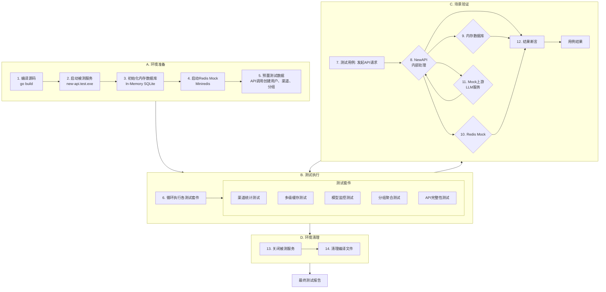

# NewAPI - 渠道监控统计与模型质量监控 测试设计与分析说明书

| 文档信息 | 内容 |
| :--- | :--- |
| **模块名称** | *NewAPI - Channel Statistics & Model Monitoring* |
| **文档作者** | *QA Team* |
| **测试环境** | *SIT / UAT* |
| **版本日期** | *2025-12-11* |

---

## 一、测试方案原理 (Test Scheme & Methodology)

> **核心策略**: 采用**代码驱动的自动化集成测试**结合**灰盒测试**方法。所有测试场景的构建、执行与验证均在 **Go** 测试框架内完成。我们将利用 **HTTP Test Server** 启动被测 NewAPI 实例，通过程序化 API 调用来预设用户、渠道及分组关系，使用**内存数据库 (In-Memory SQLite)** 确保测试环境的纯净与隔离，同时使用 **Redis Mock** 模拟缓存层行为。

### 1.1 自动化测试流程总览 (Automated Test Flow)

测试流程遵循"编译-启动-测试-清理"的生命周期，确保每次运行都在一个隔离、纯净的环境中进行。



### 1.2 关键测试组件 (Key Components)

*   **测试运行器 (Test Runner)**: 基于 `go test`，负责编排测试生命周期 (`Setup`, `Teardown`) 和定义测试用例。
*   **HTTP Test Server**: 使用 `net/http/httptest` 包启动一个临时的 NewAPI 服务实例，监听本地端口。
*   **内存数据库**: 使用 `gorm.io/driver/sqlite` 的内存模式 (`file::memory:?cache=shared`)。
*   **Redis Mock**: 使用 `miniredis` 包模拟 Redis 服务，用于验证缓存逻辑。
*   **Mock LLM Server**: 模拟上游 LLM 服务，用于测试模型监控的探测与评估流程。

---

## 二、测试点分析列表 (Test Point Analysis)

### 2.1 渠道统计核心功能测试 (Channel Statistics Core)

**核心风险**: 验证渠道统计数据的准确性、三级缓存的正确性以及高并发场景下的性能与一致性。

#### 2.1.1 统计指标计算正确性测试

| ID | 测试场景 | 指标项 | 测试数据准备 | 预期结果 | 优先级 |
| :--- | :--- | :--- | :--- | :--- | :--- |
| **CS-01** | **基础请求计数** | `request_count`, `total_tokens`, `total_quota` | 对渠道Ch1发起10个请求，每个请求1000 tokens，消耗100 quota | `request_count=10`, `total_tokens=10000`, `total_quota=1000` | **P0** |
| **CS-02** | **失败率计算** | `fail_rate` | 发起100个请求，其中20个返回5xx错误 | `fail_rate = 20%` | **P0** |
| **CS-03** | **平均响应时间** | `avg_response_time` | 发起5个请求，首字延迟分别为100ms, 200ms, 300ms, 400ms, 500ms | `avg_response_time = 300ms` | **P0** |
| **CS-04** | **TPM/RPM计算** | `tpm`, `rpm` | 在1分钟内发起60个请求，总计60000 tokens | `rpm=60`, `tpm=60000` | **P0** |
| **CS-05** | **流式请求占比** | `stream_req_ratio` | 发起10个请求，其中3个为流式请求 | `stream_req_ratio = 30%` | P1 |
| **CS-06** | **缓存命中率** | `avg_cache_hit_rate` | 发起10个请求，其中4个命中缓存 | `avg_cache_hit_rate = 40%` | P1 |
| **CS-07** | **去重用户数** | `unique_users` | 用户A发起5个请求，用户B发起3个请求，用户A再发起2个请求 | `unique_users = 2` | **P0** |
| **CS-08** | **停服时间占比** | `downtime_percentage` | 15分钟窗口内，渠道禁用5分钟后再启用 | `downtime_percentage = 33.33%` | **P0** |
| **CS-09** | **平均并发数** | `avg_concurrency` | 在统计窗口内模拟不同处理时长的并发请求 | 验证计算公式: `总处理时长 / 窗口时长` | P1 |
| **CS-10** | **按模型分组统计** | 所有指标 | 对同一渠道的`gpt-4`和`gpt-3.5`分别发起请求 | 两个模型的统计数据独立且正确 | **P0** |

#### 2.1.2 三级缓存数据流测试

| ID | 测试场景 | 缓存层级 | 测试步骤 | 预期行为 | 优先级 |
| :--- | :--- | :--- | :--- | :--- | :--- |
| **CL-01** | **L1内存写入** | L1 (内存) | 1. 发起API请求完成<br>2. 立即检查内存计数器 | 计数器原子增加，无阻塞主流程 | **P0** |
| **CL-02** | **L1到L2刷新** | L1 -> L2 | 1. 发起请求<br>2. 等待1分钟触发Flush<br>3. 检查Redis中的Hash键 | Redis中 `channel_stats:{id}:{model}` 正确更新，L1计数器清零 | **P0** |
| **CL-03** | **HyperLogLog去重** | L2 (Redis) | 1. 用户A发起3个请求<br>2. 用户B发起2个请求<br>3. 用户A再发起1个请求<br>4. 检查Redis HLL | `PFCOUNT` 返回 `2` | **P0** |
| **CL-04** | **脏数据标记** | L2 (Redis) | 1. 渠道Ch1有数据更新<br>2. 检查 `dirty_channels` ZSet | ZSet中包含 `Ch1:model_name`，score为最新时间戳 | **P0** |
| **CL-05** | **Redis TTL机制** | L2 (Redis) | 1. 创建统计键<br>2. 验证TTL已设置为24小时<br>3. Mock时间快进25小时<br>4. 检查键是否被清理 | 冷数据自动过期清理 | P1 |
| **CL-06** | **L2到L3错峰同步** | L2 -> L3 | 1. 多个渠道同时产生脏数据<br>2. 触发DB Sync Worker<br>3. 监控实际同步时间 | 各渠道同步时间分散在15分钟窗口内，有随机抖动 | **P0** |
| **CL-07** | **L3数据聚合与去重** | L3 (数据库) | 1. 同一渠道在一个窗口内多次触发同步<br>2. 检查数据库记录 | `channel_statistics` 表中该窗口只有一条记录，数据无重复累加 | **P0** |
| **CL-08** | **读路径三级缓存** | L1 <- L2 <- L3 | 1. 首次查询 `/api/channels/{id}/stats`<br>2. 第二次查询同一渠道<br>3. 第三次查询 | 第一次回源DB，第二次命中Redis，第三次命中进程内存 | P1 |
| **CL-09** | **缓存穿透保护** | 全链路 | 查询一个不存在的渠道ID | 快速返回错误，不引发缓存雪崩或DB压力 | P2 |
| **CL-10** | **内存淘汰机制** | L1 (内存) | 1. 创建100个渠道的统计数据<br>2. 其中50个渠道5分钟无更新<br>3. 触发淘汰任务 | 冷渠道从内存Map中移除，热渠道保留 | P1 |

#### 2.1.3 并发与一致性测试

| ID | 测试场景 | 并发操作 | 预期行为 | 优先级 |
| :--- | :--- | :--- | :--- | :--- |
| **CON-01** | **高并发写入L1** | 1000个协程同时对同一渠道发起请求 | 原子计数器无数据竞争，最终计数准确 | **P0** |
| **CON-02** | **Flush并发安全** | 多个Flush任务同时触发 | 使用锁或原子操作避免重复刷新 | **P0** |
| **CON-03** | **DB Sync并发控制** | 多个Worker尝试同步同一渠道 | 分布式锁确保只有一个Worker执行 | **P0** |
| **CON-04** | **统计与渠道禁用冲突** | 1. 渠道有进行中的请求<br>2. 同时管理员禁用渠道 | 进行中请求的统计正常记录，后续请求被拒绝 | P1 |

### 2.2 模型智能监控测试 (Model Monitoring)

**核心风险**: 验证基准管理、自动探测、评估打分和结果存储的完整性与准确性。

#### 2.2.1 基准管理测试

| ID | 测试场景 | 测试步骤 | 预期结果 | 优先级 |
| :--- | :--- | :--- | :--- | :--- |
| **MB-01** | **创建基准** | 1. 调用 `POST /api/monitor/baselines`<br>2. 指定 `model_name=gpt-4`, `test_type=style`, `evaluation_standard=strict` | `model_baselines` 表新增记录，返回201 | **P0** |
| **MB-02** | **基准唯一性约束** | 1. 创建一个基准<br>2. 用相同的 `(model_name, test_type, evaluation_standard)` 再次创建 | 第二次请求更新现有记录，而非新增 | **P0** |
| **MB-03** | **基准查询** | 调用 `GET /api/monitor/baselines` | 返回所有已配置的基准列表 | P1 |
| **MB-04** | **基准更新** | 1. 创建基准<br>2. 更换 `baseline_channel_id`<br>3. 重新创建 | 基准的 `baseline_output` 被更新 | P1 |

#### 2.2.2 监控策略与调度测试

| ID | 测试场景 | 测试步骤 | 预期结果 | 优先级 |
| :--- | :--- | :--- | :--- | :--- |
| **MP-01** | **创建监控策略** | `POST /api/monitor/policies` 创建策略，设置 `schedule_cron=0 */4 * * *` | `monitor_policies` 表新增记录，`is_enabled=true` | **P0** |
| **MP-02** | **策略调度触发** | 1. 创建策略<br>2. Mock时间，模拟Cron触发<br>3. 检查是否启动监控任务 | MonitorWorker 被正确触发，执行探测 | **P0** |
| **MP-03** | **策略禁用** | 1. 创建并启用策略<br>2. 设置 `is_enabled=false`<br>3. 等待下一个Cron周期 | 监控任务不再触发 | P1 |
| **MP-04** | **多策略叠加** | 1. 创建策略A: 监控 `gpt-4`, 检测类型 `style`<br>2. 创建策略B: 监控 `gpt-4`, 检测类型 `reasoning`<br>3. 触发调度 | 两个检测类型的探测任务都被执行 | **P0** |
| **MP-05** | **渠道级配置覆盖** | 1. 全局策略监控所有渠道<br>2. 渠道Ch1的 `monitoring_config` 指定不同的 `evaluation_standard`<br>3. 触发探测 | Ch1使用自身配置，其他渠道使用全局策略 | **P0** |

#### 2.2.3 模型探测与评估测试

| ID | 测试场景 | 评估类型 | 测试步骤 | 预期结果 | 优先级 |
| :--- | :--- | :--- | :--- | :--- | :--- |
| **ME-01** | **简单规则评估 (编码)** | `encoding` | 1. Mock上游返回可执行代码<br>2. 执行单元测试<br>3. 代码通过测试 | `status=pass`, `diff_score=0` | **P0** |
| **ME-02** | **简单规则评估失败** | `encoding` | 1. Mock上游返回有语法错误的代码<br>2. 执行单元测试失败 | `status=fail`, `reason` 包含错误信息 | **P0** |
| **ME-03** | **LLM裁判评估 (风格)** | `style` | 1. Mock上游返回与基准相似的输出<br>2. 调用裁判LLM<br>3. 裁判返回 `similarity_score=95` | `status=pass`, `diff_score=5` | **P0** |
| **ME-04** | **LLM裁判评估失败** | `style` | 1. Mock上游返回与基准差异巨大的输出<br>2. 调用裁判LLM<br>3. 裁判返回 `similarity_score=30` | `status=fail`, `diff_score=70` | **P0** |
| **ME-05** | **评估标准差异** | `style` | 1. 同一输出在 `strict` 标准下失败<br>2. 在 `lenient` 标准下通过 | 不同 `evaluation_standard` 产生不同的 `is_pass` 结果 | **P0** |
| **ME-06** | **探测重试机制** | 所有类型 | 1. Mock上游第一次返回5xx错误<br>2. 第二次返回正常结果 | 系统自动重试，最终记录成功结果 | P1 |
| **ME-07** | **探测失败标记** | 所有类型 | 1. Mock上游连续3次超时<br>2. 检查结果表 | `status=monitor_failed`, `reason` 记录错误原因 | **P0** |
| **ME-08** | **裁判LLM失败处理** | `style`/`reasoning` | 1. Mock裁判LLM返回非JSON或错误响应<br>2. 检查结果表 | `status=monitor_failed`, 不影响其他渠道的探测 | P1 |

#### 2.2.4 监控结果存储与查询测试

| ID | 测试场景 | 测试步骤 | 预期结果 | 优先级 |
| :--- | :--- | :--- | :--- | :--- |
| **MR-01** | **结果持久化** | 1. 完成一次探测<br>2. 查询 `model_monitoring_results` 表 | 表中新增记录，包含 `channel_id`, `model_name`, `status`, `diff_score`, `reason`, `raw_output` | **P0** |
| **MR-02** | **历史结果查询** | `GET /api/channels/:id/monitoring_results?model_name=gpt-4` | 返回该渠道该模型的所有历史监控记录，按时间倒序 | P1 |
| **MR-03** | **模型横向对比报告** | `GET /api/models/:model_name/monitoring_report` | 返回所有渠道的该模型最新监控状态，方便对比 | P1 |
| **MR-04** | **时间范围过滤** | `GET /api/channels/:id/monitoring_results?start_time=X&end_time=Y` | 仅返回时间范围内的记录 | P2 |

### 2.3 P2P分组聚合统计测试 (Group Statistics)

**核心风险**: 验证分组聚合逻辑的正确性、节流机制、并发控制和最终一致性。

#### 2.3.1 聚合计算正确性测试

| ID | 测试场景 | 聚合类型 | 测试数据准备 | 预期结果 | 优先级 |
| :--- | :--- | :--- | :--- | :--- | :--- |
| **GS-01** | **求和类指标聚合** | `TPM`, `RPM`, `TotalTokens` | 分组G1包含Ch1(TPM=1000)和Ch2(TPM=2000) | `Group.TPM = 3000` | **P0** |
| **GS-02** | **加权平均聚合 (失败率)** | `fail_rate` | Ch1: `fail_rate=10%`, `request_count=100`<br>Ch2: `fail_rate=20%`, `request_count=200` | `Group.fail_rate = (10*100 + 20*200) / 300 = 16.67%` | **P0** |
| **GS-03** | **加权平均聚合 (响应时间)** | `avg_response_time` | Ch1: `avg_response_time=100ms`, `request_count=50`<br>Ch2: `avg_response_time=200ms`, `request_count=150` | `Group.avg_response_time = (100*50 + 200*150) / 200 = 175ms` | **P0** |
| **GS-04** | **并发数直接求和** | `avg_concurrency` | Ch1: `avg_concurrency=5`<br>Ch2: `avg_concurrency=3` | `Group.avg_concurrency = 8` | P1 |
| **GS-05** | **去重用户数聚合** | `unique_users` | Ch1服务用户A、B，Ch2服务用户B、C | `Group.unique_users = 3` (A, B, C去重) | **P0** |
| **GS-06** | **按模型维度聚合** | 所有指标 | 分组内Ch1支持gpt-4和gpt-3.5，Ch2只支持gpt-4 | 分别生成 `(G1, gpt-4)` 和 `(G1, gpt-3.5)` 两条统计记录 | **P0** |
| **GS-07** | **禁用渠道不参与聚合** | 所有指标 | 分组内Ch1启用，Ch2禁用 | 聚合结果仅包含Ch1的数据 | **P0** |

#### 2.3.2 事件驱动与节流测试

| ID | 测试场景 | 测试步骤 | 预期行为 | 优先级 |
| :--- | :--- | :--- | :--- | :--- |
| **GE-01** | **渠道更新触发事件** | 1. 渠道Ch1数据持久化到DB<br>2. 检查是否产生内部事件 | 系统发出"渠道统计更新"事件 | **P0** |
| **GE-02** | **节流机制 (30分钟)** | 1. 分组G1的Ch1在T0时刻更新<br>2. Ch2在T0+10分钟更新<br>3. Ch3在T0+20分钟更新 | 只在T0时刻生成一次聚合任务，后续更新被节流忽略 | **P0** |
| **GE-03** | **节流时间窗口过期** | 1. T0时刻触发聚合<br>2. T0+31分钟再次触发 | 第二次触发成功生成新的聚合任务 | **P0** |
| **GE-04** | **跨分组独立节流** | 1. 分组G1触发聚合<br>2. 同时分组G2也有渠道更新 | 两个分组的节流计时器独立，互不影响 | P1 |

#### 2.3.3 并发控制与分布式锁测试

| ID | 测试场景 | 测试步骤 | 预期行为 | 优先级 |
| :--- | :--- | :--- | :--- | :--- |
| **GC-01** | **分布式锁获取** | 1. Worker A尝试聚合分组G1<br>2. 在A完成前，Worker B也尝试聚合G1 | Worker A获取锁成功，Worker B获取失败并放弃任务 | **P0** |
| **GC-02** | **锁超时恢复** | 1. Worker获取锁后异常退出<br>2. 锁180秒后自动过期<br>3. 新Worker尝试聚合 | 新Worker成功获取锁并完成聚合 | P1 |
| **GC-03** | **全局并发限制** | 1. 同时有10个分组需要聚合<br>2. 系统配置 `MaxGroupStatConcurrency=5` | 最多5个Worker同时运行，其他任务排队 | **P0** |
| **GC-04** | **锁释放失败处理** | 1. Worker完成聚合但释放锁失败<br>2. 检查锁状态 | 依赖锁的TTL自动过期，不导致死锁 | P2 |

#### 2.3.4 分组统计查询测试

| ID | 测试场景 | 测试步骤 | 预期结果 | 优先级 |
| :--- | :--- | :--- | :--- | :--- |
| **GQ-01** | **分组总体统计查询** | `GET /api/p2p_groups/:id/stats` (不指定model) | 返回分组所有模型的聚合数据 | P1 |
| **GQ-02** | **分组按模型过滤** | `GET /api/p2p_groups/:id/stats?model=gpt-4` | 仅返回该分组的gpt-4模型统计 | P1 |
| **GQ-03** | **权限控制** | 1. 用户A是分组G1成员<br>2. 用户B不是<br>3. 两者都查询G1统计 | 用户A成功，用户B返回403 | **P0** |
| **GQ-04** | **数据时效性** | 1. 查询分组统计<br>2. 检查返回的 `updated_at` 字段 | 时间戳在合理范围内（不超过30分钟前） | P1 |

### 2.4 数据库表完整性测试 (Database Schema Coverage)

**核心风险**: 确保所有新增表和字段都被正确使用，没有遗漏。

| ID | 表名 | 测试场景 | 操作类型 | 验收标准 | 优先级 |
| :--- | :--- | :--- | :--- | :--- | :--- |
| **DB-01** | `channel_statistics` | 渠道统计持久化 | CREATE | 每15分钟窗口生成新记录 | **P0** |
| **DB-02** | `channel_statistics` | 查询渠道历史数据 | READ | 按 `channel_id`, `model_name`, `time_window_start` 正确检索 | **P0** |
| **DB-03** | `channel_statistics` | 更新已有窗口数据 | UPDATE | UPSERT逻辑正确，不重复插入 | **P0** |
| **DB-04** | `channels` 表扩展字段 | 读取渠道统计字段 | READ | `avg_response_time`, `fail_rate`, `tpm` 等字段可正常读取 | **P0** |
| **DB-05** | `channels.monitoring_config` | 设置渠道监控配置 | CREATE/UPDATE | JSON字段正确存储和解析 | **P0** |
| **DB-06** | `group_statistics` | 分组聚合结果持久化 | CREATE | 按 `(group_id, model_name, time_window_start)` 生成记录 | **P0** |
| **DB-07** | `group_statistics` | 查询分组统计 | READ | 能按主键正确检索最新记录 | **P0** |
| **DB-08** | `group_statistics` | 更新分组统计 | UPDATE | 每次聚合更新 `updated_at` 字段 | P1 |
| **DB-09** | `monitor_policies` | 创建监控策略 | CREATE | 所有字段正确存储，`target_models` 等JSON字段可解析 | **P0** |
| **DB-10** | `monitor_policies` | 查询启用策略 | READ | 能按 `is_enabled=true` 过滤 | **P0** |
| **DB-11** | `monitor_policies` | 更新策略 | UPDATE | 可修改 `schedule_cron`, `evaluation_standard` 等字段 | P1 |
| **DB-12** | `monitor_policies` | 禁用策略 | UPDATE | 设置 `is_enabled=false` 后不再触发 | P1 |
| **DB-13** | `model_baselines` | 创建基准 | CREATE | 按 `(model_name, test_type, evaluation_standard)` 唯一约束生效 | **P0** |
| **DB-14** | `model_baselines` | 查询基准 | READ | 能按复合条件精确查询 | **P0** |
| **DB-15** | `model_baselines` | 更新基准 | UPDATE | 覆盖已有基准的 `baseline_output` | P1 |
| **DB-16** | `model_monitoring_results` | 存储探测结果 | CREATE | 每次探测生成新记录，包含 `raw_output`, `reason` 等 | **P0** |
| **DB-17** | `model_monitoring_results` | 查询历史结果 | READ | 按 `channel_id`, `model_name`, `test_timestamp` 检索 | **P0** |
| **DB-18** | `model_monitoring_results` | 时间范围查询 | READ | 支持 `test_timestamp` 的范围查询 | P1 |

### 2.5 API接口完整性测试 (API Completeness)

**核心风险**: 确保所有设计的API端点都被实现且可正常调用。

| ID | API端点 | HTTP方法 | 权限 | 测试场景 | 预期响应 | 优先级 |
| :--- | :--- | :--- | :--- | :--- | :--- | :--- |
| **API-01** | `/api/channels/{id}/stats` | GET | 管理员 | 查询渠道统计，`period=1h`, `model=gpt-4` | 返回200，包含所有统计指标 | **P0** |
| **API-02** | `/api/channels/{id}/stats` | GET | 管理员 | `period=7d`，不指定model | 返回渠道7天总体统计 | **P0** |
| **API-03** | `/api/channels/{id}/stats` | GET | 普通用户 | 尝试查询 | 返回403或401 | P1 |
| **API-04** | `/api/monitor/baselines` | POST | 管理员 | 创建新基准 | 返回201，响应包含基准ID | **P0** |
| **API-05** | `/api/monitor/baselines` | GET | 管理员 | 查询所有基准 | 返回200，数组包含所有基准 | P1 |
| **API-06** | `/api/monitor/policies` | POST | 管理员 | 创建监控策略 | 返回201 | **P0** |
| **API-07** | `/api/monitor/policies` | GET | 管理员 | 查询所有策略 | 返回200，包含策略列表 | P1 |
| **API-08** | `/api/monitor/policies` | PUT | 管理员 | 更新策略 `is_enabled=false` | 返回200 | P1 |
| **API-09** | `/api/channels/:id/monitoring_results` | GET | 管理员 | 查询渠道监控历史 | 返回200，包含结果数组 | P1 |
| **API-10** | `/api/models/:model_name/monitoring_report` | GET | 管理员 | 查询模型横向对比报告 | 返回200，包含所有渠道的该模型监控状态 | P1 |
| **API-11** | `/api/p2p_groups/:id/stats` | GET | 分组成员 | 查询分组统计 | 返回200，包含聚合数据 | **P0** |
| **API-12** | `/api/p2p_groups/:id/stats` | GET | 非成员 | 尝试查询 | 返回403 | **P0** |
| **API-13** | `/api/p2p_groups/:id/stats?model=gpt-4` | GET | 分组成员 | 按模型过滤 | 返回200，仅包含gpt-4数据 | P1 |

### 2.6 边界与异常场景测试 (Boundary & Exception Cases)

| ID | 测试场景 | 边界条件 | 预期行为 | 优先级 |
| :--- | :--- | :--- | :--- | :--- |
| **ED-01** | **空数据查询** | 查询一个从未有请求的渠道统计 | 返回200，所有指标为0或默认值 | P1 |
| **ED-02** | **超大并发写入** | 同时10000个协程写入统计 | 系统不崩溃，最终数据一致 | P2 |
| **ED-03** | **Redis宕机** | Redis不可用时发起请求 | 统计写入降级到直接写DB或日志，不影响主流程 | P1 |
| **ED-04** | **数据库写入失败** | DB Sync时数据库返回错误 | Worker记录错误日志，不丢失Redis中的数据，下次重试 | P1 |
| **ED-05** | **监控上游超时** | Mock上游渠道响应时间>30秒 | 探测任务超时，标记为 `monitor_failed` | P1 |
| **ED-06** | **裁判LLM返回非JSON** | 裁判返回纯文本或格式错误 | 解析失败，标记为 `monitor_failed`，记录原始响应 | P1 |
| **ED-07** | **分组无渠道** | 聚合一个没有任何渠道的分组 | 返回空统计或全0数据，不抛出异常 | P2 |
| **ED-08** | **统计窗口跨越禁用期** | 渠道在窗口中间被禁用 | `downtime_percentage` 正确计算禁用时长占比 | **P0** |

### 2.7 配置正交组合测试 (Orthogonal Configuration Testing)

**核心风险**: 验证在复杂配置组合场景下（多分组、多Token、多重授权）系统的路由、计费和统计行为是否符合预期。

#### 2.7.1 正交测试设计原理

使用**正交表**方法，用最少的测试用例覆盖最多的配置组合。我们识别出以下关键因子：

**渠道维度因子**:
- 因子A: 系统分组 (3水平: default, vip, svip)
- 因子B: P2P授权分组 (4水平: 无, 单个G1, 单个G2, 多个G1+G2)
- 因子C: 渠道私有性 (2水平: 私有, 非私有)

**用户维度因子**:
- 因子D: 用户系统分组 (3水平: default, vip, svip)
- 因子E: 用户加入的P2P分组 (4水平: 无, 单个G1, 单个G2, 多个G1+G2)

**Token维度因子**:
- 因子F: Token计费分组配置 (4水平: 空, 单个, 多个列表, 与用户分组不同)
- 因子G: Token P2P分组限制 (3水平: 不限制, 单个P2P组, 多个P2P组)

#### 2.7.2 渠道多分组配置测试

| ID | 测试场景 | 渠道配置 | 用户配置 | Token配置 | 预期路由结果 | 预期计费分组 | 优先级 |
| :--- | :--- | :--- | :--- | :--- | :--- | :--- | :--- |
| **OC-01** | **渠道授权给多个P2P分组** | Ch-X (系统分组: vip)<br>`allowed_groups: [G1, G2]` | User-A (vip)<br>加入: G1 | Token-A1 (无限制) | 成功路由到Ch-X | vip | **P0** |
| **OC-02** | **用户匹配多个授权分组之一** | Ch-X (vip)<br>`allowed_groups: [G1, G2, G3]` | User-A (vip)<br>加入: G2 | Token-A1 (无限制) | 成功路由到Ch-X | vip | **P0** |
| **OC-03** | **渠道跨系统分组+P2P授权** | Ch-X (default)<br>`allowed_groups: [G1]` | User-A (vip)<br>加入: G1 | Token-A1 (计费组: `["default"]`) | 成功路由 (系统分组降级+P2P匹配) | default | **P0** |
| **OC-04** | **渠道授权冲突测试** | Ch-X (vip)<br>`allowed_groups: [G1]`<br>`is_private: false` | User-A (vip)<br>加入: G1, G2 | Token-A1 (无限制) | 成功路由 (匹配G1) | vip | P1 |
| **OC-05** | **私有渠道多分组授权无效** | Ch-X (vip)<br>`allowed_groups: [G1, G2]`<br>`is_private: true` | User-A (vip, owner)<br>加入: G1<br>User-B (vip)<br>加入: G1 | Token-B1 (无限制) | User-A成功，User-B失败 | - | **P0** |
| **OC-06** | **渠道统计按分组聚合** | Ch-X (vip)<br>`allowed_groups: [G1, G2]` | User-A加入G1发起10个请求<br>User-B加入G2发起20个请求 | - | 两个分组的统计都应包含Ch-X的数据 | - | **P0** |
| **OC-07** | **多分组渠道禁用影响** | Ch-X授权给G1, G2<br>Ch-X被禁用 | User-A (G1成员)<br>User-B (G2成员) | - | 两者都无法访问Ch-X | - | P1 |

#### 2.7.3 用户多Token配置测试

| ID | 测试场景 | 用户配置 | Token1配置 | Token2配置 | Token3配置 | 测试操作 | 预期结果 | 优先级 |
| :--- | :--- | :--- | :--- | :--- | :--- | :--- | :--- | :--- |
| **OT-01** | **同用户不同计费组Token** | User-A (vip)<br>加入G1 | `group: []` (默认vip) | `group: ["default"]` | `group: ["svip"]` | 用三个Token分别请求同一渠道 | Token1按vip计费<br>Token2按default计费<br>Token3按svip计费 | **P0** |
| **OT-02** | **Token计费组列表降级** | User-A (vip)<br>加入G1 | `group: ["svip", "default"]` | - | - | 无svip渠道时请求 | 自动降级到default费率计费 | **P0** |
| **OT-03** | **不同P2P组限制Token** | User-A (vip)<br>加入G1, G2 | `p2p_group_id: null` | `p2p_group_id: G1` | `p2p_group_id: G2` | Ch-X授权给G1<br>Ch-Y授权给G2 | Token1: 无法使用P2P渠道<br>Token2: 只能用Ch-X<br>Token3: 只能用Ch-Y | **P0** |
| **OT-04** | **Token多P2P组限制** | User-A (vip)<br>加入G1, G2, G3 | `p2p_group_id: [G1, G2]` | - | - | Ch-X授权给G1<br>Ch-Y授权给G2<br>Ch-Z授权给G3 | Token1可用Ch-X和Ch-Y<br>无法用Ch-Z | **P0** |
| **OT-05** | **Token模型限制+分组组合** | User-A (vip)<br>加入G1 | `group: ["default"]`<br>`model_limits: ["gpt-4"]` | - | - | 请求gpt-4和gpt-3.5 | gpt-4成功且按default计费<br>gpt-3.5被拒绝 | P1 |
| **OT-06** | **Token配额独立统计** | User-A (vip) | Token1: 额度100000 | Token2: 额度50000 | - | 两个Token分别消耗 | Token1和Token2的额度独立扣减<br>渠道统计合并 | **P0** |
| **OT-07** | **同用户多Token并发** | User-A (vip)<br>加入G1 | Token1 | Token2 | Token3 | 三个Token同时请求同一渠道 | 渠道并发数正确累加<br>unique_users=1 | P1 |

#### 2.7.4 正交组合矩阵测试 (核心场景覆盖)

使用L18正交表设计，覆盖7因子的主要交互效应：

| 用例ID | 渠道<br>系统分组 | 渠道<br>P2P授权 | 渠道<br>私有性 | 用户<br>系统分组 | 用户<br>P2P成员 | Token<br>计费组 | Token<br>P2P限制 | 预期路由 | 预期计费 | 优先级 |
| :--- | :--- | :--- | :--- | :--- | :--- | :--- | :--- | :--- | :--- | :--- |
| **OM-01** | default | 无 | 非私有 | default | 无 | 空 | 不限制 | 成功 | default | **P0** |
| **OM-02** | default | G1 | 非私有 | vip | G1 | `["default"]` | 不限制 | 成功 | default | **P0** |
| **OM-03** | default | G1+G2 | 私有 | svip | G1 | 空 | G1 | 失败 | - | **P0** |
| **OM-04** | vip | 无 | 非私有 | vip | 无 | 空 | 不限制 | 成功 | vip | **P0** |
| **OM-05** | vip | G1 | 非私有 | default | G1 | `["vip"]` | G1 | 失败 | - | **P0** |
| **OM-06** | vip | G1+G2 | 私有 | vip | G1+G2 | `["vip", "default"]` | G1+G2 | 成功(owner) | vip | P1 |
| **OM-07** | svip | 无 | 非私有 | svip | 无 | 空 | 不限制 | 成功 | svip | P1 |
| **OM-08** | svip | G1 | 非私有 | default | G1 | `["svip"]` | G1 | 失败 | - | **P0** |
| **OM-09** | svip | G1+G2 | 私有 | vip | G1 | 空 | G1 | 失败 | - | P1 |
| **OM-10** | default | G1 | 非私有 | vip | G2 | `["default"]` | G2 | 失败 | - | **P0** |
| **OM-11** | vip | G1 | 非私有 | vip | G1 | `["default", "svip"]` | G1 | 成功 | default | **P0** |
| **OM-12** | default | G1+G2 | 非私有 | default | G1 | 空 | G1+G2 | 成功 | default | P1 |

#### 2.7.5 配置组合统计正确性测试

| ID | 测试场景 | 配置组合 | 测试步骤 | 统计验证点 | 优先级 |
| :--- | :--- | :--- | :--- | :--- | :--- |
| **OS-01** | **多Token同用户统计** | User-A使用Token1和Token2 | 1. Token1发起10个请求<br>2. Token2发起5个请求 | 渠道: `request_count=15`, `unique_users=1` | **P0** |
| **OS-02** | **多分组渠道统计聚合** | Ch-X授权给G1和G2 | 1. G1成员请求10次<br>2. G2成员请求20次 | G1统计: 包含Ch-X的10次<br>G2统计: 包含Ch-X的20次 | **P0** |
| **OS-03** | **Token计费组切换统计** | Token1: `group: ["vip"]`切换为`["default"]` | 1. 切换前请求10次<br>2. 切换后请求10次 | 渠道统计正确，但计费费率改变 | P1 |
| **OS-04** | **多模型多分组统计** | Ch-X (gpt-4, gpt-3.5)<br>授权给G1, G2 | 分别对两个模型两个分组发起请求 | 生成4条统计记录: <br>(Ch-X, gpt-4), (Ch-X, gpt-3.5) x G1, G2 | **P0** |

---

## 三、测试数据准备 (Test Data Preparation)

所有测试均基于以下预置实体及其关系。测试代码应在 `Setup` 阶段通过 API 动态创建这些实体。

### 3.1 用户 (Users)

**基础用户**:
*   `User-A`: 系统分组 `vip` (倍率: 2.0)，作为渠道提供者和分组Owner。
*   `User-B`: 系统分组 `default` (倍率: 1.0)，作为渠道使用者。
*   `User-C`: 系统分组 `svip` (倍率: 0.8)，用于测试分组聚合。

**正交测试用户** (用于配置组合测试):
*   `User-OT-1`: 系统分组 `default`，加入分组: 无
*   `User-OT-2`: 系统分组 `vip`，加入分组: G1
*   `User-OT-3`: 系统分组 `vip`，加入分组: G1, G2
*   `User-OT-4`: 系统分组 `svip`，加入分组: G1, G2, G3
*   `User-OT-5`: 系统分组 `default`，加入分组: G2, G3

### 3.2 渠道 (Channels)

**基础渠道**:
*   `Ch-A`: Owner: User-A, 模型: `gpt-4`, 系统分组: `vip`, P2P授权: 无
*   `Ch-B`: Owner: User-B, 模型: `gpt-4`, 系统分组: `default`, P2P授权: 无
*   `Ch-C`: Owner: User-C, 模型: `gpt-3.5`, 系统分组: `svip`, P2P授权: 无

**多分组配置渠道** (用于OC测试系列):
*   `Ch-Multi-1`: Owner: User-A, 模型: `gpt-4`, 系统分组: `vip`, P2P授权: `[G1, G2]`, 私有: false
*   `Ch-Multi-2`: Owner: User-B, 模型: `gpt-4`, 系统分组: `default`, P2P授权: `[G1]`, 私有: false
*   `Ch-Multi-3`: Owner: User-C, 模型: `gpt-3.5`, 系统分组: `svip`, P2P授权: `[G1, G2, G3]`, 私有: false
*   `Ch-Private-Multi`: Owner: User-A, 模型: `gpt-4`, 系统分组: `vip`, P2P授权: `[G1, G2]`, 私有: true

**跨系统分组渠道**:
*   `Ch-Cross-1`: Owner: User-A, 模型: `gpt-4`, 系统分组: `default`, P2P授权: `[G1]`
*   `Ch-Cross-2`: Owner: User-B, 模型: `gpt-4`, 系统分组: `vip`, P2P授权: `[G2]`

**Mock渠道**:
*   `Ch-Mock-Baseline`: 高质量基准渠道，用于生成模型基准
*   `Ch-Mock-Test1`: 模拟正常质量渠道
*   `Ch-Mock-Test2`: 模拟降智渠道

### 3.3 P2P分组 (Groups)

**基础分组**:
*   `G1-Public`: Owner: User-A, 类型: 共享, 成员: User-A, User-B, User-OT-2, User-OT-3, User-OT-4
*   `G2-Public`: Owner: User-B, 类型: 共享, 成员: User-B, User-OT-3, User-OT-4, User-OT-5
*   `G3-Public`: Owner: User-C, 类型: 共享, 成员: User-C, User-OT-4, User-OT-5
*   `G4-Private`: Owner: User-A, 类型: 私有, 成员: User-A

### 3.4 Token配置 (Tokens)

**User-A的Tokens** (用于多Token测试):
*   `Token-A1`: 计费组: `[]` (默认vip), P2P限制: null, 模型限制: 无, 额度: 100000
*   `Token-A2`: 计费组: `["default"]`, P2P限制: null, 模型限制: 无, 额度: 100000
*   `Token-A3`: 计费组: `["svip"]`, P2P限制: G1, 模型限制: 无, 额度: 100000
*   `Token-A4`: 计费组: `["svip", "default"]`, P2P限制: `[G1, G2]`, 模型限制: `["gpt-4"]`, 额度: 50000

**User-B的Tokens**:
*   `Token-B1`: 计费组: `[]` (默认default), P2P限制: null, 模型限制: 无, 额度: 100000
*   `Token-B2`: 计费组: `["vip"]`, P2P限制: G1, 模型限制: 无, 额度: 100000
*   `Token-B3`: 计费组: `[]`, P2P限制: G2, 模型限制: `["gpt-3.5"]`, 额度: 50000

**User-OT系列的Tokens** (用于正交测试):
*   `Token-OT-1-1`: User: User-OT-1, 计费组: `[]`, P2P限制: null
*   `Token-OT-2-1`: User: User-OT-2, 计费组: `["default"]`, P2P限制: G1
*   `Token-OT-3-1`: User: User-OT-3, 计费组: `[]`, P2P限制: `[G1, G2]`
*   `Token-OT-4-1`: User: User-OT-4, 计费组: `["vip", "default"]`, P2P限制: G1
*   `Token-OT-5-1`: User: User-OT-5, 计费组: `["svip"]`, P2P限制: `[G2, G3]`

### 3.5 监控策略 (Monitor Policies)

*   `Policy-Style`: 监控 `gpt-4` 模型的 `style` 检测，每4小时执行一次，评估标准: `standard`
*   `Policy-Encoding`: 监控 `gpt-3.5` 模型的 `encoding` 检测，每6小时执行一次，评估标准: `strict`
*   `Policy-Multi`: 监控 `gpt-4` 模型的 `[style, reasoning]` 检测，每2小时执行一次，目标渠道: `[Ch-Multi-1, Ch-Multi-2]`

### 3.6 模型基准 (Model Baselines)

*   `Baseline-GPT4-Style-Standard`: 模型: `gpt-4`, 检测类型: `style`, 评估标准: `standard`, 基准渠道: `Ch-Mock-Baseline`
*   `Baseline-GPT4-Style-Strict`: 模型: `gpt-4`, 检测类型: `style`, 评估标准: `strict`, 基准渠道: `Ch-Mock-Baseline`
*   `Baseline-GPT4-Reasoning`: 模型: `gpt-4`, 检测类型: `reasoning`, 评估标准: `standard`, 基准渠道: `Ch-Mock-Baseline`
*   `Baseline-GPT35-Encoding`: 模型: `gpt-3.5`, 检测类型: `encoding`, 评估标准: `strict`, 基准渠道: `Ch-Mock-Baseline`

### 3.7 Mock服务 (Mock Servers)

*   **Mock-LLM-Upstream**: 模拟上游LLM服务，可配置返回：
    *   正常响应（含首字延迟模拟）
    *   流式响应
    *   5xx错误
    *   超时
    *   按渠道ID和模型返回不同响应
*   **Mock-Judge-LLM**: 模拟裁判LLM，返回预定义的JSON评分结果
    *   可根据输入文本返回不同的相似度分数
    *   支持配置评分阈值映射

### 3.8 配置组合关系矩阵

为了便于理解复杂的测试数据关系，下表展示了关键实体之间的配置组合：

| 用户 | 系统分组 | 加入的P2P分组 | 拥有的Token数 | Token计费组配置示例 | Token P2P限制示例 |
| :--- | :--- | :--- | :--- | :--- | :--- |
| User-A | vip | G1 | 4 | `[]`, `["default"]`, `["svip"]`, `["svip", "default"]` | null, null, G1, `[G1, G2]` |
| User-B | default | G1, G2 | 3 | `[]`, `["vip"]`, `[]` | null, G1, G2 |
| User-OT-3 | vip | G1, G2 | 1 | `[]` | `[G1, G2]` |
| User-OT-4 | svip | G1, G2, G3 | 1 | `["vip", "default"]` | G1 |

| 渠道 | Owner | 系统分组 | P2P授权分组 | 私有性 | 支持模型 |
| :--- | :--- | :--- | :--- | :--- | :--- |
| Ch-Multi-1 | User-A | vip | `[G1, G2]` | false | gpt-4 |
| Ch-Multi-3 | User-C | svip | `[G1, G2, G3]` | false | gpt-3.5 |
| Ch-Private-Multi | User-A | vip | `[G1, G2]` | true | gpt-4 |
| Ch-Cross-1 | User-A | default | `[G1]` | false | gpt-4 |

---

## 四、自动化测试实现方案 (Automated Test Implementation Plan)

### 4.1 测试目录结构

```
new-api/
├── scene_test/
│   ├── main_test.go                    # 测试主入口
│   ├── new-api-monitoring-stats/
│   │   ├── channel-statistics/
│   │   │   ├── stats_calculation_test.go      # 统计指标计算测试
│   │   │   ├── cache_layer_test.go            # 三级缓存测试
│   │   │   └── concurrent_write_test.go       # 并发写入测试
│   │   ├── model-monitoring/
│   │   │   ├── baseline_management_test.go    # 基准管理测试
│   │   │   ├── policy_schedule_test.go        # 策略调度测试
│   │   │   ├── probe_evaluation_test.go       # 探测评估测试
│   │   │   └── result_query_test.go           # 结果查询测试
│   │   ├── group-statistics/
│   │   │   ├── aggregation_test.go            # 聚合计算测试
│   │   │   ├── event_throttle_test.go         # 事件节流测试
│   │   │   ├── concurrency_control_test.go    # 并发控制测试
│   │   │   └── query_test.go                  # 查询测试
│   │   ├── orthogonal-config/
│   │   │   ├── channel_multi_group_test.go    # 渠道多分组配置测试 (OC系列)
│   │   │   ├── user_multi_token_test.go       # 用户多Token配置测试 (OT系列)
│   │   │   ├── orthogonal_matrix_test.go      # 正交组合矩阵测试 (OM系列)
│   │   │   └── config_stats_test.go           # 配置组合统计测试 (OS系列)
│   │   └── database-api/
│   │       ├── database_schema_test.go        # 数据库表测试
│   │       └── api_completeness_test.go       # API完整性测试
│   └── testutil/
│       ├── fixtures.go                # 测试数据准备工具
│       ├── fixtures_orthogonal.go     # 正交测试数据准备工具
│       ├── mock_llm.go                # Mock LLM服务
│       └── assertions.go              # 自定义断言工具
```

### 4.2 测试生命周期管理

#### 4.2.1 全局Setup (TestMain)

```go
// scene_test/main_test.go
package scene_test

import (
    "os"
    "os/exec"
    "testing"
    "github.com/alicebob/miniredis/v2"
)

var (
    testAppPath   string
    serverCmd     *exec.Cmd
    mockRedis     *miniredis.Miniredis
    testServerURL string
)

func TestMain(m *testing.M) {
    // 1. 编译被测程序
    testAppPath = "./new-api.test.exe"
    buildCmd := exec.Command("go", "build", "-o", testAppPath, "../main.go")
    if err := buildCmd.Run(); err != nil {
        panic("Failed to build test app: " + err.Error())
    }

    // 2. 启动Redis Mock
    mockRedis, _ = miniredis.Run()

    // 3. 配置环境变量
    os.Setenv("SQL_DSN", "file::memory:?cache=shared")
    os.Setenv("REDIS_CONN_STRING", mockRedis.Addr())
    os.Setenv("GIN_MODE", "release")

    // 4. 启动被测服务
    serverCmd = exec.Command(testAppPath)
    serverCmd.Start()

    // 等待服务就绪
    testServerURL = "http://localhost:3000"
    waitForServer(testServerURL)

    // 5. 运行所有测试
    exitCode := m.Run()

    // 6. 清理
    if serverCmd != nil && serverCmd.Process != nil {
        serverCmd.Process.Kill()
    }
    mockRedis.Close()
    os.Remove(testAppPath)

    os.Exit(exitCode)
}
```

#### 4.2.2 套件级Setup/Teardown

每个测试套件使用 `testify/suite` 或自定义Setup方法：

```go
// scene_test/new-api-monitoring-stats/channel-statistics/stats_calculation_test.go
package channel_statistics_test

import (
    "testing"
    "github.com/stretchr/testify/assert"
)

type StatsCalculationSuite struct {
    suite.Suite
    testClient *http.Client
    adminToken string
    fixtures   *testutil.Fixtures
}

func (s *StatsCalculationSuite) SetupTest() {
    // 1. 清理数据库
    cleanupDatabase()

    // 2. 创建测试数据
    s.fixtures = testutil.CreateFixtures()

    // 3. 获取管理员Token
    s.adminToken = s.fixtures.AdminToken
}

func (s *StatsCalculationSuite) TearDownTest() {
    // 清理测试数据
    s.fixtures.Cleanup()
}

func TestStatsCalculationSuite(t *testing.T) {
    suite.Run(t, new(StatsCalculationSuite))
}
```

### 4.3 关键测试用例实现示例

#### 4.3.1 统计指标计算测试 (CS-01)

```go
func (s *StatsCalculationSuite) TestCS01_BasicRequestCount() {
    // Arrange: 准备渠道和用户
    channel := s.fixtures.Channels["Ch-A"]
    token := s.fixtures.Tokens["Token-A"]

    // Act: 发起10个请求，每个1000 tokens
    for i := 0; i < 10; i++ {
        resp := callChatCompletions(token, "gpt-4", 1000)
        assert.Equal(s.T(), http.StatusOK, resp.StatusCode)
    }

    // 等待L1刷新到L2 (1分钟)
    time.Sleep(61 * time.Second)

    // 等待L2同步到L3 (最多15分钟+抖动)
    waitForDBSync(channel.ID, 16*time.Minute)

    // Assert: 查询统计API
    stats := getChannelStats(s.adminToken, channel.ID, "1h", "gpt-4")
    assert.Equal(s.T(), 10, stats.RequestCount)
    assert.Equal(s.T(), 10000, stats.TotalTokens)
    assert.Equal(s.T(), 1000, stats.TotalQuota)
}
```

#### 4.3.2 三级缓存数据流测试 (CL-02)

```go
func (s *CacheLayerSuite) TestCL02_L1ToL2Flush() {
    // Arrange
    channel := s.fixtures.Channels["Ch-A"]
    token := s.fixtures.Tokens["Token-A"]

    // Act 1: 发起请求
    callChatCompletions(token, "gpt-4", 500)

    // 立即检查L1内存
    l1Counter := inspectL1Memory(channel.ID, "gpt-4")
    assert.Equal(s.T(), 1, l1Counter.RequestCount)

    // Act 2: 等待Flush任务触发 (1分钟)
    time.Sleep(61 * time.Second)

    // Assert: 检查Redis
    redisKey := fmt.Sprintf("channel_stats:%d:gpt-4", channel.ID)
    reqCount := mockRedis.HGet(redisKey, "req_count")
    assert.Equal(s.T(), "1", reqCount)

    // Assert: 检查L1已清零
    l1Counter = inspectL1Memory(channel.ID, "gpt-4")
    assert.Equal(s.T(), 0, l1Counter.RequestCount)

    // Assert: 检查脏数据标记
    score := mockRedis.ZScore("dirty_channels", fmt.Sprintf("%d:gpt-4", channel.ID))
    assert.True(s.T(), score > 0)
}
```

#### 4.3.3 模型探测与评估测试 (ME-03)

```go
func (s *ModelMonitoringSuite) TestME03_LLMJudgeEvaluation_Style_Pass() {
    // Arrange: 创建基准和策略
    baseline := createBaseline("gpt-4", "style", "standard", "Ch-Mock-Baseline")
    policy := createPolicy("gpt-4", []string{"style"}, "standard", "0 */4 * * *")

    // Mock上游渠道返回与基准相似的输出
    mockLLMServer.SetResponse(channel.ID, "gpt-4", "Similar output to baseline...")

    // Mock裁判LLM返回高相似度评分
    mockJudgeLLM.SetResponse(map[string]interface{}{
        "similarity_score": 95.0,
        "is_pass": true,
        "reason": "输出风格与基准高度一致",
    })

    // Act: 触发监控任务
    triggerMonitorWorker(policy.ID)

    // 等待探测完成
    waitForMonitoringComplete(channel.ID, "gpt-4", 30*time.Second)

    // Assert: 检查监控结果
    result := getMonitoringResult(channel.ID, "gpt-4")
    assert.Equal(s.T(), "pass", result.Status)
    assert.Equal(s.T(), 5.0, result.DiffScore) // 100 - 95
    assert.Contains(s.T(), result.Reason, "高度一致")
}
```

#### 4.3.4 分组聚合计算测试 (GS-02)

```go
func (s *GroupStatsSuite) TestGS02_WeightedAverageFailRate() {
    // Arrange: 准备分组和渠道统计数据
    group := s.fixtures.Groups["G1-Public"]

    // Ch1: fail_rate=10%, request_count=100
    createChannelStatistics(s.fixtures.Channels["Ch-A"].ID, "gpt-4", map[string]interface{}{
        "request_count": 100,
        "fail_count": 10,
    })

    // Ch2: fail_rate=20%, request_count=200
    createChannelStatistics(s.fixtures.Channels["Ch-B"].ID, "gpt-4", map[string]interface{}{
        "request_count": 200,
        "fail_count": 40,
    })

    // Act: 触发分组聚合
    triggerGroupAggregation(group.ID)

    // 等待聚合完成
    waitForGroupStatsUpdate(group.ID, 2*time.Minute)

    // Assert: 查询分组统计
    stats := getGroupStats(s.fixtures.UserA.Token, group.ID, "gpt-4")

    // 预期: (10*100 + 40*200) / 300 = 16.67%
    assert.InDelta(s.T(), 16.67, stats.FailRate, 0.01)
}
```

### 4.4 Mock服务实现

#### 4.4.1 Mock LLM上游服务

```go
// testutil/mock_llm.go
type MockLLMServer struct {
    server *httptest.Server
    responses map[string]MockResponse
}

type MockResponse struct {
    StatusCode int
    Body       string
    Delay      time.Duration
    IsStream   bool
}

func NewMockLLMServer() *MockLLMServer {
    m := &MockLLMServer{
        responses: make(map[string]MockResponse),
    }

    m.server = httptest.NewServer(http.HandlerFunc(func(w http.ResponseWriter, r *http.Request) {
        // 解析请求，模拟首字延迟
        key := r.Header.Get("X-Channel-ID") + ":" + r.URL.Query().Get("model")
        resp := m.responses[key]

        time.Sleep(resp.Delay)

        w.WriteHeader(resp.StatusCode)
        if resp.IsStream {
            // 模拟流式响应
            flusher := w.(http.Flusher)
            for _, chunk := range splitToChunks(resp.Body) {
                w.Write([]byte(chunk))
                flusher.Flush()
                time.Sleep(10 * time.Millisecond)
            }
        } else {
            w.Write([]byte(resp.Body))
        }
    }))

    return m
}

func (m *MockLLMServer) SetResponse(channelID int, model string, body string) {
    key := fmt.Sprintf("%d:%s", channelID, model)
    m.responses[key] = MockResponse{
        StatusCode: 200,
        Body:       body,
        Delay:      100 * time.Millisecond,
    }
}
```

### 4.5 灰盒测试：内部状态检查

对于缓存层测试，我们需要直接访问内部状态：

```go
// testutil/internal_inspector.go
package testutil

// 通过反射或测试专用接口访问内部状态
func InspectL1Memory(channelID int, modelName string) *L1Counter {
    // 使用测试钩子或反射访问 relay 包中的内存计数器
    key := fmt.Sprintf("%d:%s", channelID, modelName)
    counter := relay.GetL1Counter(key) // 需要在 relay 包中提供测试接口
    return counter
}

func InspectRedisKey(redis *miniredis.Miniredis, key string) map[string]string {
    // 直接查询Redis Mock
    return redis.HGetAll(key)
}
```

### 4.6 测试数据准备工具

```go
// testutil/fixtures.go
type Fixtures struct {
    Users    map[string]*model.User
    Channels map[string]*model.Channel
    Groups   map[string]*model.Group
    Tokens   map[string]string
    AdminToken string
}

func CreateFixtures() *Fixtures {
    f := &Fixtures{
        Users:    make(map[string]*model.User),
        Channels: make(map[string]*model.Channel),
        Groups:   make(map[string]*model.Group),
        Tokens:   make(map[string]string),
    }

    // 创建管理员
    admin := createUser("admin", "admin@test.com", "admin", 1000000)
    f.AdminToken = createToken(admin.ID)

    // 创建测试用户
    f.Users["User-A"] = createUser("userA", "a@test.com", "vip", 100000)
    f.Users["User-B"] = createUser("userB", "b@test.com", "default", 100000)
    f.Users["User-C"] = createUser("userC", "c@test.com", "svip", 100000)

    // 创建渠道
    f.Channels["Ch-A"] = createChannel(f.Users["User-A"].ID, "gpt-4", "vip")
    f.Channels["Ch-B"] = createChannel(f.Users["User-B"].ID, "gpt-4", "default")
    f.Channels["Ch-C"] = createChannel(f.Users["User-C"].ID, "gpt-3.5", "svip")

    // 创建分组
    f.Groups["G1-Public"] = createGroup(f.Users["User-A"].ID, "shared", "public")
    addGroupMember(f.Groups["G1-Public"].ID, f.Users["B"].ID, "active")

    // 创建Token
    f.Tokens["Token-A"] = createToken(f.Users["User-A"].ID)
    f.Tokens["Token-B"] = createToken(f.Users["User-B"].ID)

    return f
}

func (f *Fixtures) Cleanup() {
    // 清理所有测试数据
    for _, user := range f.Users {
        deleteUser(user.ID)
    }
    // ... 清理其他资源
}
```

### 4.7 正交测试数据准备与用例实现

#### 4.7.1 正交测试Fixtures

```go
// testutil/fixtures_orthogonal.go
type OrthogonalFixtures struct {
    BaseFixtures *Fixtures
    OTUsers      map[string]*model.User
    MultiChannels map[string]*model.Channel
    MultiTokens   map[string]map[string]string // User -> Token名 -> Token值
    Groups        map[string]*model.Group
}

func CreateOrthogonalFixtures() *OrthogonalFixtures {
    of := &OrthogonalFixtures{
        BaseFixtures: CreateFixtures(),
        OTUsers:      make(map[string]*model.User),
        MultiChannels: make(map[string]*model.Channel),
        MultiTokens:   make(map[string]map[string]string),
        Groups:        make(map[string]*model.Group),
    }

    // 创建正交测试用户
    of.OTUsers["User-OT-1"] = createUser("ot1", "ot1@test.com", "default", 100000)
    of.OTUsers["User-OT-2"] = createUser("ot2", "ot2@test.com", "vip", 100000)
    of.OTUsers["User-OT-3"] = createUser("ot3", "ot3@test.com", "vip", 100000)
    of.OTUsers["User-OT-4"] = createUser("ot4", "ot4@test.com", "svip", 100000)
    of.OTUsers["User-OT-5"] = createUser("ot5", "ot5@test.com", "default", 100000)

    // 创建多个P2P分组
    of.Groups["G1"] = createGroup(of.BaseFixtures.Users["User-A"].ID, "shared", "public")
    of.Groups["G2"] = createGroup(of.BaseFixtures.Users["User-B"].ID, "shared", "public")
    of.Groups["G3"] = createGroup(of.BaseFixtures.Users["User-C"].ID, "shared", "public")

    // 添加用户到分组
    addGroupMember(of.Groups["G1"].ID, of.OTUsers["User-OT-2"].ID, "active")
    addGroupMember(of.Groups["G1"].ID, of.OTUsers["User-OT-3"].ID, "active")
    addGroupMember(of.Groups["G1"].ID, of.OTUsers["User-OT-4"].ID, "active")
    addGroupMember(of.Groups["G2"].ID, of.OTUsers["User-OT-3"].ID, "active")
    addGroupMember(of.Groups["G2"].ID, of.OTUsers["User-OT-4"].ID, "active")
    addGroupMember(of.Groups["G2"].ID, of.OTUsers["User-OT-5"].ID, "active")
    addGroupMember(of.Groups["G3"].ID, of.OTUsers["User-OT-4"].ID, "active")
    addGroupMember(of.Groups["G3"].ID, of.OTUsers["User-OT-5"].ID, "active")

    // 创建多分组授权渠道
    of.MultiChannels["Ch-Multi-1"] = createChannelWithMultiGroups(
        of.BaseFixtures.Users["User-A"].ID,
        "gpt-4",
        "vip",
        []int{of.Groups["G1"].ID, of.Groups["G2"].ID},
        false,
    )
    of.MultiChannels["Ch-Multi-2"] = createChannelWithMultiGroups(
        of.BaseFixtures.Users["User-B"].ID,
        "gpt-4",
        "default",
        []int{of.Groups["G1"].ID},
        false,
    )
    of.MultiChannels["Ch-Multi-3"] = createChannelWithMultiGroups(
        of.BaseFixtures.Users["User-C"].ID,
        "gpt-3.5",
        "svip",
        []int{of.Groups["G1"].ID, of.Groups["G2"].ID, of.Groups["G3"].ID},
        false,
    )
    of.MultiChannels["Ch-Private-Multi"] = createChannelWithMultiGroups(
        of.BaseFixtures.Users["User-A"].ID,
        "gpt-4",
        "vip",
        []int{of.Groups["G1"].ID, of.Groups["G2"].ID},
        true, // 私有渠道
    )

    // 为User-A创建多个Token
    of.MultiTokens["User-A"] = make(map[string]string)
    of.MultiTokens["User-A"]["Token-A1"] = createTokenWithConfig(
        of.BaseFixtures.Users["User-A"].ID,
        TokenConfig{BillingGroups: []string{}, P2PGroupIDs: nil},
    )
    of.MultiTokens["User-A"]["Token-A2"] = createTokenWithConfig(
        of.BaseFixtures.Users["User-A"].ID,
        TokenConfig{BillingGroups: []string{"default"}, P2PGroupIDs: nil},
    )
    of.MultiTokens["User-A"]["Token-A3"] = createTokenWithConfig(
        of.BaseFixtures.Users["User-A"].ID,
        TokenConfig{BillingGroups: []string{"svip"}, P2PGroupIDs: []int{of.Groups["G1"].ID}},
    )
    of.MultiTokens["User-A"]["Token-A4"] = createTokenWithConfig(
        of.BaseFixtures.Users["User-A"].ID,
        TokenConfig{
            BillingGroups: []string{"svip", "default"},
            P2PGroupIDs: []int{of.Groups["G1"].ID, of.Groups["G2"].ID},
            ModelLimits: []string{"gpt-4"},
        },
    )

    return of
}

type TokenConfig struct {
    BillingGroups []string
    P2PGroupIDs   []int
    ModelLimits   []string
    IPWhitelist   []string
    Quota         int
}

func createTokenWithConfig(userID int, config TokenConfig) string {
    // 创建Token并设置配置
    // ...实现细节
}

func createChannelWithMultiGroups(ownerID int, model string, sysGroup string, p2pGroups []int, isPrivate bool) *model.Channel {
    // 创建支持多P2P分组的渠道
    // ...实现细节
}
```

#### 4.7.2 正交测试用例实现示例

**OC-01: 渠道授权给多个P2P分组**

```go
func (s *OrthogonalConfigSuite) TestOC01_ChannelMultiGroupAuthorization() {
    // Arrange
    of := s.orthogonalFixtures
    channel := of.MultiChannels["Ch-Multi-1"] // 授权给G1和G2
    userA := of.BaseFixtures.Users["User-A"]  // 系统分组vip, 加入G1
    tokenA1 := of.MultiTokens["User-A"]["Token-A1"] // 无限制

    // Act: 用户A使用Token-A1请求
    resp := callChatCompletions(tokenA1, "gpt-4", 1000)

    // Assert
    assert.Equal(s.T(), http.StatusOK, resp.StatusCode)

    // 验证计费
    log := queryLatestLogFromDB(userA.ID)
    assert.Equal(s.T(), channel.ID, log.ChannelID)
    // 验证按vip费率计费 (倍率2.0)
    expectedQuota := calculateQuota(1000, 2.0)
    assert.Equal(s.T(), expectedQuota, log.Quota)
}
```

**OT-01: 同用户不同计费组Token**

```go
func (s *OrthogonalConfigSuite) TestOT01_SameUserDifferentBillingTokens() {
    // Arrange
    of := s.orthogonalFixtures
    userA := of.BaseFixtures.Users["User-A"] // 系统分组vip (倍率2.0)
    token1 := of.MultiTokens["User-A"]["Token-A1"] // 默认vip
    token2 := of.MultiTokens["User-A"]["Token-A2"] // 强制default (倍率1.0)
    token3 := of.MultiTokens["User-A"]["Token-A3"] // 强制svip (倍率0.8)

    channel := of.BaseFixtures.Channels["Ch-A"] // vip渠道

    // Act: 用三个Token分别请求
    resp1 := callChatCompletions(token1, "gpt-4", 1000)
    resp2 := callChatCompletions(token2, "gpt-4", 1000)
    resp3 := callChatCompletions(token3, "gpt-4", 1000)

    // Assert
    assert.Equal(s.T(), http.StatusOK, resp1.StatusCode)
    assert.Equal(s.T(), http.StatusOK, resp2.StatusCode)
    assert.Equal(s.T(), http.StatusOK, resp3.StatusCode)

    // 验证计费分组
    log1 := queryLogByToken(token1)
    log2 := queryLogByToken(token2)
    log3 := queryLogByToken(token3)

    // Token1按vip计费: quota = 1000 * 2.0 = 2000
    assert.Equal(s.T(), 2000, log1.Quota)
    // Token2按default计费: quota = 1000 * 1.0 = 1000
    assert.Equal(s.T(), 1000, log2.Quota)
    // Token3按svip计费: quota = 1000 * 0.8 = 800
    assert.Equal(s.T(), 800, log3.Quota)
}
```

**OM-05: 正交矩阵用例 - 跨分组失败场景**

```go
func (s *OrthogonalConfigSuite) TestOM05_OrthogonalMatrix_CrossGroupFail() {
    // 用例OM-05: vip渠道授权G1, default用户加入G1, Token计费组["vip"], P2P限制G1
    // 预期: 失败 (用户系统分组default无法匹配渠道系统分组vip)

    // Arrange
    of := s.orthogonalFixtures
    channel := of.MultiChannels["Ch-Multi-1"] // vip渠道, 授权G1
    userOT2 := of.OTUsers["User-OT-2"] // default用户, 加入G1

    // 创建特殊Token: 计费组["vip"], P2P限制G1
    tokenSpecial := createTokenWithConfig(userOT2.ID, TokenConfig{
        BillingGroups: []string{"vip"},
        P2PGroupIDs: []int{of.Groups["G1"].ID},
    })

    // Act: 请求
    resp := callChatCompletions(tokenSpecial, "gpt-4", 1000)

    // Assert: 应该失败，因为用户系统分组(default)与渠道系统分组(vip)不匹配
    // 即使P2P分组匹配且Token指定了vip计费组
    assert.Equal(s.T(), http.StatusForbidden, resp.StatusCode)
    assert.Contains(s.T(), resp.Body, "no available channel")
}
```

**OS-02: 多分组渠道统计聚合**

```go
func (s *OrthogonalConfigSuite) TestOS02_MultiGroupChannelStatsAggregation() {
    // Arrange
    of := s.orthogonalFixtures
    channel := of.MultiChannels["Ch-Multi-1"] // 授权给G1和G2

    userInG1 := of.OTUsers["User-OT-2"] // 仅加入G1
    userInG2 := of.OTUsers["User-OT-5"] // 仅加入G2
    tokenG1 := createTokenWithConfig(userInG1.ID, TokenConfig{P2PGroupIDs: []int{of.Groups["G1"].ID}})
    tokenG2 := createTokenWithConfig(userInG2.ID, TokenConfig{P2PGroupIDs: []int{of.Groups["G2"].ID}})

    // Act: G1成员请求10次
    for i := 0; i < 10; i++ {
        callChatCompletions(tokenG1, "gpt-4", 1000)
    }

    // G2成员请求20次
    for i := 0; i < 20; i++ {
        callChatCompletions(tokenG2, "gpt-4", 1000)
    }

    // 等待统计聚合
    waitForDBSync(channel.ID, 16*time.Minute)
    waitForGroupStatsUpdate(of.Groups["G1"].ID, 2*time.Minute)
    waitForGroupStatsUpdate(of.Groups["G2"].ID, 2*time.Minute)

    // Assert: 查询两个分组的统计
    statsG1 := getGroupStats(of.BaseFixtures.AdminToken, of.Groups["G1"].ID, "gpt-4")
    statsG2 := getGroupStats(of.BaseFixtures.AdminToken, of.Groups["G2"].ID, "gpt-4")

    // G1统计应包含该渠道的10次请求
    assert.Contains(s.T(), statsG1.ChannelStats, channel.ID)
    assert.Equal(s.T(), 10, statsG1.TotalRequests)

    // G2统计应包含该渠道的20次请求
    assert.Contains(s.T(), statsG2.ChannelStats, channel.ID)
    assert.Equal(s.T(), 20, statsG2.TotalRequests)
}
```

---

## 五、测试执行策略与报告

### 5.1 测试分层执行

| 测试层级 | 执行频率 | 优先级覆盖 | 执行时长预估 |
| :--- | :--- | :--- | :--- |
| **冒烟测试** | 每次提交 | P0 | 5-10分钟 |
| **核心回归** | 每日构建 | P0 + P1 | 30-60分钟 |
| **完整回归** | 发布前 | P0 + P1 + P2 | 2-4小时 |

### 5.2 持续集成配置

```yaml
# .github/workflows/monitoring-stats-test.yml
name: Monitoring & Stats Tests

on:
  push:
    branches: [ main, develop ]
    paths:
      - 'relay/**'
      - 'service/channel_stats*'
      - 'service/monitor*'
      - 'service/group_stats*'
      - 'model/**'
      - 'scene_test/new-api-monitoring-stats/**'

jobs:
  test:
    runs-on: ubuntu-latest
    steps:
      - uses: actions/checkout@v3

      - name: Setup Go
        uses: actions/setup-go@v4
        with:
          go-version: '1.25'

      - name: Run Tests
        run: |
          cd scene_test/new-api-monitoring-stats
          go test -v -timeout 30m ./...

      - name: Upload Coverage
        uses: codecov/codecov-action@v3
        with:
          files: ./coverage.out
```

### 5.3 测试报告格式

测试完成后生成详细报告，包含：

1. **执行摘要**: 总用例数、通过率、失败用例列表
2. **覆盖率报告**: 代码覆盖率、API覆盖率、数据库表覆盖率
3. **性能指标**: 各测试套件执行时长、缓存命中率、并发性能
4. **失败分析**: 失败用例的详细堆栈、截图（如有UI）、日志片段

---

## 六、验收标准 (Acceptance Criteria)

### 6.1 功能完整性

- [ ] 所有P0优先级测试用例100%通过
- [ ] P1优先级测试用例通过率 >= 95%
- [ ] 所有新增数据库表都有CRUD操作测试覆盖
- [ ] 所有新增API端点都有正常和异常场景测试
- [ ] **正交测试完整性**:
  - [ ] 渠道多分组配置测试 (OC系列) 全部通过
  - [ ] 用户多Token配置测试 (OT系列) 全部通过
  - [ ] 正交组合矩阵测试 (OM系列) 至少覆盖12个核心场景
  - [ ] 配置组合统计测试 (OS系列) 验证统计准确性

### 6.2 性能要求

- [ ] 单个请求的统计上报耗时 < 1ms (L1写入)
- [ ] L1到L2 Flush延迟 <= 65秒
- [ ] L2到L3同步延迟 <= 16分钟
- [ ] `/api/channels/{id}/stats` 响应时间 < 500ms (缓存命中)
- [ ] 高并发场景 (1000 QPS) 下统计数据准确性误差 < 0.1%

### 6.3 稳定性要求

- [ ] 连续运行24小时无内存泄漏
- [ ] Redis宕机场景下主流程不受影响
- [ ] 数据库写入失败时有重试机制且不丢失数据
- [ ] 监控探测失败不影响其他渠道的监控任务

### 6.4 可维护性

- [ ] 测试代码覆盖率 >= 80%
- [ ] 所有Mock服务都有清晰的文档说明
- [ ] 测试失败时有清晰的错误信息和调试日志
- [ ] 测试数据准备和清理自动化，无手动干预

---

## 七、风险与缓解措施 (Risks & Mitigation)

| 风险项 | 影响 | 概率 | 缓解措施 |
| :--- | :--- | :--- | :--- |
| **时间相关测试不稳定** | 测试结果随机失败 | 中 | 使用Mock时钟，避免依赖真实时间；增加合理的等待超时 |
| **Redis Mock与真实Redis行为差异** | 生产环境出现未预见问题 | 中 | 在UAT环境使用真实Redis进行回归测试 |
| **并发测试的竞态条件** | 测试结果不一致 | 高 | 使用充分的同步机制；多次重复执行验证稳定性 |
| **Mock上游无法覆盖所有边界情况** | 真实上游行为未被测试 | 低 | 补充真实上游的集成测试（在生产隔离环境） |
| **测试数据准备复杂度高** | 维护成本大 | 中 | 封装统一的Fixtures工具；使用数据快照恢复机制 |

---

## 八、附录：测试辅助工具

### 8.1 等待工具函数

```go
// testutil/wait.go
func WaitForCondition(timeout time.Duration, condition func() bool) error {
    deadline := time.Now().Add(timeout)
    for time.Now().Before(deadline) {
        if condition() {
            return nil
        }
        time.Sleep(100 * time.Millisecond)
    }
    return fmt.Errorf("timeout waiting for condition")
}

func WaitForDBSync(channelID int, maxWait time.Duration) error {
    return WaitForCondition(maxWait, func() bool {
        var count int64
        db.Model(&model.ChannelStatistics{}).
            Where("channel_id = ? AND time_window_start > ?", channelID, time.Now().Add(-20*time.Minute).Unix()).
            Count(&count)
        return count > 0
    })
}
```

### 8.2 自定义断言

```go
// testutil/assertions.go
func AssertStatisticsEqual(t *testing.T, expected, actual *ChannelStats) {
    assert.Equal(t, expected.RequestCount, actual.RequestCount, "request_count mismatch")
    assert.Equal(t, expected.TotalTokens, actual.TotalTokens, "total_tokens mismatch")
    assert.InDelta(t, expected.FailRate, actual.FailRate, 0.01, "fail_rate mismatch")
    // ... 其他字段
}
```

### 8.3 日志分析工具

```go
// testutil/log_analyzer.go
func ExtractErrorLogs(logFile string) []string {
    // 解析测试期间的错误日志
    // 用于失败分析
}

func AnalyzePerformanceMetrics(logFile string) map[string]time.Duration {
    // 提取性能指标
    // 用于性能回归检测
}
```

---

**文档结束**
