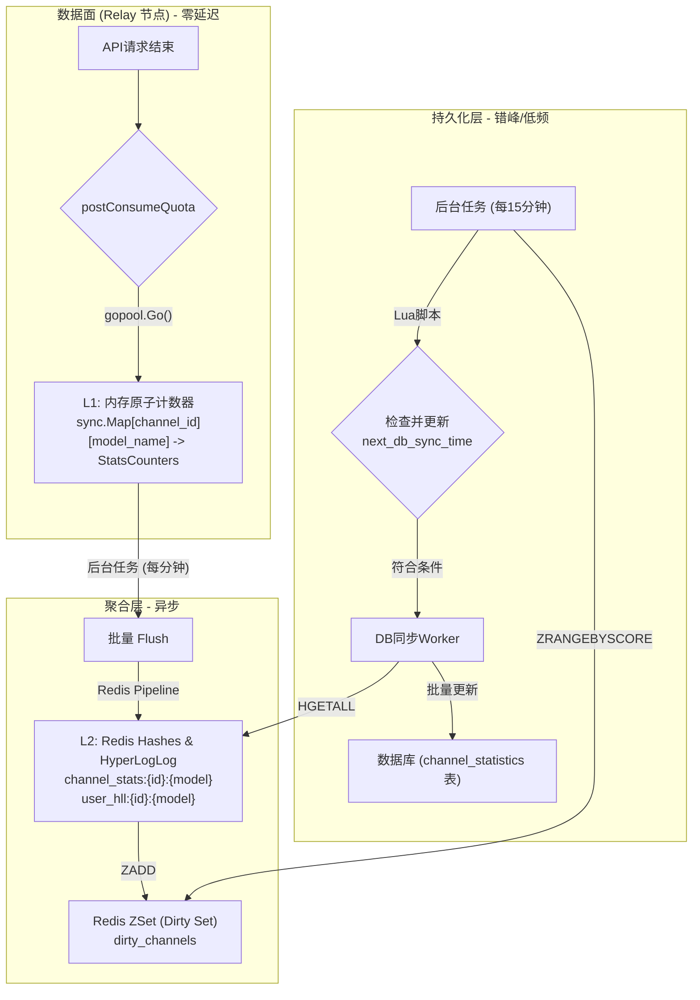
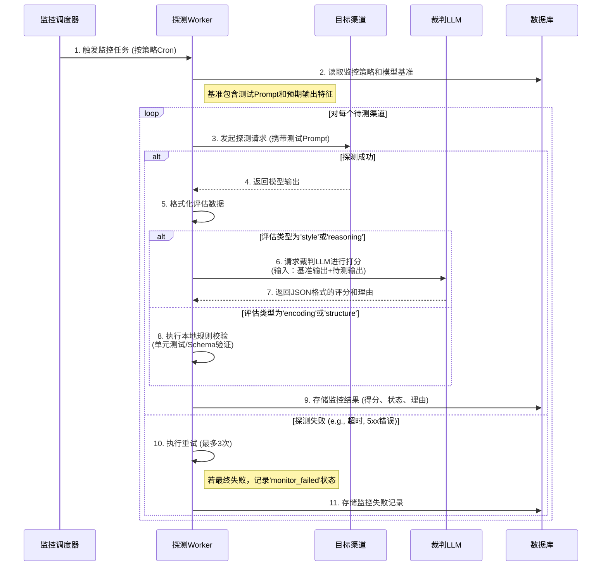

| 文档属性 | 内容 |
| :--- | :--- |
| **版本** | V2.0 |
| **最后更新** | 2025-12-10 |
| **状态** | 优化设计中 |
| **负责人** | 架构组 |

## 1. 业务背景与目标 (Context)

### 1.1 业务背景
随着NewAPI平台中P2P共享分组与用户自定义渠道功能的广泛应用，渠道的数量与来源日益多样化，给服务质量（QoS）的保障带来了新的挑战。为了构建一个可信、透明、高效的渠道生态，平台迫切需要一套强大的监控、统计与智能分析系统。现行系统在此方面存在空白，无法有效追踪渠道健康度、性能衰减、模型行为漂移，也缺乏对P2P共享分组的宏观洞察力。

### 1.2 核心业务目标
为应对上述挑战，本项目旨在构建一个三位一体的监控、统计与智能分析系统，实现以下核心目标：

1.  **渠道性能全景洞察**: 为每个渠道（包括平台自营、用户私有及P2P共享渠道）建立全面的性能档案，关键指标包括：请求延迟、成功率、TPM/RPM、额度消耗速率、并发数、活跃用户数等，以支持精细化运营与智能路由决策。

2.  **模型质量智能监控**: 建立自动化的模型“降智”与“行为漂移”检测机制。通过设置官方基准渠道，定期对其他渠道的同名模型进行探测、打分，量化其与基准的差异，确保P2P渠道模型的真实性与可靠性。

3.  **P2P分组聚合分析**: 提供P2P共享分组维度的聚合统计视图，将组内所有渠道的同类指标（如总TPM、加权平均成功率）进行汇总，帮助分组所有者和成员宏观评估分组的整体服务能力与健康状况。

4.  **高性能与低侵入性**: 设计一套**内存 -> Redis -> 数据库**的三级异步缓存与聚合架构，确保监控系统在数据采集过程中对核心转发链路的性能影响降至最低，并能应对高并发写入场景，避免数据库瓶颈。


为了支持上述功能，需要对现有数据模型进行扩展，并增加新的统计和监控相关的表。

### 2.1 核心设计思想

*   **分离热冷数据**:
    *   **热数据 (Hot Data)**: 实时、高频更新的统计指标（如TPM、RPM、并发数）将存储在 `Redis` 和内存中，保证数据面性能。
    *   **冷数据 (Cold Data)**: 定期（如每15分钟）从Redis同步到数据库，用于长期存储、趋势分析和仪表盘展示。
*   **扩展 `channels` 表**: 直接在 `channels` 表中增加统计字段，用于存储**渠道级别**的聚合统计信息。
*   **新增 `group_stats` 表**: 用于存储 **P2P共享分组级别** 的聚合统计信息。
*   **新增模型监控相关表**:
    *   `model_baselines`: 存储管理员为每个模型设定的行为基准。
    *   `model_monitoring_results`: 记录每次模型质量探测的结果和与基准的差异得分。

### 2.2 表结构定义

#### 2.2.1 `channels` 表扩展

在现有的 `channels` 表中增加以下字段，用于存储渠道的统计信息和监控策略。

```sql
ALTER TABLE `channels`
ADD COLUMN `avg_response_time` INT DEFAULT 0,              -- 平均"首字"响应时间 (ms)
ADD COLUMN `fail_rate` DOUBLE PRECISION DEFAULT 0.0,       -- 请求失败率 (%)
ADD COLUMN `avg_cache_hit_rate` DOUBLE PRECISION DEFAULT 0.0, -- 平均缓存命中率 (%)
ADD COLUMN `stream_req_ratio` DOUBLE PRECISION DEFAULT 0.0,   -- 流式请求占比 (%)
ADD COLUMN `tpm` INT DEFAULT 0,                            -- 每分钟处理的Tokens数量
ADD COLUMN `rpm` INT DEFAULT 0,                            -- 每分钟请求数
ADD COLUMN `quota_pm` BIGINT DEFAULT 0,                    -- 每分钟消耗的额度
ADD COLUMN `total_sessions` BIGINT DEFAULT 0,              -- 区间总服务session数
ADD COLUMN `downtime_percentage` DOUBLE PRECISION DEFAULT 0.0, -- 区间停止服务时间占比 (%)
ADD COLUMN `unique_users` INT DEFAULT 0,                   -- 区间服务用户数 (去重)
ADD COLUMN `monitoring_config` TEXT;                       -- 模型智能监控策略 (JSON)
```

*   **`monitoring_config` JSON 结构示例**:
    ```json
    {
      "enabled": true,
      "target_model": "gpt-4",
      "test_interval_minutes": 60,
      "test_type": ["encoding", "style"],
      "evaluation_standard": "standard"
    }
    ```

#### 2.2.2 新增 `group_stats` 表

用于存储P2P共享分组的聚合统计数据。

```sql
CREATE TABLE `group_stats` (
    `group_id` INT NOT NULL,
    `model_name` VARCHAR(255) NOT NULL,
    `tpm` INT DEFAULT 0,
    `rpm` INT DEFAULT 0,
    `quota_pm` BIGINT DEFAULT 0,
    `total_tokens` BIGINT DEFAULT 0,
    `total_quota` BIGINT DEFAULT 0,
    `avg_concurrency` DOUBLE PRECISION DEFAULT 0.0,
    `total_sessions` BIGINT DEFAULT 0,
    `downtime_percentage` DOUBLE PRECISION DEFAULT 0.0,
    `unique_users` INT DEFAULT 0,
    `updated_at` BIGINT NOT NULL,
    PRIMARY KEY (`group_id`, `model_name`)
);
```

## 3. 详细设计：渠道统计与性能监控 (Channel Statistics)

本章节详细阐述渠道性能与状态统计的实现方案，旨在满足高并发、低延迟的数据采集需求，并为后续的智能分析提供坚实的数据基础。

### 3.1 统计指标定义
系统将为每个渠道（`channel_id`）及其支持的每个模型（`model_name`）维护一套独立的统计指标。这允许我们进行多维度的聚合分析，既能看渠道的总体表现，也能深入到特定模型的性能。

| 指标分类 | 指标项 (数据库字段) | 数据类型 | 描述与计算方法 |
| :--- | :--- | :--- | :--- |
| **质量指标** | `avg_response_time` | INT | **平均首字响应时间 (ms)**：一个统计周期内，所有请求从发送到接收到第一个字符的平均耗时。 |
| | `fail_rate` | DOUBLE | **请求失败率 (%)**: `(周期内失败请求数 / 周期内总请求数) * 100`。 |
| | `avg_cache_hit_rate`| DOUBLE | **平均缓存命中率 (%)**: `(周期内缓存命中请求数 / 周期内总请求数) * 100`。 |
| | `stream_req_ratio` | DOUBLE | **流式请求占比 (%)**: `(周期内流式请求数 / 周期内总请求数) * 100`。 |
| **容量指标** | `tpm` | INT | **每分钟处理Tokens数 (TPM)**: 基于最近一个统计周期的 `total_tokens` 计算得出。 |
| | `rpm` | INT | **每分钟请求数 (RPM)**: 基于最近一个统计周期的 `request_count` 计算得出。 |
| | `quota_pm` | BIGINT | **每分钟消耗额度 (Quota PM)**: 基于最近一个统计周期的 `total_quota` 计算得出。 |
| **总量指标** | `total_tokens` | BIGINT | **区间Token总额**: 统计周期内处理的总 Token 数。 |
| | `total_quota` | BIGINT | **区间额度总额**: 统计周期内消耗的总额度。 |
| | `total_sessions` | BIGINT | **区间总服务Session数**: 统计周期内服务的会话总数。 |
| | `unique_users` | INT | **区间服务用户数 (去重)**: 统计周期内服务的独立用户数量，通过 `HyperLogLog` 计算。 |
| **并发与状态** | `avg_concurrency` | DOUBLE | **平均并发Session数**: `(周期内所有请求的总处理时长 / 周期时长)`。 |
| | `downtime_percentage`| DOUBLE | **区间停止服务时间占比 (%)**: `(周期内禁用总时长 / 周期总时长) * 100`。 |

### 3.2 高性能数据采集架构

为实现高性能与低侵入性，系统采用**内存 -> Redis -> 数据库**的三级异步数据流架构。



#### 3.2.1 L1: 进程内存缓存 (In-Memory)
*   **数据结构**: `sync.Map`，键为 `channel_id:model_name`，值为包含各种原子计数器 (`atomic.Int64`) 的结构体。
*   **写入逻辑**: 在 `postConsumeQuota` 函数中，通过 `gopool.Go()` 启动一个轻量级协程，对内存中的计数器执行原子增操作 (`Add`)。此操作与主请求处理完全分离，无任何阻塞。
*   **淘汰机制**: 一个后台 Goroutine 每分钟遍历一次 Map。如果某个渠道在过去5分钟内没有任何更新（通过时间戳判断），则从 Map 中移除，防止内存无限增长。

#### 3.2.2 L2: Redis 缓存 (Cache & Buffer)
*   **数据结构**:
    *   **统计计数**: `HASH` -> `channel_stats:{channel_id}:{model_name}`
        *   **Fields**: `req_count`, `fail_count`, `token_count`, `quota_sum`, `latency_sum`...
    *   **去重用户**: `HyperLogLog` -> `user_hll:{channel_id}:{model_name}:{time_window}`
    *   **脏数据标记**: `ZSET` -> `dirty_channels`
        *   **Member**: `{channel_id}:{model_name}`
        *   **Score**: `timestamp` (最新更新时间)
*   **写入逻辑**: 一个后台任务每分钟执行一次 `Flush` 操作：
    1.  遍历 L1 内存中所有发生变更的计数器。
    2.  使用 `Redis Pipeline` 将所有更新打包，通过 `HINCRBY` 和 `PFADD` 原子地批量更新到 Redis。
    3.  使用 `ZADD` 将被更新的 `channel:model` 键及其当前时间戳添加到 `dirty_channels` 集合中。
    4.  清空 L1 内存中的计数器。
*   **TTL**: 所有 Redis 键都设置合理的过期时间（例如，统计 Hash 设置 24 小时，HLL 设置 30 天），确保冷数据自动清理。

#### 3.2.3 L3: 数据库持久化 (Database)
*   **触发机制**: 一个独立的后台任务（例如，`DB Sync Worker`）每分钟执行一次。
*   **错峰同步 (Staggered Sync)**:
    1.  Worker **不直接**处理所有脏数据，而是检查 Redis 中每个渠道的一个特殊字段: `next_db_sync_time`。
    2.  只有当 `currentTime > next_db_sync_time` 时，该渠道的数据才会被本次同步任务选中。
    3.  这通过一个 **Lua 脚本** 实现原子性的“检查并提取”，避免并发问题。
    4.  同步完成后，Worker 会为该渠道计算一个新的、带有随机抖动（如 `15m + random(0, 60s)`）的 `next_db_sync_time` 并写回 Redis。这确保了数据库的写入压力在时间上被均匀分散。
*   **聚合与写入**:
    1.  Worker 从 Redis 的 `HASH` 中读取累计数据，并从 `HyperLogLog` 中使用 `PFCOUNT` 获取去重用户数。
    2.  计算最终的平均值和比率（如 `fail_rate`, `avg_response_time`）。
    3.  将计算结果 `UPSERT` 到 `channel_statistics` 表中。
    4.  成功写入数据库后，从 Redis 的 `HASH` 中减去已同步的计数值，确保数据不重复计算。

### 3.3 API 设计

*   **Endpoint**: `GET /api/channels/{id}/stats`
*   **权限**: 管理员
*   **参数**:
    *   `period` (Query, string, optional): 时间窗口, 可选 `1h`, `6h`, `7d`, `30d` (默认 `1h`)。
    *   `model` (Query, string, optional): 指定模型，为空则返回渠道总体统计。
*   **响应逻辑**:
    1.  根据 `period` 确定查询的时间范围。
    2.  从 `channel_statistics` 表中查询该时间范围内的所有历史数据点。
    3.  从 `Redis` 中查询当前未持久化的实时数据。
    4.  将两者合并、聚合，计算出最终的统计指标并返回。
    5.  **缓存**: 此 API 的计算结果应被缓存（如 Redis 缓存 1-5 分钟），以应对高频查询。
*   **数据结构**: (与原设计保持一致)

## 4. 详细设计：模型智能与特征波动监控

本部分详细阐述模型质量的自动化监控方案，其核心是**基准对比法 (Baseline Comparison)**，旨在量化并追踪各渠道模型的“降智”或行为“漂移”现象。

### 4.1 核心工作流
系统通过后台任务，定期使用标准化的“金丝雀测试Prompt”对各渠道模型进行探测，并将其输出与管理员设定的“基准模型”的输出进行对比和打分。



### 4.2 基准管理 (Baseline Management)
基准是模型质量评估的“黄金标准”，由管理员手动设定。

1.  **基准生成**:
    *   **触发**: 管理员在后台为指定模型（如 `gpt-4-turbo`）选择一个**受信任的高质量渠道**作为基准源。
    *   **动作**: 系统将从预置的“金丝雀测试集”(`@docs/001-具体检测AI降智prompt.md`)中，根据所选的检测类型（`coding`, `reasoning`, `style`等）选取对应的Prompt，通过基准渠道执行并**记录其完整的输出内容**。
    *   **存储**: 这个“输入-输出”对被保存到 `model_baselines` 表中，作为后续所有对比的依据。

2.  **基准更新**: 管理员可随时为模型重新指定基准渠道或更新基准，新基准会覆盖旧数据。

### 4.3 自动化监控流程

1.  **调度 (Scheduling)**: 一个独立的后台任务（`MonitorWorker`），由调度器根据 `monitor_policies` 表中定义的 Cron 表达式（如 `0 */4 * * *` 每4小时）触发。

2.  **探测 (Probing)**:
    *   Worker 从数据库加载需要执行的监控策略。
    *   对每个策略，它会获取对应的模型基准（包含测试Prompt和预期输出）。
    *   向策略定义的所有待测渠道发送这个标准的测试 Prompt。

3.  **评估与打分 (Evaluation & Scoring)**:
    *   **简单对比 (Rule-based)**: 对于 `encoding`（编码能力）或 `structure_consistency`（结构一致性）等客观任务，系统直接在本地执行评估。例如，运行代码的单元测试或用 JSON Schema 校验输出，结果直接为 `pass` 或 `fail`。
    *   **复杂对比 (LLM-as-a-Judge)**: 对于 `style`（风格）或 `reasoning`（逻辑）等主观性强的任务，系统将依赖一个高质量的“裁判LLM”进行仲裁。
        *   **裁判Prompt构建**: 系统会构造一个类似以下的Prompt，要求裁判LLM进行打分：
            ```text
            你是一个AI模型质量评估专家。请基于“{evaluation_standard}”标准，对比以下两个匿名模型的输出。

            # 任务输入
            {original_prompt}

            # 基准模型输出 (模型A)
            {baseline_output}

            # 待测模型输出 (模型B)
            {candidate_output}

            请以JSON格式返回你的评估，包含三个字段：
            1. "similarity_score": 一个0到100的浮点数，表示模型B在多大程度上模拟了模型A的风格、语气、逻辑和内容质量。
            2. "is_pass": 一个布尔值，表示模型B的输出是否达到了可接受的模仿水平。
            3. "reason": 一句简短的中文解释，说明你的打分依据，尤其是指出二者的关键差异。
            ```
        *   **结果解析**: Worker 解析裁判LLM返回的JSON，提取 `similarity_score` 和 `is_pass` 等关键信息。

4.  **结果存储**: 所有探测结果，包括得分、状态（`pass`/`fail`/`monitor_failed`）、裁判理由等，都会被详细记录到 `model_monitoring_results` 表中。

### 4.4 鲁棒性设计
*   **探测重试**: 如果对某个渠道的探测因网络错误或临时性5xx错误而失败，系统将自动进行最多**3次**的重试（间隔1分钟）。
*   **监控失败状态**: 如果所有重试都失败，该渠道本次的监控结果将被标记为 `monitor_failed`，并记录下错误原因，以区别于模型本身的质量问题。
*   **裁判LLM失败处理**: 如果向裁判LLM的请求失败，本次评估也会被标记为 `monitor_failed`，并在日志中记录相关错误，以便运维排查。

### 4.5 API 设计

*   **基准管理**:
    *   `POST /api/monitor/baselines`: 创建或更新一个模型的基准。
        *   **Request Body**: `{ "model_name": "gpt-4", "baseline_channel_id": 123, "test_type": "style", "evaluation_standard": "strict" }`
    *   `GET /api/monitor/baselines`: 获取所有模型的基准配置。
*   **监控结果查询**: (与原设计保持一致)
    *   `GET /api/channels/:id/monitoring_results`
    *   `GET /api/models/:model_name/monitoring_report`

## 5. 详细设计：P2P共享分组统计

P2P共享分组的统计数据并非实时计算，而是基于其组内所有渠道已持久化的统计数据，进行定期的、低频的**后聚合（Post-Aggregation）**，以确保对系统性能的影响降至最低。

### 5.1 聚合逻辑
分组的统计指标是对其组内所有**活跃（Enabled）**渠道对应指标的逻辑汇总。

*   **求和类指标 (Summation Metrics)**:
    *   **指标**: `TPM`, `RPM`, `QuotaPM`, `TotalTokens`, `TotalQuota`, `TotalSessions`, `UniqueUsers`。
    *   **计算**: `Group.TPM = Σ(Channel_i.TPM)`，其中 `i` 遍历组内所有活跃渠道。

*   **加权平均类指标 (Weighted Average Metrics)**:
    *   **指标**: `FailRate`, `AvgCacheHitRate`, `StreamReqRatio`, `DowntimePercentage`。
    *   **计算**: 以**请求总数 (`request_count`)** 作为权重进行加权平均，以更准确地反映整体服务质量。
        *   `Group.FailRate = Σ(Channel_i.FailRate * Channel_i.RequestCount) / Σ(Channel_i.RequestCount)`。

*   **特殊聚合指标 (Special Aggregation Metrics)**:
    *   **指标**: `AvgResponseTime`, `AvgConcurrency`。
    *   **计算**:
        *   `Group.AvgResponseTime`：同样以请求数作为权重进行加权平均。
        *   `Group.AvgConcurrency`：直接求和 `Σ(Channel_i.AvgConcurrency)`，因为并发能力是叠加的。

*   **聚合维度**: 统计可以按**分组+模型**的粒度进行（如 "TeamA" 分组下 "gpt-4" 的总TPM），也可以按**分组**的粒度进行（聚合组内所有模型的数据）。

### 5.2 触发与更新机制：事件驱动 + 节流
为避免高频的全量轮询，分组统计采用**事件驱动**结合**节流（Debounce）**的更新策略。

1.  **触发源**:
    *   当 `DB Sync Worker` 成功将一个渠道的统计数据持久化到 `channel_statistics` 表后，会产生一个“渠道数据已更新”的内部事件。

2.  **节流检查 (Debounce Check)**:
    *   监听到事件后，系统会检查该渠道所属的每一个P2P分组。
    *   对于每个分组，查询其在 Redis 中的 `group_stats_updated_at:{group_id}` 时间戳。
    *   如果 `currentTime - last_update_time < 30分钟`（可配置），则**忽略**本次触发。这确保了即使组内多个渠道在短时间内相继更新，对该分组的聚合计算也只会在半小时内执行一次。

3.  **任务调度**:
    *   如果超过节流时间，系统会向一个专用的任务队列（如 Redis List）中推送一个 `GroupStatUpdateTask`，任务内容为 `{ "group_id": 123 }`。

### 5.3 更新过程的鲁棒性与并发控制

`GroupAggregator` Worker 从队列中消费任务，并执行以下高鲁棒性的更新流程：

1.  **分布式锁 (Distributed Lock)**:
    *   **目的**: 防止多个 `GroupAggregator` 实例（在多节点部署时）同时计算同一个分组的数据。
    *   **实现**: 在开始计算前，Worker 必须先尝试获取一个基于 Redis 的分布式锁，例如 `SET group_stats_lock:{group_id} "in_progress" NX EX 180`。
    *   如果获取锁失败，说明已有其他 Worker 在处理，本次任务直接放弃。

2.  **全局并发控制 (Global Concurrency Limit)**:
    *   **目的**: 避免同一时间有大量的分组聚合任务并发执行，对数据库造成冲击。
    *   **实现**: 使用一个全局的信号量或令牌桶（如 Go 的 `semaphore` 包或 Redis 计数器）来限制同时运行的 `GroupAggregator` 协程数量，例如，平台范围内最多允许 **5个** 分组聚合任务同时进行。

3.  **数据聚合与持久化**:
    1.  获取分布式锁成功后，Worker 从 `group_members` 表获取该分组下的所有活跃渠道 ID。
    2.  从 `channel_statistics` 表中批量查询这些渠道的最新统计数据。
    3.  在内存中，根据 **5.1节** 定义的聚合逻辑进行计算。
    4.  使用 `UPSERT` (或 `INSERT ... ON DUPLICATE KEY UPDATE`) 将聚合结果写入 `group_statistics` 表。
    5.  更新 Redis 中的 `group_stats_updated_at:{group_id}` 时间戳为当前时间。

4.  **释放锁**: 任务完成后，务必 `DEL group_stats_lock:{group_id}` 以释放锁。

### 5.4 API 设计

*   **Endpoint**: `GET /api/p2p_groups/:id/stats`
*   **权限**: 分组内的成员
*   **参数**:
    *   `model` (Query, string, optional): 指定要查询的模型，如果为空则返回该分组下所有模型的聚合统计。
*   **响应**: 直接从 `group_statistics` 表中查询并返回最新的聚合数据，确保了查询的低延迟。


## 6. 数据库设计 (Database Schema)

为支撑上述功能，需新增以下数据表。所有表均需包含 `created_at` 和 `updated_at` 时间戳字段。

### 6.1 `channel_statistics` (渠道统计时序表)
用于持久化渠道在每个统计周期的性能快照，作为长期趋势分析的数据源。

```sql
CREATE TABLE `channel_statistics` (
    `id` INT AUTO_INCREMENT PRIMARY KEY,
    `channel_id` INT NOT NULL,
    `model_name` VARCHAR(255) NOT NULL,
    `time_window_start` BIGINT NOT NULL COMMENT '统计窗口起始时间戳',
    `request_count` INT DEFAULT 0 COMMENT '总请求数',
    `fail_count` INT DEFAULT 0 COMMENT '失败请求数',
    `total_tokens` BIGINT DEFAULT 0 COMMENT '总Token数',
    `total_quota` BIGINT DEFAULT 0 COMMENT '总额度消耗',
    `total_latency_ms` BIGINT DEFAULT 0 COMMENT '总首字延迟(ms)',
    `stream_req_count` INT DEFAULT 0 COMMENT '流式请求数',
    `cache_hit_count` INT DEFAULT 0 COMMENT '缓存命中数',
    `downtime_seconds` INT DEFAULT 0 COMMENT '禁用时长(秒)',
    INDEX `idx_channel_model_time` (`channel_id`, `model_name`, `time_window_start`)
);
```

### 6.2 `group_statistics` (分组聚合统计表)
存储P2P分组在每个统计周期的聚合性能数据。

```sql
CREATE TABLE `group_statistics` (
    `group_id` INT NOT NULL,
    `model_name` VARCHAR(255) NOT NULL,
    `time_window_start` BIGINT NOT NULL,
    `tpm` INT DEFAULT 0,
    `rpm` INT DEFAULT 0,
    `fail_rate` DOUBLE PRECISION DEFAULT 0.0,
    `avg_response_time` INT DEFAULT 0,
    -- ... 其他聚合指标字段 ...
    `updated_at` BIGINT NOT NULL,
    PRIMARY KEY (`group_id`, `model_name`, `time_window_start`)
);
```

### 6.3 `monitor_policies` (模型监控策略表)
定义对哪些模型、以何种频率、按何种标准进行监控。

```sql
CREATE TABLE `monitor_policies` (
    `id` INT AUTO_INCREMENT PRIMARY KEY,
    `name` VARCHAR(100) NOT NULL,
    `target_models` TEXT COMMENT '监控的模型列表 (JSON Array)',
    `test_types` TEXT COMMENT '检测类型 (JSON Array: coding, style, etc.)',
    `schedule_cron` VARCHAR(50) NOT NULL COMMENT 'Cron表达式',
    `is_enabled` BOOLEAN DEFAULT TRUE,
    `created_at` BIGINT,
    `updated_at` BIGINT
);
```

### 6.4 `model_baselines` (模型基准表)
存储由管理员设定的、作为“黄金标准”的模型输出。

```sql
CREATE TABLE `model_baselines` (
    `id` INT AUTO_INCREMENT PRIMARY KEY,
    `model_name` VARCHAR(255) NOT NULL,
    `test_type` VARCHAR(50) NOT NULL,
    `evaluation_standard` VARCHAR(50) NOT NULL,
    `baseline_channel_id` INT NOT NULL,
    `prompt` TEXT NOT NULL COMMENT '测试用的Prompt',
    `baseline_output` TEXT NOT NULL COMMENT '基准输出内容',
    `created_at` BIGINT,
    UNIQUE INDEX `idx_model_type_standard` (`model_name`, `test_type`, `evaluation_standard`)
);
```

### 6.5 `model_monitoring_results` (模型监控结果表)
记录每一次自动化探测的结果。

```sql
CREATE TABLE `model_monitoring_results` (
    `id` BIGINT AUTO_INCREMENT PRIMARY KEY,
    `channel_id` INT NOT NULL,
    `model_name` VARCHAR(255) NOT NULL,
    `baseline_id` INT NOT NULL,
    `test_timestamp` BIGINT NOT NULL,
    `status` VARCHAR(20) NOT NULL COMMENT 'pass, fail, monitor_failed',
    `diff_score` DOUBLE PRECISION,
    `reason` TEXT COMMENT '失败原因或裁判LLM的评估理由',
    `raw_output` TEXT,
    INDEX `idx_channel_model_time` (`channel_id`, `model_name`, `test_timestamp`)
);
```

---

## 7. API 接口设计 (API Design)

以下是为支持本设计而新增或修改的核心管理API端点。

### 7.1 渠道统计接口
*   **`GET /api/channels/{id}/stats`**
    *   **描述**: 获取指定渠道的详细性能统计数据。
    *   **权限**: 管理员
    *   **Query参数**:
        *   `period` (string, optional): 时间窗口，支持 `1h`, `6h`, `7d`, `30d`。默认为 `1h`。
        *   `model` (string, optional): 指定模型名称，如果为空，则返回渠道的总体统计。
    *   **成功响应**: (HTTP 200) 返回包含各项统计指标的JSON对象。

### 7.2 模型监控接口
*   **`POST /api/monitor/baselines`**
    *   **描述**: 创建或更新一个模型的行为基准。
    *   **权限**: 管理员
    *   **请求体**: `{ "model_name": "gpt-4", "baseline_channel_id": 123, "test_type": "style", "evaluation_standard": "strict" }`
    *   **成功响应**: (HTTP 201) 创建成功。

*   **`GET /api/models/:model_name/monitoring_report`**
    *   **描述**: 获取一个模型在所有渠道下的最新监控对比报告。
    *   **权限**: 管理员
    *   **成功响应**: (HTTP 200) 返回一个包含所有被测渠道得分和状态的对比列表。

*   **`GET /api/channels/:id/monitoring_results`**
    *   **描述**: 获取指定渠道在特定模型上的历史监控结果。
    *   **权限**: 管理员
    *   **Query参数**: `model_name`, `test_type`, `start_time`, `end_time`
    *   **成功响应**: (HTTP 200) 返回一个包含历史监控记录的时间序列数组。

### 7.3 分组统计接口
*   **`GET /api/p2p_groups/:id/stats`**
    *   **描述**: 获取指定P2P共享分组的聚合统计数据。
    *   **权限**: 分组成员
    *   **Query参数**: `model` (string, optional): 指定模型名称，为空则返回分组总体数据。
    *   **成功响应**: (HTTP 200) 返回该分组（及指定模型）的最新聚合统计信息。

