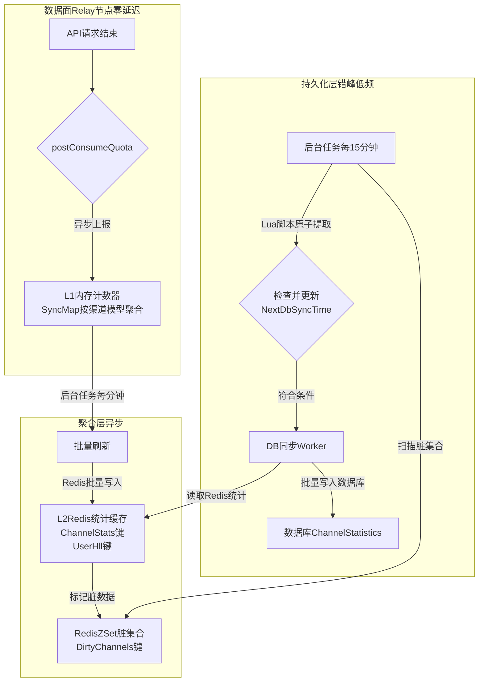
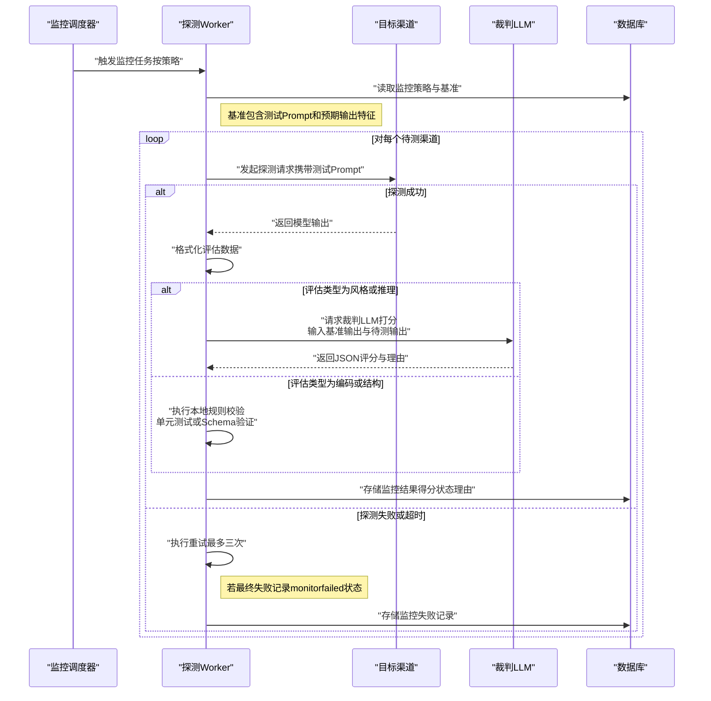

# New API P2P共享分组与用户渠道监控统计设计

| 文档属性 | 内容 |
| :--- | :--- |
| **版本** | V2.0 |
| **最后更新** | 2025-12-13 |
| **状态** | 优化设计中 |
| **负责人** | 架构组 |
| **对应需求** | 渠道统计性需求、渠道模型智能监控需求、P2P共享分组统计需求 |

## 1. 业务背景与目标 (Context)

### 1.1 业务背景
随着NewAPI平台中P2P共享分组与用户自定义渠道功能的广泛应用，渠道的数量与来源日益多样化，给服务质量（QoS）的保障带来了新的挑战。为了构建一个可信、透明、高效的渠道生态，平台迫切需要一套强大的监控、统计与智能分析系统。现行系统在此方面存在空白，无法有效追踪渠道健康度、性能衰减、模型行为漂移，也缺乏对P2P共享分组的宏观洞察力。

### 1.2 核心业务目标
为应对上述挑战，本项目旨在构建一个三位一体的监控、统计与智能分析系统，实现以下核心目标：

1.  **渠道性能全景洞察**: 为每个渠道（包括平台自营、用户私有及P2P共享渠道）建立全面的性能档案，关键指标包括：请求延迟、成功率、TPM/RPM、额度消耗速率、并发数、活跃用户数等，以支持精细化运营与智能路由决策。

2.  **模型质量智能监控**: 建立自动化的模型“降智”与“行为漂移”检测机制。通过设置官方基准渠道，定期对其他渠道的同名模型进行探测、打分，量化其与基准的差异，确保P2P渠道模型的真实性与可靠性。

3.  **P2P分组聚合分析**: 提供P2P共享分组维度的聚合统计视图，将组内所有渠道的同类指标（如总TPM、加权平均成功率）进行汇总，帮助分组所有者和成员宏观评估分组的整体服务能力与健康状况。

4.  **高性能与低侵入性**: 设计一套**内存 -> Redis -> 数据库**的三级异步缓存与聚合架构，确保监控系统在数据采集过程中对核心转发链路的性能影响降至最低，并能应对高并发写入场景，避免数据库瓶颈。

## 2. 总体架构与技术方案

为了支持上述功能，需要对现有数据模型进行扩展，并增加新的统计和监控相关的表。

### 2.1 核心设计思想

*   **分离热冷数据**:
    *   **热数据 (Hot Data)**: 实时、高频更新的统计指标（如TPM、RPM、并发数）将存储在 `Redis` 和内存中，保证数据面性能。
    *   **冷数据 (Cold Data)**: 定期（如每15分钟）从Redis同步到数据库，用于长期存储、趋势分析和仪表盘展示。
*   **扩展 `channels` 表**: 直接在 `channels` 表中增加统计字段，用于存储**渠道级别**的聚合统计信息。
*   **新增 `group_stats` 表**: 用于存储 **P2P共享分组级别** 的聚合统计信息。
*   **新增模型监控相关表**:
    *   `model_baselines`: 存储管理员为每个模型设定的行为基准。
    *   `model_monitoring_results`: 记录每次模型质量探测的结果和与基准的差异得分。

### 2.2 表结构定义

#### 2.2.1 `channels` 表扩展

在现有的 `channels` 表中增加以下字段，用于存储渠道的统计信息和监控策略。

```sql
ALTER TABLE `channels`
ADD COLUMN `avg_response_time` INT DEFAULT 0,              -- 平均"首字"响应时间 (ms)
ADD COLUMN `fail_rate` DOUBLE PRECISION DEFAULT 0.0,       -- 请求失败率 (%)
ADD COLUMN `avg_cache_hit_rate` DOUBLE PRECISION DEFAULT 0.0, -- 平均缓存命中率 (%)
ADD COLUMN `stream_req_ratio` DOUBLE PRECISION DEFAULT 0.0,   -- 流式请求占比 (%)
ADD COLUMN `tpm` INT DEFAULT 0,                            -- 每分钟处理的Tokens数量
ADD COLUMN `rpm` INT DEFAULT 0,                            -- 每分钟请求数
ADD COLUMN `quota_pm` BIGINT DEFAULT 0,                    -- 每分钟消耗的额度
ADD COLUMN `total_sessions` BIGINT DEFAULT 0,              -- 区间总服务session数
ADD COLUMN `downtime_percentage` DOUBLE PRECISION DEFAULT 0.0, -- 区间停止服务时间占比 (%)
ADD COLUMN `unique_users` INT DEFAULT 0,                   -- 区间服务用户数 (去重)
ADD COLUMN `monitoring_config` TEXT;                       -- 模型智能监控策略 (JSON，按渠道配置监控模型、检测类型、评估标准与绑定的策略ID列表)
```

*   **`monitoring_config` JSON 结构示例**:
    ```json
    {
      "enabled": true,
      "target_model": "gpt-4",
      "test_interval_minutes": 60,
      "test_type": ["encoding", "style"],
      "evaluation_standard": "standard"
    }
    ```

#### 2.2.2 新增 `group_stats` 表

用于存储P2P共享分组的聚合统计数据。

```sql
CREATE TABLE `group_stats` (
    `group_id` INT NOT NULL,
    `model_name` VARCHAR(255) NOT NULL,
    `tpm` INT DEFAULT 0,
    `rpm` INT DEFAULT 0,
    `quota_pm` BIGINT DEFAULT 0,
    `total_tokens` BIGINT DEFAULT 0,
    `total_quota` BIGINT DEFAULT 0,
    `avg_concurrency` DOUBLE PRECISION DEFAULT 0.0,
    `total_sessions` BIGINT DEFAULT 0,
    `downtime_percentage` DOUBLE PRECISION DEFAULT 0.0,
    `unique_users` INT DEFAULT 0,
    `updated_at` BIGINT NOT NULL,
    PRIMARY KEY (`group_id`, `model_name`)
);
```

## 3. 详细设计：渠道统计与性能监控 (Channel Statistics)

本章节详细阐述渠道性能与状态统计的实现方案，旨在满足高并发、低延迟的数据采集需求，并为后续的智能分析提供坚实的数据基础。

### 3.1 统计指标定义
系统将为每个渠道（`channel_id`）及其支持的每个模型（`model_name`）维护一套独立的统计指标。这允许我们进行多维度的聚合分析，既能看渠道的总体表现，也能深入到特定模型的性能。

| 指标分类 | 指标项 (数据库字段) | 数据类型 | 描述与计算方法 |
| :--- | :--- | :--- | :--- |
| **质量指标** | `avg_response_time` | INT | **平均首字响应时间 (ms)**：一个统计周期内，所有请求从发送到接收到第一个字符的平均耗时。 |
| | `fail_rate` | DOUBLE | **请求失败率 (%)**: `(周期内失败请求数 / 周期内总请求数) * 100`。 |
| | `avg_cache_hit_rate`| DOUBLE | **平均缓存命中率 (%)**: `(周期内缓存命中请求数 / 周期内总请求数) * 100`。 |
| | `stream_req_ratio` | DOUBLE | **流式请求占比 (%)**: `(周期内流式请求数 / 周期内总请求数) * 100`。 |
| **容量指标** | `tpm` | INT | **每分钟处理Tokens数 (TPM)**: 基于最近一个统计周期的 `total_tokens` 计算得出。 |
| | `rpm` | INT | **每分钟请求数 (RPM)**: 基于最近一个统计周期的 `request_count` 计算得出。 |
| | `quota_pm` | BIGINT | **每分钟消耗额度 (Quota PM)**: 基于最近一个统计周期的 `total_quota` 计算得出。 |
| **总量指标** | `total_tokens` | BIGINT | **区间Token总额**: 统计周期内处理的总 Token 数。 |
| | `total_quota` | BIGINT | **区间额度总额**: 统计周期内消耗的总额度。 |
| | `total_sessions` | BIGINT | **区间总服务Session数**: 统计周期内服务的会话总数。 |
| | `unique_users` | INT | **区间服务用户数 (去重)**: 统计周期内服务的独立用户数量，通过 `HyperLogLog` 计算。 |
| **并发与状态** | `avg_concurrency` | DOUBLE | **平均并发Session数**: `(周期内所有请求的总处理时长 / 周期时长)`。 |
| | `downtime_percentage`| DOUBLE | **区间停止服务时间占比 (%)**: `(周期内禁用总时长 / 周期总时长) * 100`。 |

上述指标以固定统计窗口（基础粒度建议为15分钟）写入 `channel_statistics` 表，请求侧通过聚合这些窗口，分别提供最近1小时、6小时、7天、30天的渠道总体视图与按模型维度的统计视图。

### 3.2 高性能数据采集架构

为实现高性能与低侵入性，系统采用**内存 -> Redis -> 数据库**的三级异步数据流架构。



#### 3.2.1 L1: 进程内存缓存 (In-Memory)
*   **数据结构**: `sync.Map`，键为 `channel_id:model_name`，值为包含各种原子计数器 (`atomic.Int64`) 的结构体。
*   **写入逻辑**: 在 `postConsumeQuota` 函数中，通过 `gopool.Go()` 启动一个轻量级协程，对内存中的计数器执行原子增操作 (`Add`)。此操作与主请求处理完全分离，无任何阻塞。
*   **淘汰机制**: 仅在渠道实际收到请求或发生禁用事件时创建内存计数器；一个后台 Goroutine 每分钟遍历一次 Map，如果某个渠道在过去5分钟内没有任何更新（通过时间戳判断），则从 Map 中移除，防止内存无限增长。

#### 3.2.2 L2: Redis 缓存 (Cache & Buffer)
*   **数据结构**:
    *   **统计计数**: `HASH` -> `channel_stats:{channel_id}:{model_name}`
        *   **Fields**: `req_count`, `fail_count`, `token_count`, `quota_sum`, `latency_sum`...
    *   **去重用户**: `HyperLogLog` -> `user_hll:{channel_id}:{model_name}:{time_window}`
    *   **脏数据标记**: `ZSET` -> `dirty_channels`
        *   **Member**: `{channel_id}:{model_name}`
        *   **Score**: `timestamp` (最新更新时间)
*   **写入逻辑**: 一个后台任务每分钟执行一次 `Flush` 操作：
    1.  遍历 L1 内存中所有发生变更的计数器。
    2.  使用 `Redis Pipeline` 将所有更新打包，通过 `HINCRBY` 和 `PFADD` 原子地批量更新到 Redis。
    3.  使用 `ZADD` 将被更新的 `channel:model` 键及其当前时间戳添加到 `dirty_channels` 集合中。
    4.  清空 L1 内存中的计数器。
*   **TTL**: 所有 Redis 键都设置合理的过期时间（例如，统计 Hash 设置 24 小时，HLL 设置 30 天），确保冷数据自动清理。

#### 3.2.3 L3: 数据库持久化 (Database)
*   **触发机制**: 一个独立的后台任务（例如，`DB Sync Worker`）每分钟执行一次。
*   **错峰同步 (Staggered Sync)**:
    1.  Worker **不直接**处理所有脏数据，而是检查 Redis 中每个渠道的一个特殊字段: `next_db_sync_time`。
    2.  只有当 `currentTime > next_db_sync_time` 时，该渠道的数据才会被本次同步任务选中。
    3.  这通过一个 **Lua 脚本** 实现原子性的“检查并提取”，避免并发问题。
    4.  同步完成后，Worker 会为该渠道计算一个新的、带有随机抖动（如 `15m + random(0, 60s)`）的 `next_db_sync_time` 并写回 Redis。这确保了数据库的写入压力在时间上被均匀分散。
*   **聚合与写入**:
    1.  Worker 从 Redis 的 `HASH` 中读取累计数据，并从 `HyperLogLog` 中使用 `PFCOUNT` 获取去重用户数。
    2.  计算最终的平均值和比率（如 `fail_rate`, `avg_response_time`）。
    3.  将计算结果 `UPSERT` 到 `channel_statistics` 表中。
    4.  成功写入数据库后，从 Redis 的 `HASH` 中减去已同步的计数值，确保数据不重复计算。
*   **停服时间累积**: 渠道在管理面被手动禁用/启用，或在数据面被风险控制自动禁用/恢复时，统一在 Redis 记录状态变更时间段（例如 `channel_status:{channel_id}` 中维护最近一次禁用起止时间）；`DB Sync Worker` 在计算某一统计窗口的 `downtime_seconds` 时，根据这些时间段与窗口的交集累加秒数，即使窗口内没有任何请求也能准确统计停服占比。

### 3.3 API 设计

*   **Endpoint**: `GET /api/channels/{id}/stats`
*   **权限**: 管理员
*   **参数**:
    *   `period` (Query, string, optional): 时间窗口, 可选 `1h`, `6h`, `7d`, `30d` (默认 `1h`)。
    *   `model` (Query, string, optional): 指定模型，为空则返回渠道总体统计。
*   **响应逻辑**:
    1.  根据 `period` 确定查询的时间范围。
    2.  从 `channel_statistics` 表中查询该时间范围内的所有历史数据点。
    3.  从 `Redis` 中查询当前未持久化的实时数据。
    4.  将两者合并、聚合，计算出最终的统计指标并返回。
    5.  **缓存**: 此 API 的计算结果应被缓存（如 Redis 缓存 1-5 分钟），以应对高频查询。
*   **三级缓存读路径**: `/api/channels/{id}/stats` 的实现上优先从本节点的进程内缓存中读取聚合结果，未命中时回退到 Redis 中的预聚合数据，再回退到 `channel_statistics` 表做 SQL 聚合，并在返回前回填 Redis 与进程内缓存，从而形成“数据库 -> Redis -> 进程内存”的读侧三级缓存闭环。
*   **数据结构**: (与原设计保持一致)

## 4. 详细设计：模型智能与特征波动监控

本部分详细阐述模型质量的自动化监控方案，其核心是**基准对比法 (Baseline Comparison)**，旨在量化并追踪各渠道模型的“降智”或行为“漂移”现象。

### 4.1 核心工作流
系统通过后台任务，定期使用标准化的“金丝雀测试Prompt”对各渠道模型进行探测，并将其输出与管理员设定的“基准模型”的输出进行对比和打分。
在策略解析阶段，系统会同时考虑全局级别的 `monitor_policies` 配置和各渠道 `monitoring_config` 中的覆盖项，确保“根据渠道配置的监控策略”能够精细控制监控模型、检测类型与评估标准。



### 4.2 基准管理 (Baseline Management)
基准是模型质量评估的“黄金标准”，由管理员手动设定。

1.  **基准生成**:
    *   **触发**: 管理员在后台为指定模型（如 `gpt-4-turbo`）选择一个**受信任的高质量渠道**作为基准源。
    *   **动作**: 系统将从预置的“金丝雀测试集”(`@docs/001-具体检测AI降智prompt.md`)，结合 `@docs/001-检测AI降智-理论方法.md` 与 `@docs/001-检测AI指纹特征变化-理论方法.md` 中定义的检测维度，根据所选的检测类型（`encoding`, `reasoning`, `style`, `instruction_following`, `structure_consistency`）选取对应的 Prompt，通过基准渠道执行并**记录其完整的输出内容与关键特征指纹**。
    *   **存储**: 这个“输入-输出”对被保存到 `model_baselines` 表中，作为后续所有对比的依据。

2.  **基准更新**: 管理员可随时为模型重新指定基准渠道或更新基准，新基准会覆盖旧数据。

### 4.3 自动化监控流程

1.  **调度 (Scheduling)**: 一个独立的后台任务（`MonitorWorker`），由调度器根据 `monitor_policies` 表中每条启用策略的 `schedule_cron` 字段（如 `0 */4 * * *` 每4小时）触发，对满足时间条件的策略逐一执行监控任务。

2.  **探测 (Probing)**:
    *   Worker 从数据库加载本次需要执行的监控策略，解析其中的 `target_models`、`test_types`、`evaluation_standard` 与可选的 `target_channels` 配置。
    *   对每个策略和其中的每个 `model_name` 与 `test_type` 组合，按 `(model_name, test_type, evaluation_standard)` 从 `model_baselines` 表中获取对应的模型基准（包含测试Prompt和预期输出特征）。
    *   根据策略的 `target_channels` 配置确定待测渠道列表：若为空则默认选择所有支持该模型的渠道，否则仅对列表中的渠道发起带有标准测试 Prompt 的探测请求。

3.  **评估与打分 (Evaluation & Scoring)**:
    *   **简单对比 (Rule-based)**: 对于 `encoding`（编码能力）或 `structure_consistency`（结构一致性）等客观任务，系统直接在本地执行评估。例如，运行代码的单元测试或用 JSON Schema 校验输出，结果直接为 `pass` 或 `fail`。
    *   **复杂对比 (LLM-as-a-Judge)**: 对于 `style`（风格）、`reasoning`（逻辑）或 `instruction_following`（指令遵循）等主观性强的任务，系统将依赖一个高质量的“裁判LLM”进行仲裁。
        *   **裁判Prompt构建**: 系统会构造一个类似以下的Prompt，要求裁判LLM进行打分：
            ```text
            你是一个AI模型质量评估专家。请基于“{evaluation_standard}”标准，对比以下两个匿名模型的输出。

            # 任务输入
            {original_prompt}

            # 基准模型输出 (模型A)
            {baseline_output}

            # 待测模型输出 (模型B)
            {candidate_output}

            请以JSON格式返回你的评估，包含三个字段：
            1. "similarity_score": 一个0到100的浮点数，表示模型B在多大程度上模拟了模型A的风格、语气、逻辑和内容质量。
            2. "is_pass": 一个布尔值，表示模型B的输出是否达到了可接受的模仿水平。
            3. "reason": 一句简短的中文解释，说明你的打分依据，尤其是指出二者的关键差异。
            ```
        *   **结果解析**: Worker 解析裁判LLM返回的JSON，提取 `similarity_score` 和 `is_pass` 等关键信息，并将 `diff_score` 字段定义为 `100 - similarity_score`（数值越大代表与基准差异越大），同时结合 `evaluation_standard` 将检测结果归类为 `pass` / `fail`。

4.  **结果存储**: 所有探测结果，包括得分、状态（`pass`/`fail`/`monitor_failed`）、裁判理由等，都会被详细记录到 `model_monitoring_results` 表中。

### 4.4 鲁棒性设计
*   **探测重试**: 如果对某个渠道的探测因网络错误或临时性5xx错误而失败，系统将自动进行最多**3次**的重试（间隔1分钟）。
*   **监控失败状态**: 如果所有重试都失败，该渠道本次的监控结果将被标记为 `monitor_failed`，并记录下错误原因，以区别于模型本身的质量问题。
*   **裁判LLM失败处理**: 如果向裁判LLM的请求失败，本次评估也会被标记为 `monitor_failed`，并在日志中记录相关错误，以便运维排查。

### 4.5 API 设计

*   **基准管理**:
    *   `POST /api/monitor/baselines`: 创建或更新一个模型的基准。
        *   **Request Body**: `{ "model_name": "gpt-4", "baseline_channel_id": 123, "test_type": "style", "evaluation_standard": "strict" }`
    *   `GET /api/monitor/baselines`: 获取所有模型的基准配置。
*   **监控结果查询**: (与原设计保持一致)
    *   `GET /api/channels/:id/monitoring_results`
    *   `GET /api/models/:model_name/monitoring_report`

## 5. 详细设计：P2P共享分组统计

P2P共享分组的统计数据并非实时计算，而是基于其组内所有渠道已持久化的统计数据，进行定期的、低频的**后聚合（Post-Aggregation）**，以确保对系统性能的影响降至最低。

### 5.1 聚合逻辑
分组的统计指标是对其组内所有**活跃（Enabled）**渠道对应指标的逻辑汇总。

*   **求和类指标 (Summation Metrics)**:
    *   **指标**: `TPM`, `RPM`, `QuotaPM`, `TotalTokens`, `TotalQuota`, `TotalSessions`, `UniqueUsers`。
    *   **计算**: `Group.TPM = Σ(Channel_i.TPM)`，其中 `i` 遍历组内所有活跃渠道。

*   **加权平均类指标 (Weighted Average Metrics)**:
    *   **指标**: `FailRate`, `AvgCacheHitRate`, `StreamReqRatio`, `DowntimePercentage`。
    *   **计算**: 以**请求总数 (`request_count`)** 作为权重进行加权平均，以更准确地反映整体服务质量。
        *   `Group.FailRate = Σ(Channel_i.FailRate * Channel_i.RequestCount) / Σ(Channel_i.RequestCount)`。

*   **特殊聚合指标 (Special Aggregation Metrics)**:
    *   **指标**: `AvgResponseTime`, `AvgConcurrency`。
    *   **计算**:
        *   `Group.AvgResponseTime`：同样以请求数作为权重进行加权平均。
        *   `Group.AvgConcurrency`：直接求和 `Σ(Channel_i.AvgConcurrency)`，因为并发能力是叠加的。

*   **聚合维度**: 统计可以按**分组+模型**的粒度进行（如 "TeamA" 分组下 "gpt-4" 的总TPM），也可以按**分组**的粒度进行（聚合组内所有模型的数据）。

### 5.2 触发与更新机制：事件驱动 + 节流
为避免高频的全量轮询，分组统计采用**事件驱动**结合**节流（Debounce）**的更新策略。

1.  **触发源**:
    *   当 `DB Sync Worker` 成功将一个渠道的统计数据持久化到 `channel_statistics` 表后，会产生一个“渠道数据已更新”的内部事件。

2.  **节流检查 (Debounce Check)**:
    *   监听到事件后，系统会检查该渠道所属的每一个P2P分组。
    *   对于每个分组，查询其在 Redis 中的 `group_stats_updated_at:{group_id}` 时间戳。
    *   如果 `currentTime - last_update_time < 30分钟`（可配置），则**忽略**本次触发。这确保了即使组内多个渠道在短时间内相继更新，对该分组的聚合计算也只会在半小时内执行一次。

3.  **任务调度**:
    *   如果超过节流时间，系统会向一个专用的任务队列（如 Redis List）中推送一个 `GroupStatUpdateTask`，任务内容为 `{ "group_id": 123 }`。

### 5.3 更新过程的鲁棒性与并发控制

`GroupAggregator` Worker 从队列中消费任务，并执行以下高鲁棒性的更新流程：

1.  **分布式锁 (Distributed Lock)**:
    *   **目的**: 防止多个 `GroupAggregator` 实例（在多节点部署时）同时计算同一个分组的数据。
    *   **实现**: 在开始计算前，Worker 必须先尝试获取一个基于 Redis 的分布式锁，例如 `SET group_stats_lock:{group_id} "in_progress" NX EX 180`。
    *   如果获取锁失败，说明已有其他 Worker 在处理，本次任务直接放弃。

2.  **全局并发控制 (Global Concurrency Limit)**:
    *   **目的**: 避免同一时间有大量的分组聚合任务并发执行，对数据库造成冲击。
    *   **实现**: 使用一个全局的信号量或令牌桶（如 Go 的 `semaphore` 包或 Redis 计数器）来限制同时运行的 `GroupAggregator` 协程数量，例如，平台范围内最多允许 **5个** 分组聚合任务同时进行，该上限通过配置项 `MaxGroupStatConcurrency` 调整。

3.  **数据聚合与持久化**:
    1.  获取分布式锁成功后，Worker 从 `group_members` 表获取该分组下的所有活跃渠道 ID。
    2.  从 `channel_statistics` 表中批量查询这些渠道的最新统计数据。
    3.  在内存中，根据 **5.1节** 定义的聚合逻辑进行计算。
    4.  使用 `UPSERT` (或 `INSERT ... ON DUPLICATE KEY UPDATE`) 将聚合结果写入 `group_statistics` 表。
    5.  更新 Redis 中的 `group_stats_updated_at:{group_id}` 时间戳为当前时间。

4.  **释放锁**: 任务完成后，务必 `DEL group_stats_lock:{group_id}` 以释放锁。

### 5.4 API 设计

*   **Endpoint**: `GET /api/p2p_groups/:id/stats`
*   **权限**: 分组内的成员
*   **参数**:
    *   `model` (Query, string, optional): 指定要查询的模型，如果为空则返回该分组下所有模型的聚合统计。
*   **响应**: 直接从 `group_statistics` 表中查询并返回最新的聚合数据，确保了查询的低延迟。


## 6. 数据库设计 (Database Schema)

为支撑上述功能，需新增以下数据表。所有表均需包含 `created_at` 和 `updated_at` 时间戳字段。

### 6.1 `channel_statistics` (渠道统计时序表)
用于持久化渠道在每个统计周期的性能快照，作为长期趋势分析的数据源。

```sql
CREATE TABLE `channel_statistics` (
    `id` INT AUTO_INCREMENT PRIMARY KEY,
    `channel_id` INT NOT NULL,
    `model_name` VARCHAR(255) NOT NULL,
    `time_window_start` BIGINT NOT NULL COMMENT '统计窗口起始时间戳',
    `request_count` INT DEFAULT 0 COMMENT '总请求数',
    `fail_count` INT DEFAULT 0 COMMENT '失败请求数',
    `total_tokens` BIGINT DEFAULT 0 COMMENT '总Token数',
    `total_quota` BIGINT DEFAULT 0 COMMENT '总额度消耗',
    `total_latency_ms` BIGINT DEFAULT 0 COMMENT '总首字延迟(ms)',
    `stream_req_count` INT DEFAULT 0 COMMENT '流式请求数',
    `cache_hit_count` INT DEFAULT 0 COMMENT '缓存命中数',
    `downtime_seconds` INT DEFAULT 0 COMMENT '禁用时长(秒)',
    INDEX `idx_channel_model_time` (`channel_id`, `model_name`, `time_window_start`)
);
```

### 6.2 `group_statistics` (分组聚合统计表)
存储P2P分组在每个统计周期的聚合性能数据。

```sql
CREATE TABLE `group_statistics` (
    `group_id` INT NOT NULL,
    `model_name` VARCHAR(255) NOT NULL,
    `time_window_start` BIGINT NOT NULL,
    `tpm` INT DEFAULT 0,
    `rpm` INT DEFAULT 0,
    `fail_rate` DOUBLE PRECISION DEFAULT 0.0,
    `avg_response_time` INT DEFAULT 0,
    -- ... 其他聚合指标字段 ...
    `updated_at` BIGINT NOT NULL,
    PRIMARY KEY (`group_id`, `model_name`, `time_window_start`)
);
```

### 6.3 `monitor_policies` (模型监控策略表)
定义对哪些模型、以何种频率、按何种标准进行监控。

```sql
CREATE TABLE `monitor_policies` (
    `id` INT AUTO_INCREMENT PRIMARY KEY,
    `name` VARCHAR(100) NOT NULL,
    `target_models` TEXT COMMENT '监控的模型列表 (JSON Array)',
    `test_types` TEXT COMMENT '检测类型 (JSON Array: encoding, reasoning, style, instruction_following, structure_consistency)',
    `evaluation_standard` VARCHAR(50) NOT NULL COMMENT '评估标准: strict/standard/lenient',
    `target_channels` TEXT COMMENT '可选: 受此策略影响的渠道ID列表 (JSON Array); 为空表示所有渠道',
    `schedule_cron` VARCHAR(50) NOT NULL COMMENT 'Cron表达式',
    `is_enabled` BOOLEAN DEFAULT TRUE,
    `created_at` BIGINT,
    `updated_at` BIGINT
);
```

### 6.4 `model_baselines` (模型基准表)
存储由管理员设定的、作为“黄金标准”的模型输出。

```sql
CREATE TABLE `model_baselines` (
    `id` INT AUTO_INCREMENT PRIMARY KEY,
    `model_name` VARCHAR(255) NOT NULL,
    `test_type` VARCHAR(50) NOT NULL,
    `evaluation_standard` VARCHAR(50) NOT NULL,
    `baseline_channel_id` INT NOT NULL,
    `prompt` TEXT NOT NULL COMMENT '测试用的Prompt',
    `baseline_output` TEXT NOT NULL COMMENT '基准输出内容',
    `created_at` BIGINT,
    UNIQUE INDEX `idx_model_type_standard` (`model_name`, `test_type`, `evaluation_standard`)
);
```

### 6.5 `model_monitoring_results` (模型监控结果表)
记录每一次自动化探测的结果。

```sql
CREATE TABLE `model_monitoring_results` (
    `id` BIGINT AUTO_INCREMENT PRIMARY KEY,
    `channel_id` INT NOT NULL,
    `model_name` VARCHAR(255) NOT NULL,
    `baseline_id` INT NOT NULL,
    `test_timestamp` BIGINT NOT NULL,
    `status` VARCHAR(20) NOT NULL COMMENT 'pass, fail, monitor_failed',
    `diff_score` DOUBLE PRECISION,
    `reason` TEXT COMMENT '失败原因或裁判LLM的评估理由',
    `raw_output` TEXT,
    INDEX `idx_channel_model_time` (`channel_id`, `model_name`, `test_timestamp`)
);
```

---

## 7. API 接口设计 (API Design)

以下是为支持本设计而新增或修改的核心管理API端点。

### 7.1 渠道统计接口
*   **`GET /api/channels/{id}/stats`**
    *   **描述**: 获取指定渠道的详细性能统计数据。
    *   **权限**: 管理员
    *   **Query参数**:
        *   `period` (string, optional): 时间窗口，支持 `1h`, `6h`, `7d`, `30d`。默认为 `1h`。
        *   `model` (string, optional): 指定模型名称，如果为空，则返回渠道的总体统计。
    *   **成功响应**: (HTTP 200) 返回包含各项统计指标的JSON对象。

### 7.2 模型监控接口
*   **`POST /api/monitor/baselines`**
    *   **描述**: 创建或更新一个模型的行为基准。
    *   **权限**: 管理员
    *   **请求体**: `{ "model_name": "gpt-4", "baseline_channel_id": 123, "test_type": "style", "evaluation_standard": "strict" }`
    *   **成功响应**: (HTTP 201) 创建成功。

*   **`GET /api/models/:model_name/monitoring_report`**
    *   **描述**: 获取一个模型在所有渠道下的最新监控对比报告。
    *   **权限**: 管理员
    *   **成功响应**: (HTTP 200) 返回一个包含所有被测渠道得分和状态的对比列表。

*   **`GET /api/channels/:id/monitoring_results`**
    *   **描述**: 获取指定渠道在特定模型上的历史监控结果。
    *   **权限**: 管理员
    *   **Query参数**: `model_name`, `test_type`, `start_time`, `end_time`
    *   **成功响应**: (HTTP 200) 返回一个包含历史监控记录的时间序列数组。

### 7.3 分组统计接口
*   **`GET /api/p2p_groups/:id/stats`**
    *   **描述**: 获取指定P2P共享分组的聚合统计数据。
    *   **权限**: 分组成员
    *   **Query参数**: `model` (string, optional): 指定模型名称，为空则返回分组总体数据。
    *   **成功响应**: (HTTP 200) 返回该分组（及指定模型）的最新聚合统计信息。

## 8. 实施计划：渠道统计相关实现任务 (1.x)

本节将 1.x 渠道统计性需求拆分为可执行的实现任务，便于分阶段落地与验收。

### 8.1 阶段一：数据库与配置扩展

- `目标`: 为渠道统计建立所需的表结构与模型字段，保证后续逻辑有稳定的数据落点。

| 任务ID | 模块/文件 | 修改内容 | 验收要点 |
| :--- | :--- | :--- | :--- |
| CS1-1 | `model/main.go`, SQL迁移 | 新增 `channel_statistics` 表，并为 `channels` 增加统计与 `monitoring_config` 字段，确保启动时自动迁移。 | 在干净环境与已有数据环境下，迁移成功且不破坏旧数据。 |
| CS1-2 | `model/channel.go` | 为 `Channel` 模型增加与统计字段、`monitoring_config` 对应的结构体字段。 | 新增字段可被正常读写，旧逻辑行为保持不变。 |

### 8.2 阶段二：L1 内存采集与会话信息接入

- `目标`: 把数据面实际请求信息转化为轻量级内存计数器，支持按渠道与模型维度聚合。

| 任务ID | 模块/文件 | 修改内容 | 验收要点 |
| :--- | :--- | :--- | :--- |
| CS2-1 | `relay/compatible_handler.go` 等 | 在 `postConsumeQuota` 之后增加异步统计上报函数，更新 `sync.Map[channel_id:model_name]` 计数器（请求数、失败数、Token、Quota、首字延迟、是否流式、会话ID、用户ID等）。 | 高并发压测下，请求延迟无显著增加；计数器与消费日志抽样核对无重大偏差。 |

### 8.3 阶段三：L2 Redis 缓存与 Flush Worker

- `目标`: 将高频内存计数批量刷入 Redis，形成分钟级可查询的中间态，避免直接冲击数据库。

| 任务ID | 模块/文件 | 修改内容 | 验收要点 |
| :--- | :--- | :--- | :--- |
| CS3-1 | `service/channel_stats_l1.go` (新增) | 实现 L1 内存快照提取与重置逻辑，将每分钟的增量转换为通用结构体。 | 在 Debug 日志下可观察到每分钟快照数量与预期一致，且不会重复累计。 |
| CS3-2 | `service/channel_stats_l2.go` (新增) | 实现 Flush Worker，将 L1 快照通过 Pipeline 写入 `channel_stats:*` Hash 与 `user_hll:*` HLL，并维护 `dirty_channels` ZSet 与 TTL。 | Redis 中键数量随活跃渠道变化，冷渠道统计键在 TTL 到期后自动回收。 |

### 8.4 阶段四：L3 数据库同步与停服时间累积

- `目标`: 将 Redis 中的累积统计按 15 分钟粒度错峰写入数据库，并在无请求场景下也能正确记录停服时间。

| 任务ID | 模块/文件 | 修改内容 | 验收要点 |
| :--- | :--- | :--- | :--- |
| CS4-1 | `service/channel_stats_l3.go` (新增) | 实现 DB Sync Worker，从 `dirty_channels` ZSet 与 `next_db_sync_time` 中选取到期渠道，汇总 Hash 与 HLL，写入 `channel_statistics`。 | 在多渠道场景下，每个渠道实际落库间隔约为 15 分钟±抖动，数据库写入峰值平滑。 |
| CS4-2 | 渠道状态相关控制器与服务 | 在渠道手动禁用/启用、风控自动禁用/恢复时，更新 `channel_status:{channel_id}` 中最近的禁用区间。 | 模拟“纯停服但无请求”的时间段时，对应统计窗口中的 `downtime_seconds` 能正确反映停服时长。 |

### 8.5 阶段五：统计查询 API 与读路径三级缓存

- `目标`: 提供 `GET /api/channels/{id}/stats` 查询能力，并通过 DB→Redis→内存三级缓存提升高频读取性能。

| 任务ID | 模块/文件 | 修改内容 | 验收要点 |
| :--- | :--- | :--- | :--- |
| CS5-1 | `controller/channel_stats.go` (新增) | 实现 `GET /api/channels/{id}/stats` 控制器，解析 `period`、`model` 参数并调用服务层聚合逻辑。 | 不同时间窗口与模型过滤下返回的统计结果与手工查询 `channel_statistics` 聚合结果一致。 |
| CS5-2 | `service/channel_stats_query.go` (新增) | 实现读路径三级缓存：优先读取进程内缓存，其次 Redis 中的预聚合结果，最后回退到 DB 聚合，并将结果回填缓存。 | 在持续高频查询同一渠道的场景下，数据库查询次数显著下降，延迟稳定可控。 |

### 8.6 阶段六：测试与运维支持

- `目标`: 通过自动化测试与运维观测手段，验证渠道统计功能的正确性与性能影响在可控范围内。

| 任务ID | 模块/文件 | 修改内容 | 验收要点 |
| :--- | :--- | :--- | :--- |
| CS6-1 | `scene_test/new-api-data-plane/channel-stats/` | 新增集成测试场景：构造多渠道多模型请求，校验 `channel_statistics` 与统计 API 返回值。 | 在 CI 环境中稳定通过，数据偏差在允许的舍入误差范围内。 |
| CS6-2 | 运维文档 | 在运维文档中补充 Redis 键前缀、统计表增长速率评估与常见异常排查指引。 | 运维可根据文档独立完成统计相关问题的排查与容量规划。 |

## 9. 实施计划：模型智能与特征波动监控 (2.x)

本节将 2.x 相关的“渠道模型智能监控与特征波动检测”拆分为分阶段的实现任务。

### 9.1 阶段一：监控策略与基准数据建模

- `目标`: 通过数据库与模型层扩展，为监控策略与模型基准提供持久化能力。

| 任务ID | 模块/文件 | 修改内容 | 验收要点 |
| :--- | :--- | :--- | :--- |
| MS1-1 | `model/main.go`, SQL迁移 | 增加 `monitor_policies`, `model_baselines`, `model_monitoring_results` 三张表的迁移。 | 启动时三张表自动创建，字段与本设计文档表结构一致。 |
| MS1-2 | `model/monitor_policy.go` (新增) | 定义 `MonitorPolicy` 模型结构，包含 `TargetModels`, `TestTypes`, `EvaluationStandard`, `TargetChannels`, `ScheduleCron` 等字段及基础 CRUD。 | 可通过管理端简单创建/查询/更新/禁用策略，数据结构与 JSON 定义一致。 |
| MS1-3 | `model/model_baseline.go` (新增) | 定义 `ModelBaseline` 模型，支持按 `(model_name, test_type, evaluation_standard)` 唯一查询与更新。 | 同一模型+检测类型+评估标准组合最多只有一条基准记录。 |

### 9.2 阶段二：监控策略管理 API 与渠道配置

- `目标`: 提供管理端接口配置监控策略与渠道监控行为，实现“按模型/渠道/检测类型/评估标准”的灵活组合。

| 任务ID | 模块/文件 | 修改内容 | 验收要点 |
| :--- | :--- | :--- | :--- |
| MS2-1 | `controller/monitor_policy.go` (新增) | 实现 `POST/GET/PUT` 等接口，用于创建、查询、修改监控策略，仅管理员可访问。 | 管理员可通过 API 正确创建包含多模型、多检测类型、多渠道的策略，权限控制正确。 |
| MS2-2 | `controller/channel.go` / 前端配置页面 | 在渠道配置界面中增加 `monitoring_config` 字段的编辑能力（例如选择监控模型、检测类型、评估标准或绑定策略 ID）。 | 渠道的监控配置可被保存并在后端正确解析，与 `channels.monitoring_config` 字段保持同步。 |
| MS2-3 | `service/monitor_config_resolver.go` (新增) | 实现“全局策略 + 渠道监控配置”的解析逻辑，输出每个 `(channel_id, model_name)` 的最终监控计划（检测类型与评估标准）。 | 针对同一渠道/模型的多策略叠加场景，输出的监控计划符合优先级约定，且解析性能可接受。 |

### 9.3 阶段三：MonitorWorker 调度与探测执行

- `目标`: 按策略定时触发监控任务，对目标模型与渠道进行探测并生成原始检测结果。

| 任务ID | 模块/文件 | 修改内容 | 验收要点 |
| :--- | :--- | :--- | :--- |
| MS3-1 | `service/monitor_worker.go` (新增) | 按 `monitor_policies.schedule_cron` 注册后台定时任务，周期性加载启用策略并调度探测任务。 | 多策略场景下，任务触发频率符合 Cron 配置，没有重复触发或漏触发。 |
| MS3-2 | `service/monitor_probe.go` (新增) | 实现探测执行逻辑：对每个策略与 `(model_name, test_type)` 组合，选择目标渠道，构建 Prompt 并调用对应渠道模型，获取输出。 | 对同一模型在不同渠道的探测请求能在合理时间内完成；在网络异常时依赖重试与失败标记。 |
| MS3-3 | `service/monitor_result_store.go` (新增) | 将每次探测结果（包括原始输出与错误信息）以结构化形式写入 `model_monitoring_results`，不阻塞探测主流程。 | 异常情况下不会导致监控任务整体崩溃，结果表记录完整可追踪。 |

### 9.4 阶段四：评估与打分引擎

- `目标`: 根据不同检测类型与评估标准，将原始探测结果转化为差异得分与通过/失败状态。

| 任务ID | 模块/文件 | 修改内容 | 验收要点 |
| :--- | :--- | :--- | :--- |
| MS4-1 | `service/monitor_evaluator_rule.go` (新增) | 对 `encoding`、`structure_consistency` 等客观检测类型实现本地评估规则，输出 `pass/fail`。 | 针对典型编码/结构用例，评估结果与人工预期一致。 |
| MS4-2 | `service/monitor_evaluator_llm.go` (新增) | 为 `style`、`reasoning`、`instruction_following` 等主观检测类型实现裁判 LLM 调用与结果解析，计算 `similarity_score` 与 `diff_score`。 | 对相似度较高/较低样例，评分有明显区分度，并能正确生成 JSON 结果。 |
| MS4-3 | `service/monitor_result_updater.go` | 在评估完成后更新 `model_monitoring_results.status` 与 `diff_score` 字段，并根据 `evaluation_standard` 统一判定 `pass/fail`。 | 对同一探测结果在不同评估标准下（strict/standard/lenient）能产生不同的通过阈值行为。 |

### 9.5 阶段五：监控结果查询与前端展示

- `目标`: 为管理员提供按模型与渠道查看监控结果与降智风险的接口与展示视图。

| 任务ID | 模块/文件 | 修改内容 | 验收要点 |
| :--- | :--- | :--- | :--- |
| MS5-1 | `controller/monitor_result.go` (新增) | 实现 `GET /api/models/:model_name/monitoring_report` 与 `GET /api/channels/:id/monitoring_results` 控制器。 | 能按模型/渠道/时间范围正确返回监控结果列表，分页与过滤条件生效。 |
| MS5-2 | 前端监控页面 | 在管理后台新增“模型监控”与“渠道监控详情”页面，基于 API 渲染评分列表与历史曲线。 | 管理员可从 UI 快速定位降智渠道与异常时间段，前端性能满足日常使用。 |

### 9.6 阶段六：监控体系测试与回归

- `目标`: 通过自动化与人工测试，验证监控结果的稳定性与对业务的低侵入性。

| 任务ID | 模块/文件 | 修改内容 | 验收要点 |
| :--- | :--- | :--- | :--- |
| MS6-1 | `scene_test/new-api-data-plane/monitoring/` | 新增监控相关集成测试场景，模拟多渠道、多策略、多检测类型的探测与评估。 | 在 CI 中稳定通过，监控结果随基准与策略变更而正确变化。 |
| MS6-2 | 运维文档 | 补充监控任务的运行频率、告警阈值建议与裁判 LLM 配额评估说明。 | 运维可根据文档调优策略频率与评估标准，避免监控本身成为成本瓶颈。 |

## 10. 实施计划：P2P 共享分组统计 (3.x)

本节将 3.x 相关的 P2P 共享分组聚合统计需求拆分为分阶段的实现任务。

### 10.1 阶段一：分组聚合表与模型扩展

- `目标`: 为分组聚合结果提供持久化表结构与模型定义。

| 任务ID | 模块/文件 | 修改内容 | 验收要点 |
| :--- | :--- | :--- | :--- |
| GS1-1 | `model/main.go`, SQL迁移 | 增加 `group_statistics` 表迁移逻辑，字段与本设计中的定义保持一致。 | 表结构正确创建，复合主键 `(group_id, model_name, time_window_start)` 生效。 |
| GS1-2 | `model/group_statistics.go` (新增) | 定义 `GroupStatistics` 模型与基础 CRUD 方法，支持按 `group_id`、`model_name` 查询最新记录。 | 可在 REPL 或简单控制器中读写该表数据，无约束异常。 |

### 10.2 阶段二：分组聚合逻辑与事件触发

- `目标`: 基于渠道统计的更新事件，按 30 分钟节流策略驱动分组聚合计算。

| 任务ID | 模块/文件 | 修改内容 | 验收要点 |
| :--- | :--- | :--- | :--- |
| GS2-1 | `service/group_stats_event.go` (新增) | 在 DB Sync Worker 成功写入 `channel_statistics` 后，发出“渠道统计更新”事件（包含 `channel_id` 与时间窗口信息）。 | 在高并发写入场景下，事件数量与渠道落库次数一致，无重复事件风暴。 |
| GS2-2 | `service/group_stats_scheduler.go` (新增) | 监听渠道统计更新事件，按分组查找所有关联渠道，并在 Redis 中维护 `group_stats_updated_at:{group_id}` 时间戳与 30 分钟节流逻辑。 | 对同一分组在 30 分钟内多次触发时，最终只生成一次聚合任务。 |

### 10.3 阶段三：GroupAggregator Worker 与并发控制

- `目标`: 实现分组聚合 Worker，按照并发上限与分布式锁策略安全执行聚合计算。

| 任务ID | 模块/文件 | 修改内容 | 验收要点 |
| :--- | :--- | :--- | :--- |
| GS3-1 | `service/group_stats_worker.go` (新增) | 实现 `GroupAggregator` Worker，从任务队列中消费 `GroupStatUpdateTask`，获取分布式锁并执行聚合。 | 在多实例部署下，同一分组不会被并行计算，锁超时后可正确恢复。 |

### 10.4 阶段四：分组聚合计算与持久化

- `目标`: 根据 5.1 中定义的汇总规则，完成分组维度的指标计算并写入 `group_statistics`。

| 任务ID | 模块/文件 | 修改内容 | 验收要点 |
| :--- | :--- | :--- | :--- |
| GS4-1 | `service/group_stats_worker.go` | 在持有锁的前提下，查询分组成员渠道列表以及对应的最新 `channel_statistics` 记录，按求和/加权平均规则计算各项指标。 | 同一时间窗口内，分组统计值与按渠道手工聚合结果一致。 |

### 10.5 阶段五：分组统计查询 API 与缓存

- `目标`: 提供 `GET /api/p2p_groups/:id/stats` 接口，并适度缓存查询结果以支撑高频访问。

| 任务ID | 模块/文件 | 修改内容 | 验收要点 |
| :--- | :--- | :--- | :--- |
| GS5-1 | `controller/group_stats.go` (新增) | 实现 `GET /api/p2p_groups/:id/stats` 控制器，支持按 `model` 过滤并返回最新聚合结果。 | 分组成员可查询到所在分组的整体与按模型统计视图，权限控制正确。 |

### 10.6 阶段六：分组统计测试与运维支持

- `目标`: 通过测试与文档，保证分组统计功能长期可维护。

## 11. 数据清理与保留策略 (Data Retention & Cleanup)

### 11.1 设计目标

统计系统会在 `channel_statistics` / `group_statistics` 等表中持续累积窗口级数据，用于 1h/6h/7d/30d 等时间段的聚合查询。若不做控制，长时间运行后数据库会出现：

- 统计表记录数线性增长，导致磁盘占用与备份时间不可控；
- 聚合查询需要扫描远超业务需要的历史窗口，影响查询性能；
- 统计数据与业务日志 (`logs`) / 模型监控结果 (`model_monitoring_results`) 的保留周期不一致，给容量规划带来困扰。

数据清理与保留策略的目标：

- 控制统计表体量在可预期范围内，便于容量规划；
- 保证“业务上需要的查询窗口”内的数据完整可靠（特别是 7/30 天窗口）；
- 清理过程可配置、幂等、安全，对在线统计与监控链路无明显影响。

### 11.2 数据分类与默认保留周期

本设计重点约束以下两张统计表的保留周期（其他表如 `logs`、`model_monitoring_results` 按各自文档单独治理）：

| 数据类型 | 表名 | 用途 | 默认保留周期 | 说明 |
| :--- | :--- | :--- | :--- | :--- |
| 渠道统计窗口数据 | `channel_statistics` | 渠道维度 15 分钟窗口统计，供 1h/6h/7d/30d 及系统级看板聚合使用 | **90 天** | 大于业务最大查询窗口（30 天），留出扩展空间（如 60/90 天报表），同时控制表体量（参考 `docs/08-渠道统计系统运维指南.md` 与 `docs/PHASE_8_FIX_COMPLETION_REPORT.md` 中对 90 天保留的容量估算）。 |
| P2P 分组聚合窗口数据 | `group_statistics` | 基于 `channel_statistics` 聚合得到的分组级窗口指标，用于 P2P 看板、公开分组排名等 | **90 天** | 仅依赖近 7/30 天统计做排名与趋势分析，90 天保留足够；更久的趋势可通过外部数仓重建。 |

后续实现中通过配置项控制以上默认值：

- `CHANNEL_STATS_RETENTION_DAYS`（int，默认 90，最小 30）；
- `GROUP_STATS_RETENTION_DAYS`（int，默认 90，最小 30）。

运行时若配置值小于 30，将自动提升到 30，以避免误配置导致“刚写入的数据很快被清理”。

### 11.3 清理执行机制：StatsCleanupWorker

为保证清理过程自动化且对业务透明，本设计引入后台任务 `StatsCleanupWorker`，整体工作方式如下。

#### 11.3.1 调度与并发控制

- **调度频率**：默认 **每天 1 次**，在本地时间凌晨（例如 03:00）执行，避免与白天高峰业务写入竞争；也可通过配置支持 `X` 小时间隔执行。
- **多实例部署下的并发控制**：
  - 使用 Redis 分布式锁或数据库级“Leader 标记”控制：仅允许**一个实例**在任意时间执行清理；
  - 锁键示例：`stats_cleanup_lock`，TTL 略大于单次清理预期时间（例如 10–30 分钟），确保异常退出后可以自动恢复；
  - 获取锁失败的节点立即返回，不做任何清理操作。

#### 11.3.2 清理流程（按表分批删除）

每次调度时，`StatsCleanupWorker` 执行以下步骤：

1. **计算时间阈值**
   - 当前时间 `now = GetTimestamp()`；
   - `channelCutoff = now - CHANNEL_STATS_RETENTION_DAYS * 86400`；
   - `groupCutoff   = now - GROUP_STATS_RETENTION_DAYS * 86400`。

2. **删除 `channel_statistics` 过期窗口**
   - 参考 `model/log.go` 中 `DeleteOldLog` 的实现，在 `model/channel_statistics.go` 中提供批量删除接口（例如 `DeleteChannelStatisticsBeforeBatch(ctx, beforeTime, batchSize)`），内部按小事务循环删除：
     ```go
     const batchSize = 10_000
     for {
         rows, err := model.DeleteChannelStatisticsBeforeBatch(ctx, channelCutoff, batchSize)
         if err != nil {
             // 记录错误并中断本次清理
             break
         }
         if rows < batchSize {
             // 不足一批，说明没有更多过期数据
             break
         }
         if time.Since(start) > maxCleanupTime {
             // 可选：单次清理时间上限，避免长时间占用资源
             break
         }
     }
     ```
   - 在 MySQL / PostgreSQL 中优先使用 `DELETE ... WHERE time_window_start < ? LIMIT ?`；在 SQLite 不支持 `DELETE ... LIMIT` 的场景下，可先 `SELECT id ... LIMIT ?` 再按主键批量删除，避免长事务锁表。

3. **删除 `group_statistics` 过期窗口**
   - 流程与 `channel_statistics` 类似，基于 `time_window_start < groupCutoff` 条件分批删除，推荐在 `model/group_statistics.go` 中提供对称的批量删除函数（例如 `DeleteGroupStatisticsBeforeBatch`），同样采用小事务循环模式。

4. **日志与监控**
   - 每次清理结束后输出结构化日志：
     - `channel_deleted_rows`、`group_deleted_rows`；
     - `cutoff_timestamp`（方便排查为何某些老数据被删除）；
     - 总耗时与是否达到 `maxCleanupTime`；
   - 暴露 Prometheus 指标（可选）：
     - `stats_cleanup_deleted_rows_total{table="channel_statistics"}`；
     - `stats_cleanup_last_run_timestamp` 等，用于观测清理是否持续运行。

#### 11.3.3 幂等与安全性保证

- **幂等性**：清理条件仅依赖于时间阈值 `time_window_start < cutoff`，重复执行不会影响仍在保留周期内的数据。
- **与查询窗口的关系**：
  - 当前所有业务查询（渠道统计、分组统计、系统看板）最大只使用 **30 天**窗口；
  - 将保留周期设置为 ≥90 天时，即使清理也不会影响 30 天内的统计查询；
  - 若未来引入 60/90 天报表，只需在配置层提升保留周期，无需修改清理逻辑。
- **配置下限保护**：
  - 若运维误将 `CHANNEL_STATS_RETENTION_DAYS` / `GROUP_STATS_RETENTION_DAYS` 配置为 `<30`，启动时自动提升到 `30` 并打印告警日志，避免误删近期统计。

### 11.4 与现有运维手册的衔接

现有运维文档中已经给出了手动清理示例 SQL，例如：

- `docs/08-渠道统计系统运维指南.md` 中的：
  - `DELETE FROM channel_statistics WHERE time_window_start < UNIX_TIMESTAMP(DATE_SUB(NOW(), INTERVAL 30 DAY));`
- `docs/PHASE_8_FIX_COMPLETION_REPORT.md` 中的：
  - `DELETE FROM channel_statistics WHERE time_window_start < EXTRACT(EPOCH FROM NOW() - INTERVAL '90 days');`

本设计的 `StatsCleanupWorker` 将这些手动操作固化为自动化后台任务，推荐的运维策略为：

- 默认情况下由 `StatsCleanupWorker` 自动清理，无需频繁手动执行 SQL；
- 在特殊场景下（如一次性清理历史遗留数据或调整保留周期）运维仍可在停机或低峰期执行手动 SQL，但建议：
  - 事先确认 `cutoff` 时间与业务期望一致；
  - 在手动大规模清理后观察一轮 `StatsCleanupWorker` 日志与指标，确认后续自动清理仍正常工作。

### 11.5 后续实现建议

为落地本节设计，推荐在后续迭代中补充以下任务（可挂接到 8.x / 10.x 实施计划中）：

- **后端实现**：
  1. 在 `model/channel_statistics.go` / `model/group_statistics.go` 中补充批量删除接口，对齐 `DeleteOldLog` 的实现模式；
  2. 新增 `service/stats_cleanup.go`（或类似模块），实现 `StatsCleanupWorker`、分布式锁与调度逻辑；
  3. 在启动流程中根据配置决定是否注册清理任务（生产环境默认开启，开发/测试环境可关闭或缩短保留周期）。

- **测试与文档**：
  1. 在 `scene_test/new-api-monitoring-stats/database-api/` 下增加“统计数据清理”集成测试：构造超过 90 天的窗口数据，触发清理后验证剩余记录与聚合查询正确性；
  2. 更新运维文档，标明自动清理行为、默认保留周期与如何调整配置。

通过上述机制，`channel_statistics` 与 `group_statistics` 两张核心统计表可以在保证业务查询需求的前提下实现长期可控的存储占用与稳定的查询性能。
