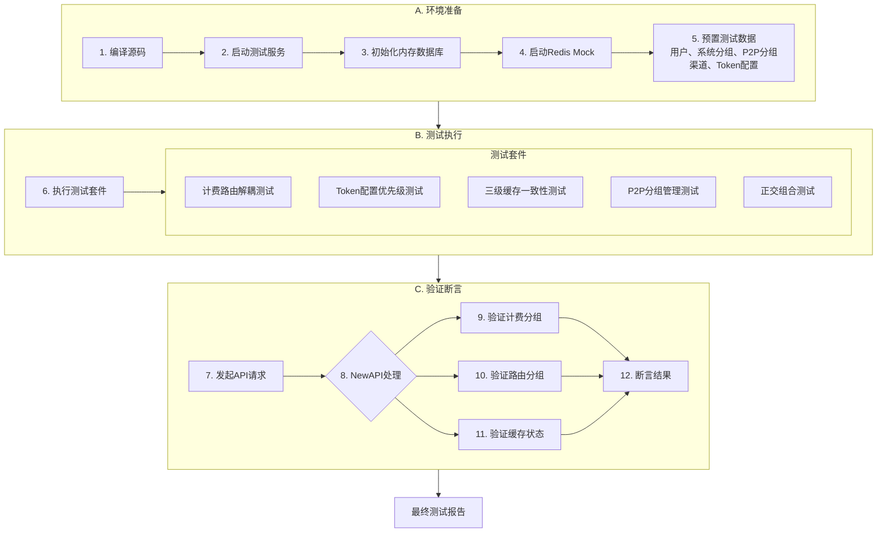

# NewAPI - 分组改动与BillingGroup-RoutingGroups解耦 测试设计与分析说明书

| 文档信息 | 内容 |
| :--- | :--- |
| **模块名称** | *NewAPI - Group Refactoring & Billing-Routing Decoupling* |
| **文档作者** | *QA Team* |
| **测试环境** | *SIT / UAT* |
| **版本日期** | *2025-12-11* |
| **对应设计文档** | *07-NEW-API-分组改动详细设计.md* |

---

## 一、测试方案原理 (Test Scheme & Methodology)

> **核心策略**: 采用**正交分解**方法设计测试用例，用最少的测试覆盖BillingGroup与RoutingGroups解耦带来的复杂配置组合。所有测试基于**Go自动化测试框架**，使用**内存数据库**和**Redis Mock**确保测试环境隔离。

### 1.1 核心改动与测试风险分析

本次分组改动涉及NewAPI的核心路由和计费逻辑，风险点如下：

| 改动项 | 核心风险 | 测试策略 |
| :--- | :--- | :--- |
| **计费与路由解耦** | BillingGroup被P2P分组影响导致计费错误 | 验证计费始终基于BillingGroup，不受RoutingGroups影响 |
| **Token计费组列表** | 优先级错误、降级逻辑失败、遍历顺序错误 | 正交测试覆盖单个/多个/空配置，验证按序查找和停止逻辑 |
| **Token P2P限制** | 限制失效、非成员访问、多组限制冲突 | 验证Token.p2p_group_id的强约束作用 |
| **三级缓存一致性** | 缓存失效不及时、数据不一致、并发问题 | 灰盒测试验证L1/L2/L3的读写路径和失效机制 |
| **多计费组迭代选路** | 未按顺序查找、过早停止、遗漏渠道 | 精确验证每个计费组的查找和决策逻辑 |
| **P2P分组管理** | 申请、审批、退出流程错误、权限泄露 | 完整验证分组生命周期和成员状态机 |

### 1.2 自动化测试流程



---

## 二、测试点分析列表 (Test Point Analysis)

### 2.1 计费与路由解耦核心测试 (Billing-Routing Decoupling)

**核心风险**: 验证计费始终基于BillingGroup，不受用户加入的P2P分组影响。

| ID | 测试场景 | 用户配置 | Token配置 | P2P分组情况 | 渠道配置 | 预期BillingGroup | 预期路由结果 | 优先级 |
| :--- | :--- | :--- | :--- | :--- | :--- | :--- | :--- | :--- |
| **BR-01** | **基线-无P2P** | User.Group=vip | Token.Group=空 | 未加入任何P2P组 | Ch-Vip-Public(group=vip, 无P2P授权) | vip | 成功路由到Ch-Vip-Public，计费按vip | **P0** |
| **BR-02** | **加入低费率P2P不影响计费** | User.Group=vip<br>(倍率2.0) | Token.Group=空 | 加入P2P组G1<br>(包含default渠道) | Ch-Default-G1(group=default, allowed_groups=[G1]) | vip | 成功路由到Ch-Default-G1，但计费仍按vip | **P0** |
| **BR-03** | **Token强制降级计费** | User.Group=vip | Token.Group=`["default"]` | 加入G1 | Ch-Default-G1(group=default, allowed_groups=[G1]) | default | 成功路由到Ch-Default-G1，按default计费 | **P0** |
| **BR-04** | **P2P扩展路由范围但不允许跨系统升级** | User.Group=default | Token.Group=空 | 加入G1<br>(包含vip渠道) | Ch-Vip-G1(group=vip, allowed_groups=[G1]) | default | **失败**<br>(系统分组不匹配，default用户不能通过P2P访问vip渠道) | **P0** |
| **BR-05** | **计费组与P2P组交集** | User.Group=vip | Token.Group=`["vip"]` | 加入G1 | Ch-Vip-G1(group=vip, allowed_groups=[G1]) | vip | 成功路由到Ch-Vip-G1<br>(同时满足系统分组和P2P授权) | **P0** |

### 2.2 Token计费组列表与优先级测试 (Token Billing Group Priority)

**核心风险**: 验证Token.Group列表的按序查找、降级机制和停止逻辑。

| ID | 测试场景 | Token.Group配置 | 可用渠道情况 | 预期BillingGroup | 预期选中渠道 | 优先级 |
| :--- | :--- | :--- | :--- | :--- | :--- | :--- |
| **TG-01** | **单个计费组** | `["vip"]` | 存在vip渠道Ch-Vip-Public | vip | Ch-Vip-Public | **P0** |
| **TG-02** | **多个计费组-优先匹配** | `["svip", "vip", "default"]` | 存在svip渠道Ch-Svip-Public | svip | Ch-Svip-Public | **P0** |
| **TG-03** | **多个计费组-降级匹配** | `["svip", "vip", "default"]` | 无svip渠道<br>存在vip渠道Ch-Vip-Public | vip | Ch-Vip-Public | **P0** |
| **TG-04** | **多个计费组-最终降级** | `["svip", "vip", "default"]` | 仅存在default渠道Ch-Default-Public | default | Ch-Default-Public | **P0** |
| **TG-05** | **所有计费组均无渠道** | `["svip", "vip"]` | 环境仅存在default渠道Ch-Default-Public | - | 404错误(无可用渠道) | **P0** |
| **TG-06** | **空列表回退用户分组** | `[]` 或 null | 用户vip分组，存在vip渠道Ch-Vip-Public | vip | Ch-Vip-Public | **P0** |
| **TG-07** | **找到渠道后立即停止** | `["vip", "default"]` | vip有可用渠道Ch-Vip-Public<br>default有更优渠道Ch-Default-Public(优先级更高) | vip | Ch-Vip-Public<br>(不会继续查找Ch-Default-Public) | **P0** |
| **TG-08** | **与P2P组合-优先级** | `["svip", "default"]` | svip无渠道<br>default有P2P渠道Ch-Default-G1(授权G1)<br>用户已加入G1 | default | Ch-Default-G1 | **P0** |
| **TG-09** | **JSON格式兼容性** | `"vip"` (旧格式) | 存在vip渠道Ch-Vip-Public | vip | 成功 | P1 |

### 2.3 Token P2P分组限制测试 (Token P2P Group Restriction)

**核心风险**: 验证Token.p2p_group_id的强约束作用和非成员场景处理。

| ID | 测试场景 | Token.p2p_group_id | 用户加入的P2P分组 | 渠道P2P授权 | 预期EffectiveP2PGroups | 预期结果 | 优先级 |
| :--- | :--- | :--- | :--- | :--- | :--- | :--- | :--- |
| **TP-01** | **无限制-访问所有加入的组** | null | G1, G2 | Ch-Default-G1授权G1 | [G1, G2] | 成功访问Ch-Default-G1 | **P0** |
| **TP-02** | **限制单个P2P组** | G1 | G1, G2 | Ch-Default-G1授权G1<br>Ch-Vip-G2授权G2 | [G1] | 只能访问Ch-Default-G1<br>无法访问Ch-Vip-G2 | **P0** |
| **TP-03** | **限制到非成员组** | G3 | G1, G2 | Ch3授权G3 | [] | 无法访问任何P2P渠道 | **P0** |
| **TP-04** | **限制与系统分组结合** | G1 | G1 | Ch-Vip-G1(vip, 授权G1)<br>用户vip, Token.Group=vip | [G1] | 成功<br>(同时满足系统分组与P2P授权) | **P0** |
| **TP-05** | **限制与计费组列表结合** | G1 | G1, G2 | Ch1(svip, G1)<br>Ch2(default, G2)<br>Token.Group=`["svip", "default"]` | [G1] | 仅访问Ch1<br>(svip+G1匹配) | **P0** |

### 2.4 多计费组迭代选路测试 (Multi-Billing-Group Routing)

**核心风险**: 验证选路器按顺序遍历计费组列表、正确应用"与"逻辑、找到渠道后立即停止。

| ID | 测试场景 | Token.Group列表 | 渠道配置 | 用户P2P分组 | 预期遍历顺序 | 预期选中渠道 | 优先级 |
| :--- | :--- | :--- | :--- | :--- | :--- | :--- | :--- |
| **MR-01** | **第一个计费组立即匹配** | `["svip", "vip"]` | Ch-Svip-Public(svip) | 无 | 仅查找svip | Ch-Svip-Public | **P0** |
| **MR-02** | **第二个计费组匹配** | `["svip", "vip"]` | Ch-Vip-Public(vip) | 无 | 1.查svip(失败)<br>2.查vip(成功) | Ch-Vip-Public | **P0** |
| **MR-03** | **跳过不可用渠道** | `["svip", "vip"]` | Ch-Svip-Public(svip, 禁用)<br>Ch-Vip-Public(vip, 启用) | 无 | 1.查svip(跳过禁用)<br>2.查vip(成功) | Ch-Vip-Public | **P0** |
| **MR-04** | **P2P组与逻辑-第一组失败** | `["svip", "default"]` | Ch-Svip-Public(svip, 无P2P授权)<br>Ch-Default-G1(default, 授权G1) | 加入G1 | 1.查svip(系统分组匹配但无P2P授权)<br>2.查default(成功) | Ch-Default-G1 | **P0** |
| **MR-05** | **停止遍历验证** | `["vip", "default"]` | Ch-Vip-Public(vip, 低权重)<br>Ch-Default-Public(default, 高权重) | 无 | 仅查vip | Ch-Vip-Public<br>(不会因为default有更优渠道而继续) | **P0** |
| **MR-06** | **Auto分组展开后遍历** | `["auto"]`<br>(展开为vip+svip) | Ch-Svip-Public(svip) | 无 | 1.查vip(失败)<br>2.查svip(成功) | Ch-Svip-Public | P1 |

### 2.5 三级缓存一致性测试 (Three-Level Cache Consistency)

**核心风险**: 验证内存->Redis->DB的读写路径、失效机制和并发安全。

| ID | 测试场景 | 缓存层级 | 测试步骤 | 预期行为 | 优先级 |
| :--- | :--- | :--- | :--- | :--- | :--- |
| **CC-01** | **L1内存命中** | L1 (内存) | 1.第一次请求加载用户P2P分组<br>2.立即第二次请求 | 第二次直接从内存读取，无Redis/DB访问 | **P0** |
| **CC-02** | **L1未命中回退L2** | L1 -> L2 | 1.清空内存缓存<br>2.发起请求 | 从Redis读取，并回填L1 | **P0** |
| **CC-03** | **L2未命中回退L3** | L2 -> L3 | 1.清空Redis<br>2.发起请求 | 从DB查询`user_groups`表，回填L2和L1 | **P0** |
| **CC-04** | **加入分组失效缓存** | 全链路 | 1.用户初始未加入G1<br>2.审批通过加入G1<br>3.立即发起请求 | Redis缓存被DEL，下次请求重新加载，能访问G1渠道 | **P0** |
| **CC-05** | **退出分组失效缓存** | 全链路 | 1.用户已加入G1<br>2.主动退出<br>3.发起请求 | 缓存失效，无法访问G1渠道 | **P0** |
| **CC-06** | **被踢出失效缓存** | 全链路 | 1.用户已加入G1<br>2.Owner踢出(status=3)<br>3.发起请求 | 缓存失效，无法访问G1渠道 | **P0** |
| **CC-07** | **分组删除失效缓存** | 全链路 | 1.用户加入G1<br>2.G1被删除<br>3.发起请求 | 级联删除`user_groups`记录，缓存失效 | P1 |
| **CC-08** | **TTL被动过期** | L1 (内存) | 1.加载缓存<br>2.等待3分钟(TTL到期)<br>3.发起请求 | L1过期，从L2重新加载 | P1 |
| **CC-09** | **并发请求缓存安全** | 全链路 | 100个协程同时请求同一用户的分组信息 | 无数据竞争，DB查询次数<=1 | **P0** |
| **CC-10** | **Redis故障降级** | L2 -> L3 | 1.Redis服务停止<br>2.用户发起请求 | 自动降级到DB查询，请求正常完成，性能略降但不中断服务 | **P0** |
| **CC-11** | **多实例缓存一致性** | L1 + L2 | 1.集群部署2个实例<br>2.用户在实例A加入G1<br>3.立即在实例B发起请求 | 实例B的L1未命中，从L2 Redis读取最新数据，能访问G1渠道 | **P0** |
| **CC-12** | **缓存回填失败处理** | L2 -> L3 | 1.清空Redis<br>2.模拟Redis写入失败<br>3.发起请求 | DB查询成功，请求正常完成，但Redis未回填（下次请求重新查DB） | **P0** |
| **CC-13** | **批量成员变更缓存** | 全链路 | 1.批量操作：10个用户同时加入G1<br>2.验证每个用户的缓存状态 | 每个用户的Redis缓存都被正确失效，下次请求都能访问G1渠道 | P1 |
| **CC-14** | **L2 Redis TTL过期** | L2 | 1.加载缓存到Redis<br>2.等待30分钟(TTL到期)<br>3.发起请求 | Redis缓存过期，回退到DB查询，自动回填新缓存 | P1 |
| **CC-15** | **分组Owner变更缓存** | 全链路 | 1.用户A作为G1的Owner<br>2.Owner转移给用户B<br>3.用户A和B分别发起请求 | 双方缓存都失效，重新加载后权限正确（A失去特权，B获得Owner权限） | P1 |
| **CC-16** | **缓存与DB数据冲突** | 全链路 | 1.用户A加入G1，缓存已建立<br>2.直接在DB中删除`user_groups`记录(模拟异常)<br>3.在L1/L2未过期前发起请求 | 虽能从缓存读取G1，但实际路由时因DB无记录而失败，**验证最终一致性保护** | P2 |

### 2.6 P2P分组管理流程测试 (P2P Group Management)

**核心风险**: 验证分组CRUD、成员申请审批流程、状态机正确性。

#### 2.6.1 分组CRUD测试

| ID | 测试场景 | API调用 | 预期结果 | 优先级 |
| :--- | :--- | :--- | :--- | :--- |
| **GM-01** | **创建私有分组** | `POST /api/groups`<br>`type=1, owner_id=UserA` | `groups`表新增记录，返回group_id | **P0** |
| **GM-02** | **创建共享分组-密码制** | `POST /api/groups`<br>`type=2, join_method=2, join_key="123456"` | 创建成功，join_key被存储 | **P0** |
| **GM-03** | **创建共享分组-审核制** | `POST /api/groups`<br>`type=2, join_method=1` | 创建成功 | **P0** |
| **GM-04** | **查询自己创建的分组** | `GET /api/groups/self?user_id=UserA` | 返回UserA作为owner的所有分组 | P1 |
| **GM-05** | **查询已加入的分组** | `GET /api/groups/joined?user_id=UserA` | 返回UserA在`user_groups`中status=1的分组 | **P0** |
| **GM-06** | **更新分组信息** | `PUT /api/groups`<br>`id=G1, name="NewName"` | 分组名称被更新 | P1 |
| **GM-07** | **删除分组** | `DELETE /api/groups?id=G1` | `groups`和`user_groups`关联记录被删除，成员缓存失效 | **P0** |
| **GM-08** | **查询公开分组广场** | `GET /api/groups/public` | 返回所有type=2的共享分组 | P1 |

#### 2.6.2 成员管理与状态机测试

| ID | 测试场景 | 初始状态 | 操作 | 预期新状态 | 预期缓存行为 | 优先级 |
| :--- | :--- | :--- | :--- | :--- | :--- | :--- |
| **MS-01** | **密码正确直接加入** | 不存在 | `POST /api/groups/apply`<br>password正确 | status=1 (Active) | 缓存失效 | **P0** |
| **MS-02** | **密码错误进入审核** | 不存在 | `POST /api/groups/apply`<br>password错误 | status=0 (Pending) | 无缓存操作 | **P0** |
| **MS-03** | **审核制进入待审** | 不存在 | `POST /api/groups/apply`<br>join_method=1 | status=0 (Pending) | 无缓存操作 | **P0** |
| **MS-04** | **审批通过** | Pending (0) | `PUT /api/groups/members`<br>status=1 | status=1 (Active) | 缓存DEL | **P0** |
| **MS-05** | **审批拒绝** | Pending (0) | `PUT /api/groups/members`<br>status=2 | status=2 (Rejected) | 无缓存操作 | P1 |
| **MS-06** | **Owner踢出成员** | Active (1) | `PUT /api/groups/members`<br>status=3 | status=3 (Banned) | 缓存DEL | **P0** |
| **MS-07** | **成员主动退出** | Active (1) | `POST /api/groups/leave` | 记录删除或status=4 | 缓存DEL | **P0** |
| **MS-08** | **重复申请** | Active (1) | 再次`POST /api/groups/apply` | 拒绝(已是成员) | - | P1 |
| **MS-09** | **查询分组成员列表** | - | `GET /api/groups/members?group_id=G1` | 返回所有成员及状态 | - | P1 |

#### 2.6.3 权限与安全边界测试

**核心风险**: 验证非Owner用户的权限边界，防止越权操作和状态机绕过。

| ID | 测试场景 | 操作者角色 | 操作 | 预期结果 | 安全影响 | 优先级 |
| :--- | :--- | :--- | :--- | :--- | :--- | :--- |
| **PM-01** | **非Owner删除分组** | 普通成员UserB | `DELETE /api/groups?id=G1`<br>(G1的Owner是UserA) | **拒绝操作**，返回403权限错误<br>分组未被删除 | 防止分组被恶意删除 | **P0** |
| **PM-02** | **非Owner踢出成员** | 普通成员UserB | `PUT /api/groups/members`<br>尝试将UserC的status改为3 | **拒绝操作**，返回403权限错误<br>UserC状态不变 | 防止成员互相踢出 | **P0** |
| **PM-03** | **非Owner修改配置** | 普通成员UserB | `PUT /api/groups`<br>尝试修改G1的name/join_method | **拒绝操作**，返回403权限错误<br>分组配置不变 | 防止配置被篡改 | **P0** |
| **PM-04** | **Banned用户再次申请** | UserB<br>(status=3 Banned) | `POST /api/groups/apply`<br>申请加入G1 | **拒绝申请**，返回错误<br>"您已被该分组禁止" | 防止被踢用户绕过限制 | **P0** |
| **PM-05** | **Rejected用户重新申请** | UserB<br>(status=2 Rejected) | `POST /api/groups/apply`<br>申请加入G1 | **允许重新申请**<br>创建新的Pending记录或覆盖旧记录 | 用户体验：允许二次申请 | P1 |
| **PM-06** | **非成员访问私有分组信息** | 未加入G1的UserC | `GET /api/groups/members?group_id=G1`<br>(G1是私有分组 type=1) | **拒绝访问**或**仅返回公开字段**<br>(如成员数量，不含成员列表) | 防止信息泄露 | P1 |
| **PM-07** | **Owner删除自己的成员记录** | Owner UserA | `POST /api/groups/leave`<br>尝试退出自己的分组G1 | **拒绝操作**<br>提示"Owner需先转移所有权才能退出" | 防止分组变为无主 | P1 |

#### 2.6.4 配置变更与流程测试

**核心风险**: 验证分组配置动态变更后的行为一致性，以及邀请制等复杂流程。

| ID | 测试场景 | 初始配置 | 操作步骤 | 预期结果 | 优先级 |
| :--- | :--- | :--- | :--- | :--- | :--- |
| **CF-01** | **邀请制完整流程** | G1: type=2, join_method=0(邀请) | 1.Owner UserA生成邀请码(或邀请链接)<br>2.UserB使用邀请码申请<br>3.系统验证邀请码有效性 | **有效码**：UserB直接加入(status=1)<br>**无效/过期码**：拒绝申请 | **P0** |
| **CF-02** | **加入方式变更影响** | G1: join_method=2(密码) | 1.UserB用正确密码申请，进入Pending<br>2.Owner修改为join_method=1(审核)<br>3.Owner审批UserB的Pending申请 | **审批操作仍有效**<br>UserB成功加入(status=1) | P1 |
| **CF-03** | **密码修改后的验证** | G1: join_key="old123" | 1.Owner修改密码为"new456"<br>2.UserB用"old123"申请<br>3.UserC用"new456"申请 | **UserB申请失败**<br>**UserC申请成功**(直接Active或Pending) | P1 |
| **CF-04** | **分组类型转换** | G1: type=1(私有) | Owner修改为type=2(共享) | **修改成功**<br>分组出现在`/api/groups/public`<br>新用户可以申请加入 | P2 |
| **CF-05** | **并发加入相同分组** | G1: join_method=2<br>join_key="pass123" | **100个用户**同时用正确密码<br>调用`POST /api/groups/apply` | **所有用户都成功加入**(status=1)<br>无重复`user_groups`记录<br>数据库约束`UNIQUE(user_id, group_id)`生效 | P1 |
| **CF-06** | **分组成员上限限制** | G1: 已有99个成员<br>(假设上限100) | 1.UserA申请加入(第100个)<br>2.UserB再申请加入(第101个) | **UserA成功加入**<br>**UserB被拒绝**，提示"分组已满" | P2 |

#### 2.6.5 成员角色与高级功能测试

**核心风险**: 验证成员角色管理（如设计支持管理员角色）和批量操作的正确性。

| ID | 测试场景 | 前置条件 | 操作 | 预期结果 | 优先级 |
| :--- | :--- | :--- | :--- | :--- | :--- |
| **RM-01** | **成员角色提升** | UserB是G1的普通成员(role=0) | Owner将UserB的role改为1(管理员) | **UserB获得管理员权限**<br>可执行踢出普通成员、审批申请等操作 | P1 |
| **RM-02** | **管理员踢出普通成员** | UserB是管理员(role=1)<br>UserC是普通成员(role=0) | 管理员UserB将UserC的status改为3(Banned) | **操作成功**<br>UserC被踢出，缓存失效 | P1 |
| **RM-03** | **管理员无法踢出Owner** | UserB是管理员<br>UserA是Owner | 管理员UserB尝试踢出Owner UserA | **拒绝操作**<br>返回403或业务错误"无法操作Owner" | P1 |
| **RM-04** | **Owner角色转移** | UserA是Owner<br>UserB是成员 | UserA执行Owner转移操作<br>`PUT /api/groups/owner`<br>new_owner_id=UserB | **转移成功**<br>UserA降为普通成员，UserB成为新Owner<br>双方缓存失效，权限立即生效 | P2 |
| **RM-05** | **批量审批操作** | G1有10个Pending申请 | Owner调用批量审批接口<br>(或循环调用10次单个审批) | **所有申请都变为Active(status=1)**<br>所有用户的缓存批量失效<br>数据库一致性保持 | P1 |
| **RM-06** | **批量踢出成员** | G1有10个Active成员 | Owner批量将10个成员status改为3 | **所有成员被踢出**<br>缓存批量失效<br>10个用户下次请求无法访问G1渠道 | P1 |

### 2.7 正交组合配置测试 (Orthogonal Configuration Matrix)

**核心风险**: 用最少用例覆盖Token配置、P2P分组、系统分组的复杂组合。

#### 2.7.1 正交测试因子定义

**因子A - Token计费组配置** (4水平):
- A1: 空/null (使用用户分组)
- A2: 单个 `["vip"]`
- A3: 多个列表 `["svip", "default"]`
- A4: 与用户分组不同 (用户vip, Token `["default"]`)

**因子B - Token P2P限制** (3水平):
- B1: null (无限制)
- B2: 单个有效组 (用户确实加入)
- B3: 单个无效组 (用户未加入)

**因子C - 用户P2P成员** (3水平):
- C1: 未加入任何P2P组
- C2: 加入单个P2P组G1
- C3: 加入多个P2P组G1+G2

**因子D - 渠道系统分组** (3水平):
- D1: default
- D2: vip
- D3: svip

**因子E - 渠道P2P授权** (3水平):
- E1: 无授权 (公共渠道)
- E2: 授权单个P2P组G1
- E3: 授权多个P2P组G1+G2

#### 2.7.2 L18正交表测试矩阵

| 用例ID | 用户<br>系统分组 | Token<br>计费组(A) | Token<br>P2P限制(B) | 用户<br>P2P成员(C) | 渠道<br>系统分组(D) | 渠道<br>P2P授权(E) | 预期路由 | 预期计费 | 优先级 |
| :--- | :--- | :--- | :--- | :--- | :--- | :--- | :--- | :--- | :--- |
| **OX-01** | default | A1(空) | B1(null) | C1(无) | D1(default) | E1(无) | 成功 | default | **P0** |
| **OX-02** | default | A2(vip) | B2(G1) | C2(G1) | D2(vip) | E2(G1) | **失败** | - | **P0** |
| **OX-03** | default | A3([svip,default]) | B3(G3) | C3(G1+G2) | D3(svip) | E3(G1+G2) | **失败** | - | **P0** |
| **OX-04** | vip | A1(空) | B2(G1) | C3(G1+G2) | D2(vip) | E1(无) | 成功 | vip | **P0** |
| **OX-05** | vip | A2(vip) | B3(G3) | C1(无) | D3(svip) | E2(G1) | **失败** | - | **P0** |
| **OX-06** | vip | A3([svip,default]) | B1(null) | C2(G1) | D1(default) | E3(G1+G2) | 成功 | default | **P0** |
| **OX-07** | svip | A1(空) | B3(G3) | C2(G1) | D3(svip) | E3(G1+G2) | **失败** | - | **P0** |
| **OX-08** | svip | A2(vip) | B1(null) | C3(G1+G2) | D1(default) | E1(无) | **失败** | - | **P0** |
| **OX-09** | svip | A3([svip,vip]) | B2(G1) | C1(无) | D2(vip) | E2(G1) | **失败** | - | **P0** |
| **OX-10** | default | A4(default) | B1(null) | C2(G1) | D1(default) | E2(G1) | 成功 | default | **P0** |
| **OX-11** | vip | A3([svip,vip]) | B2(G1) | C2(G1) | D2(vip) | E2(G1) | 成功 | vip | **P0** |
| **OX-12** | vip | A3([svip,default]) | B1(null) | C2(G1) | D1(default) | E2(G1) | 成功 | default | **P0** |

#### 2.7.3 复杂场景组合测试

| ID | 测试场景 | 完整配置描述 | 预期行为 | 优先级 |
| :--- | :--- | :--- | :--- | :--- |
| **CS-01** | **计费降级+P2P限制+多渠道** | 用户vip, Token.Group=`["svip","vip"]`, Token.p2p_group_id=G1<br>用户加入G1, G2<br>渠道1(svip, G2), 渠道2(vip, G1) | 跳过渠道1(P2P不匹配)<br>选中渠道2(系统分组降级到vip且P2P匹配G1) | **P0** |
| **CS-02** | **与逻辑双重约束** | 用户default, Token.Group=`["vip"]`, Token.p2p_group_id=G1<br>渠道(vip, G1) | 失败(用户系统分组default无法匹配渠道vip，即使Token和P2P都匹配) | **P0** |
| **CS-03** | **Auto展开+P2P组合** | 用户vip, Token.Group=`["auto"]` (展开为vip+svip)<br>加入G1<br>渠道1(svip, 无P2P), 渠道2(vip, G1) | 选中渠道1(优先匹配vip，找不到后降级到svip) | P1 |
| **CS-04** | **多Token不同配置** | 用户A有Token1(无限制), Token2(P2P限制G1)<br>同一渠道(授权G1和G2) | Token1可通过G1或G2访问<br>Token2只能通过G1访问 | **P0** |

### 2.8 边界与异常测试 (Boundary & Exception Cases)

| ID | 测试场景 | 边界条件 | 预期行为 | 优先级 |
| :--- | :--- | :--- | :--- | :--- |
| **ED-01** | **空P2P分组列表** | 用户未加入任何P2P组，请求P2P渠道 | 无法访问P2P渠道，只能访问公共渠道 | **P0** |
| **ED-02** | **Token计费组列表为空数组** | Token.Group=`[]` | 回退使用User.Group | **P0** |
| **ED-03** | **Token计费组不存在** | Token.Group=`["nonexistent"]` | 404错误，无可用渠道 | P1 |
| **ED-04** | **渠道P2P授权为空** | 渠道allowed_groups=`[]` | 仅能通过系统分组访问 | P1 |
| **ED-05** | **分组删除后的请求** | 用户加入G1，G1被删除，用户立即请求 | 缓存失效，无法访问原G1渠道 | **P0** |
| **ED-06** | **并发加入和请求** | 100个协程同时加入分组和发起请求 | 无数据竞争，最终状态一致 | P1 |
| **ED-07** | **缓存穿透** | 查询不存在的用户分组信息 | 快速返回，不引发DB压力 | P2 |

---

## 三、测试数据准备 (Test Data Preparation)

### 3.1 用户 (Users)

**基础用户**:
*   `User-A`: 系统分组 `vip` (倍率: 2.0)
*   `User-B`: 系统分组 `default` (倍率: 1.0)
*   `User-C`: 系统分组 `svip` (倍率: 0.8)

**正交测试用户**:
*   `User-OX-1`: 系统分组 `default`，未加入P2P组
*   `User-OX-2`: 系统分组 `vip`，加入P2P组G1
*   `User-OX-3`: 系统分组 `vip`，加入P2P组G1+G2
*   `User-OX-4`: 系统分组 `svip`，加入P2P组G1

### 3.2 P2P分组 (Groups)

*   `G1-Public`: Owner: User-A, 类型: 共享(2), 加入方式: 审核(1)
*   `G2-Public`: Owner: User-B, 类型: 共享(2), 加入方式: 密码(2), join_key: "password123"
*   `G3-Private`: Owner: User-C, 类型: 私有(1)
*   `G4-Invite`: Owner: User-A, 类型: 共享(2), 加入方式: 邀请(0)

### 3.3 渠道 (Channels)

**基础渠道** (无P2P授权):
*   `Ch-Default-Public`: Group: default, 模型: gpt-4, allowed_groups: []
*   `Ch-Vip-Public`: Group: vip, 模型: gpt-4, allowed_groups: []
*   `Ch-Svip-Public`: Group: svip, 模型: gpt-4, allowed_groups: []

**P2P授权渠道**:
*   `Ch-Vip-G1`: Group: vip, 模型: gpt-4, allowed_groups: [G1]
*   `Ch-Default-G1`: Group: default, 模型: gpt-4, allowed_groups: [G1]
*   `Ch-Default-G1G2`: Group: default, 模型: gpt-4, allowed_groups: [G1, G2]
*   `Ch-Vip-G2`: Group: vip, 模型: gpt-4, allowed_groups: [G2]
*   `Ch-Svip-G1G2`: Group: svip, 模型: gpt-4, allowed_groups: [G1, G2]

### 3.4 Token配置 (Tokens)

**User-A的Tokens**:
*   `Token-A1`: Group: null, p2p_group_id: null (无任何限制)
*   `Token-A2`: Group: `["default"]`, p2p_group_id: null (强制default计费)
*   `Token-A3`: Group: `["svip", "vip"]`, p2p_group_id: null (计费组列表)
*   `Token-A4`: Group: null, p2p_group_id: G1 (P2P限制到G1)
*   `Token-A5`: Group: `["svip", "default"]`, p2p_group_id: G1 (组合配置)

**User-B的Tokens**:
*   `Token-B1`: Group: null, p2p_group_id: null
*   `Token-B2`: Group: `["vip"]`, p2p_group_id: null (跨级计费)
*   `Token-B3`: Group: null, p2p_group_id: G2

**User-OX系列的Tokens** (用于正交测试):
*   针对每个OX-用例创建特定配置的Token

### 3.5 成员关系 (User-Group Memberships)

| 用户 | 分组 | 状态 | 角色 |
| :--- | :--- | :--- | :--- |
| User-A | G1-Public | Active (1) | Owner (1) |
| User-B | G1-Public | Active (1) | Member (0) |
| User-B | G2-Public | Active (1) | Owner (1) |
| User-C | G2-Public | Active (1) | Member (0) |
| User-C | G3-Private | Active (1) | Owner (1) |
| User-OX-2 | G1-Public | Active (1) | Member (0) |
| User-OX-3 | G1-Public | Active (1) | Member (0) |
| User-OX-3 | G2-Public | Active (1) | Member (0) |
| User-OX-4 | G1-Public | Active (1) | Member (0) |

### 3.6 配置关系矩阵

| 用户 | 系统分组 | 加入P2P分组 | Token数量 | Token计费配置示例 | Token P2P限制示例 |
| :--- | :--- | :--- | :--- | :--- | :--- |
| User-A | vip | G1 | 5 | null, `["default"]`, `["svip","vip"]` | null, null, null, G1, G1 |
| User-B | default | G1, G2 | 3 | null, `["vip"]`, null | null, null, G2 |
| User-OX-2 | vip | G1 | 多个 | 按正交表配置 | 按正交表配置 |
| User-OX-3 | vip | G1, G2 | 多个 | 按正交表配置 | 按正交表配置 |

---

## 四、自动化测试实现方案 (Automated Test Implementation Plan)

### 4.1 测试目录结构

```
new-api/
├── scene_test/
│   ├── main_test.go
│   ├── new-api-group-refactoring/
│   │   ├── billing-routing-decoupling/
│   │   │   ├── core_decoupling_test.go        # BR系列测试
│   │   │   └── billing_priority_test.go       # 计费优先级验证
│   │   ├── token-config/
│   │   │   ├── billing_group_list_test.go     # TG系列测试
│   │   │   ├── p2p_restriction_test.go        # TP系列测试
│   │   │   └── multi_billing_routing_test.go  # MR系列测试
│   │   ├── cache-consistency/
│   │   │   ├── three_level_cache_test.go      # CC系列测试
│   │   │   ├── cache_invalidation_test.go     # 缓存失效测试
│   │   │   └── concurrent_cache_test.go       # 并发缓存测试
│   │   ├── p2p-management/
│   │   │   ├── group_crud_test.go             # GM系列测试
│   │   │   ├── member_lifecycle_test.go       # MS系列测试
│   │   │   └── approval_workflow_test.go      # 审批流程测试
│   │   ├── orthogonal-matrix/
│   │   │   ├── orthogonal_l18_test.go         # OX系列正交测试
│   │   │   └── complex_scenarios_test.go      # CS系列复杂场景
│   │   └── boundary-exception/
│   │       └── edge_cases_test.go             # ED系列边界测试
│   └── testutil/
│       ├── fixtures_group_refactor.go         # 分组改动测试数据
│       ├── cache_inspector.go                 # 缓存状态检查工具
│       └── group_helper.go                    # 分组操作辅助函数
```

### 4.2 核心测试用例实现示例

#### 4.2.1 BR-02: 加入低费率P2P不影响计费

```go
func (s *BillingRoutingSuite) TestBR02_JoinLowRateP2PNoAffectBilling() {
    // Arrange
    userA := s.fixtures.Users["User-A"] // vip, 倍率2.0
    tokenA1 := s.fixtures.Tokens["Token-A1"] // 无任何限制

    // 用户加入G1分组（包含default渠道）
    joinGroup(userA.ID, s.fixtures.Groups["G1-Public"].ID, "active")

    channel := s.fixtures.Channels["Ch-Default-G1"] // default系统分组, 授权G1

    // Act: 发起请求
    resp := callChatCompletions(tokenA1, "gpt-4", 1000)

    // Assert
    assert.Equal(s.T(), http.StatusOK, resp.StatusCode)

    // 验证路由到了default渠道
    log := queryLatestLogFromDB(userA.ID)
    assert.Equal(s.T(), channel.ID, log.ChannelID)

    // 关键断言：计费仍然按vip倍率2.0
    expectedQuota := calculateQuota(1000, 2.0) // 而非default的1.0
    assert.Equal(s.T(), expectedQuota, log.Quota)

    // 验证BillingGroup字段
    assert.Equal(s.T(), "vip", log.BillingGroup)
}
```

#### 4.2.2 TG-03: 多个计费组-降级匹配

```go
func (s *TokenConfigSuite) TestTG03_MultiBillingGroups_FallbackMatch() {
    // Arrange
    userA := s.fixtures.Users["User-A"] // vip

    // Token配置计费组列表: ["svip", "vip", "default"]
    tokenA3 := s.fixtures.Tokens["Token-A3"]

    // 环境中无svip渠道，仅有vip渠道
    channel := s.fixtures.Channels["Ch-Vip-Public"]

    // Act
    resp := callChatCompletions(tokenA3, "gpt-4", 1000)

    // Assert
    assert.Equal(s.T(), http.StatusOK, resp.StatusCode)

    log := queryLatestLogFromDB(userA.ID)
    assert.Equal(s.T(), channel.ID, log.ChannelID)

    // 验证计费组降级到了vip（跳过了svip）
    assert.Equal(s.T(), "vip", log.BillingGroup)

    // 验证计费按vip倍率
    expectedQuota := calculateQuota(1000, 2.0)
    assert.Equal(s.T(), expectedQuota, log.Quota)
}
```

#### 4.2.3 TG-07: 找到渠道后立即停止

```go
func (s *TokenConfigSuite) TestTG07_StopImmediatelyWhenChannelFound() {
    // Arrange
    tokenA3 := createTokenWithConfig(userA.ID, TokenConfig{
        BillingGroups: []string{"vip", "default"},
    })

    // vip有可用渠道Ch1
    ch1 := s.fixtures.Channels["Ch-Vip-Public"]
    // default有更优渠道Ch2（优先级更高）
    ch2 := s.fixtures.Channels["Ch-Default-Public"]
    updateChannelPriority(ch2.ID, 100) // 高优先级

    // Act: 发起请求
    resp := callChatCompletions(tokenA3, "gpt-4", 1000)

    // Assert
    log := queryLatestLogFromDB(userA.ID)

    // 关键断言：选中的是Ch1（vip渠道），而非Ch2
    // 因为在vip计费组下找到渠道后立即停止，不会继续查找default
    assert.Equal(s.T(), ch1.ID, log.ChannelID)
    assert.Equal(s.T(), "vip", log.BillingGroup)

    // 验证没有访问Ch2
    assert.NotEqual(s.T(), ch2.ID, log.ChannelID)
}
```

#### 4.2.4 TP-02: Token限制单个P2P组

```go
func (s *TokenConfigSuite) TestTP02_TokenRestrictSingleP2PGroup() {
    // Arrange
    userB := s.fixtures.Users["User-B"] // default, 加入G1和G2

    // Token限制只能访问G1
    tokenB3 := createTokenWithConfig(userB.ID, TokenConfig{
        P2PGroupID: s.fixtures.Groups["G1-Public"].ID,
    })

    ch1 := s.fixtures.Channels["Ch-Default-G1"]   // 授权G1
    ch2 := s.fixtures.Channels["Ch-Default-G1G2"] // 授权G1和G2

    // Act: 请求授权G1的渠道
    resp1 := callChatCompletions(tokenB3, "gpt-4", 1000)
    assert.Equal(s.T(), http.StatusOK, resp1.StatusCode)
    log1 := queryLatestLogFromDB(userB.ID)
    assert.True(s.T(), log1.ChannelID == ch1.ID || log1.ChannelID == ch2.ID)

    // 创建仅授权G2的渠道
    chG2Only := createChannel(userA.ID, "gpt-4", "default", []int{G2.ID})

    // Act: 请求仅授权G2的渠道
    resp2 := callChatCompletions(tokenB3, "gpt-4", 1000)

    // Assert: 应该失败，因为Token限制了只能访问G1
    assert.NotEqual(s.T(), chG2Only.ID, queryLatestLogFromDB(userB.ID).ChannelID)
    // 或者如果没有其他可用渠道，返回404
}
```

#### 4.2.5 CC-04: 加入分组失效缓存

```go
func (s *CacheConsistencySuite) TestCC04_JoinGroupInvalidatesCache() {
    // Arrange
    userA := s.fixtures.Users["User-A"]
    groupG1 := s.fixtures.Groups["G1-Public"]

    // 第一次请求，用户未加入G1
    resp1 := callChatCompletions(userA.Token, "gpt-4", 1000)

    // 验证缓存已建立
    cachedGroups := inspectRedisCache(fmt.Sprintf("user_groups:%d", userA.ID))
    assert.NotContains(s.T(), cachedGroups, groupG1.ID)

    // Act: 用户申请并被批准加入G1
    applyGroup(userA.ID, groupG1.ID, "password123")
    approveGroupMember(groupG1.ID, userA.ID, 1) // status=1 Active

    // Assert: 验证Redis缓存被删除
    _, err := mockRedis.Get(fmt.Sprintf("user_groups:%d", userA.ID))
    assert.Error(s.T(), err) // 缓存应被DEL

    // 再次请求
    resp2 := callChatCompletions(userA.Token, "gpt-4", 1000)

    // 验证缓存重建，包含G1
    cachedGroups = inspectRedisCache(fmt.Sprintf("user_groups:%d", userA.ID))
    assert.Contains(s.T(), cachedGroups, groupG1.ID)

    // 验证能够访问G1授权的渠道
    chG1 := s.fixtures.Channels["Ch-Default-G1"]
    log := queryLatestLogFromDB(userA.ID)
    assert.Equal(s.T(), chG1.ID, log.ChannelID)
}
```

#### 4.2.6 MS-04: 审批通过流程

```go
func (s *P2PManagementSuite) TestMS04_ApprovalProcess_Approve() {
    // Arrange
    userB := s.fixtures.Users["User-B"]
    groupG1 := s.fixtures.Groups["G1-Public"] // 审核制

    // Act 1: 申请加入
    resp1 := apiPost("/api/groups/apply", map[string]interface{}{
        "user_id":  userB.ID,
        "group_id": groupG1.ID,
    }, adminToken)

    assert.Equal(s.T(), http.StatusOK, resp1.StatusCode)

    // Assert 1: 验证数据库状态为Pending
    membership := queryUserGroup(userB.ID, groupG1.ID)
    assert.Equal(s.T(), 0, membership.Status) // Pending

    // Act 2: Owner审批通过
    resp2 := apiPut("/api/groups/members", map[string]interface{}{
        "group_id": groupG1.ID,
        "user_id":  userB.ID,
        "status":   1, // Active
    }, adminToken)

    assert.Equal(s.T(), http.StatusOK, resp2.StatusCode)

    // Assert 2: 验证状态变更
    membership = queryUserGroup(userB.ID, groupG1.ID)
    assert.Equal(s.T(), 1, membership.Status) // Active

    // Assert 3: 验证缓存失效
    _, err := mockRedis.Get(fmt.Sprintf("user_groups:%d", userB.ID))
    assert.Error(s.T(), err) // 缓存已被DEL

    // Assert 4: 验证能访问G1渠道
    channel := s.fixtures.Channels["Ch-Default-G1"]
    resp3 := callChatCompletions(userB.Token, "gpt-4", 1000)
    assert.Equal(s.T(), http.StatusOK, resp3.StatusCode)
    log := queryLatestLogFromDB(userB.ID)
    assert.Equal(s.T(), channel.ID, log.ChannelID)
}
```

#### 4.2.7 OX-06: 正交矩阵用例

```go
func (s *OrthogonalMatrixSuite) TestOX06_OrthogonalCase06() {
    // 用例OX-06:
    // 用户vip, Token.Group=["svip","default"], Token.p2p_group_id=null
    // 用户加入G1, 渠道default+授权G1+G2
    // 预期: 成功路由（系统分组降级到default, P2P匹配G1）, 计费default

    // Arrange
    user := createUser("ox6", "ox6@test.com", "vip", 100000)
    joinGroup(user.ID, G1.ID, "active")

    token := createTokenWithConfig(user.ID, TokenConfig{
        BillingGroups: []string{"svip", "default"},
        P2PGroupID: nil,
    })

    channel := s.fixtures.Channels["Ch-Default-G1G2"] // default, [G1, G2]

    // Act
    resp := callChatCompletions(token, "gpt-4", 1000)

    // Assert
    assert.Equal(s.T(), http.StatusOK, resp.StatusCode)

    log := queryLatestLogFromDB(user.ID)
    assert.Equal(s.T(), channel.ID, log.ChannelID)

    // 验证计费组降级到了default（跳过了svip）
    assert.Equal(s.T(), "default", log.BillingGroup)

    // 验证按default倍率1.0计费
    expectedQuota := calculateQuota(1000, 1.0)
    assert.Equal(s.T(), expectedQuota, log.Quota)
}
```

### 4.3 缓存状态检查工具

```go
// testutil/cache_inspector.go
package testutil

type CacheInspector struct {
    redis *miniredis.Miniredis
}

// 检查内存缓存（通过反射或测试钩子）
func (ci *CacheInspector) InspectL1Cache(userID int) []int {
    // 访问relay包的内存缓存
    // 返回用户的P2P分组ID列表
}

// 检查Redis缓存
func (ci *CacheInspector) InspectL2Cache(userID int) ([]int, bool) {
    key := fmt.Sprintf("user_groups:%d", userID)
    val, err := ci.redis.Get(key)
    if err != nil {
        return nil, false
    }

    var groups []int
    json.Unmarshal([]byte(val), &groups)
    return groups, true
}

// 检查数据库
func (ci *CacheInspector) InspectL3DB(userID int) []int {
    var memberships []model.UserGroup
    db.Where("user_id = ? AND status = ?", userID, 1).Find(&memberships)

    var groupIDs []int
    for _, m := range memberships {
        groupIDs = append(groupIDs, m.GroupID)
    }
    return groupIDs
}

// 验证三级缓存一致性
func (ci *CacheInspector) VerifyConsistency(userID int) error {
    l1 := ci.InspectL1Cache(userID)
    l2, l2Exists := ci.InspectL2Cache(userID)
    l3 := ci.InspectL3DB(userID)

    if l2Exists && !slicesEqual(l2, l3) {
        return fmt.Errorf("L2 Redis cache mismatch with L3 DB")
    }

    if len(l1) > 0 && !slicesEqual(l1, l3) {
        return fmt.Errorf("L1 Memory cache mismatch with L3 DB")
    }

    return nil
}
```

### 4.4 用例 ID 与自动化测试函数映射（2.1 ~ 2.4）

> 说明：本节将 2.1~2.4 中的每个用例 ID（BR / TG / TP / MR）与当前仓库中已经落地的集成测试函数进行映射，便于从业务用例快速跳转到具体 `*_test.go` 实现。若某些用例尚无一一对应的自动化测试，则在“自动化测试函数”列中标记为“TODO”。

#### 4.4.1 计费与路由解耦（2.1 BR-xx）

| 用例ID | 场景摘要 | 自动化测试函数 | 所在文件 | 备注 |
| :--- | :--- | :--- | :--- | :--- |
| BR-01 | 基线-无P2P（同一系统分组路由与计费） | `TestRouting_R01_BasicSystemGroup`<br>`TestBilling_B01_HighRateUserLowRateChannel`（baseline 部分） | `scene_test/new-api-data-plane/routing-authorization/routing_test.go`<br>`scene_test/new-api-data-plane/billing/billing_test.go` | R-01 验证同组路由，B-01/B-02 的基线场景验证“计费看自己”原则 |
| BR-02 | 加入低费率P2P不影响计费 | `TestRouting_R03_P2PBasicSharing`<br>`TestBilling_B01_HighRateUserLowRateChannel` | `scene_test/new-api-data-plane/routing-authorization/routing_test.go`<br>`scene_test/new-api-data-plane/billing/billing_test.go` | R-03 验证 P2P 共享路由，B-01 验证高费率用户使用低费率渠道时仍按高费率计费 |
| BR-03 | Token 强制降级计费 | `TestBilling_B03_TokenForceBillingGroup` | `scene_test/new-api-data-plane/billing/billing_test.go` | 用户在 vip 组，Token.Group=`["default"]`，验证 BillingGroup 被 Token 覆盖且倍率从 2.0→1.0 |
| BR-04 | P2P 扩展路由范围但不允许跨系统升级 | `TestRouting_R02_CrossSystemGroup` | `scene_test/new-api-data-plane/routing-authorization/routing_test.go` | R-02 验证 default 用户无法访问 vip 渠道；当前实现不支持“通过 P2P 升级系统分组”，与 BR-04 期望一致 |
| BR-05 | 计费组与 P2P 组交集 | `TestRouting_R03_P2PBasicSharing`<br>`TestBilling_B02_LowRateUserHighRateChannel` | `scene_test/new-api-data-plane/routing-authorization/routing_test.go`<br>`scene_test/new-api-data-plane/billing/billing_test.go` | R-03 验证 P2P 授权 + 成员关系，B-02 验证低费率用户使用高费率渠道时仍按低费率计费，二者组合体现“系统分组 ∧ P2P 授权，计费看自己” |

#### 4.4.2 Token 计费组列表与优先级（2.2 TG-xx）

| 用例ID | 场景摘要 | 自动化测试函数 | 所在文件 | 备注 |
| :--- | :--- | :--- | :--- | :--- |
| TG-01 | 单个计费组 | `TestBilling_B03_TokenForceBillingGroup` | `scene_test/new-api-data-plane/billing/billing_test.go` | Token.Group=`["default"]`，等价于单计费组场景，验证覆盖用户组的单一 BillingGroup |
| TG-02 | 多个计费组-优先匹配 | `TestRouting_TokenWithBillingGroupList_Success` | `scene_test/new-api-data-plane/routing-authorization/routing_test.go` | Token.Group=`["vip","default"]`，vip 与 default 均有渠道，验证优先命中第一个计费组（vip） |
| TG-03 | 多个计费组-降级匹配 | `TestRouting_TokenWithBillingGroupList_Failover`<br>`TestBilling_B04_TokenBillingGroupFailover` | `scene_test/new-api-data-plane/routing-authorization/routing_test.go`<br>`scene_test/new-api-data-plane/billing/billing_test.go` | Routing 侧验证从 vip→default 的失败转移；Billing 侧验证 group=`["svip","default"]` 时按 default 倍率计费 |
| TG-04 | 多个计费组-最终降级 | `TestRouting_TokenWithBillingGroupList_Failover`<br>`TestBilling_B04_TokenBillingGroupFailover` | 同上 | 与 TG-03 相同组合，表示所有高优先级计费组无渠道时最终降级到 default |
| TG-05 | 所有计费组均无渠道 | （部分覆盖）`TestRouting_R02_CrossSystemGroup` | `scene_test/new-api-data-plane/routing-authorization/routing_test.go` | R-02 中 default 用户访问 vip 渠道时“无可用渠道”错误，等价于 BillingGroup 候选列表下无匹配渠道；尚无专门针对多计费组全失败的单独用例 |
| TG-06 | 空列表回退用户分组 | （间接覆盖）多处未设置 Token.Group 的用例，如 `TestRouting_R01_BasicSystemGroup`、各 Billing 测试基线场景 | `scene_test/new-api-data-plane/routing-authorization/routing_test.go` 等 | 所有未显式配置 Token.Group 的集成测试均依赖“回退到 User.Group”行为，当前通过整体路由链路间接验证 |
| TG-07 | 找到渠道后立即停止 | TODO | - | 现有 `TestRouting_TokenWithBillingGroupList_Success` 只断言首个计费组被命中，未对“是否继续遍历后续计费组”做显式断言，需要后续补充性能/次数级校验 |
| TG-08 | 与 P2P 组合-优先级 | TODO | - | 当前仓库暂未实现“Token.BillingGroupList + P2P 授权”联合优先级的专门集成用例 |
| TG-09 | JSON 格式兼容性（`\"vip\"` 旧格式） | TODO | - | 现有测试均使用 JSON 数组格式（如 `["vip"]`），未覆盖单字符串旧格式，需要后续补充 Token 层单测或集成测试 |

#### 4.4.3 Token P2P 分组限制（2.3 TP-xx）

> 注意：当前实现采用了更严格的“无 p2p_group_id 时不访问 P2P 渠道”的语义，相关实现分析见 `docs/Token与b2b分组计费相关实现问题.md`，与 2.3 表中 TP-01 的旧语义略有差异，映射表中已注明。

| 用例ID | 场景摘要 | 自动化测试函数 | 所在文件 | 备注 |
| :--- | :--- | :--- | :--- | :--- |
| TP-01 | 无限制 Token 对 P2P 的行为 | `TestRouting_P2P_NoTokenRestriction_CannotUseP2PChannels`<br>`TestRouting_P2P_NoTokenRestriction_UsesPublicChannel`<br>`TestRouting_P2P_NoTokenRestriction_OwnerCanUseOwnP2P` | `scene_test/new-api-data-plane/routing-authorization/routing_test.go` | 实际语义为：无 p2p_group_id 时普通用户只走公共渠道，不使用 P2P 渠道；渠道 owner 仍可自用自己的 P2P 渠道 |
| TP-02 | 限制单个 P2P 组 | `TestRouting_P2P_TokenRestricted_SelectsOnlyMatchingP2PChannel`<br>`TestRouting_TokenWithP2PRestriction` | `scene_test/new-api-data-plane/routing-authorization/routing_test.go` | 两个用例分别验证“同一计费组下仅选中绑定 G1 的渠道”和“用户加入 G1+G2 时，Token.p2p_group_id=G1 只允许访问 G1 渠道” |
| TP-03 | 限制到非成员组 | TODO | - | 当前没有场景“Token.p2p_group_id 指向用户未加入的 P2P 组”的专门集成测试 |
| TP-04 | 限制与系统分组结合（AND 逻辑） | （部分覆盖）`TestRouting_TokenWithP2PRestriction` | `scene_test/new-api-data-plane/routing-authorization/routing_test.go` | 该用例验证“系统分组匹配 + P2P 授权 + Token 限制”的组合，但未构造跨系统分组场景（如 default 用户访问 vip 渠道） |
| TP-05 | 限制与计费组列表结合 | TODO | - | 当前未实现“Token.BillingGroupList + Token.p2p_group_id + 多渠道”的组合用例 |

#### 4.4.4 多计费组迭代选路（2.4 MR-xx）

| 用例ID | 场景摘要 | 自动化测试函数 | 所在文件 | 备注 |
| :--- | :--- | :--- | :--- | :--- |
| MR-01 | 第一个计费组立即匹配 | `TestRouting_TokenWithBillingGroupList_Success` | `scene_test/new-api-data-plane/routing-authorization/routing_test.go` | Token.Group=`["vip","default"]`，vip 组下有渠道，验证直接命中第一个计费组 |
| MR-02 | 第二个计费组匹配 | `TestRouting_TokenWithBillingGroupList_Failover` | `scene_test/new-api-data-plane/routing-authorization/routing_test.go` | 同样使用 `["vip","default"]`，未创建 vip 渠道，仅 default 有渠道，验证从第一个计费组失败转移到第二个 |
| MR-03 | 跳过不可用渠道 | TODO | - | 当前仅在 `channel-stickiness` 套件中有“禁用渠道后重新选路”的测试，尚无针对“多计费组迭代时跳过禁用渠道”的专门用例 |
| MR-04 | P2P 组与逻辑-第一组失败 | TODO | - | 需要补充“第一个计费组系统分组匹配但 P2P 授权不匹配，第二个计费组成功”的组合场景 |
| MR-05 | 停止遍历验证 | （部分覆盖）`TestRouting_TokenWithBillingGroupList_Success` | `scene_test/new-api-data-plane/routing-authorization/routing_test.go` | 现有用例保证首个计费组一定被命中，但未对“后续计费组是否被继续遍历”做严格断言，更多体现为性能风险 |
| MR-06 | Auto 分组展开后遍历 | TODO | - | 虽在 Billing 环境中配置了 `auto` 组（包含 vip + svip），但尚未有以 `Token.Group=["auto"]` 触发自动展开的专门集成测试 |

---

## 五、测试执行策略与报告

### 5.1 测试分层执行

| 测试层级 | 执行频率 | 优先级覆盖 | 包含套件 | 执行时长预估 |
| :--- | :--- | :--- | :--- | :--- |
| **冒烟测试** | 每次提交 | P0 | BR系列, TG-01~05, CC-01~03 | 5-10分钟 |
| **核心回归** | 每日构建 | P0 + P1 | 所有P0和P1用例 | 30-60分钟 |
| **完整回归** | 发布前 | 全部 | 所有测试套件 | 2-4小时 |
| **正交专项** | 重大变更前 | P0正交用例 | OX系列 + CS系列 | 30-45分钟 |

### 5.2 持续集成配置

```yaml
# .github/workflows/group-refactoring-test.yml
name: Group Refactoring Tests

on:
  push:
    branches: [ main, develop ]
    paths:
      - 'model/group*.go'
      - 'controller/group*.go'
      - 'relay/**'
      - 'service/channel_select.go'
      - 'scene_test/new-api-group-refactoring/**'

jobs:
  test:
    runs-on: ubuntu-latest
    steps:
      - uses: actions/checkout@v3

      - name: Setup Go
        uses: actions/setup-go@v4
        with:
          go-version: '1.25'

      - name: Run Smoke Tests (P0 only)
        run: |
          cd scene_test/new-api-group-refactoring
          go test -v -timeout 15m -run 'Test.*P0' ./...

      - name: Run Full Tests
        if: github.ref == 'refs/heads/main'
        run: |
          cd scene_test/new-api-group-refactoring
          go test -v -timeout 60m ./...

      - name: Upload Coverage
        uses: codecov/codecov-action@v3
```

### 5.3 测试报告格式

测试完成后生成详细报告：

1. **执行摘要**:
   - 总用例数、P0/P1/P2分布
   - 通过率、失败用例列表
   - 关键指标：计费准确率、路由正确率、缓存一致性

2. **功能覆盖率**:
   - 计费路由解耦: X个场景，Y个通过
   - Token配置: X个组合，Y个通过
   - P2P分组管理: X个API，Y个覆盖
   - 正交测试: L18矩阵完成度

3. **性能指标**:
   - 缓存命中率 (L1/L2/L3)
   - 选路平均耗时
   - 并发安全验证结果

4. **失败分析**:
   - 失败用例详情
   - 根因分类 (计费错误/路由错误/缓存不一致)
   - 代码定位和日志片段

---

## 六、验收标准 (Acceptance Criteria)

### 6.1 功能完整性

- [ ] 所有P0优先级测试用例100%通过
- [ ] P1优先级测试用例通过率 >= 95%
- [ ] **计费路由解耦验证**:
  - [ ] BR系列全部通过，计费始终基于BillingGroup
  - [ ] 加入低费率P2P组不影响用户原计费等级
- [ ] **Token配置优先级验证**:
  - [ ] TG系列全部通过，计费组列表按序查找并正确停止
  - [ ] TP系列全部通过，P2P限制强约束生效
  - [ ] MR系列全部通过，多计费组迭代逻辑正确
- [ ] **缓存一致性验证**:
  - [ ] CC系列全部通过，三级缓存读写路径正确
  - [ ] 缓存失效及时，权限变更后立即生效(分钟级)
- [ ] **P2P分组管理验证**:
  - [ ] GM系列全部通过，分组CRUD操作正常
  - [ ] MS系列全部通过，成员状态机流转正确
- [ ] **正交测试验证**:
  - [ ] OX系列L18矩阵至少覆盖12个核心场景且全部通过
  - [ ] CS系列复杂场景组合测试全部通过

### 6.2 性能要求

- [ ] 路由选择性能:
  - [ ] 单次请求路由决策耗时 < 10ms (含缓存查询)
  - [ ] 多计费组迭代遍历3个分组的耗时 < 5ms
- [ ] 缓存性能:
  - [ ] L1内存命中率 >= 80% (热用户)
  - [ ] L2 Redis命中率 >= 95%
  - [ ] L3 DB查询次数 < 总请求数的5%
- [ ] 并发性能:
  - [ ] 1000 QPS下，路由准确率100%
  - [ ] 缓存并发读写无数据竞争

### 6.3 稳定性要求

- [ ] 连续运行24小时无内存泄漏
- [ ] Redis宕机场景下，路由降级到DB查询，不影响主流程
- [ ] 分组删除、成员变更等控制面操作不阻塞数据面请求
- [ ] 并发场景 (100协程同时申请分组) 无死锁或状态不一致

### 6.4 数据准确性

- [ ] 计费金额误差 = 0 (绝对准确)
- [ ] 路由分组判定误差 = 0
- [ ] 缓存数据与DB最终一致性 < 1分钟延迟

### 6.5 可维护性

- [ ] 测试代码覆盖率 >= 85%
- [ ] 所有正交用例有清晰的因子组合文档
- [ ] 缓存检查工具完整，可独立验证L1/L2/L3状态
- [ ] 失败用例有详细的调试日志和断言信息

---

## 七、风险与缓解措施 (Risks & Mitigation)

| 风险项 | 影响 | 概率 | 缓解措施 |
| :--- | :--- | :--- | :--- |
| **计费逻辑回归** | 用户通过P2P逃避计费 | 高 | 专项测试BR系列，强制所有计费路径使用BillingGroup |
| **Token优先级混淆** | 计费组列表解析错误 | 中 | TG-09验证JSON格式兼容性，完整测试多格式 |
| **缓存一致性问题** | 权限变更后仍能访问旧权限 | 高 | CC系列灰盒测试验证每个失效触发点，监控TTL |
| **选路停止逻辑错误** | 遍历全部计费组而非找到即停 | 中 | TG-07, MR-05专项验证停止逻辑，性能测试验证 |
| **并发场景死锁** | 多协程同时操作分组 | 低 | ED-06并发测试，使用Go race detector |
| **P2P与系统分组与逻辑失效** | 仅满足一个条件就通过 | 高 | BR-04, BR-05, OX系列验证"与"逻辑 |

---

## 八、附录：关键概念验证清单

### 8.1 核心概念理解检查

在编写测试用例前，确保理解以下核心概念：

- [ ] **BillingGroup**: 仅用于计费和费率匹配，不受P2P影响
- [ ] **RoutingGroups**: 用于扩展渠道搜索范围，包含系统分组和P2P分组
- [ ] **Token.Group优先级**: Token配置 > User.Group
- [ ] **Token.p2p_group_id约束**: 强制限制，覆盖用户实际加入的所有P2P组
- [ ] **多计费组遍历**: 按序查找，找到可用渠道立即停止，不继续遍历
- [ ] **与逻辑**: 渠道必须同时满足系统分组和P2P分组要求（如果都设置）
- [ ] **三级缓存**: L1(内存, 1-3分钟) -> L2(Redis, 30分钟) -> L3(DB)

### 8.2 测试数据一致性检查工具

```go
// testutil/consistency_checker.go
func VerifyBillingConsistency(t *testing.T, log *model.Log, expectedBillingGroup string, expectedRatio float64) {
    assert.Equal(t, expectedBillingGroup, log.BillingGroup, "BillingGroup mismatch")

    actualRatio := float64(log.Quota) / float64(log.PromptTokens + log.CompletionTokens)
    assert.InDelta(t, expectedRatio, actualRatio, 0.001, "Billing ratio mismatch")
}

func VerifyRoutingGroups(t *testing.T, userID int, expectedSystemGroup string, expectedP2PGroups []int) {
    // 验证路由分组的构建是否正确
    systemGroup := getUserSystemGroup(userID)
    assert.Equal(t, expectedSystemGroup, systemGroup)

    actualP2PGroups := getUserActiveP2PGroups(userID)
    assert.ElementsMatch(t, expectedP2PGroups, actualP2PGroups)
}
```

---

**文档结束**
