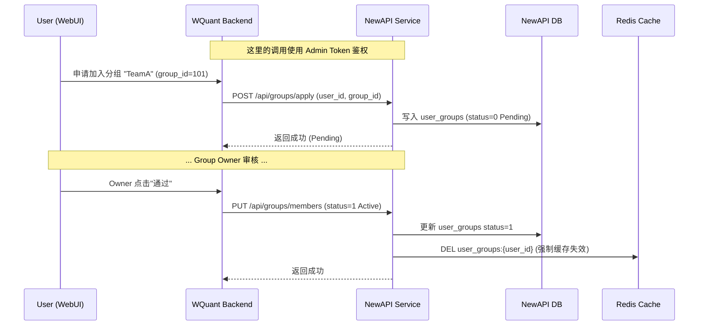

# NEW-API 分组改动详细设计文档

| 文档属性 | 内容 |
| :--- | :--- |
| **版本** | 1.0 |
| **状态** | 拟定中 |
| **最后更新** | 2025-11-30 |
| **对应需求** | P2P 分组管理与共享机制、BillingGroup与RoutingGroups解耦 |

## 1. 引言

本设计文档旨在详细描述 NewAPI 为了支持 WQuant 平台的 P2P 渠道共享机制所需要的底层改造。核心目标是将原有的“分组”概念解耦为 **计费分组 (BillingGroup)** 和 **路由分组 (RoutingGroups)**，并引入用户自主管理的 P2P 分组体系。

### 1.1 核心概念定义

*   **系统分组 (System Group)**: NewAPI 原有的分组概念（如 `default`, `vip`），用于定义费率倍率和全局流控。
*   **计费分组 (BillingGroup)**: 用户在本次请求中用于结算的系统分组。
    *   默认等于用户的 System Group。
    *   若 Token 配置了 `Group` 字段（覆盖），则使用 Token 的配置。
    *   **核心原则**：计费和流控仅依赖 BillingGroup，不受 P2P 分组影响。
*   **P2P 分组 (P2P Group)**: 新增实体。用户创建的社交化分组，用于共享渠道权限。
    *   对外统一使用 `group_id` (Int) 标识。
    *   仅用于扩展路由范围，不包含费率属性。
*   **路由分组集合 (RoutingGroups)**: 用户在发起请求时，系统计算出的有效渠道搜索范围。
    *   `RoutingGroups = {BillingGroup} U {Active P2P Groups}`
    *   如果 `BillingGroup` 是 `auto`，则展开为自动分组列表后再与 P2P 分组取并集。

---

## 2. 数据库设计

需要新增两个表来存储分组元数据及成员关系，并对现有表进行微调。

### 2.1 新增表结构

#### 2.1.1 `groups` (P2P 分组表)

存储分组的基础信息。

```sql
CREATE TABLE groups (
    id INTEGER PRIMARY KEY AUTOINCREMENT,
    name VARCHAR(50) NOT NULL,          -- 分组唯一标识/代号
    display_name VARCHAR(100),          -- 显示名称
    owner_id INTEGER NOT NULL,          -- 拥有者ID NewAPI User ID
    type INTEGER DEFAULT 1,             -- 类型: 1=Private(私有), 2=Shared(共享)
    join_method INTEGER DEFAULT 0,      -- 加入方式: 0=邀请, 1=审核, 2=密码
    join_key VARCHAR(50),               -- 加入密码/Key
    description TEXT,                   -- 描述
    created_at BIGINT,
    updated_at BIGINT,
    INDEX idx_owner_id (owner_id)
);
```

#### 2.1.2 `user_groups` (用户-分组关联表)

存储成员关系及状态。

```sql
CREATE TABLE user_groups (
    id INTEGER PRIMARY KEY AUTOINCREMENT,
    user_id INTEGER NOT NULL,           -- 成员ID
    group_id INTEGER NOT NULL,          -- 分组ID
    role INTEGER DEFAULT 0,             -- 角色: 0=成员, 1=管理员
    status INTEGER DEFAULT 0,           -- 状态: 0=申请中, 1=已加入(Active), 2=已拒绝, 3=已踢出
    created_at BIGINT,
    updated_at BIGINT,
    UNIQUE(user_id, group_id),          -- 防止重复加入
    INDEX idx_user_id (user_id),
    INDEX idx_group_id (group_id)
);
```

### 2.2 现有表变更

*   **`channels` 表**: 
    *   `group`: **仅用于存储系统分组** (System Group) 名称（逗号分隔字符串）。保持原有语义，用于费率匹配和基础可见性。
    *   `allowed_groups`: (JSON Array) 存储允许访问该渠道的 P2P 分组 ID 列表 (例如 `[101, 102]`)。选路时检查用户的 RoutingGroups 是否包含其中任意 ID。

*   **`tokens` 表**:
    *   `p2p_group_id` (INTEGER, 可选): 新增字段，取代原`allowed_p2p_groups`。用于存储该 Token **唯一允许**的 P2P 分组 ID。若设置，则用户的 P2P 权限被缩小到这一个组。
    *   `group`: (VARCHAR) 字段类型不变，但语义升级为支持**JSON数组**字符串。若设置，则强制将 `BillingGroup` 替换为该**有序列表**，系统将按顺序查找可用渠道。例如 `"[\"svip\", \"default\"]"`。也兼容旧的单个字符串格式。

---

## 3. 管理面接口设计

管理面 API 供 WQuant 云端后端调用，**不直接暴露给最终用户**。所有接口需通过 Admin Token 鉴权。遵循 `woolen_quant` 控制器规范（禁用路径参数）。

**注意区分**:
*   `/api/group`: 现有的系统分组（System Group）配置接口（倍率、名称）。
*   `/api/groups*`: 新增的 P2P 分组（P2P Group）管理接口。

### 3.1 P2P 分组 CRUD (`controller/group.go`)

| 方法 | 路径 | 参数 | 描述 |
| :--- | :--- | :--- | :--- |
| POST | `/api/groups` | `name`, `owner_id`, `type`, `join_method`... | 创建分组 (返回 group_id) |
| GET | `/api/groups/self` | `user_id` (Query) | 获取指定用户创建的分组 |
| GET | `/api/groups/joined` | `user_id` (Query) | 获取指定用户已加入的 P2P 分组 (Status=1) |
| PUT | `/api/groups` | `id` (Body), `name`... | 更新分组信息 |
| DELETE | `/api/groups` | `id` (Query/Body) | 删除分组 (级联删除关联关系) |

### 3.2 成员与审核 (`controller/group_member.go`)

| 方法 | 路径 | 参数 | 描述 |
| :--- | :--- | :--- | :--- |
| POST | `/api/groups/apply` | `group_id`, `user_id`, `password` | 申请加入 (密码正确直接Active，否则Pending) |
| GET | `/api/groups/members` | `group_id` | 获取分组内所有成员及状态 |
| PUT | `/api/groups/members` | `group_id`, `user_id`, `status`, `role` | 审批操作 (通过/拒绝/踢出) |
| POST | `/api/groups/leave` | `group_id`, `user_id` | 用户主动退出 |

### 3.3 广场发现

| 方法 | 路径 | 参数 | 描述 |
| :--- | :--- | :--- | :--- |
| GET | `/api/groups/public` | `page`, `page_size`, `keyword` | 获取公开的共享分组列表 (Type=2) |

### 3.4 令牌管理扩展 (`controller/token.go`)

现有 Token 接口需支持 P2P 分组字段：

| 方法 | 路径 | 参数 | 描述 |
| :--- | :--- | :--- | :--- |
| POST | `/api/tokens` | `p2p_group_id` (Integer) | 创建 Token 时指定允许访问的唯一 P2P 分组ID |
| PUT | `/api/tokens` | `id`, `p2p_group_id` | 更新 Token 的 P2P 分组限制 |

---

## 4. 数据面路由逻辑与缓存设计

数据面（Relay）是性能敏感区，必须避免每次请求都查询 SQL 数据库来获取用户的分组信息。

### 4.1 缓存策略

设计二级缓存机制，以支撑高并发下的路由鉴权：

1.  **Redis 缓存 (`UserGroupCache`)**:
    *   **Key**: `user_groups:{user_id}`
    *   **Value**: JSON 数组，存储用户所有 `Status=1` (Active) 的 P2P 分组 ID。
    *   **TTL**: 30分钟。
    *   **失效触发点**:
        *   用户加入分组 (`PUT /api/groups/members` 审批通过)。
        *   用户退出/被踢出分组 (`POST /api/groups/leave` 或审批拒绝)。
        *   分组本身被删除 (`DELETE /api/groups`)。

2.  **内存缓存 (`MemoryCache`)**:
    *   **目的**: 消除高并发请求下频繁访问 Redis 带来的网络开销。
    *   **字段扩展**: 在 `model/user_cache.go` 的 `User` (或 `UserCache`) 结构体中新增 `ExtendedGroups` 字段。
    *   **读取顺序 (Read-Through)**:
        1.  **L1 内存**: 检查内存中 User 对象是否包含 `ExtendedGroups` 且未过期。
        2.  **L2 Redis**: 若内存未命中，读取 Redis Key `user_groups:{user_id}`。
        3.  **L3 DB**: 若 Redis 未命中，查询 `user_groups` 表。
        4.  **回填**: 数据取回后，同时写入 Redis (TTL 30m) 和 本地内存 (TTL 1-5m)。
    *   **一致性策略**:
        *   **被动过期**: 内存缓存设置较短 TTL (如 1-3 分钟)。
        *   **主动失效**: 在单机部署下直接清除；集群模式下依赖 TTL 自动过期 (P2P 权限变更允许分钟级延迟)。

### 4.2 路由逻辑适配

在 `relay` 处理流程中，上下文初始化和选路逻辑需要进行重大调整，以支持新的计费优先级和P2P限制。

1.  **确定计费分组列表 (BillingGroupList)**:
    *   优先读取 `Token.Group` (JSON Array)。如果存在且不为空，则用户的计费分组候选列表即为此列表，例如 `["svip", "default"]`。
    *   若 `Token.Group` 为空，则回退使用 `User.Group`，此时计费分组候选列表为 `[User.Group]`。

2.  **确定最终P2P权限 (EffectiveP2PGroupID)**:
    *   优先读取 `Token.p2p_group_id`。
    *   如果 Token **已指定** `p2p_group_id`，则检查用户是否确实是该 P2P 分组的成员。
        *   如果是，则用户的P2P权限**仅限于**这一个分组。
        *   如果不是，则用户的P2P权限为空。
    *   如果 Token **未指定** `p2p_group_id`，则用户拥有所有其已加入的 P2P 分组的权限。

3.  **选路 (`Distributor`)**:
    *   **迭代计费分组**: 选路器现在必须**按顺序遍历** `BillingGroupList`。
    *   **构建单次路由集**: 对于列表中的每一个计费分组（例如，先是 `svip`），构建一个临时的 `RoutingGroups` 集合 = `{当前计费分组} U {EffectiveP2PGroupID}`。
    *   **查找渠道**: 在这个临时的 `RoutingGroups` 集合中查找可用渠道，并应用“与”逻辑（即渠道必须同时满足系统分组和P2P分组要求，如果都设置了的话）。
    *   **决策**:
        *   如果在当前计费分组下**找到了**可用渠道，则**立即停止遍历**，并从这些候选渠道中进行负载均衡。本次请求的最终 `BillingGroup` 就确定为当前遍历到的这个分组（例如 `svip`）。
        *   如果**未找到**，则继续遍历 `BillingGroupList` 中的下一个分组（例如 `default`），重复上述查找过程。
        *   如果遍历完所有计费分组仍未找到渠道，则返回“无可用渠道”错误。
    *   执行去重和 P2P 优先级排序（私有 > 共享 > 公共）的逻辑在每次计费分组的内部查找中应用。

### 4.3 避免性能问题的关键点

*   **异步更新**: 分组的创建、加入等管理操作不阻塞数据面请求。
*   **按需加载**: 只有当用户发起请求且缓存未命中时，才从 SQL 加载 P2P 分组关系，并回填缓存。
*   **批量获取**: 如果 WQuant 后端需要批量同步权限，提供批量接口，避免 N+1 查询。

---

## 5. 实施步骤与代码改动建议

### 5.1 新增源码文件

| 文件路径 | 职责描述 |
| :--- | :--- |
| `model/group.go` | 定义 `Group` 和 `UserGroup` 结构体，实现 CRUD 和关联查询的数据库操作。 |
| `model/group_cache.go` | 实现分组关系的 Redis 缓存逻辑 (`GetUserActiveGroups`, `InvalidateUserGroupCache`)。 |
| `controller/group.go` | 实现分组管理的 API 控制器逻辑。 |
| `controller/group_member.go` | 实现成员申请、审批的 API 控制器逻辑。 |
| `router/group.go` | 注册分组相关的路由。 |

### 5.2 修改源码文件

| 文件路径 | 改动点 | 改动目的 |
| :--- | :--- | :--- |
| `relay/common/relay_info.go` | `RelayInfo` 结构体增加 `BillingGroup` 和 `RoutingGroups` 字段；`genBaseRelayInfo` 函数增加初始化逻辑。 | 实现计费与路由概念的解耦，在请求上下文中携带完整的权限信息。 |
| `service/channel_select.go` | 修改 `CacheGetRandomSatisfiedChannel`，支持传入 `[]string` 类型的 `RoutingGroups`，并实现多分组遍历逻辑。 | 支持用户同时访问多个分组下的渠道。 |
| `relay/helper/price.go` | 确保 `ModelPriceHelper` 及其它计费函数**强制使用** `info.BillingGroup`。 | 防止用户通过加入低费率 P2P 分组来逃避系统计费。 |
| `model/channel.go` | 修改 `CheckChannelAccess`，支持检查用户的 `RoutingGroups` 是否与渠道的允许分组有交集。 | 适配新的多分组权限校验逻辑。 |
| `router/api-router.go` | 注册新的 Group 相关路由组。 | 暴露管理接口给 WQuant 后端。 |

---

## 6. 交互流程图

### 6.1 控制面交互 (WQuant <-> NewAPI)

描述 WQuant 后端如何通过管理接口控制分组权限。



### 6.2 数据面路由改动逻辑

描述用户发起 AI 请求时，系统如何利用新的分组逻辑进行选路。

```mermaid
flowchart TD
    Req[用户发起 AI 请求] --> Middleware[中间件鉴权]
    
    subgraph Context_Setup [上下文构建]
        GetToken[解析 Token] --> GetTokenConfig[获取 Token.Group(计费组列表) & Token.p2p_group_id]
        GetTokenConfig --> GetUser[获取 User 信息]
        
        GetUser --> CalcBillingList[**计算 BillingGroupList**]
        CalcBillingList -->|Token.Group 存在| UseTokenBillingList[使用 Token 计费组列表]
        CalcBillingList -->|Token.Group 为空| UseUserBillingList[使用 User 主分组]
        
        GetUser --> CheckCache{P2P组缓存命中?}
        CheckCache -- Yes --> GetCached[获取用户已加入的 P2P 分组]
        CheckCache -- No --> QueryDB[查询 user_groups 表]
        QueryDB --> WriteCache[回填缓存]
        
        GetCached --> ApplyTokenP2PLimit[**应用 Token 的 P2P 限制**]
        WriteCache --> ApplyTokenP2PLimit
        ApplyTokenP2PLimit --> EffectiveP2PGroups[有效的P2P分组]
    end
    
    Middleware --> Context_Setup
    Context_Setup --> Selector[渠道选路器]

    subgraph Selection_Logic [多计费组迭代选路]
        LoopBilling[遍历 BillingGroupList] --> ForEachBillingGroup{当前计费组}
        ForEachBillingGroup --> BuildRoutingGroups[构建 RoutingGroups: {当前计费组} U {有效的P2P分组}]
        BuildRoutingGroups --> FindChannels[查找可用渠道]
        FindChannels --> HasChannels{找到渠道?}
        HasChannels -- Yes --> SelectAndExecute[选择渠道并执行]
        HasChannels -- No --> LoopBilling
    end

    Selector --> LoopBilling
    LoopBilling -- 遍历结束且无渠道 --> NoChannelError[返回404错误]

    subgraph Billing [计费]
        SelectAndExecute --> Calc[计算消耗]
        Calc --> UseFinalBillingGroup[**使用最终选定的计费组计算倍率**]
    end
```
