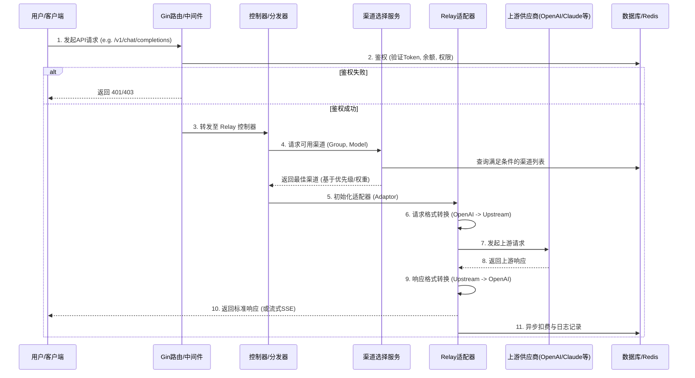
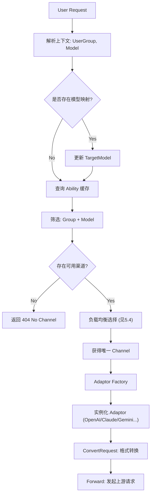
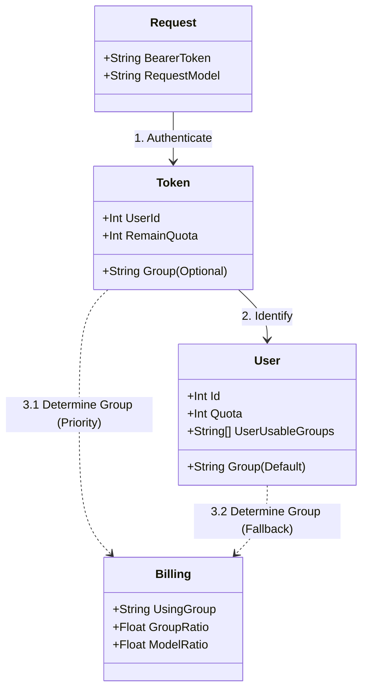
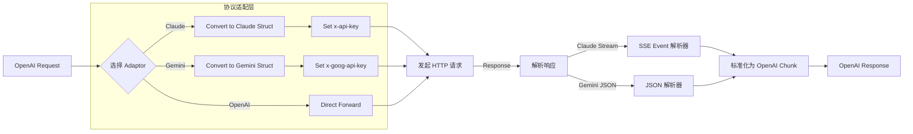
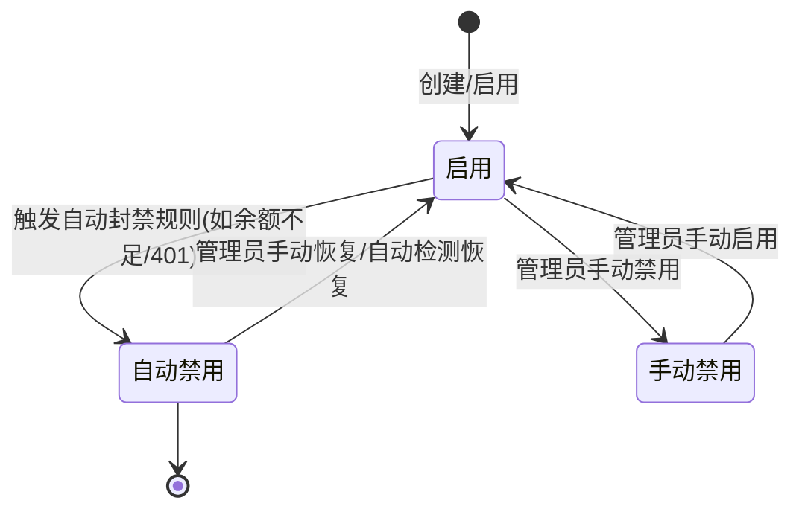
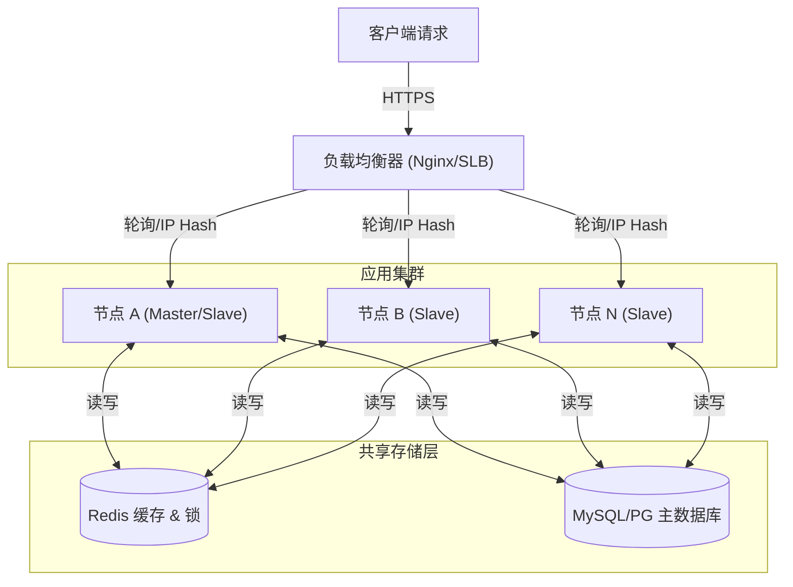
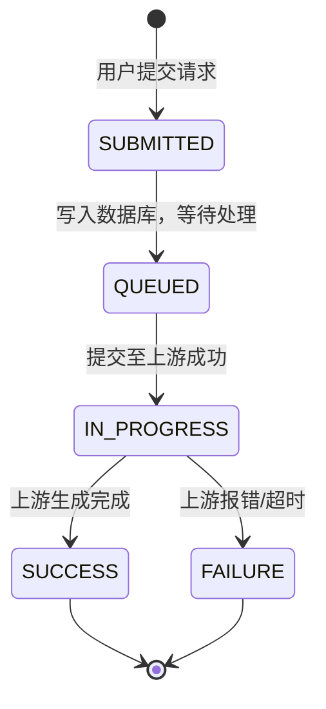
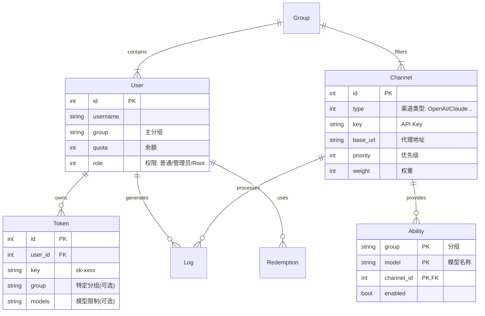

---

# New API 业务流总体设计文档

| 文档属性 | 内容 |
| :--- | :--- |
| **作者** | [Gemini] |
| **版本** | V1.0 |
| **最后更新** | 2025-11-24 |
| **对应需求文档** | - |

---

## 1. 业务背景与目标 (Context)

### 1.1 业务背景
随着各类大语言模型（LLM）的涌现，开发者在集成和管理这些异构的API时面临巨大挑战。不同的供应商（如OpenAI, Azure, Anthropic, Google等）拥有各自独特的API格式、计费模型和安全策略。为了简化开发流程、降低维护成本，并为企业提供一个可集中管理、可监控、可计费的AI能力入口，`New API` 应运而生。

本项目在 `One API` 的基础上进行二次开发，定位为新一代的AI模型网关与资产管理系统，旨在解决多模型API接入的复杂性，提供一个统一、高效、可靠的解决方案。

### 1.2 核心业务目标
*   **统一API接口**：将不同供应商的LLM API标准化为与OpenAI兼容的格式，开发者无需关心底层差异。
*   **集中化管理**：提供Web管理后台，对用户、渠道（模型供应商的API Key）、令牌、计费、模型等进行集中化配置与监控。
*   **智能路由与负载均衡**：支持多渠道的负载均衡、自动重试和故障切换，确保服务的高可用性和稳定性。
*   **精细化计费与多租户**：支持多用户管理，提供基于Token/请求的计费能力，并支持多种支付渠道，满足运营需求。
*   **良好的可扩展性**：系统设计支持快速接入新的AI模型或供应商，保持对前沿技术的兼容性。

### 1.3 关键应用场景
*   **C-1: 应用统一接入**：开发者希望在其应用中同时集成并使用多种大模型（如GPT-4o, Claude 3, Gemini Pro）。通过`New API`，开发者只需对接一个与OpenAI兼容的API端点，即可通过修改`model`参数无缝切换或调用不同模型，`New API`网关负责处理后续的请求转换、认证和路由。
*   **C-2: 服务商业化运营**：服务商利用`New API`为多个客户提供付费的AI模型接入服务。管理员可以创建和管理不同的用户账户，为每个账户设置独立的额度（Quota），并配置不同用户分组（Group）的模型访问权限和倍率（Ratio），实现精细化的多租户运营。
*   **C-3: 服务高可用保障**：企业为保证其内部AI服务的稳定性，在`New API`中为同一个模型（如`gpt-4-turbo`）配置了多个来自不同供应商或不同账号的API Key（即渠道）。网关通过负载均衡策略（如轮询、权重）将请求分发到不同渠道，并在某个渠道请求失败时自动重试或切换到其他可用渠道，保障服务的连续性。

---

## 2. 关键技术及解决途径
*   **HTTP 网关 (HTTP Gateway):** 使用 `Gin` 框架构建高性能的HTTP服务，作为系统的统一入口，负责接收所有API请求。
    *   *相关资料:* [Gin Web Framework](https://gin-gonic.com/)
*   **统一 API 适配 (Unified API Adaptation):** 项目核心的 `relay` 模块，通过适配器模式（Adapter Pattern）将不同上游供应商的请求和响应格式（如Anthropic Claude, Google Gemini）动态转换为与OpenAI API兼容的格式，从而对上层屏蔽底层差异。
*   **数据持久化 (Data Persistence):** 使用 `GORM` 作为ORM层，支持 `SQLite`, `MySQL`, `PostgreSQL` 等多种数据库，用于存储用户、渠道、令牌、日志、额度等核心数据。
    *   *相关资料:* [GORM - The fantastic ORM library for Go](https://gorm.io/)
*   **渠道路由与负载均衡 (Channel Routing & Load Balancing):** 基于用户分组（Group）和模型名称（Model）进行渠道（Channel）的动态选择。支持基于权重（Weight）的加权随机和基于优先级（Priority）的故障切换（Failover）策略，确保请求能被高效、可靠地处理。
*   **前端界面 (Frontend Interface):** 使用 `React` 和 `Vite` 构建的现代化单页应用（SPA），提供系统管理后台，方便管理员进行配置和监控。

## 3. 业务角色与边界 (Actors & Boundaries)

| 角色/系统 | 类型 | 职责描述 | 关键依赖/约束 |
| :--- | :--- | :--- | :--- |
| **C端用户** | 人员 | 使用API Key调用AI模型，查询余额与日志 | 依赖API Key鉴权 |
| **系统管理员** | 人员 | 配置渠道、管理用户、设置系统参数 | 需要最高权限 |
| **New API 网关** | **本系统** | 统一接入、鉴权、路由、计费、协议转换 | 高可用，低延迟 |
| **上游模型供应商** | 外部系统 | 提供实际的AI模型推理服务 (OpenAI, Claude等) | 需有效的API Key |
| **数据库/Redis** | 基础设施 | 存储配置、用户数据；缓存Token、配额信息 | 数据持久化与高速缓存 |

---

## 4. 总体业务流程全景图 (Overall Process)

### 4.1 核心业务链路图



---

## 5. 详细子流程设计 (Detailed Flows)

### 5.1 渠道选择与负载均衡流程

#### 5.1.1 流程前置条件
*   用户请求已通过鉴权。
*   请求中包含明确的目标模型 (Model)。

#### 5.1.2 流程步骤说明
1.  **分组过滤**: 根据用户的分组 (Group) 筛选出所有该分组下的可用渠道。
2.  **模型匹配**: 在分组渠道中，进一步筛选出支持请求模型的渠道。
    *   支持模型重定向 (Model Mapping)。
3.  **优先级排序**: 将筛选出的渠道按 `Priority` 字段降序排列。
4.  **加权随机**: 在最高优先级的渠道集合中，根据 `Weight` 字段进行加权随机选择，确定最终使用的渠道。
5.  **自动重试**: 如果选中的渠道请求失败（网络错误或上游5xx），系统会自动记录错误并尝试同一优先级下的其他渠道，或降级到下一优先级。

### 5.2 计费与额度扣减流程

#### 5.2.1 流程步骤说明
1.  **预扣费 (Pre-consume)**: 请求开始前，根据模型费率和经验预估Token数，预扣除用户一定额度。如果余额不足，直接拒绝。
2.  **实际消耗计算**:
    *   **非流式**: 请求结束后，根据响应中的 `usage` 字段精确计算。
    *   **流式 (Stream)**: 实时累加 Token 数量，或在流结束时估算。
3.  **补/退费 (Post-consume)**: 请求结束后，对比预扣费和实际消耗：
    *   实际 < 预扣：返还多扣部分。
    *   实际 > 预扣：扣除差额。
4.  **异步入库**: 额度更新和日志记录通过异步协程写入数据库，避免阻塞主请求响应。


### 5.3 请求路由与适配机制 (Routing & Adaptation)

#### 5.3.1 逻辑说明
请求路由的核心是将用户的标准OpenAI格式请求，精准定位到后端配置的具体渠道（Channel），并选择正确的适配器（Adaptor）将请求转换为上游接口格式。

#### 5.3.2 路由流程图



#### 5.3.3 路由核心逻辑 (Pseudo-Code)

```go
// 核心路由逻辑
func RouteRequest(c Context, user *User, requestModel string) (*Response, error) {
    // 1. 模型重定向处理
    actualModel := requestModel
    if mappedModel, ok := user.ModelMapping[requestModel]; ok {
        actualModel = mappedModel
    }

    // 2. 获取候选渠道 (基于 Ability 表缓存)
    // 筛选条件: 渠道启用(Status=1) AND 包含模型 AND 包含用户分组
    candidates := ChannelCache.GetChannels(user.Group, actualModel)
    
    if len(candidates) == 0 {
        return nil, Error("No available channel for this model/group")
    }

    // 3. 负载均衡选择
    selectedChannel := LoadBalancer.Select(candidates)

    // 4. 适配器选择与执行
    adaptor := Relay.GetAdaptor(selectedChannel.Type)
    
    // 5. 格式转换与请求
    // e.g., OpenAI JSON -> Claude JSON
    upstreamReq := adaptor.ConvertRequest(c, selectedChannel, userRequest) 
    response := adaptor.DoRequest(c, selectedChannel, upstreamReq)
}
```

#### 5.3.4 模型映射与名称匹配策略 (Model Mapping & Matching)
1.  **渠道模型映射 (Channel Model Mapping)**:
    *   每个渠道可配置独立的 JSON 映射规则（如 `{"gpt-3.5-turbo": "gpt-35-turbo-0613"}`）。
    *   **生效时机**: 在负载均衡选定具体渠道**之后**，请求发送给上游**之前**。
    *   **作用**: 解决上游服务商模型命名不规范或需要将通用模型名称重定向到特定部署版本的问题。支持链式映射（A->B->C）。

2.  **模型名称匹配类型 (Model Name Matching Rule)**:
    *   定义在 `Model` 元数据表中，用于将用户请求的复杂模型名称关联到系统的标准模型配置。
    *   **匹配模式**:
        *   `Exact` (精确匹配): 请求名称必须与配置完全一致。
        *   `Prefix` (前缀匹配): 请求名称以配置值为前缀（如 `gpt-4-git` 匹配 `gpt-4`）。
        *   `Suffix` (后缀匹配): 请求名称以配置值为后缀。
    *   **作用**: 主要影响计费倍率查找、权限验证和UI展示，不直接参与渠道的物理路由（路由主要基于 `abilities` 表的精确模型名或 `FormatMatchingModelName` 通配符）。


### 5.4 负载均衡与渠道判定 (Load Balancing Detail)

#### 5.4.1 渠道有效性判定标准
在进行负载均衡选择前，系统会从缓存中获取候选列表，判定标准如下：
1.  **状态 (Status)**: 必须为 `Enabled (1)`。手动禁用或自动禁用的渠道不会进入候选列表。
2.  **分组 (Group)**: 渠道配置的分组必须包含用户的当前分组（或用户拥有跨组权限）。
3.  **模型 (Model)**: 渠道支持的模型列表 (`Models`) 中必须包含当前请求的模型 (`actualModel`)。
4.  **多Key状态**: 对于配置了多个 API Key 的渠道，需确保至少有一个 Key 处于有效状态。

#### 5.4.2 优先级与权重算法
系统采用 **"优先级分层 + 层内加权随机"** 的混合策略。

1.  **优先级分组**: 将所有候选渠道按 `Priority` 属性分组。优先使用 `Priority` 值最大的一组。
2.  **加权随机**: 在最高优先级组内，根据 `Weight` 属性进行随机选择。

#### 5.4.3 负载均衡流程图

```mermaid
flowchart TD
    Start[候选渠道列表 Candidates] --> GroupBy[按 Priority 分组]
    GroupBy --> SelectTop[选择 Priority 最高的组 Group_P]
    SelectTop --> CalcSum[计算组内总权重 TotalWeight]
    CalcSum --> Random[生成随机数 R = Random(0, TotalWeight)]
    Random --> Loop[遍历组内渠道 Channel_i]
    Loop --> Sub{R = R - Channel_i.Weight}
    Sub -- "R < 0" --> Selected[选中 Channel_i]
    Sub -- "R >= 0" --> Next[继续下一个]
    Selected --> Return[返回选定渠道]
```

#### 5.4.4 权重选择公式 (Pseudo-Code)

```go
// 负载均衡核心算法
func SelectChannel(candidates []*Channel) *Channel {
    // 1. 寻找最高优先级
    maxPriority := -1
    for _, c := range candidates {
        if c.Priority > maxPriority {
            maxPriority = c.Priority
        }
    }

    // 2. 筛选最高优先级组
    var highPriorityGroup []*Channel
    totalWeight := 0
    for _, c := range candidates {
        if c.Priority == maxPriority {
            highPriorityGroup = append(highPriorityGroup, c)
            totalWeight += c.Weight
        }
    }

    // 3. 特殊情况处理
    if totalWeight == 0 {
        // 如果所有权重都为0，退化为纯随机
        return highPriorityGroup[rand.Intn(len(highPriorityGroup))]
    }

    // 4. 加权随机算法
    r := rand.Intn(totalWeight)
    for _, channel := range highPriorityGroup {
        r -= channel.Weight
        if r < 0 {
            return channel
        }
    }
    
    // 理论上不可达，返回最后一个兜底
    return highPriorityGroup[len(highPriorityGroup)-1]
}
```

### 5.5 Token与用户分组关联流程 (Token & Auth Flow)

#### 5.5.1 关联流程
每个API请求的计费和权限控制都基于 Token、User 和 Group 的关联关系。

1.  **Token 鉴权**:
    *   中间件提取请求头 `Authorization: Bearer <sk-key>`。
    *   查询数据库 `tokens` 表，验证 Key 有效性。
    *   获取 `Token` 关联的 `UserId`。

2.  **用户加载**:
    *   根据 `UserId` 加载用户缓存 (`UserCache`)，包含用户的 `Group` (主分组) 和 `Quota` (余额)。

3.  **分组 (Group) 判定**:
    *   **Token分组优先**: 检查 `Token.Group`。如果 Token 设置了特定分组（非空），则请求使用该分组 (`UsingGroup = Token.Group`)。
    *   **用户分组兜底**: 如果 Token 未设置分组，则使用用户的主分组 (`UsingGroup = User.Group`)。
    *   **权限检查**: 系统校验 `UsingGroup` 是否在用户的 `UserUsableGroups` 列表中。如果用户无权使用该分组，请求将被拒绝。

#### 5.5.2 数据结构关系图



### 5.6 上游渠道探测与降级机制 (Upstream Health & Downgrade)

系统通过**被动错误捕获**与**主动定时探测**相结合的方式，维护渠道的健康状态，确保持续高可用。

#### 5.6.1 被动探测 (Passive Detection)
在实际处理用户请求的生命周期中，实时监控上游响应状态：

*   **自动封禁 (Auto Ban)**:
    *   **触发条件**: 遇到明确的不可恢复错误，如 HTTP `401 Unauthorized` (密钥无效)、`403 Forbidden` (账户被封/欠费)、以及特定的 OpenAI Error Code (如 `insufficient_quota`, `account_deactivated`)。
    *   **动作**: 立即将渠道状态置为 **3 (自动禁用)**，并触发系统通知（邮件/Webhook）。
    *   **配置**: 受 `AutomaticDisableChannelEnabled` 开关控制。

*   **临时避让与重试 (Retry & Backoff)**:
    *   **触发条件**: 遇到临时性错误，如 HTTP `429 Too Many Requests` (限流)、`5xx Server Error` (服务宕机) 或网络超时。
    *   **动作**:
        1.  当前请求立即在同组、同模型候选列表中重试下一个可用渠道（Retry）。
        2.  若开启了“失败自动降级”，可能会暂时降低该渠道的优先级权重（部分实现）。
    *   **重试次数**: 默认 `RetryTimes` (通常为 3 次)。

#### 5.6.2 主动探测 (Active Probing)
系统后台维护一个定时任务，对异常渠道进行“复活”检测：

*   **探测对象**: 状态为 **3 (自动禁用)** 的渠道。
*   **探测逻辑**: 使用极低成本的模型（如 `gpt-3.5-turbo` 或自定义测试模型）发起一次简单生成请求。
*   **状态恢复**:
    *   **成功**: 将渠道状态恢复为 **1 (启用)**，并重置失败计数。
    *   **失败**: 保持禁用状态，等待下一次探测周期。
*   **探测间隔**: 可配置，默认每 10-30 分钟执行一次。

#### 5.6.3 降级与重试流程图

```mermaid
flowchart TD
    Start[发起请求] --> ChannelA[尝试渠道 A]
    ChannelA -- 成功 200 --> Success[返回结果]
    ChannelA -- 失败 (Err) --> Analyze{错误类型分析}
    
    Analyze -- "致命错误 (401/403/Quota)" --> Ban[自动禁用渠道 A]
    Analyze -- "临时错误 (429/502/Timeout)" --> LogWarn[记录警告]
    
    Ban --> Retry{剩余重试次数?}
    LogWarn --> Retry
    
    Retry -- Yes --> ChannelB[切换渠道 B (同组/同模型)]
    ChannelB --> ChannelA
    
    Retry -- No --> Failure[返回最后一次错误给用户]
```

### 5.7 异构协议转换机制 (Heterogeneous Protocol Adaptation)

#### 5.7.1 适配器模式实现
Relay 模块核心采用适配器模式，通过 `Adaptor` 接口抹平不同 AI 供应商的协议差异。系统内部统一使用 OpenAI 格式进行流转。

*   **Request 转换**: `OpenAI Request` -> `Upstream Request` (e.g., Claude Message)
*   **Response 转换**: `Upstream Response` -> `OpenAI Response` (e.g., Gemini Candidate -> ChatCompletionChoice)

#### 5.7.2 关键协议差异与映射策略

| 协议维度 | OpenAI (标准) | Anthropic Claude | Google Gemini | 转换策略 (Adaptor Logic) |
| :--- | :--- | :--- | :--- | :--- |
| **鉴权头** | `Authorization: Bearer sk-` | `x-api-key: sk-` | `x-goog-api-key: AIza` | **Header处理**: Adaptor 根据 `ChannelType` 自动注入对应的 Header Key 和 Value。 |
| **角色 (Role)** | `system`, `user`, `assistant` | `system` (顶级字段), `user`, `assistant` | `user`, `model` | **Role映射**: 遍历 Messages，将 `system` 消息提取为 Claude 的顶层参数或 Gemini 的 `SystemInstruction`；将 `assistant` 映射为 `model`。 |
| **多模态 (Vision)** | `image_url` (URL/Base64) | `source` (Base64/URL) | `inlineData` (Base64) | **媒体转换**: 自动下载 URL 图片转为 Base64 (若上游不支持 URL)，并调整 JSON 结构层级。 |
| **流式响应 (SSE)** | `data: {json}` | `event: type` + `data: {json}` | `data: {json}` | **流式解析**: 针对 Claude 的 `event` 驱动模式（如 `message_start`, `content_block_delta`）进行状态机处理，聚合并转换为 OpenAI 的 `chat.completion.chunk` 格式。 |
| **参数名** | `max_tokens` | `max_tokens` | `maxOutputTokens` | **字段重命名**: 在构建请求体时进行字段名的映射和值的拷贝。 |

#### 5.7.3 转换流程图



### 5.8 会话一致性与缓存策略 (Session Affinity & Caching)

#### 5.8.1 异步任务会话保持 (Task Session Affinity)
对于 **Midjourney**、**Suno** 等异步生成任务，后续的操作（如放大、变换、查询进度）必须路由到最初提交任务的同一渠道（Channel）。系统通过 **TaskID 回溯** 机制实现会话保持：

1.  **任务提交 (Submit)**:
    *   请求分发到 `Channel_A`。
    *   数据库 `tasks` 表记录 `TaskID` 与 `Channel_A` 的绑定关系。
2.  **后续操作 (Action/Fetch)**:
    *   用户请求携带 `TaskID`。
    *   系统查询数据库，获取该任务绑定的 `Channel_A`。
    *   强制指定请求路由至 `Channel_A`，绕过负载均衡器。

#### 5.8.2 提示缓存计费逻辑 (Prompt Caching Billing)
针对支持 **Context Caching** 的模型（如 Claude 3.5, Gemini 1.5, DeepSeek），系统实现了精细化的 Token 计费策略：

*   **计费公式**:
    $$ \text{PromptQuota} = (\text{UncachedTokens} \times 1 + \text{CachedReadTokens} \times \text{CacheRatio} + \text{CacheCreationTokens} \times \text{CacheCreationRatio}) \times \text{ModelRatio} $$
*   **参数说明**:
    *   `CacheRatio`: 缓存命中时的折扣倍率（通常 < 1.0，如 0.1）。
    *   `CacheCreationRatio`: 写入缓存时的溢价倍率（通常 > 1.0，如 1.25）。
*   **处理流程**:
    1.  **响应解析**: 适配器从上游响应（如 `usage` 字段）中提取 `cache_read_input_tokens` 和 `cache_creation_input_tokens`。
    2.  **额度计算**: 结合系统配置的倍率，计算最终消耗的 Quota。
    3.  **日志记录**: 在日志的 `other` 字段中记录缓存命中详情。

#### 5.8.3 鉴权令牌缓存 (Auth Token Caching)
为减少高并发下的数据库压力，系统对用户 API Key (Token) 实行多级缓存策略：

*   **缓存键**: `token:<token_hash>` (HMAC 哈希值，保障安全)。
*   **缓存内容**: Token 的核心属性（UserID, Group, Quota, ModelLimits 等）。
*   **同步机制**:
    *   **读**: 优先读 Redis，未命中查 DB 并写入 Redis。
    *   **写**: Token 属性更新（如余额扣减、状态变更）时，同步更新 DB 和 Redis。
    *   **过期**: 设置合理的 TTL（默认 5 分钟），兼顾性能与数据新鲜度。

---

## 6. 核心领域对象与状态机 (Domain Objects)

### 6.1 [渠道 Channel] 状态流转图



### 6.2 关键实体说明
| 实体 | 说明 | 关键属性 |
| :--- | :--- | :--- |
| **User (用户)** | 系统使用者 | `Quota`(余额), `Group`(分组), `Role`(权限) |
| **Channel (渠道)** | 上游API凭证容器 | `Type`(类型), `Key`, `Models`(模型列表), `Priority`(优先级), `Weight`(权重) |
| **Token (令牌)** | 访问系统的凭证 | `Key`, `RemainQuota`(剩余额度), `UnlimitedQuota`(无限额度) |
| **Log (日志)** | 请求记录 | `Type`(消费/充值), `Quota`(消耗额度), `ModelName`, `PromptTokens`, `CompletionTokens` |

---

## 7. 关键业务规则 (Business Rules)

### 7.1 计费体系详解 (Billing System)

#### 7.1.1 核心计费公式

系统支持**按量计费 (Usage-Based)** 和 **按次计费 (Per-Call)** 两种模式。

**1. 文本/音频模型 (Text/Audio Models)**

采用 Token 计费，公式如下：

```math
Quota = ( \text{InputQuota} + \text{OutputQuota} ) \times \text{ModelRatio} \times \text{FinalGroupRatio}
```

其中：

*   **InputQuota** = `TextTokens` + `(AudioTokens × AudioRatio)` + `(ImageTokens × ImageRatio)`
    *   *Cache Hit*: 若命中缓存，`TextTokens` 拆分为 `CacheReadTokens × CacheRatio` + `UncachedTokens`。
    *   *Cache Creation*: 若写入缓存，额外增加 `CacheCreationTokens × CacheCreationRatio`。
*   **OutputQuota** = `TextTokens` × `CompletionRatio` + `(AudioTokens × AudioRatio × AudioCompletionRatio)`

**2. 按次计费模型 (Per-Call Models)**

针对 Midjourney, Sora 等无法计算 Token 的模型：

```math
Quota = \text{ModelFixedPrice} \times \text{QuotaPerUnit} \times \text{FinalGroupRatio}
```
#### 7.1.2 分组倍率逻辑 (Group Ratios)

最终分组倍率 (`FinalGroupRatio`) 决定了不同用户访问不同资源时的折扣或溢价。

*   **普通分组倍率 (`GroupRatio`)**:
    *   定义：访问特定分组渠道的基础倍率。例如 `vip` 分组倍率为 0.8。
*   **组间特殊倍率 (`GroupGroupRatio`)**:
    *   定义：特定用户组访问特定渠道组时的覆盖倍率。
    *   *场景*: `svip` 用户访问 `vip` 渠道时，可配置特殊倍率 0.5，覆盖默认的 0.8。
    *   **逻辑**:
        ```go
        if ratio, exists := GroupGroupRatio[UserGroup][UsingGroup]; exists {
            FinalGroupRatio = ratio
        } else {
            FinalGroupRatio = GroupRatio[UsingGroup]
        }
        ```
### 7.2 数据定义 (Data Definitions)

| 术语 | 定义 | 包含内容 |
| :--- | :--- | :--- |
| **Prompt (提示/输入)** | 用户发送给模型的指令 | System Prompt, User Message, Function/Tool Definitions, 输入图片/音频/文件 |
| **Completion (补全/输出)** | 模型生成的内容 | Assistant Message, Reasoning Content (思维链), Tool Calls (函数调用参数), 生成的音频 |
| **Quota (额度)** | 系统内部货币单位 | 默认 `500000 Quota = 1 USD` (可配置)。 |

### 7.3 权限与限流规则


1.  **权限控制**:

    *   **分组权限**: 用户只能使用其 `UserUsableGroups` 列表中包含的分组。

    *   **模型权限**: 令牌 (Token) 可单独配置 `ModelLimits`（白名单），限制仅能调用特定模型。

2.  **限流策略**:

    *   **RPM (Requests Per Minute)**: 限制用户或令牌每分钟的请求次数。

    *   **TPM (Tokens Per Minute)**: (可选) 限制每分钟消耗的 Token 数。

    *   **IP 限流**: 针对高频异常 IP 进行自动封禁。

---

## 8. 数据一致性与并发策略 (Consistency & Concurrency)

*   **并发控制**：
    *   使用 `sync.RWMutex` 保护内存中的配置（如 `OptionMap`）和渠道缓存，确保高并发下的读写安全。
    *   使用 `Go Channels` 或 `Gopool` 处理异步任务（如日志写入），避免阻塞主线程。
*   **数据一致性**：
    *   **余额扣减**：使用数据库原子更新语句 (`UPDATE users SET quota = quota - ? WHERE id = ?`)，确保在并发请求下余额扣减的准确性。
    *   **缓存同步**：核心配置修改后，通过内存刷新机制或 Redis Pub/Sub（如启用 Redis）通知其他节点更新缓存。

---

## 9. 多节点部署与集群架构 (Multi-node Deployment)

### 9.1 集群拓扑与流量分发
系统采用**无状态架构 (Stateless Architecture)** 设计，天然支持水平扩展。多节点环境下的业务分发完全依赖于前置负载均衡器（Load Balancer）。



### 9.2 跨节点业务协同机制

| 业务场景 | 协同机制 | 数据流转说明 |
| :--- | :--- | :--- |
| **请求路由** | **无状态分发** | 任意节点均可处理任意 API 请求。请求上下文（Context）在单次请求生命周期内由单个节点独立维护。 |
| **配置同步** | **数据库轮询** | 渠道、系统设置等配置修改写入 DB 后，其他节点通过后台定时任务（默认 `SyncFrequency` 秒）自动从 DB 拉取最新配置到本地内存。 |
| **全局限流** | **Redis 计数器** | 必须启用 Redis。所有节点共享同一个 Redis Key (`rate_limit:key`) 进行原子计数，确保限流策略在集群层面生效。 |
| **渠道禁用** | **异步广播** | 当节点 A 检测到渠道故障并更新 DB 状态后，其他节点在下一次轮询周期（或缓存过期）时感知该变更，停止分发请求到该渠道。 |
| **额度扣减** | **数据库原子锁** | 余额扣减最终落实为数据库的原子 Update 操作。Redis 用于高频请求的预检查（Pre-check），防止瞬间超额并发。 |

### 9.3 关键注意事项
1.  **Master 节点**: 虽然业务处理是对等的，但建议指定一个节点运行数据看板更新、日志清理等后台定时任务（通过 `NODE_TYPE` 环境变量控制），避免多节点重复执行维护任务。
2.  **批量更新风险**: 若开启 `BatchUpdateEnabled` (批量写入日志/余额)，数据会缓存在节点本地内存。节点宕机可能导致未刷盘的少量统计数据丢失。生产环境对金额敏感时建议关闭此选项。

---

## 10. 异步任务处理机制 (Asynchronous Task Processing)

针对耗时较长的生成任务（如 Midjourney 绘图、Suno 音乐、视频生成），系统采用异步处理模式，避免 HTTP 连接超时。

### 10.1 任务状态流转


### 10.2 任务交互流程
1.  **提交阶段 (Submit)**:
    *   用户发起请求 (e.g., `/v1/images/generations`).
    *   网关将请求转换为 `Task` 实体写入数据库。
    *   调用上游异步接口，获取上游 TaskID。
    *   立即返回本地 TaskID 给用户。
2.  **轮询/回调阶段 (Polling/Callback)**:
    *   **被动轮询**: 客户端通过 GET `/v1/tasks/{id}` 查询进度。网关收到查询请求时，触发 `Adaptor.FetchTask()` 向上游查询最新状态并更新数据库。
    *   **主动回调 (部分渠道)**: 支持接收上游 Webhook 回调，实时更新任务状态。
3.  **结果获取 (Retrieve)**:
    *   任务完成后，网关代理下载上游资源（图片/视频）或返回 CDN 链接。

---

## 11. 安全与防护设计 (Security & Protection)

### 11.1 多级限流策略 (Rate Limiting)
*   **全局限流**: 针对未登录访问（如登录页面、注册接口），基于 IP 进行高频限制（默认 IP 限制）。
*   **业务限流**:
    *   **用户级**: 限制单个用户每分钟请求数 (RPM)。
    *   **模型级**: 针对稀缺模型（如 `o1-preview`），限制全站或分组的并发请求数，防止耗尽上游配额。
*   **实现方式**: 优先使用 Redis 滑动窗口算法；无 Redis 时降级为内存计数器。

### 11.2 内容安全 (Content Safety)
*   **敏感词过滤**: 系统内置敏感词库，支持对 `Prompt` (输入) 和 `Completion` (输出) 进行双向检测。
*   **处理策略**: 可配置为“检测到即拦截”或“自动替换敏感词”。

### 11.3 SSRF 防护 (Server-Side Request Forgery)
针对图像/音频代理下载功能，系统实现了严格的 URL 校验：
*   **内网IP拦截**: 禁止请求 `127.0.0.1`, `192.168.x.x` 等私有网段。
*   **端口白名单**: 仅允许访问 `80`, `443` 等标准端口。
*   **域名/IP黑白名单**: 支持管理员配置允许或禁止的外部域名。

---

## 12. 监控与可观测性 (Monitoring & Observability)

### 12.1 日志体系
系统构建了双层日志记录机制，满足运维排查与审计需求：
1.  **系统运行日志 (System Logs)**:
    *   **内容**: 启动信息、Panic 捕获、关键配置变更、异步任务状态。
    *   **输出**: 标准输出 (Stdout/Stderr)，适配 Docker/K8s 日志收集系统。
    *   **级别**: INFO, WARN, ERROR, FATAL。
2.  **业务请求日志 (Operation Logs)**:
    *   **存储**: 持久化至数据库 `logs` 表。
    *   **分类**:
        *   `CONSUME` (消费): 记录 API 调用详情（Token、模型、耗时、消耗额度、Prompt/Completion Tokens）。
        *   `TOPUP` (充值): 记录在线支付或兑换码充值记录。
        *   `SYSTEM` (系统): 记录用户注册、签到等系统行为。
        *   `ERROR` (错误): 记录 API 调用失败的具体原因（状态码、错误信息）。

### 12.2 健康检查与指标
*   **系统状态探针**: `/api/status` 返回系统版本、启动时间及关键功能开关状态。
*   **Uptime Kuma 集成**: 专用端点 `/api/uptime/status`，按分组返回渠道健康度（成功率/响应时间），支持直接接入 Uptime Kuma 进行可视化监控。
*   **数据看板**: 后台 `quota_data` 表按小时聚合用户和模型的用量数据，支持生成消耗趋势图。

---

## 13. 数据库设计概要 (Database Schema Overview)

### 13.1 核心实体关系图 (ER Diagram)



### 13.2 关键表设计说明
*   **abilities (能力表)**:
    *   **作用**: 系统路由的核心索引表。它是 `Channel` 表的非规范化视图 (Denormalized View)。
    *   **结构**: 记录 `(Group, Model, ChannelId)` 的三元组关系。
    *   **维护**: 当渠道被添加、更新或禁用时，系统会自动同步更新此表。路由查询时直接查此表，避免全表扫描 Channel。
*   **logs (日志表)**:
    *   **特点**: 写多读少。设计时并未建立过多外键约束，以保证高并发写入性能。
    *   **清理**: 支持基于时间的批量清理策略。

---

## 14. 待定问题 (Open Issues)

*   [ ] **流式计费精度**：针对 SSE 流式响应，目前采用结束后计算或估算的方式，如何在高并发中断时保证计费绝对准确？
*   [ ] **熔断机制**：当某个上游渠道出现高延迟或高错误率时，目前的降级策略是否足够敏捷？是否需要引入断路器模式？
*   [ ] **分布式锁性能**：在极高并发下（>10k TPS），基于数据库的乐观锁扣费是否会成为瓶颈？是否需要全面迁移到 Redis Lua 脚本扣费？

---

### 附录：修订历史
| 日期 | 修改人 | 修改内容 |
| :--- | :--- | :--- |
| 2025-11-24 | Gemini | 完成总体设计文档 V1.0，涵盖架构、流程、实体与规则。 |