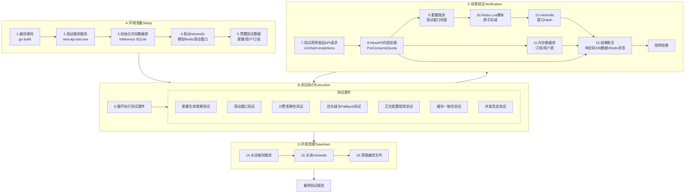

# NewAPI 包月套餐功能 - 测试设计与分析说明书

| 文档信息 | 内容 |
| :--- | :--- |
| **模块名称** | NewAPI - Package Subscription System |
| **文档作者** | QA Team |
| **测试环境** | SIT / UAT |
| **版本日期** | 2025-12-12 |
| **关键特性** | 滑动时间窗口、多套餐优先级、Fallback机制 |

---

## 一、测试方案原理 (Test Scheme & Methodology)

> **核心策略**: 采用**代码驱动的自动化集成测试**。所有测试场景的构建、执行与验证均在 **Go** 测试框架内完成。利用 **HTTP Test Server** 启动被测 NewAPI 实例，通过程序化 API 调用预设套餐、订阅、用户关系，使用**内存数据库 (In-Memory SQLite)** 确保测试环境的纯净与隔离，并通过**miniredis**模拟Redis滑动窗口行为。

### 1.1 自动化测试流程总览 (Automated Test Flow)

测试流程遵循"编译-启动-测试-清理"的生命周期，并特别关注滑动窗口的状态追踪和缓存一致性验证。



### 1.2 关键测试组件 (Key Components)

| 组件 | 技术选型 | 作用 | 配置 |
| :--- | :--- | :--- | :--- |
| **测试运行器** | `go test` | 编排测试生命周期 | - |
| **HTTP Test Server** | `net/http/httptest` | 启动临时NewAPI实例 | 随机端口 |
| **内存数据库** | `gorm.io/driver/sqlite` | 隔离的数据存储 | `file::memory:?cache=shared` |
| **Redis模拟** | `github.com/alicebob/miniredis/v2` | 模拟Redis滑动窗口 | 内存模式 |
| **Lua脚本验证** | miniredis支持Lua | 验证Lua脚本逻辑 | 完整Lua支持 |
| **Mock上游** | `httptest.Server` | 模拟LLM供应商响应 | 可控返回值 |
| **断言库** | `github.com/stretchr/testify/assert` | 结果验证 | - |

---

## 二、测试点分析列表 (Test Point Analysis)

### 2.1 套餐生命周期测试 (Package Lifecycle)

**核心风险**: 验证套餐从创建到过期的完整状态转换流程，确保状态机逻辑正确。

| ID | 测试场景 | 操作步骤 | 预期结果 | 验证点 | 优先级 |
| :--- | :--- | :--- | :--- | :--- | :--- |
| **LC-01** | **套餐创建权限-管理员全局** | 1. 管理员创建全局套餐（p2p_group_id=0）<br>2. 设置priority=15 | 创建成功，priority=15 | DB: packages表新增记录 | **P0** |
| **LC-02** | **套餐创建权限-P2P Owner** | 1. P2P分组Owner创建分组套餐<br>2. 尝试设置priority=20 | 创建成功，priority强制改为11 | DB: priority=11 | **P0** |
| **LC-03** | **套餐创建权限-非Owner拒绝** | 1. 普通用户尝试为他人的P2P分组创建套餐 | 返回403 Forbidden | 无DB变更 | **P0** |
| **LC-04** | **用户订阅-权限验证** | 1. 用户A订阅全局套餐<br>2. 用户A订阅未加入的P2P分组套餐 | 1. 成功<br>2. 返回403 | DB: subscriptions状态 | **P0** |
| **LC-05** | **套餐启用-库存到激活** | 1. 用户订阅套餐（status=inventory）<br>2. 调用启用接口 | status=active<br>start_time=now<br>end_time=start+duration | DB: 时间字段正确计算 | **P0** |
| **LC-06** | **套餐启用-非inventory拒绝** | 1. 套餐已启用（status=active）<br>2. 再次调用启用接口 | 返回错误"invalid status" | 无DB变更 | P1 |
| **LC-07** | **套餐过期-定时任务标记** | 1. 创建并启用套餐（duration=1秒）<br>2. 等待2秒<br>3. 触发`MarkExpiredSubscriptions` | status=expired | DB: status更新 | **P0** |
| **LC-08** | **时长计算-月份闰年** | 1. 创建duration_type=month的套餐<br>2. 在2月启用 | end_time正确（处理28/29天） | 时间计算准确 | P1 |
| **LC-09** | **时长计算-季度年度** | 1. 测试quarter（90天）<br>2. 测试year（365天） | end_time准确 | 时间计算准确 | P2 |

---

### 2.2 滑动时间窗口核心测试 (Sliding Window Core)

**核心风险**: 验证滑动窗口的按需开启、独立滑动、自动过期、原子扣减四大核心特性。

| ID | 测试场景 | 操作步骤 | 预期Redis状态 | 预期行为 | 优先级 |
| :--- | :--- | :--- | :--- | :--- | :--- |
| **SW-01** | **首次请求创建窗口** | 1. 用户首次请求套餐<br>2. Redis中无窗口Key | 创建Hash Key<br>start_time=now<br>end_time=now+3600<br>consumed=estimated | Lua返回status=1 | **P0** |
| **SW-02** | **窗口内扣减累加** | 1. 首次请求2.5M<br>2. 5分钟后再请求3M | consumed=5.5M<br>窗口时间不变 | 两次请求都成功 | **P0** |
| **SW-03** | **窗口超限拒绝** | 1. 小时限额10M<br>2. 先请求8M<br>3. 再请求5M（累计13M） | consumed=8M<br>第二次请求前不变 | 第二次请求返回429超限 | **P0** |
| **SW-04** | **窗口过期自动重建** | 1. 创建窗口（duration=60秒）<br>2. 等待65秒<br>3. 再次请求 | 旧窗口被DEL<br>创建新窗口<br>新start_time=now | Lua返回新窗口信息 | **P0** |
| **SW-05** | **窗口TTL自动清理** | 1. 创建窗口<br>2. 等待TTL过期（70分钟） | Key被Redis自动删除 | 下次请求创建新窗口 | P1 |
| **SW-06** | **RPM特殊处理** | 1. RPM限制60<br>2. 发起61次请求（每次quota不同） | RPM窗口consumed=61<br>（请求数，非quota） | 第61次返回超限 | **P0** |
| **SW-07** | **多维度独立滑动** | 1. 同时配置小时、日、周限额<br>2. 在不同时间发起请求 | 三个窗口独立创建<br>start_time各不相同 | 每个窗口独立滑动 | **P0** |
| **SW-08** | **4小时窗口跨度** | 1. 在22:00首次请求<br>2. 在次日01:00再次请求 | 窗口: 22:00 ~ 次日02:00<br>（跨日期边界） | 窗口时间正确 | P1 |
| **SW-09** | **无请求不创建Key** | 1. 启用套餐<br>2. 不发起任何请求<br>3. 查询Redis | 无任何窗口Key存在 | 资源节省验证 | P1 |
| **SW-10** | **Lua脚本原子性** | 1. 100个并发请求同一套餐<br>2. 小时限额10M，每次请求0.2M | consumed精确=成功请求数×0.2M<br>无超限超额 | 无TOCTOU竞态 | **P0** |

---

### 2.3 套餐优先级与Fallback测试 (Priority & Fallback)

**核心风险**: 验证多套餐场景下的优先级降级和Fallback到用户余额的逻辑正确性。

| ID | 测试场景 | 套餐配置 | 请求序列 | 预期套餐使用顺序 | 预期余额变化 | 优先级 |
| :--- | :--- | :--- | :--- | :--- | :--- | :--- |
| **PF-01** | **单套餐未超限** | 套餐A（优先级15，小时限额10M） | 请求3M | 使用套餐A | 用户余额不变 | **P0** |
| **PF-02** | **单套餐超限-允许Fallback** | 套餐A（小时限额5M，fallback=true）<br>用户余额100M | 请求8M | 套餐A超限<br>→ Fallback到用户余额 | 用户余额-8M | **P0** |
| **PF-03** | **单套餐超限-禁止Fallback** | 套餐A（小时限额5M，fallback=false） | 请求8M | 套餐A超限 | 返回429错误<br>余额不变 | **P0** |
| **PF-04** | **多套餐优先级降级** | 套餐A（优先级15，小时限额5M）<br>套餐B（优先级5，小时限额20M） | 1. 请求3M<br>2. 请求4M | 1. 使用套餐A<br>2. A超限，降级到套餐B | 余额不变 | **P0** |
| **PF-05** | **优先级相同按ID排序** | 套餐A（优先级10，ID=1）<br>套餐B（优先级10，ID=2） | 请求3M | 优先使用ID小的套餐A | 套餐A扣减 | P1 |
| **PF-06** | **所有套餐超限-Fallback** | 套餐A（小时限额5M，fallback=true）<br>套餐B（小时限额3M，fallback=true）<br>用户余额100M | 请求10M | 所有套餐超限<br>→ 使用用户余额 | 余额-10M | **P0** |
| **PF-07** | **所有套餐超限-无Fallback** | 套餐A（fallback=false）<br>套餐B（fallback=false） | 请求超限 | 检查最后套餐B的fallback配置 | 返回429<br>余额不变 | **P0** |
| **PF-08** | **月度总限额优先检查** | 套餐A（quota=100M，小时限额50M）<br>已消耗95M | 请求10M | 月度总限额超限<br>（未检查小时窗口） | 返回月度超限错误 | P1 |
| **PF-09** | **多窗口任一超限即失败** | 套餐A（小时限额10M，日限额20M）<br>小时已用9M，日已用15M | 请求2M | 小时窗口超限<br>（9+2>10） | 套餐A不可用 | **P0** |

---

### 2.4 计费准确性专项测试 (Billing Accuracy)

**核心风险**: 确保套餐消耗的quota计算与用户余额计费公式完全一致，且在异常情况下计费准确。

| ID | 测试场景 | 输入参数 | 计费公式 | 预期扣减 | 验证点 | 优先级 |
| :--- | :--- | :--- | :--- | :--- | :--- | :--- |
| **BA-01** | **套餐消耗基础计费** | InputTokens=1000<br>OutputTokens=500<br>ModelRatio=2.0<br>GroupRatio=1.5 | (1000 + 500×1.2) × 2.0 × 1.5 | 套餐扣减4800 quota | DB: total_consumed增加4800 | **P0** |
| **BA-02** | **Fallback时应用GroupRatio** | 套餐超限后使用用户余额<br>UserGroup=vip, BillingGroup=default | 应用GetEffectiveGroupRatio | 用户余额扣减正确 | 与套餐计费公式一致 | **P0** |
| **BA-03** | **流式请求预扣与补差** | 预估2000 tokens<br>实际返回2500 tokens | 预扣2000×ratio<br>后补差500×ratio | 套餐最终扣减2500×ratio | Redis + DB一致 | **P0** |
| **BA-04** | **缓存Token计费** | Claude模型返回<br>cached_tokens=1000<br>normal_tokens=500 | cached×0.1 + normal×1.0 | 套餐扣减正确计算 | 支持缓存倍率 | P1 |
| **BA-05** | **多模型混合计费** | 1. 使用套餐A请求gpt-4（ratio=2.0）<br>2. 使用套餐A请求gpt-3.5（ratio=1.0） | 不同模型不同倍率 | 套餐total_consumed=sum | 正确累加 | P1 |
| **BA-06** | **异常-上游返回空usage** | 上游响应无usage字段 | 使用默认估算 | 不crash，按估算扣减 | 错误处理 | P1 |
| **BA-07** | **异常-请求失败不扣费** | 请求失败（如401, 500） | 不扣减套餐 | total_consumed不变 | 回滚逻辑 | **P0** |
| **BA-08** | **异常-流式中断** | 流式请求中途断开 | 按已接收tokens扣减 | 部分扣减正确 | 异常计费 | P1 |
| **BA-09** | **边界-套餐刚好用尽** | 套餐quota=100M<br>已消耗99.9M<br>请求0.2M | total_consumed保持≤100M（不透支套餐额度）<br>超出部分视为溢出，由余额承担或请求被拒绝 | 严格月度总限额检查 | P2 |

---

### 2.5 正交配置矩阵测试 (Orthogonal Matrix Test)

**核心风险**: 验证套餐类型、用户分组、P2P分组、系统渠道等多维度组合的正确性。

#### 2.5.1 正交因子定义

| 因子 | 水平（Level） |
| :--- | :--- |
| **套餐类型** | L1: 全局套餐（p2p_group_id=0）<br>L2: P2P分组套餐 |
| **套餐优先级** | L1: 低优先级（5）<br>L2: P2P固定（11）<br>L3: 高优先级（15） |
| **用户系统分组** | L1: default<br>L2: vip<br>L3: svip |
| **用户P2P分组** | L1: 未加入任何P2P分组<br>L2: 加入P2P分组G1 |
| **渠道类型** | L1: 公共渠道（owner_id=0）<br>L2: P2P共享渠道（授权G1）<br>L3: 私有渠道 |
| **Token配置** | L1: 无特殊配置<br>L2: billing_group覆盖<br>L3: p2p_group_id限制 |
| **滑动窗口状态** | L1: 窗口不存在<br>L2: 窗口有效<br>L3: 窗口过期 |

#### 2.5.2 正交测试用例矩阵（示例）

| 用例ID | 套餐类型 | 套餐优先级 | 用户系统分组 | 用户P2P分组 | 渠道类型 | Token配置 | 滑动窗口状态 | 预期结果 |
| :--- | :--- | :--- | :--- | :--- | :--- | :--- | :--- | :--- |
| **OM-01** | 全局套餐 | 高优先级15 | vip | 未加入P2P | 公共渠道 | 无特殊配置 | 窗口不存在 | 套餐扣减成功<br>创建新窗口<br>用户余额不变 |
| **OM-02** | P2P套餐 | P2P固定11 | default | 加入G1 | P2P共享渠道G1 | 无特殊配置 | 窗口不存在 | 套餐扣减成功<br>创建新窗口<br>计费分组=default |
| **OM-03** | 全局套餐 | 低优先级5 | vip | 未加入P2P | 公共渠道 | billing_group覆盖为default | 窗口有效 | 套餐扣减成功<br>窗口累加<br>计费分组=default |
| **OM-04** | P2P套餐 | P2P固定11 | vip | 加入G1 | P2P共享渠道G1 | p2p_group_id限制为G1 | 窗口过期 | 窗口重建<br>套餐扣减成功 |
| **OM-05** | 全局套餐 | 高优先级15 | svip | 未加入P2P | 公共渠道 | 无特殊配置 | 窗口有效<br>但已超限 | 套餐超限<br>检查fallback配置 |
| **OM-06** | P2P套餐 | P2P固定11 | default | 加入G1 | 私有渠道 | 无特殊配置 | 窗口不存在 | 无法使用私有渠道<br>路由失败 |
| **OM-07** | 全局套餐 | 低优先级5 | default | 加入G1 | P2P共享渠道G1 | Token无P2P限制 | 窗口不存在 | 无法使用P2P渠道<br>仅能用公共渠道 |
| **OM-08** | 多套餐组合 | 全局15+P2P11 | vip | 加入G1 | 公共+P2P混合 | billing_group列表 | 窗口有效 | 优先级15优先<br>超限降级到11 |

**注**: 完整正交矩阵应生成50+个测试用例，上表仅为示例。

---

### 2.6 缓存一致性测试 (Cache Consistency)

**核心风险**: 验证套餐信息的三级缓存（内存+Redis+DB）在更新、失效、降级时的一致性。

| ID | 测试场景 | 操作步骤 | 验证点 | 预期行为 | 优先级 |
| :--- | :--- | :--- | :--- | :--- | :--- |
| **CC-01** | **套餐信息缓存写穿** | 1. 创建套餐<br>2. 立即查询 | Redis中存在套餐缓存<br>内容与DB一致 | Cache-Aside模式正确 | P1 |
| **CC-02** | **订阅信息缓存失效** | 1. 启用套餐（status=active）<br>2. 从另一节点查询 | Redis缓存已更新<br>返回status=active | 异步刷新生效 | P1 |
| **CC-03** | **滑动窗口Redis失效** | 1. 创建窗口<br>2. 手动DEL窗口Key<br>3. 再次请求 | Lua检测不存在<br>创建新窗口 | 窗口重建逻辑 | P1 |
| **CC-04** | **Redis完全不可用** | 1. 停止miniredis<br>2. 发起套餐请求 | 跳过滑动窗口检查<br>仅检查月度总限额 | 降级策略生效 | **P0** |
| **CC-05** | **Redis恢复后功能恢复** | 1. Redis不可用时请求成功<br>2. 恢复Redis<br>3. 再次请求 | 滑动窗口检查恢复 | 功能自动恢复 | P1 |
| **CC-06** | **DB与Redis数据对比** | 1. 发起100次请求<br>2. 对比DB的total_consumed和Redis窗口的sum | total_consumed ≈ sum(所有窗口consumed)<br>（允许微小误差） | 数据一致性 | P1 |
| **CC-07** | **Lua脚本加载失败降级** | 1. 清空scriptSHA<br>2. SCRIPT LOAD失败 | 记录ERROR日志<br>降级到允许请求通过 | 降级不阻塞服务 | P1 |

---

### 2.7 计费与路由组合测试 (Billing & Routing Integration)

**核心风险**: 验证套餐消耗与渠道路由的独立性，套餐仅影响额度管理，不影响渠道选择。

| ID | 测试场景 | 套餐配置 | 渠道配置 | 预期路由 | 预期计费 | 优先级 |
| :--- | :--- | :--- | :--- | :--- | :--- | :--- |
| **BR-01** | **套餐与BillingGroup独立** | 用户A（vip）<br>全局套餐（优先级15） | 渠道Ch-vip（系统分组vip）<br>渠道Ch-default（系统分组default） | 路由到Ch-vip<br>（基于BillingGroup=vip） | 使用套餐扣减<br>按vip倍率计费 | **P0** |
| **BR-02** | **套餐与P2P路由无关** | P2P套餐（绑定G1）<br>用户加入G1 | P2P渠道Ch-G1（授权G1）<br>公共渠道Ch-public | 两个渠道都可路由<br>（RoutingGroups包含G1和系统分组） | 使用P2P套餐扣减 | **P0** |
| **BR-03** | **Token覆盖BillingGroup** | 用户A（vip）<br>全局套餐<br>Token billing_group=["default"] | 渠道Ch-default（系统分组default） | 路由到Ch-default<br>（BillingGroup被Token覆盖） | 使用套餐扣减<br>按default倍率 | **P0** |
| **BR-04** | **套餐用尽后路由不变** | 套餐A（小时限额5M）<br>用户余额100M | 渠道Ch-vip | 1. 套餐可用时路由到Ch-vip<br>2. 套餐超限Fallback后仍路由到Ch-vip | 路由逻辑不受套餐影响 | P1 |

---

### 2.8 并发与数据竞态测试 (Concurrency & Race Conditions)

**核心风险**: 验证高并发场景下滑动窗口的原子性和数据一致性。

| ID | 测试场景 | 并发配置 | 预期行为 | 验证点 | 优先级 |
| :--- | :--- | :--- | :--- | :--- | :--- |
| **CR-01** | **Lua脚本原子性验证** | 100个goroutine同时请求<br>小时限额10M<br>每次请求0.15M | consumed = 成功请求数 × 0.15M<br>成功请求数 <= 66 (10/0.15) | 无TOCTOU竞态<br>严格不超限 | **P0** |
| **CR-02** | **窗口创建并发竞争** | 100个goroutine首次请求<br>（窗口不存在） | 仅创建1个窗口<br>start_time一致 | Lua脚本串行化 | **P0** |
| **CR-03** | **窗口过期并发重建** | 1. 窗口过期（end_time < now）<br>2. 100个goroutine同时请求 | 旧窗口被删除一次<br>新窗口创建一次<br>consumed = sum(所有请求) | DEL+HSET原子性 | **P0** |
| **CR-04** | **多套餐并发扣减** | 用户拥有2个套餐<br>50个goroutine同时请求 | 套餐A和B的consumed之和=总请求quota | 优先级选择正确 | P1 |
| **CR-05** | **订阅启用并发冲突** | 同一订阅，2个请求同时调用启用接口 | 仅一个成功<br>另一个返回"invalid status" | DB状态转换原子性 | P1 |
| **CR-06** | **total_consumed并发更新** | 100个goroutine同时更新同一订阅的total_consumed | DB最终值=所有goroutine的sum | GORM Expr原子性 | **P0** |

---

### 2.9 统计值正确性验证测试 (Statistics Correctness)

**核心风险**: 验证套餐消耗统计、窗口使用率等衍生数据的计算准确性。

| ID | 测试场景 | 操作序列 | 统计指标 | 预期值 | 验证方式 | 优先级 |
| :--- | :--- | :--- | :--- | :--- | :--- | :--- |
| **ST-01** | **total_consumed累计** | 1. 请求3M（成功）<br>2. 请求5M（成功）<br>3. 请求2M（失败，超限） | subscription.total_consumed | 8M（仅成功请求） | DB查询对比 | **P0** |
| **ST-02** | **滑动窗口consumed** | 1. 创建小时窗口，请求2M<br>2. 请求3M<br>3. 请求1M | Redis: hourly:window consumed | 6M | HGETALL查询 | **P0** |
| **ST-03** | **窗口使用率** | 小时限额10M<br>已消耗7M | 使用率 | 70% | (consumed/limit)×100 | P1 |
| **ST-04** | **窗口剩余时间** | 窗口end_time=now+1800 | time_left | 1800秒 | end_time - now | P1 |
| **ST-05** | **多窗口聚合统计** | 小时consumed=5M<br>日consumed=20M<br>周consumed=80M | 窗口消耗分布 | 小时5M，日20M，周80M | 各窗口独立正确 | P1 |
| **ST-06** | **套餐剩余额度** | quota=100M<br>total_consumed=35M | remaining_quota | 65M | quota - total_consumed | P1 |
| **ST-07** | **Fallback触发率** | 100次请求<br>其中20次Fallback到余额 | fallback_rate | 20% | 计数器统计 | P2 |
| **ST-08** | **窗口超限次数** | 100次请求<br>其中15次因小时窗口超限被拒 | window_exceeded_count | 15 | Counter指标 | P2 |

---

### 2.10 边界与异常场景测试 (Boundary & Exception Cases)

**核心风险**: 验证系统在极端条件和异常输入下的鲁棒性。

| ID | 测试场景 | 极端条件 | 预期行为 | 优先级 |
| :--- | :--- | :--- | :--- | :--- |
| **EC-01** | **窗口时间边界-刚好过期** | end_time = now（精确到秒） | Lua判定为过期<br>删除并重建窗口 | **P0** |
| **EC-02** | **窗口时间边界-差1秒** | end_time = now + 1 | Lua判定为有效<br>允许扣减 | **P0** |
| **EC-03** | **限额边界-刚好用尽** | consumed=9999999<br>limit=10000000<br>请求1 quota | Lua判定为未超限<br>扣减成功 | **P0** |
| **EC-04** | **限额边界-超1 quota** | consumed=10000000<br>limit=10000000<br>请求1 quota | Lua判定为超限<br>拒绝扣减 | **P0** |
| **EC-05** | **套餐生命周期边界** | end_time = now（套餐刚好过期） | 定时任务标记为expired<br>不可用于新请求 | **P0** |
| **EC-06** | **极小quota请求** | 请求1 quota | 正常扣减 | P2 |
| **EC-07** | **极大quota请求** | 请求1亿 quota | 正确处理（可能超限） | P2 |
| **EC-08** | **用户拥有0个套餐** | 用户无任何订阅 | 直接使用用户余额<br>不调用套餐逻辑 | P1 |
| **EC-09** | **用户拥有20个套餐** | 用户拥有20个不同优先级的套餐 | 按优先级正确遍历<br>性能可接受（<50ms） | P2 |
| **EC-10** | **套餐quota=0** | 套餐月度总限额设为0（不限制） | 仅检查滑动窗口<br>月度限额不生效 | P1 |
| **EC-11** | **所有limit都为0** | 套餐所有限额字段=0 | 仅检查月度总限额 | P1 |
| **EC-12** | **Redis Key名称冲突** | 两个订阅ID相同（理论上不可能） | 系统正确隔离 | P2 |

---

### 2.11 P2P分组与套餐权限组合测试 (P2P & Package Permission)

**核心风险**: 验证P2P分组套餐的权限隔离和订阅限制。

| ID | 测试场景 | 用户状态 | 套餐配置 | 预期行为 | 优先级 |
| :--- | :--- | :--- | :--- | :--- | :--- |
| **PP-01** | **P2P套餐仅组内可见** | 用户A未加入G1 | P2P套餐（绑定G1） | 查询套餐市场时不显示 | **P0** |
| **PP-02** | **P2P套餐仅组内可订阅** | 用户A未加入G1 | P2P套餐（绑定G1） | 订阅返回403 | **P0** |
| **PP-03** | **加入分组后可订阅** | 用户A加入G1（status=1） | P2P套餐（绑定G1） | 订阅成功 | **P0** |
| **PP-04** | **退出分组后订阅失效** | 1. 用户A订阅G1套餐并启用<br>2. 用户A退出G1<br>3. 再次请求 | 查询可用套餐时不包含G1套餐<br>无法使用 | **P0** |
| **PP-05** | **P2P Owner自己订阅** | 分组G1的Owner创建套餐并订阅 | 订阅成功 | P1 |
| **PP-06** | **多P2P分组套餐优先级** | 用户加入G1和G2<br>G1套餐优先级11<br>G2套餐优先级11<br>G1套餐ID=1<br>G2套餐ID=2 | 同优先级按ID排序<br>优先使用ID=1的G1套餐 | P1 |

---

### 2.12 异常与容错测试 (Exception & Fault Tolerance)

**核心风险**: 验证系统在各种异常情况下的容错能力和错误处理。

| ID | 测试场景 | 异常注入 | 预期行为 | 恢复能力 | 优先级 |
| :--- | :--- | :--- | :--- | :--- | :--- |
| **EX-01** | **请求中Redis断开** | 1. 请求开始<br>2. PreConsumeQuota时Redis可用<br>3. PostConsumeQuota时Redis断开 | 请求成功完成<br>记录降级日志<br>仅更新DB的total_consumed | Redis恢复后功能正常 | **P0** |
| **EX-02** | **请求中DB断开** | PostConsumeQuota时DB不可用 | 记录ERROR日志<br>不影响响应返回 | DB恢复后数据补齐 | P1 |
| **EX-03** | **Lua脚本返回异常格式** | Lua返回非4元素数组 | Go代码type assertion失败<br>降级处理<br>允许请求通过 | 不panic | P1 |
| **EX-04** | **套餐查询超时** | GetUserAvailablePackages超过5秒 | 超时返回<br>降级到用户余额 | 不阻塞请求 | P1 |
| **EX-05** | **滑动窗口Pipeline失败** | Pipeline部分命令失败 | 降级处理<br>记录错误 | 不影响主流程 | P1 |
| **EX-06** | **套餐过期但未标记** | 套餐end_time已过<br>但status仍为active | 查询时动态检测过期<br>不使用该套餐 | 保护性验证 | P1 |

---

## 三、测试数据准备 (Test Data Preparation)

所有测试均基于以下预置实体及其关系。测试代码应在 `Setup` 阶段通过程序化方式动态创建。

### 3.1 用户配置 (Users)

| 用户ID | 用户名 | 系统分组 | GroupRatio | 余额（Quota） | P2P分组成员 | 角色 |
| :--- | :--- | :--- | :--- | :--- | :--- | :--- |
| `User-A` | user_a | vip | 2.0 | 10,000,000 | Owner of G1 | Admin |
| `User-B` | user_b | default | 1.0 | 5,000,000 | Member of G1 | User |
| `User-C` | user_c | svip | 0.8 | 20,000,000 | - | User |
| `User-D` | user_d | default | 1.0 | 1,000,000 | Member of G1, G2 | User |

### 3.2 套餐模板配置 (Packages)

| 套餐ID | 套餐名称 | 优先级 | P2P分组 | 月度Quota | 小时限额 | 日限额 | RPM | Fallback | Creator |
| :--- | :--- | :--- | :--- | :--- | :--- | :--- | :--- | :--- | :--- |
| `Pkg-Global-High` | 全局高优先级套餐 | 15 | 0 | 500M | 20M | 150M | 60 | true | Admin |
| `Pkg-Global-Low` | 全局低优先级套餐 | 5 | 0 | 300M | 15M | 100M | 30 | true | Admin |
| `Pkg-P2P-G1` | P2P分组G1套餐 | 11 | G1 | 200M | 10M | 50M | 40 | true | User-A |
| `Pkg-P2P-G2` | P2P分组G2套餐 | 11 | G2 | 150M | 8M | 40M | 30 | false | User-A |
| `Pkg-NoFallback` | 无Fallback套餐 | 10 | 0 | 100M | 5M | 20M | 20 | false | Admin |
| `Pkg-OnlyMonthly` | 仅月度限额套餐 | 8 | 0 | 50M | 0 | 0 | 0 | true | Admin |

### 3.3 订阅关系配置 (Subscriptions)

| 订阅ID | 用户 | 套餐 | 状态 | start_time | end_time | total_consumed |
| :--- | :--- | :--- | :--- | :--- | :--- | :--- |
| `Sub-A1` | User-A | Pkg-Global-High | active | now | now+30天 | 0 |
| `Sub-B1` | User-B | Pkg-Global-Low | active | now | now+30天 | 0 |
| `Sub-B2` | User-B | Pkg-P2P-G1 | active | now | now+30天 | 0 |
| `Sub-C1` | User-C | Pkg-NoFallback | inventory | null | null | 0 |
| `Sub-D1` | User-D | Pkg-P2P-G1 | active | now | now+30天 | 0 |
| `Sub-D2` | User-D | Pkg-P2P-G2 | active | now | now+30天 | 0 |

### 3.4 渠道配置 (Channels)

| 渠道ID | 渠道名 | 系统分组 | 模型 | Owner | P2P授权 | 状态 |
| :--- | :--- | :--- | :--- | :--- | :--- | :--- |
| `Ch-Public-1` | 公共渠道1 | default | gpt-4 | 0 | - | Enabled |
| `Ch-Vip-1` | VIP渠道1 | vip | gpt-4 | 0 | - | Enabled |
| `Ch-P2P-G1` | P2P分组G1渠道 | default | gpt-4 | User-A | G1 | Enabled |

### 3.5 系统配置 (System Settings)

| 配置项 | 值 | 说明 |
| :--- | :--- | :--- |
| `PackageEnabled` | true | 套餐功能开关 |
| `GroupRatio[default]` | 1.0 | default分组倍率 |
| `GroupRatio[vip]` | 2.0 | vip分组倍率 |
| `GroupRatio[svip]` | 0.8 | svip分组倍率 |
| `PackageMaxActivePerUser` | 10 | 单用户最大活跃订阅数 |

---

## 四、自动化测试实现方案 (Automated Test Implementation Plan)

### 4.1 测试目录结构

```
new-api/
├── scene_test/
│   ├── main_test.go                          # 测试主入口
│   ├── testutil/
│   │   ├── server.go                         # 测试服务器启动工具
│   │   ├── fixtures.go                       # 测试数据预置工具
│   │   ├── redis_mock.go                     # miniredis封装
│   │   └── assertions.go                     # 自定义断言
│   │
│   ├── new-api-package/
│   │   ├── lifecycle/
│   │   │   └── lifecycle_test.go             # 套餐生命周期测试
│   │   │
│   │   ├── sliding-window/
│   │   │   ├── window_basic_test.go          # 滑动窗口基础测试
│   │   │   ├── window_concurrency_test.go    # 滑动窗口并发测试
│   │   │   └── lua_script_test.go            # Lua脚本单元测试
│   │   │
│   │   ├── billing/
│   │   │   ├── billing_accuracy_test.go      # 计费准确性测试
│   │   │   └── billing_exception_test.go     # 异常计费测试
│   │   │
│   │   ├── priority-fallback/
│   │   │   └── priority_test.go              # 优先级与Fallback测试
│   │   │
│   │   ├── orthogonal-matrix/
│   │   │   └── orthogonal_test.go            # 正交配置矩阵测试
│   │   │
│   │   ├── cache-consistency/
│   │   │   └── cache_test.go                 # 缓存一致性测试
│   │   │
│   │   └── statistics/
│   │       └── statistics_test.go            # 统计值正确性测试
│   │
│   └── integration/
│       └── package_e2e_test.go               # 端到端完整流程测试
```

### 4.2 测试工具函数实现

#### 4.2.1 测试服务器启动

**文件**: `scene_test/testutil/server.go`

```go
package testutil

import (
    "os/exec"
    "time"
    "github.com/alicebob/miniredis/v2"
    "one-api/common"
)

type TestServer struct {
    Cmd       *exec.Cmd
    BaseURL   string
    MiniRedis *miniredis.Miniredis
    DB        *gorm.DB
}

// StartTestServer 启动测试服务器
func StartTestServer() (*TestServer, error) {
    // 1. 启动miniredis
    mr, err := miniredis.Run()
    if err != nil {
        return nil, err
    }

    // 2. 设置环境变量
    os.Setenv("GIN_MODE", "test")
    os.Setenv("SQL_DSN", "file::memory:?cache=shared")
    os.Setenv("REDIS_CONN_STRING", "redis://"+mr.Addr())
    os.Setenv("PORT", "0")  // 随机端口
    os.Setenv("PACKAGE_ENABLED", "true")

    // 3. 启动被测程序
    cmd := exec.Command("./new-api.test.exe")
    cmd.Start()

    // 4. 等待服务启动
    time.Sleep(2 * time.Second)

    // 5. 获取实际监听端口（从日志或环境变量）
    baseURL := "http://localhost:3000"  // 或动态获取

    return &TestServer{
        Cmd:       cmd,
        BaseURL:   baseURL,
        MiniRedis: mr,
    }, nil
}

// Stop 停止测试服务器
func (s *TestServer) Stop() {
    if s.Cmd != nil && s.Cmd.Process != nil {
        s.Cmd.Process.Kill()
    }
    if s.MiniRedis != nil {
        s.MiniRedis.Close()
    }
}
```

#### 4.2.2 测试数据预置

**文件**: `scene_test/testutil/fixtures.go`

```go
package testutil

import (
    "one-api/model"
    "one-api/common"
)

// CreateTestPackage 创建测试套餐
func CreateTestPackage(name string, priority int, p2pGroupId int, quota int64, hourlyLimit int64) *model.Package {
    pkg := &model.Package{
        Name:              name,
        Priority:          priority,
        P2PGroupId:        p2pGroupId,
        Quota:             quota,
        HourlyLimit:       hourlyLimit,
        DurationType:      "month",
        Duration:          1,
        FallbackToBalance: true,
        Status:            1,
        CreatorId:         0,
    }
    model.CreatePackage(pkg)
    return pkg
}

// CreateAndActivateSubscription 创建并启用订阅
func CreateAndActivateSubscription(userId int, packageId int) *model.Subscription {
    sub := &model.Subscription{
        UserId:    userId,
        PackageId: packageId,
        Status:    model.SubscriptionStatusInventory,
    }
    model.CreateSubscription(sub)

    // 启用
    now := common.GetTimestamp()
    endTime := now + 30*24*3600
    sub.Status = model.SubscriptionStatusActive
    sub.StartTime = &now
    sub.EndTime = &endTime
    model.DB.Save(sub)

    return sub
}
```

#### 4.2.3 自定义断言

**文件**: `scene_test/testutil/assertions.go`

```go
package testutil

import (
    "testing"
    "github.com/stretchr/testify/assert"
    "github.com/alicebob/miniredis/v2"
)

// AssertWindowExists 断言滑动窗口存在
func AssertWindowExists(t *testing.T, mr *miniredis.Miniredis, subscriptionId int, period string) {
    key := fmt.Sprintf("subscription:%d:%s:window", subscriptionId, period)
    exists := mr.Exists(key)
    assert.True(t, exists, "window %s should exist", key)
}

// AssertWindowConsumed 断言窗口消耗值
func AssertWindowConsumed(t *testing.T, mr *miniredis.Miniredis, subscriptionId int, period string, expectedConsumed int64) {
    key := fmt.Sprintf("subscription:%d:%s:window", subscriptionId, period)
    consumed, err := mr.HGet(key, "consumed")
    assert.Nil(t, err)
    assert.Equal(t, fmt.Sprintf("%d", expectedConsumed), consumed)
}

// AssertSubscriptionConsumed 断言订阅总消耗
func AssertSubscriptionConsumed(t *testing.T, subscriptionId int, expectedConsumed int64) {
    sub, _ := model.GetSubscriptionById(subscriptionId)
    assert.Equal(t, expectedConsumed, sub.TotalConsumed)
}

// AssertUserQuotaUnchanged 断言用户余额未变
func AssertUserQuotaUnchanged(t *testing.T, userId int, initialQuota int) {
    finalQuota, _ := model.GetUserQuota(userId, true)
    assert.Equal(t, initialQuota, finalQuota, "user quota should not change when using package")
}
```

### 4.3 测试套件实现框架

#### 4.3.1 滑动窗口基础测试

**文件**: `scene_test/new-api-package/sliding-window/window_basic_test.go`

```go
package sliding_window_test

import (
    "testing"
    "time"
    "github.com/stretchr/testify/assert"
    "scene_test/testutil"
    "one-api/service"
)

var (
    server *testutil.TestServer
)

func TestMain(m *testing.M) {
    // Setup
    server, _ = testutil.StartTestServer()
    defer server.Stop()

    // Run tests
    exitCode := m.Run()
    os.Exit(exitCode)
}

// SW-01: 首次请求创建窗口
func TestSlidingWindow_FirstRequest_CreatesWindow(t *testing.T) {
    // Arrange: 创建套餐和订阅
    pkg := testutil.CreateTestPackage("测试套餐", 15, 0, 100000000, 20000000)
    sub := testutil.CreateAndActivateSubscription(userId, pkg.Id)

    // Act: 首次请求
    result, err := service.CheckAndConsumeSlidingWindow(
        sub.Id,
        service.SlidingWindowConfig{
            Period:   "hourly",
            Duration: 3600,
            Limit:    20000000,
            TTL:      4200,
        },
        2500000,
    )

    // Assert: 窗口创建成功
    assert.Nil(t, err)
    assert.True(t, result.Success)
    assert.Equal(t, int64(2500000), result.Consumed)
    assert.NotZero(t, result.StartTime)
    assert.Equal(t, result.StartTime+3600, result.EndTime)

    // Assert: Redis状态
    testutil.AssertWindowExists(t, server.MiniRedis, sub.Id, "hourly")
    testutil.AssertWindowConsumed(t, server.MiniRedis, sub.Id, "hourly", 2500000)
}

// SW-02: 窗口内扣减累加
func TestSlidingWindow_WithinWindow_Accumulates(t *testing.T) {
    // Arrange
    pkg := testutil.CreateTestPackage("测试套餐", 15, 0, 100000000, 20000000)
    sub := testutil.CreateAndActivateSubscription(userId, pkg.Id)

    // Act: 第一次请求2.5M
    result1, _ := service.CheckAndConsumeSlidingWindow(sub.Id, config, 2500000)
    assert.True(t, result1.Success)
    assert.Equal(t, int64(2500000), result1.Consumed)

    // Act: 5分钟后第二次请求3M
    time.Sleep(5 * time.Minute)  // 或使用时间mock
    result2, _ := service.CheckAndConsumeSlidingWindow(sub.Id, config, 3000000)

    // Assert: 累加正确
    assert.True(t, result2.Success)
    assert.Equal(t, int64(5500000), result2.Consumed)

    // Assert: 窗口时间未变
    assert.Equal(t, result1.StartTime, result2.StartTime)
    assert.Equal(t, result1.EndTime, result2.EndTime)
}

// SW-03: 窗口超限拒绝
func TestSlidingWindow_Exceeded_Rejects(t *testing.T) {
    // Arrange: 小时限额10M
    pkg := testutil.CreateTestPackage("测试套餐", 15, 0, 100000000, 10000000)
    sub := testutil.CreateAndActivateSubscription(userId, pkg.Id)

    // Act: 先请求8M（成功）
    result1, _ := service.CheckAndConsumeSlidingWindow(sub.Id, config, 8000000)
    assert.True(t, result1.Success)

    // Act: 再请求5M（8+5=13M > 10M，超限）
    result2, _ := service.CheckAndConsumeSlidingWindow(sub.Id, config, 5000000)

    // Assert: 第二次被拒绝
    assert.False(t, result2.Success)
    assert.Equal(t, int64(8000000), result2.Consumed)  // consumed未增加

    // Assert: Redis窗口consumed仍为8M
    testutil.AssertWindowConsumed(t, server.MiniRedis, sub.Id, "hourly", 8000000)
}

// SW-04: 窗口过期自动重建
func TestSlidingWindow_Expired_Rebuilds(t *testing.T) {
    // Arrange: 创建窗口（duration=60秒）
    pkg := testutil.CreateTestPackage("测试套餐", 15, 0, 100000000, 20000000)
    sub := testutil.CreateAndActivateSubscription(userId, pkg.Id)

    config := service.SlidingWindowConfig{
        Period:   "hourly",
        Duration: 60,  // 仅60秒
        Limit:    20000000,
        TTL:      90,
    }

    // Act: 首次请求创建窗口
    result1, _ := service.CheckAndConsumeSlidingWindow(sub.Id, config, 2500000)
    window1Start := result1.StartTime

    // Act: 等待65秒（窗口过期）
    server.MiniRedis.FastForward(65 * time.Second)

    // Act: 再次请求
    result2, _ := service.CheckAndConsumeSlidingWindow(sub.Id, config, 3000000)

    // Assert: 窗口已重建
    assert.True(t, result2.Success)
    assert.Equal(t, int64(3000000), result2.Consumed)  // 新窗口从0开始
    assert.Greater(t, result2.StartTime, window1Start)  // 新窗口的开始时间更晚

    // Assert: 新窗口时长正确
    assert.Equal(t, result2.StartTime+60, result2.EndTime)
}
```

---

### 4.4 计费准确性测试实现

**文件**: `scene_test/new-api-package/billing/billing_accuracy_test.go`

```go
package billing_test

import (
    "testing"
    "net/http"
    "github.com/stretchr/testify/assert"
    "scene_test/testutil"
)

// BA-01: 套餐消耗基础计费
func TestBilling_PackageConsumption_BasicFormula(t *testing.T) {
    // Arrange: 创建套餐和订阅
    pkg := testutil.CreateTestPackage("测试套餐", 15, 0, 500000000, 20000000)
    sub := testutil.CreateAndActivateSubscription(userId, pkg.Id)
    token := testutil.CreateTestToken(userId, "", 0)

    // 获取用户初始余额
    initialQuota, _ := model.GetUserQuota(userId, true)

    // Act: 发起API请求
    // 模拟: InputTokens=1000, OutputTokens=500, ModelRatio=2.0, GroupRatio=1.5
    // 预期消耗: (1000 + 500×1.2) × 2.0 × 1.5 = 4800 quota
    resp := testutil.CallChatCompletion(t, server.BaseURL, token, &ChatRequest{
        Model: "gpt-4",
        Messages: []Message{
            {Role: "user", Content: "test"},
        },
    })

    // Assert: 请求成功
    assert.Equal(t, http.StatusOK, resp.StatusCode)

    // Assert: 套餐扣减正确
    updatedSub, _ := model.GetSubscriptionById(sub.Id)
    assert.Equal(t, int64(4800), updatedSub.TotalConsumed)

    // Assert: 用户余额未变
    testutil.AssertUserQuotaUnchanged(t, userId, initialQuota)

    // Assert: 滑动窗口已创建并扣减
    testutil.AssertWindowConsumed(t, server.MiniRedis, sub.Id, "hourly", 4800)
}

// BA-02: Fallback时应用GroupRatio
func TestBilling_Fallback_AppliesGroupRatio(t *testing.T) {
    // Arrange: 创建小时限额5M的套餐（fallback=true）
    pkg := testutil.CreateTestPackage("测试套餐", 15, 0, 500000000, 5000000)
    pkg.FallbackToBalance = true
    model.UpdatePackage(pkg)

    sub := testutil.CreateAndActivateSubscription(userId, pkg.Id)
    token := testutil.CreateTestToken(userId, "", 0)

    initialQuota, _ := model.GetUserQuota(userId, true)

    // Act: 请求8M（超过小时限额，Fallback到用户余额）
    // 预期消耗: 8M × ModelRatio × GroupRatio
    resp := testutil.CallChatCompletion(t, server.BaseURL, token, &ChatRequest{
        Model: "gpt-4",
        // ... 构造请求，使其消耗8M quota
    })

    // Assert: 请求成功
    assert.Equal(t, http.StatusOK, resp.StatusCode)

    // Assert: 套餐未扣减（超限）
    updatedSub, _ := model.GetSubscriptionById(sub.Id)
    assert.Equal(t, int64(0), updatedSub.TotalConsumed)

    // Assert: 用户余额扣减正确（应用GroupRatio）
    finalQuota, _ := model.GetUserQuota(userId, true)
    expectedDeduction := calculateExpectedQuota(8000000, userGroupRatio)
    assert.Equal(t, initialQuota-expectedDeduction, finalQuota)
}

// BA-07: 异常-请求失败不扣费
func TestBilling_RequestFailed_NoCharge(t *testing.T) {
    // Arrange
    pkg := testutil.CreateTestPackage("测试套餐", 15, 0, 500000000, 20000000)
    sub := testutil.CreateAndActivateSubscription(userId, pkg.Id)
    token := testutil.CreateTestToken(userId, "", 0)

    // 配置Mock上游返回500错误
    mockServer := testutil.CreateMockUpstream(func(w http.ResponseWriter, r *http.Request) {
        w.WriteHeader(http.StatusInternalServerError)
        w.Write([]byte(`{"error": "internal server error"}`))
    })
    defer mockServer.Close()

    // 配置渠道指向Mock上游
    // ...

    // Act: 发起请求
    resp := testutil.CallChatCompletion(t, server.BaseURL, token, &ChatRequest{
        Model: "gpt-4",
        Messages: []Message{{Role: "user", Content: "test"}},
    })

    // Assert: 请求失败
    assert.Equal(t, http.StatusInternalServerError, resp.StatusCode)

    // Assert: 套餐未扣减
    updatedSub, _ := model.GetSubscriptionById(sub.Id)
    assert.Equal(t, int64(0), updatedSub.TotalConsumed)

    // Assert: 滑动窗口未创建
    key := fmt.Sprintf("subscription:%d:hourly:window", sub.Id)
    assert.False(t, server.MiniRedis.Exists(key))
}
```

---

### 4.5 优先级与Fallback测试实现

**文件**: `scene_test/new-api-package/priority-fallback/priority_test.go`

```go
package priority_test

// PF-04: 多套餐优先级降级
func TestPriority_MultiPackage_Degradation(t *testing.T) {
    // Arrange: 创建两个套餐
    pkgHigh := testutil.CreateTestPackage("高优先级", 15, 0, 500000000, 5000000)
    pkgLow := testutil.CreateTestPackage("低优先级", 5, 0, 500000000, 20000000)

    subHigh := testutil.CreateAndActivateSubscription(userId, pkgHigh.Id)
    subLow := testutil.CreateAndActivateSubscription(userId, pkgLow.Id)

    token := testutil.CreateTestToken(userId, "", 0)
    initialQuota, _ := model.GetUserQuota(userId, true)

    // Act: 第一次请求3M（小于pkgHigh的5M限额）
    resp1 := testutil.CallChatCompletion(t, server.BaseURL, token, &ChatRequest{
        Model: "gpt-4",
        // ... 构造3M quota的请求
    })

    // Assert: 第一次使用高优先级套餐
    assert.Equal(t, http.StatusOK, resp1.StatusCode)
    updatedSubHigh1, _ := model.GetSubscriptionById(subHigh.Id)
    assert.Equal(t, int64(3000000), updatedSubHigh1.TotalConsumed)

    updatedSubLow1, _ := model.GetSubscriptionById(subLow.Id)
    assert.Equal(t, int64(0), updatedSubLow1.TotalConsumed)  // 低优先级未使用

    // Act: 第二次请求4M（高优先级已用3M，剩余2M不足，应降级到低优先级）
    resp2 := testutil.CallChatCompletion(t, server.BaseURL, token, &ChatRequest{
        Model: "gpt-4",
        // ... 构造4M quota的请求
    })

    // Assert: 第二次降级到低优先级套餐
    assert.Equal(t, http.StatusOK, resp2.StatusCode)

    updatedSubHigh2, _ := model.GetSubscriptionById(subHigh.Id)
    assert.Equal(t, int64(3000000), updatedSubHigh2.TotalConsumed)  // 高优先级未增加

    updatedSubLow2, _ := model.GetSubscriptionById(subLow.Id)
    assert.Equal(t, int64(4000000), updatedSubLow2.TotalConsumed)  // 低优先级扣减

    // Assert: 用户余额仍未变
    testutil.AssertUserQuotaUnchanged(t, userId, initialQuota)
}

// PF-06: 所有套餐超限-Fallback
func TestPriority_AllExceeded_FallbackToBalance(t *testing.T) {
    // Arrange: 两个套餐，小时限额都很小
    pkgA := testutil.CreateTestPackage("套餐A", 15, 0, 500000000, 3000000)
    pkgA.FallbackToBalance = true
    model.UpdatePackage(pkgA)

    pkgB := testutil.CreateTestPackage("套餐B", 5, 0, 500000000, 2000000)
    pkgB.FallbackToBalance = true
    model.UpdatePackage(pkgB)

    subA := testutil.CreateAndActivateSubscription(userId, pkgA.Id)
    subB := testutil.CreateAndActivateSubscription(userId, pkgB.Id)

    token := testutil.CreateTestToken(userId, "", 0)
    initialQuota := 100000000

    // Act: 请求10M（超过所有套餐小时限额）
    resp := testutil.CallChatCompletion(t, server.BaseURL, token, &ChatRequest{
        Model: "gpt-4",
        // ... 构造10M quota的请求
    })

    // Assert: 请求成功（Fallback到用户余额）
    assert.Equal(t, http.StatusOK, resp.StatusCode)

    // Assert: 所有套餐都未扣减
    testutil.AssertSubscriptionConsumed(t, subA.Id, 0)
    testutil.AssertSubscriptionConsumed(t, subB.Id, 0)

    // Assert: 用户余额扣减
    finalQuota, _ := model.GetUserQuota(userId, true)
    assert.Less(t, finalQuota, initialQuota)
    assert.Equal(t, initialQuota-10000000, finalQuota)  // 简化计算
}
```

---

### 4.6 正交配置矩阵测试实现

**文件**: `scene_test/new-api-package/orthogonal-matrix/orthogonal_test.go`

```go
package orthogonal_test

import (
    "testing"
)

// 正交测试用例生成器
type OrthogonalTestCase struct {
    Name              string
    PackageType       string  // "global" or "p2p"
    PackagePriority   int
    UserGroup         string
    UserInP2PGroup    bool
    ChannelType       string  // "public", "p2p", "private"
    TokenConfig       string  // "normal", "billing_override", "p2p_restriction"
    WindowState       string  // "not_exist", "active", "expired"
    ExpectedResult    string  // "package_consumed", "balance_consumed", "rejected"
    ExpectedBillingGroup string
}

var orthogonalCases = []OrthogonalTestCase{
    {
        Name:              "OM-01-全局套餐高优先级VIP用户公共渠道",
        PackageType:       "global",
        PackagePriority:   15,
        UserGroup:         "vip",
        UserInP2PGroup:    false,
        ChannelType:       "public",
        TokenConfig:       "normal",
        WindowState:       "not_exist",
        ExpectedResult:    "package_consumed",
        ExpectedBillingGroup: "vip",
    },
    {
        Name:              "OM-02-P2P套餐default用户G1渠道",
        PackageType:       "p2p",
        PackagePriority:   11,
        UserGroup:         "default",
        UserInP2PGroup:    true,
        ChannelType:       "p2p",
        TokenConfig:       "normal",
        WindowState:       "not_exist",
        ExpectedResult:    "package_consumed",
        ExpectedBillingGroup: "default",
    },
    // ... 更多正交用例（建议生成50+个）
}

// 正交测试执行器
func TestOrthogonalMatrix_AllCombinations(t *testing.T) {
    for _, tc := range orthogonalCases {
        t.Run(tc.Name, func(t *testing.T) {
            // Setup: 根据tc配置创建测试环境
            setupOrthogonalTestCase(t, tc)

            // Execute: 发起API请求
            resp, relayInfo := executePackageRequest(t, tc)

            // Verify: 验证结果
            verifyOrthogonalResult(t, tc, resp, relayInfo)

            // Cleanup: 清理该用例的数据
            cleanupOrthogonalTestCase(t, tc)
        })
    }
}

func setupOrthogonalTestCase(t *testing.T, tc OrthogonalTestCase) {
    // 根据tc配置创建用户、套餐、订阅、渠道、Token
    // ...
}

func verifyOrthogonalResult(t *testing.T, tc OrthogonalTestCase, resp *http.Response, relayInfo *RelayInfo) {
    switch tc.ExpectedResult {
    case "package_consumed":
        // 验证套餐扣减
        assert.Equal(t, http.StatusOK, resp.StatusCode)
        assert.Greater(t, relayInfo.UsingPackageId, 0)
        // 验证计费分组
        assert.Equal(t, tc.ExpectedBillingGroup, relayInfo.BillingGroup)

    case "balance_consumed":
        // 验证余额扣减
        assert.Equal(t, http.StatusOK, resp.StatusCode)
        assert.Equal(t, 0, relayInfo.UsingPackageId)

    case "rejected":
        // 验证请求被拒绝
        assert.Equal(t, http.StatusTooManyRequests, resp.StatusCode)
    }
}
```

---

### 4.7 缓存一致性测试实现

**文件**: `scene_test/new-api-package/cache-consistency/cache_test.go`

```go
package cache_test

// CC-04: Redis完全不可用
func TestCache_RedisDown_GracefulDegradation(t *testing.T) {
    // Arrange: 创建套餐和订阅
    pkg := testutil.CreateTestPackage("测试套餐", 15, 0, 500000000, 20000000)
    sub := testutil.CreateAndActivateSubscription(userId, pkg.Id)
    token := testutil.CreateTestToken(userId, "", 0)

    // Act: 停止miniredis（模拟Redis不可用）
    server.MiniRedis.Close()
    common.RedisEnabled = false

    // Act: 发起请求
    resp := testutil.CallChatCompletion(t, server.BaseURL, token, &ChatRequest{
        Model: "gpt-4",
        Messages: []Message{{Role: "user", Content: "test"}},
    })

    // Assert: 请求成功（降级）
    assert.Equal(t, http.StatusOK, resp.StatusCode)

    // Assert: 套餐仍然扣减（仅检查月度总限额）
    updatedSub, _ := model.GetSubscriptionById(sub.Id)
    assert.Greater(t, updatedSub.TotalConsumed, int64(0))

    // Assert: 日志记录降级警告
    logs := testutil.GetSystemLogs()
    assert.Contains(t, logs, "Redis unavailable, sliding window check skipped")

    // Act: 恢复Redis
    server.MiniRedis, _ = miniredis.Run()
    common.RedisEnabled = true

    // Act: 再次请求
    resp2 := testutil.CallChatCompletion(t, server.BaseURL, token, &ChatRequest{
        Model: "gpt-4",
        Messages: []Message{{Role: "user", Content: "test"}},
    })

    // Assert: 滑动窗口功能恢复
    assert.Equal(t, http.StatusOK, resp2.StatusCode)
    testutil.AssertWindowExists(t, server.MiniRedis, sub.Id, "hourly")
}

// CC-06: DB与Redis数据对比
func TestCache_DBRedisConsistency_AfterMultipleRequests(t *testing.T) {
    // Arrange
    pkg := testutil.CreateTestPackage("测试套餐", 15, 0, 500000000, 50000000)
    sub := testutil.CreateAndActivateSubscription(userId, pkg.Id)
    token := testutil.CreateTestToken(userId, "", 0)

    // Act: 发起100次请求（每次1M quota）
    for i := 0; i < 100; i++ {
        testutil.CallChatCompletion(t, server.BaseURL, token, &ChatRequest{
            Model: "gpt-4",
            // ... 构造1M quota的请求
        })
    }

    // Assert: DB的total_consumed
    updatedSub, _ := model.GetSubscriptionById(sub.Id)
    dbConsumed := updatedSub.TotalConsumed

    // Assert: Redis小时窗口的consumed
    redisConsumed, _ := server.MiniRedis.HGet(
        fmt.Sprintf("subscription:%d:hourly:window", sub.Id),
        "consumed",
    )
    redisConsumedInt, _ := strconv.ParseInt(redisConsumed, 10, 64)

    // Assert: 两者应相等（或允许微小误差）
    assert.InDelta(t, dbConsumed, redisConsumedInt, 1000)  // 允许1000 quota误差
}
```

---

## 五、测试执行计划 (Test Execution Plan)

### 5.1 测试分阶段执行

| 阶段 | 时间 | 测试范围 | 验收标准 |
| :--- | :--- | :--- | :--- |
| **Phase 1: 单元测试** | Day 1-10 | 各任务集的单元测试 | 覆盖率>85% |
| **Phase 2: 集成测试** | Day 11-15 | 滑动窗口、优先级、计费测试 | 核心场景通过 |
| **Phase 3: 正交测试** | Day 16-18 | 正交配置矩阵测试 | 50+用例通过 |
| **Phase 4: 性能测试** | Day 19-20 | 并发、性能基准测试 | P99<10ms |
| **Phase 5: 故障测试** | Day 21-22 | Redis降级、异常处理 | 降级正确 |
| **Phase 6: E2E测试** | Day 23-25 | 端到端完整流程 | 用户体验验证 |

### 5.2 测试优先级执行顺序

**P0级别**（必须通过才能上线）：
1. SW-01, SW-02, SW-03, SW-04（滑动窗口核心）
2. PF-01, PF-02, PF-03, PF-04（优先级与Fallback）
3. BA-01, BA-02, BA-07（计费准确性）
4. LC-01, LC-02, LC-03, LC-05（生命周期核心）
5. CR-01, CR-02, CR-03（并发原子性）

**P1级别**（重要但可延后修复）：
- 缓存一致性测试
- 边界条件测试
- 统计值验证

**P2级别**（可选优化）：
- 极端场景测试
- 性能优化测试

---

## 六、测试报告与度量 (Test Report & Metrics)

### 6.1 测试覆盖率目标

| 维度 | 目标 | 测量方式 |
| :--- | :--- | :--- |
| **代码覆盖率** | >85% | `go test -cover` |
| **场景覆盖率** | 100%核心场景 | 测试用例清单 |
| **Lua脚本分支覆盖** | 100% | 手动验证4种场景 |
| **API接口覆盖** | 100% | Postman Collection |

### 6.2 测试通过标准

**必须满足**：
- ✅ 所有P0级别测试用例通过（0失败）
- ✅ P1级别测试用例通过率>95%
- ✅ 代码覆盖率>85%
- ✅ 性能测试达标（P99<10ms）
- ✅ Redis降级测试通过
- ✅ 并发竞态测试通过（0数据不一致）

---

## 七、附录：测试命令与工具 (Appendix: Test Commands & Tools)

### 7.1 运行所有测试

```bash
# 运行所有套餐相关测试
cd scene_test/new-api-package
go test ./... -v -cover

# 运行特定测试套件
go test ./sliding-window -v

# 运行性能测试
go test ./sliding-window -bench=. -benchtime=10s

# 生成覆盖率报告
go test ./... -coverprofile=coverage.out
go tool cover -html=coverage.out -o coverage.html
```

### 7.2 Redis手动验证

```bash
# 查看所有窗口Key
redis-cli --scan --pattern "subscription:*:window"

# 查看窗口详情
redis-cli HGETALL subscription:1:hourly:window

# 检查TTL
redis-cli TTL subscription:1:hourly:window

# 手动触发窗口过期（测试用）
redis-cli EXPIRE subscription:1:hourly:window 1
sleep 2
```

### 7.3 数据库手动验证

```sql
-- 查询所有活跃订阅
SELECT s.*, p.name, p.priority
FROM subscriptions s
JOIN packages p ON s.package_id = p.id
WHERE s.status = 'active';

-- 验证total_consumed
SELECT subscription_id, SUM(consumed_quota) as total
FROM subscription_history
GROUP BY subscription_id;
```

---

**测试设计文档结束**
