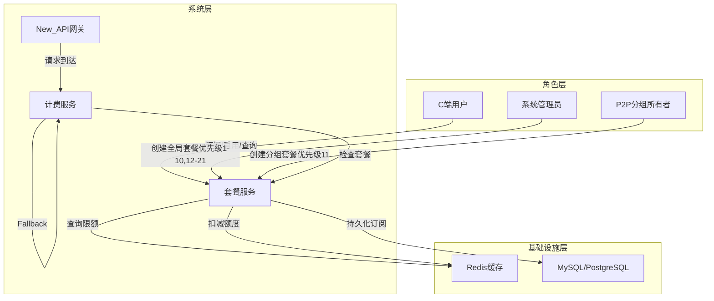
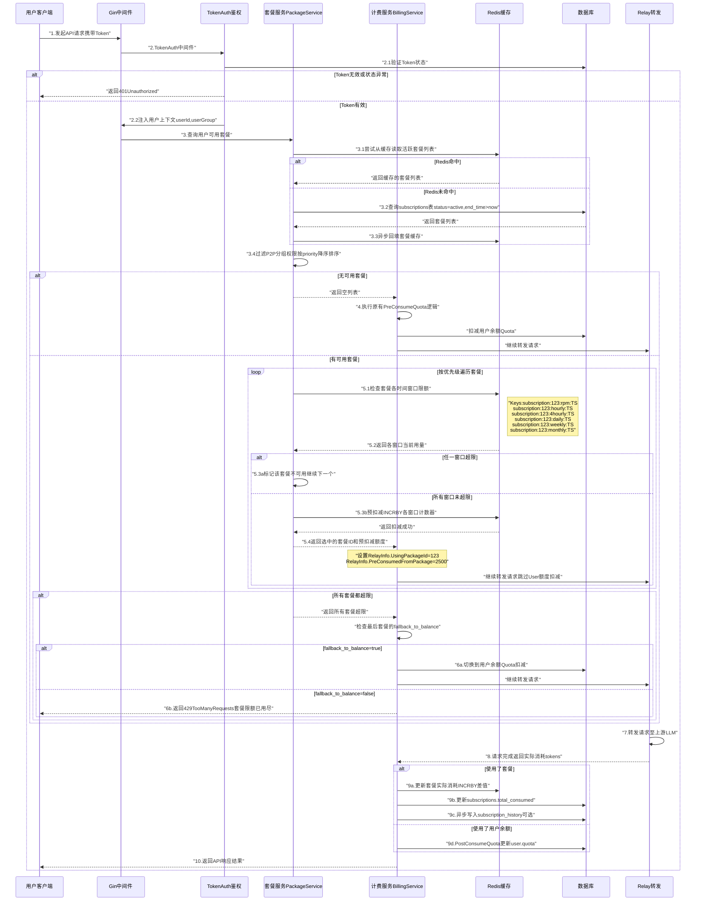
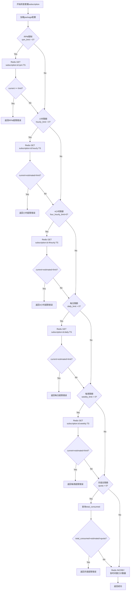
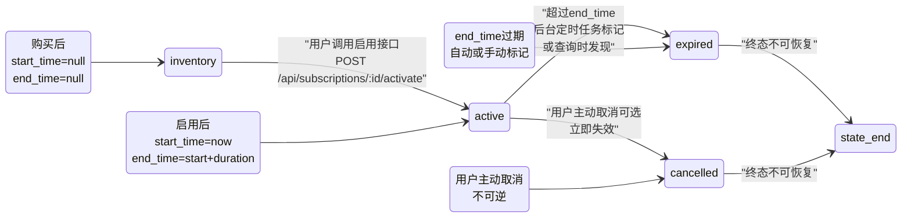
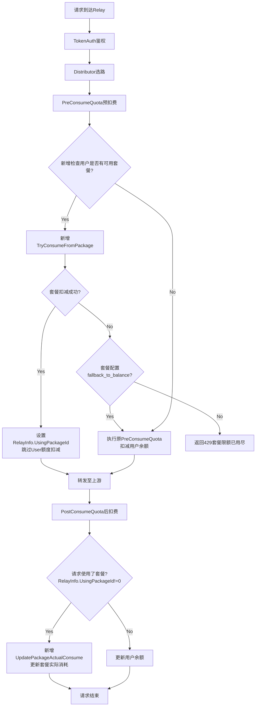
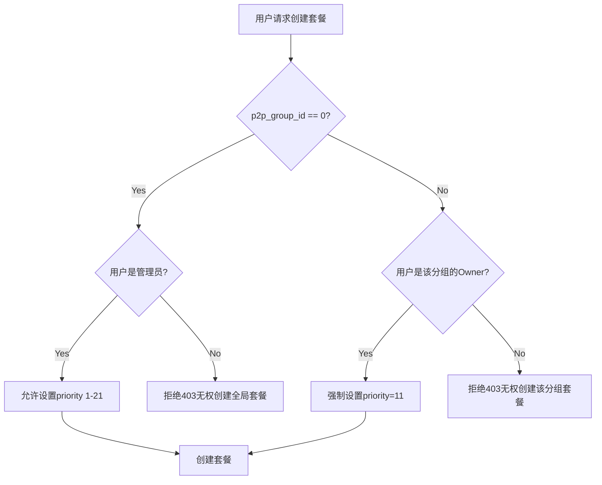
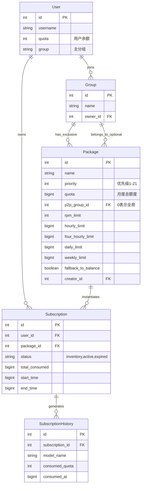
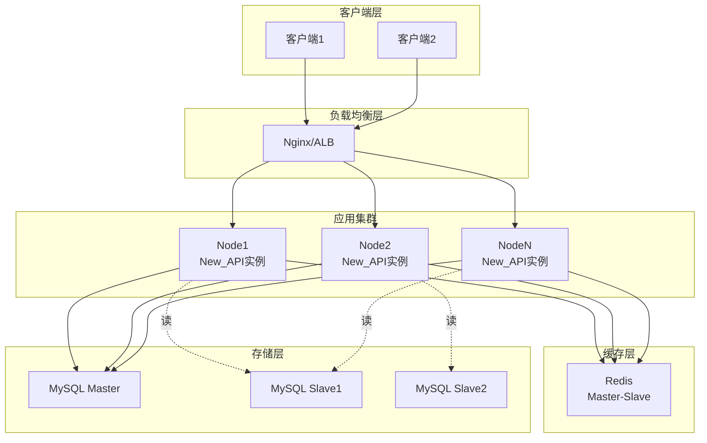

---
# New API 多种包月套餐支持 - 总体设计文档 (优化版)

| 文档属性 | 内容 |
| :--- | :--- |
| **作者** | Claude (基于架构分析) |
| **版本** | V2.0 |
| **最后更新** | 2025年12月12日 |
| **对应需求文档** | New API 支持多种包月套餐 |
| **状态** | 设计优化中 |

---

## 1. 业务背景与目标 (Context)

### 1.1 业务背景

当前 New API 的计费系统采用**纯按量付费（Pay-as-you-go）**的额度（Quota）体系，用户根据实际使用的 Token 数量精确消耗余额。这种模式虽然公平透明，但在以下场景存在局限性：

1. **高频用户成本优化难题**：对于日均消耗大量Token的企业用户和开发者，无法享受"批量采购"式的价格优惠，缺乏成本可预测性。
2. **用户心智负担重**：每次请求都需要关注余额，担心在关键任务中途因余额不足而中断服务。
3. **平台运营灵活性不足**：无法通过"限时优惠套餐"、"VIP会员包"等营销手段提升用户粘性和活跃度。
4. **P2P分组激励机制缺失**：P2P分组所有者希望为组员提供专属福利套餐，但现有架构不支持分组级别的套餐发布。
5. **资源浪费问题**：用户可能因预存大量余额而长期不使用，导致平台资金沉淀，无法通过"用尽作废"机制鼓励高频使用。

**引入套餐机制的核心价值**：通过在现有按量计费基础上**叠加**一个**时间窗口限量预付费体系**，实现以下目标：
- **用户侧**：提供更具性价比的消费选择，降低心智负担，鼓励高频使用。
- **平台侧**：丰富计费模型，增强运营灵活性，提升资金周转效率。
- **生态侧**：赋能P2P分组所有者，激活社区运营活力。

### 1.2 核心业务目标

| 目标维度 | 具体目标 | 衡量指标 |
| :--- | :--- | :--- |
| **计费模型丰富化** | 在保留按量付费的基础上，增加包周/月/季/年四种预付费套餐类型 | 套餐类型覆盖率≥4种 |
| **用户粘性提升** | 通过时效性优惠套餐，鼓励用户持续活跃和高频使用 | 套餐用户DAU提升≥30% |
| **精细化资源管控** | 支持多维度（RPM、小时、4小时、日、周、月）的访问速率和额度限制 | 限流维度≥6个 |
| **分层运营支持** | 允许系统管理员（全局套餐）和P2P分组所有者（分组套餐）发布不同优先级的套餐 | 优先级层级=21级 |
| **透明度保障** | 用户可实时查询套餐各时间窗口的消耗情况和剩余额度 | 查询接口响应时间<100ms |
| **系统性能保证** | 套餐检查和扣减逻辑对请求转发性能影响<5ms | P99延迟增量<5ms |

### 1.3 关键应用场景

#### **C-1: 高频开发者成本优化**
- **角色**：某AI应用开发者，日均调用量10M tokens
- **痛点**：按量付费成本高昂，无法享受批量折扣
- **解决方案**：购买"开发者月包"（包含500M tokens，有效期30天），相比按量付费节省30%成本。套餐设置每日限额20M（防止异常消耗），未用完的当日额度自动作废（鼓励持续使用）。

#### **C-2: P2P分组专属福利**
- **角色**：P2P分组"AI研究小组"的组长
- **痛点**：希望为组员提供周末加速包，提升组内活跃度
- **解决方案**：发布"周末畅享包"（仅限本组成员订阅，优先级15），包含100M tokens，仅在周六日有效，每小时限额5M。组员在周末享受专属优惠，提升组内凝聚力。

#### **C-3: 多套餐智能叠加**
- **角色**：同时拥有系统级"基础套餐"（优先级5）和P2P分组"高级套餐"（优先级15）的用户
- **场景**：用户发起API请求
- **系统行为**：
  1. 优先检查"高级套餐"（优先级高）是否可用，如限额未超，则从该套餐扣费。
  2. 若"高级套餐"当日限额已用尽，自动降级到"基础套餐"。
  3. 若两个套餐都已超限，根据"基础套餐"的`fallback_to_balance`配置，决定是否继续消耗用户余额（Quota）。

#### **C-4: 灵活的消耗策略**
- **场景**：用户购买了"试用套餐"（`fallback_to_balance=false`）
- **行为**：当套餐的任一时间窗口限额（如当日限额）用尽后，系统直接返回`429 Too Many Requests`错误，**不会**自动切换到消耗用户余额，确保试用范围可控。

---

## 2. 关键技术及解决途径

### 2.1 技术选型矩阵

| 技术维度 | 选型方案 | 核心理由 | 备选方案 |
| :--- | :--- | :--- | :--- |
| **时间窗口限流** | Redis (INCRBY + TTL) | 原子操作、高性能、自动过期、多节点共享 | 内存计数器（无法跨节点） |
| **套餐信息缓存** | 三级缓存（内存+Redis+DB） | 借鉴现有User/Token缓存架构，平衡性能与一致性 | 纯DB查询（性能差） |
| **优先级机制** | 21级整型（1-21） | 兼容现有Channel Priority机制，易于理解和配置 | 字符串枚举（扩展性差） |
| **套餐与分组关联** | `packages.p2p_group_id` (外键) | 复用现有P2P分组体系，减少数据冗余 | 独立分组表（复杂度高） |
| **并发控制** | Redis原子操作 + DB乐观锁 | 依赖Redis INCRBY原子性，避免应用层锁 | 分布式锁（复杂度高） |
| **消耗历史记录** | 可选的异步消息队列 | 避免写入瓶颈，支持后续数据分析 | 同步写入DB（性能差） |

### 2.2 核心技术挑战与解决方案

#### **挑战 1：与现有计费系统无缝集成**
- **问题**：现有系统的`PreConsumeQuota`和`PostConsumeQuota`逻辑紧密耦合User/Token额度，如何在不破坏现有逻辑的前提下插入套餐检查？
- **解决方案**：
  1. 在`PreConsumeQuota`之前插入`CheckAndReservePackageQuota`（套餐额度预检和预留）。
  2. 在`PostConsumeQuota`中增加`ConsumePackageQuota`（套餐实际扣减）分支。
  3. 通过`RelayInfo.UsingPackageId`标记当前请求使用的套餐，确保上下文传递。

#### **挑战 2：4小时时间窗口的时间桶划分**
- **问题**：如何确保"每4小时限额"在跨自然小时时仍能正确生效？（例如，14:00-17:59为一个桶）
- **解决方案**：参考NewAPI的`channel_risk_control.go`实现，采用**时间戳取整法**：
  ```go
  func get4HourlyBucket(t time.Time) string {
      hour := t.Hour()
      bucketStart := (hour / 4) * 4  // 将小时数向下取整到4的倍数
      return t.Format("20060102") + fmt.Sprintf("%02d", bucketStart)
      // 示例：2025-12-12 15:30 → "2025121212" (12:00-15:59)
  }
  ```

#### **挑战 3：多套餐并发扣费的竞态问题**
- **问题**：用户同时发起多个请求，可能导致同一套餐的时间窗口限额被超额扣减。
- **解决方案**：
  1. **Redis INCRBY原子性**：所有时间窗口计数器使用Redis的`INCRBY`命令，天然支持并发累加。
  2. **先检查后扣减**：在`CheckAndReservePackageQuota`阶段，使用`GET`查询当前用量，判断`current + estimated <= limit`后，再执行`INCRBY`。虽然存在微小的竞态窗口，但结合后续的`PostConsumeQuota`补差机制，误差可控。
  3. **Lua脚本优化**（可选）：对于极端高并发场景，可将"检查+扣减"封装为Redis Lua脚本，确保绝对原子性。

#### **挑战 4：套餐优先级与P2P分组权限的协同**
- **问题**：如何确保用户只能使用自己有权访问的套餐，同时保证优先级逻辑正确？
- **解决方案**：
  1. **权限过滤**：在查询用户可用套餐时，同时检查：
     - 套餐的`p2p_group_id=0`（全局套餐）或用户是该P2P分组的活跃成员。
     - 套餐状态为`active`且在有效期内。
  2. **优先级排序**：将通过权限检查的套餐按`priority`降序排列，逐级尝试扣费。

---

## 3. 业务角色与边界 (Actors & Boundaries)

| 角色/系统 | 类型 | 职责描述 | 关键依赖/约束 | 权限边界 |
| :--- | :--- | :--- | :--- | :--- |
| **C端用户** | 人员 | 购买套餐、启用套餐、查询消耗、调用API | 依赖套餐可用范围、自身订阅状态、P2P分组成员身份 | 只能订阅全局套餐或自己所在P2P分组的套餐 |
| **系统管理员** | 人员 | 创建/编辑/删除全局套餐、设置系统级优先级（1-10, 12-21） | 需要Root权限 | 可设置所有21级优先级 |
| **P2P分组所有者** | 人员 | 为自己管理的分组创建专属套餐、设置分组级优先级（11） | 需要分组Owner权限 | 只能设置优先级11，只能为自己的分组创建套餐 |
| **New API 网关** | **本系统** | 执行套餐额度检查、扣减、限流，记录消耗历史 | Redis可用性、DB性能 | - |
| **Redis** | 基础设施 | 存储时间窗口计数器、套餐信息缓存 | 必须启用（套餐功能强依赖） | - |
| **数据库** | 基础设施 | 持久化套餐模板、订阅记录、消耗历史 | - | - |

**角色交互图**:


---

## 4. 总体业务流程全景图 (Overall Process)

### 4.1 完整计费流程（集成套餐体系）



---

## 5. 详细子流程设计 (Detailed Flows)

### 5.1 套餐消耗与优先级逻辑（优化版）

#### 5.1.1 查询可用套餐

**函数**: `GetUserAvailablePackages(userId int, p2pGroupIds []int, currentTime int64) ([]*Subscription, error)`

**逻辑**:
```go
步骤 1: 构建基础查询条件
├── subscriptions.user_id = userId
├── subscriptions.status = 'active'
├── subscriptions.start_time <= currentTime
└── subscriptions.end_time > currentTime

步骤 2: P2P分组权限过滤
├── JOIN packages ON subscriptions.package_id = packages.id
├── 过滤条件:
│   ├── packages.p2p_group_id = 0 (全局套餐)
│   └── OR packages.p2p_group_id IN (用户的P2P分组列表)

步骤 3: 状态检查
└── packages.status = 1 (可用)

步骤 4: 优先级排序
└── ORDER BY packages.priority DESC, subscriptions.id ASC

返回: 排序后的套餐订阅列表
```

#### 5.1.2 套餐额度检查与预扣

**函数**: `CheckAndReservePackageQuota(subscription *Subscription, estimatedQuota int) error`

**流程图**:


**关键代码逻辑**:
```go
// 伪代码
func CheckAndReservePackageQuota(sub *Subscription, pkg *Package, estimated int) error {
    ctx := context.Background()
    rdb := common.RDB
    now := time.Now()

    // 1. RPM检查（分钟级精确限流）
    if pkg.RpmLimit > 0 {
        rpmKey := fmt.Sprintf("subscription:%d:rpm:%s", sub.Id, now.Format("200601021504"))
        current, _ := rdb.Get(ctx, rpmKey).Int64()
        if current >= int64(pkg.RpmLimit) {
            return errors.New("RPM limit exceeded")
        }
        // 预留：rdb.Incr(ctx, rpmKey); rdb.Expire(ctx, rpmKey, 90*time.Second)
    }

    // 2. 小时限额检查
    if pkg.HourlyLimit > 0 {
        hourlyKey := fmt.Sprintf("subscription:%d:hourly:%s", sub.Id, now.Format("2006010215"))
        current, _ := rdb.Get(ctx, hourlyKey).Int64()
        if current + int64(estimated) > pkg.HourlyLimit {
            return errors.New("hourly quota exceeded")
        }
    }

    // 3. 4小时限额检查
    if pkg.FourHourlyLimit > 0 {
        hour := now.Hour()
        bucketStart := (hour / 4) * 4
        fourHourlyKey := fmt.Sprintf("subscription:%d:4hourly:%s%02d",
            sub.Id, now.Format("20060102"), bucketStart)
        current, _ := rdb.Get(ctx, fourHourlyKey).Int64()
        if current + int64(estimated) > pkg.FourHourlyLimit {
            return errors.New("4-hourly quota exceeded")
        }
    }

    // 4-6. 每日/每周/月度限额检查（省略，逻辑类似）
    // ...

    // 7. 预扣减：使用Pipeline批量执行INCRBY
    pipe := rdb.Pipeline()
    if pkg.RpmLimit > 0 {
        pipe.Incr(ctx, rpmKey)
        pipe.Expire(ctx, rpmKey, 90*time.Second)
    }
    if pkg.HourlyLimit > 0 {
        pipe.IncrBy(ctx, hourlyKey, int64(estimated))
        pipe.Expire(ctx, hourlyKey, 65*time.Minute)
    }
    // ... 其他窗口

    _, err := pipe.Exec(ctx)
    return err
}
```

#### 5.1.3 优先级遍历与降级逻辑

**函数**: `SelectAvailablePackage(packages []*Subscription, estimatedQuota int) (*Subscription, error)`

```go
func SelectAvailablePackage(packages []*Subscription, estimatedQuota int) (*Subscription, error) {
    var lastError error
    var lastPackage *Subscription

    // 已按priority降序排列
    for _, sub := range packages {
        pkg, _ := model.GetPackageById(sub.PackageId)

        // 尝试检查并预扣该套餐
        err := CheckAndReservePackageQuota(sub, pkg, estimatedQuota)

        if err == nil {
            // 成功，返回该套餐
            return sub, nil
        }

        // 失败，记录错误并继续下一个
        lastError = err
        lastPackage = pkg
    }

    // 所有套餐都不可用
    if lastPackage != nil && lastPackage.FallbackToBalance {
        // 允许降级到用户余额
        return nil, nil  // 返回nil表示使用用户余额
    }

    // 不允许降级，返回错误
    return nil, lastError
}
```

---

### 5.2 时间窗口限流实现（详细版）

#### 5.2.1 Redis Key设计规范

**统一格式**: `subscription:{subscription_id}:{period}:{time_bucket}`

| Period类型 | Key示例 | Time Bucket格式 | TTL | 说明 |
| :--- | :--- | :--- | :--- | :--- |
| `rpm` | `subscription:123:rpm:202512121530` | `yyyyMMddHHmm` | 90秒 | 分钟级精确限流 |
| `hourly` | `subscription:123:hourly:2025121215` | `yyyyMMddHH` | 65分钟 | 自然小时 |
| `4hourly` | `subscription:123:4hourly:2025121212` | `yyyyMMdd + 4h桶起始` | 5小时 | 4小时滚动窗口 |
| `daily` | `subscription:123:daily:20251212` | `yyyyMMdd` | 26小时 | 自然日 |
| `weekly` | `subscription:123:weekly:2025_W50` | `yyyy_Www` (ISO周) | 8天 | ISO 8601周 |
| `monthly` | `subscription:123:monthly:202512` | `yyyyMM` | 32天 | 自然月 |

#### 5.2.2 时间桶计算函数

**文件位置**: `service/package_time_window.go` (新增)

```go
package service

import (
    "fmt"
    "time"
)

// GetRPMBucket 获取分钟级时间桶
func GetRPMBucket(t time.Time) string {
    return t.Format("200601021504")  // yyyyMMddHHmm
}

// GetHourlyBucket 获取小时级时间桶
func GetHourlyBucket(t time.Time) string {
    return t.Format("2006010215")  // yyyyMMddHH
}

// Get4HourlyBucket 获取4小时级时间桶
func Get4HourlyBucket(t time.Time) string {
    hour := t.Hour()
    bucketStart := (hour / 4) * 4  // 0, 4, 8, 12, 16, 20
    return fmt.Sprintf("%s%02d", t.Format("20060102"), bucketStart)
}

// GetDailyBucket 获取每日时间桶
func GetDailyBucket(t time.Time) string {
    return t.Format("20060102")  // yyyyMMdd
}

// GetWeeklyBucket 获取ISO周时间桶
func GetWeeklyBucket(t time.Time) string {
    year, week := t.ISOWeek()
    return fmt.Sprintf("%d_W%02d", year, week)  // 2025_W50
}

// GetMonthlyBucket 获取月度时间桶
func GetMonthlyBucket(t time.Time) string {
    return t.Format("200601")  // yyyyMM
}

// GetSubscriptionQuotaKey 构建完整的Redis Key
func GetSubscriptionQuotaKey(subscriptionId int, period string, bucket string) string {
    return fmt.Sprintf("subscription:%d:%s:%s", subscriptionId, period, bucket)
}
```

#### 5.2.3 时间窗口更新流程

**场景**: 请求完成后，更新实际消耗到各时间窗口

**函数**: `UpdateSubscriptionTimeWindowQuota(subscriptionId int, actualQuota int) error`

```go
func UpdateSubscriptionTimeWindowQuota(subscriptionId int, actualQuota int) error {
    if !common.RedisEnabled {
        // 降级：仅更新DB的total_consumed
        return model.IncrementSubscriptionConsumed(subscriptionId, actualQuota)
    }

    ctx := context.Background()
    rdb := common.RDB
    now := time.Now()

    // 使用Pipeline批量更新，确保原子性
    pipe := rdb.Pipeline()

    // 1. RPM（已在预扣时处理，这里仅更新差值）
    rpmKey := GetSubscriptionQuotaKey(subscriptionId, "rpm", GetRPMBucket(now))
    pipe.IncrBy(ctx, rpmKey, int64(actualQuota))
    pipe.Expire(ctx, rpmKey, 90*time.Second)

    // 2. 小时
    hourlyKey := GetSubscriptionQuotaKey(subscriptionId, "hourly", GetHourlyBucket(now))
    pipe.IncrBy(ctx, hourlyKey, int64(actualQuota))
    pipe.Expire(ctx, hourlyKey, 65*time.Minute)

    // 3. 4小时
    fourHourlyKey := GetSubscriptionQuotaKey(subscriptionId, "4hourly", Get4HourlyBucket(now))
    pipe.IncrBy(ctx, fourHourlyKey, int64(actualQuota))
    pipe.Expire(ctx, fourHourlyKey, 5*time.Hour)

    // 4. 每日
    dailyKey := GetSubscriptionQuotaKey(subscriptionId, "daily", GetDailyBucket(now))
    pipe.IncrBy(ctx, dailyKey, int64(actualQuota))
    pipe.Expire(ctx, dailyKey, 26*time.Hour)

    // 5. 每周
    weeklyKey := GetSubscriptionQuotaKey(subscriptionId, "weekly", GetWeeklyBucket(now))
    pipe.IncrBy(ctx, weeklyKey, int64(actualQuota))
    pipe.Expire(ctx, weeklyKey, 8*24*time.Hour)

    // 6. 月度（总限额在DB中维护，这里更新Redis缓存）
    monthlyKey := GetSubscriptionQuotaKey(subscriptionId, "monthly", GetMonthlyBucket(now))
    pipe.IncrBy(ctx, monthlyKey, int64(actualQuota))
    pipe.Expire(ctx, monthlyKey, 32*24*time.Hour)

    _, err := pipe.Exec(ctx)
    if err != nil {
        common.SysError("failed to update subscription time window quota: " + err.Error())
        // 降级：继续更新DB
    }

    // 异步更新DB的total_consumed
    gopool.Go(func() {
        model.IncrementSubscriptionConsumed(subscriptionId, actualQuota)
    })

    return nil
}
```

#### 5.2.4 降级策略

**Redis不可用时的处理**:
1. **检查阶段**: 跳过所有时间窗口限额检查，仅检查DB的`total_consumed`。
2. **扣减阶段**: 直接更新DB的`total_consumed`，记录警告日志。
3. **查询阶段**: 从DB查询`total_consumed`，时间窗口数据显示为0。

---

### 5.3 套餐生命周期管理（状态机设计）

#### 5.3.1 套餐订阅状态机



#### 5.3.2 状态转换触发条件

| 转换路径 | 触发条件 | 执行动作 | 限制条件 |
| :--- | :--- | :--- | :--- |
| `inventory` → `active` | 用户调用启用接口 | 1. 设置`start_time = now` <br> 2. 计算`end_time = start_time + duration` <br> 3. 更新`status = 'active'` | - 用户必须是订阅所有者 <br> - 当前状态必须为`inventory` |
| `active` → `expired` | 当前时间超过`end_time` | 更新`status = 'expired'` | 由后台定时任务或查询时检测 |
| `active` → `cancelled` | 用户主动取消（可选功能） | 更新`status = 'cancelled'` | 可配置是否支持取消，取消后不退款 |

#### 5.3.3 后台定时任务：过期套餐标记

**任务**: `MarkExpiredSubscriptions`
**频率**: 每小时执行一次
**逻辑**:
```go
func MarkExpiredSubscriptions() {
    now := common.GetTimestamp()

    // 批量更新已过期但状态仍为active的订阅
    result := DB.Model(&Subscription{}).
        Where("status = ? AND end_time < ?", "active", now).
        Update("status", "expired")

    if result.RowsAffected > 0 {
        common.SysLog(fmt.Sprintf("marked %d expired subscriptions", result.RowsAffected))
    }
}
```

---

### 5.4 与现有计费系统集成（关键设计）

#### 5.4.1 集成点分析

NewAPI现有计费流程的关键函数（基于架构分析）：
1. **`PreConsumeQuota`** (`service/pre_consume_quota.go`): 预扣费，检查并扣减用户余额。
2. **`PostConsumeQuota`** (`service/quota.go`): 后扣费，根据实际消耗补差或退还。

**集成策略**: 在不修改核心计费逻辑的前提下，通过**中间层**插入套餐检查。

#### 5.4.2 修改点与新增函数



#### 5.4.3 核心集成函数

**新增函数1**: `TryConsumeFromPackage`

```go
// 文件: service/package_consume.go (新增)

// TryConsumeFromPackage 尝试从套餐中消耗额度
// 返回: (成功使用的套餐ID, 预扣减的额度, 错误信息)
func TryConsumeFromPackage(userId int, p2pGroupIds []int, estimatedQuota int) (int, int, error) {
    // 1. 查询用户可用套餐
    packages, err := GetUserAvailablePackages(userId, p2pGroupIds, common.GetTimestamp())
    if err != nil || len(packages) == 0 {
        return 0, 0, nil  // 无可用套餐，返回nil表示降级到用户余额
    }

    // 2. 按优先级遍历
    subscription, err := SelectAvailablePackage(packages, estimatedQuota)

    if subscription != nil {
        // 成功找到可用套餐
        return subscription.Id, estimatedQuota, nil
    }

    // 3. 所有套餐都超限，检查fallback配置
    if err != nil && !strings.Contains(err.Error(), "fallback allowed") {
        // 不允许fallback，返回错误
        return 0, 0, err
    }

    // 允许fallback，返回nil表示降级到用户余额
    return 0, 0, nil
}
```

**修改点1**: 修改`PreConsumeQuota`函数

```go
// 文件: service/pre_consume_quota.go

func PreConsumeQuota(c *gin.Context, preConsumedQuota int, relayInfo *relaycommon.RelayInfo) *types.NewAPIError {
    // ============ 新增：套餐检查 ============
    if common.PackageEnabled {  // 新增配置开关
        packageId, packageQuota, err := TryConsumeFromPackage(
            relayInfo.UserId,
            relayInfo.P2PGroupIDs,  // 用户的P2P分组列表
            preConsumedQuota,
        )

        if packageId > 0 {
            // 成功使用套餐，跳过User额度扣减
            relayInfo.UsingPackageId = packageId
            relayInfo.PreConsumedFromPackage = packageQuota
            return nil  // 直接返回，不执行后续逻辑
        }

        if err != nil {
            // 套餐超限且不允许fallback
            return types.OpenAIErrorWrapperLocal(err, "package_quota_exceeded", http.StatusTooManyRequests)
        }
    }
    // ========================================

    // 原有逻辑：检查用户余额
    userQuota, err := model.GetUserQuota(relayInfo.UserId, false)
    if userQuota <= 0 || userQuota-preConsumedQuota < 0 {
        return types.NewError("user quota exceeded", "insufficient_quota", http.StatusPaymentRequired)
    }

    // ... 原有的信任额度判断和扣减逻辑 ...
}
```

**修改点2**: 修改`PostConsumeQuota`函数

```go
// 文件: service/quota.go

func PostConsumeQuota(relayInfo *relaycommon.RelayInfo, quota int, preConsumedQuota int, sendEmail bool) (err error) {
    // ============ 新增：套餐实际消耗更新 ============
    if relayInfo.UsingPackageId > 0 {
        // 计算实际消耗与预扣减的差值
        actualQuota := quota
        preConsumed := relayInfo.PreConsumedFromPackage

        // 更新套餐时间窗口和总消耗
        err = UpdateSubscriptionTimeWindowQuota(relayInfo.UsingPackageId, actualQuota)
        if err != nil {
            common.SysError("failed to update package quota: " + err.Error())
        }

        // 如果实际消耗与预扣减有差异，进行补差（例如流式请求）
        if actualQuota != preConsumed {
            // 补差逻辑（可选）
        }

        return nil  // 使用套餐时，不更新用户余额
    }
    // ================================================

    // 原有逻辑：更新用户余额
    if quota > 0 {
        err = model.DecreaseUserQuota(relayInfo.UserId, quota)
    } else {
        err = model.IncreaseUserQuota(relayInfo.UserId, -quota, false)
    }

    // ... 原有的Token额度更新和邮件通知逻辑 ...
}
```

---

### 5.5 套餐优先级实现（21级体系）

#### 5.5.1 优先级划分规则

| 优先级范围 | 可设置角色 | 用途 | 示例场景 |
| :--- | :--- | :--- | :--- |
| **1-10** | 系统管理员 | 系统级低优先级套餐 | 基础试用包、新手福利包 |
| **11** | P2P分组所有者 | P2P分组专属套餐（固定优先级） | 分组内部激励套餐 |
| **12-21** | 系统管理员 | 系统级高优先级套餐 | VIP套餐、企业套餐 |

**设计理由**:
1. **隔离系统与分组套餐**: 通过固定P2P套餐优先级为11，确保系统管理员可以在1-10和12-21范围内灵活配置，避免冲突。
2. **简化P2P管理**: P2P分组所有者无需考虑优先级设置，降低操作复杂度。
3. **兼容现有架构**: 21级与NewAPI现有的渠道优先级（Priority字段）机制一致。

#### 5.5.2 优先级校验逻辑

**场景1**: 管理员创建套餐
```go
func (controller *PackageController) CreatePackage(c *gin.Context) {
    var pkg model.Package
    c.ShouldBindJSON(&pkg)

    userId := c.GetInt("id")
    userRole := c.GetInt("role")

    if pkg.P2PGroupId == 0 {
        // 全局套餐，必须是管理员
        if userRole != common.RoleRootUser {
            return
        }
        // 管理员可设置1-21任意优先级
        if pkg.Priority < 1 || pkg.Priority > 21 {
            return
        }
    } else {
        // P2P分组套餐
        // 1. 验证用户是该分组的Owner
        group, _ := model.GetGroupById(pkg.P2PGroupId)
        if group.OwnerId != userId {
            return
        }
        // 2. 强制设置优先级为11
        pkg.Priority = 11
    }

    pkg.CreatorId = userId
    model.CreatePackage(&pkg)
}
```

**场景2**: 套餐排序
```go
func GetUserAvailablePackages(...) ([]*Subscription, error) {
    // SQL查询时已按优先级排序
    query := DB.Model(&Subscription{}).
        Joins("JOIN packages ON subscriptions.package_id = packages.id").
        Where("subscriptions.user_id = ?", userId).
        Where("subscriptions.status = ?", "active").
        Where("packages.status = ?", 1).
        Order("packages.priority DESC, subscriptions.id ASC")  // 关键排序

    // ...
}
```

---

### 5.6 P2P分组套餐管理（权限与隔离）

#### 5.6.1 P2P套餐创建权限

**规则**:
1. 只有P2P分组的**Owner**才能为该分组创建套餐。
2. P2P分组成员只能**订阅**该分组的套餐，无法创建或编辑。

**权限检查流程**:


#### 5.6.2 P2P套餐订阅权限

**规则**:
- 用户只能订阅以下套餐：
  1. 全局套餐（`p2p_group_id = 0`）
  2. 自己加入的P2P分组的专属套餐（`user_groups.status = 1 AND user_groups.group_id = packages.p2p_group_id`）

**订阅接口权限检查**:
```go
func (controller *SubscriptionController) Subscribe(c *gin.Context) {
    packageId := c.Param("package_id")
    userId := c.GetInt("id")

    pkg, _ := model.GetPackageById(packageId)

    if pkg.P2PGroupId > 0 {
        // P2P分组套餐，验证用户是否为该分组成员
        isMember, _ := model.IsUserInGroup(userId, pkg.P2PGroupId, 1)  // status=1表示active
        if !isMember {
            c.JSON(403, gin.H{"error": "you are not a member of this group"})
            return
        }
    }

    // 创建订阅记录
    subscription := &model.Subscription{
        UserId:    userId,
        PackageId: pkg.Id,
        Status:    "inventory",
        SubscribedAt: common.GetTimestamp(),
    }
    model.CreateSubscription(subscription)

    c.JSON(200, subscription)
}
```

#### 5.6.3 套餐可见性隔离

**前端查询接口**:
```go
// GET /api/packages
// 返回用户可订阅的套餐列表
func (controller *PackageController) GetAvailablePackages(c *gin.Context) {
    userId := c.GetInt("id")

    // 查询用户的P2P分组列表
    userGroupIds, _ := model.GetUserActiveGroups(userId, false)

    var packages []model.Package
    query := DB.Where("status = ?", 1)  // 仅查询可用套餐

    // 条件：全局套餐 OR 用户所在的P2P分组套餐
    query = query.Where("p2p_group_id = 0 OR p2p_group_id IN ?", userGroupIds)

    query.Find(&packages)
    c.JSON(200, packages)
}
```

---

## 6. 核心领域对象与状态机 (Domain Objects)

### 6.1 套餐订阅状态转换详细设计

（已在5.3.1节展示状态机图）

### 6.2 关键实体说明

| 实体 | 说明 | 关键属性 | 生命周期 |
| :--- | :--- | :--- | :--- |
| **Package（套餐模板）** | 套餐的定义，由管理员或P2P组长创建 | `priority`（优先级）, `p2p_group_id`（分组归属）, `rpm_limit/hourly_limit`（各种限额） | 创建后可编辑，下架后不可订阅但已订阅的仍生效 |
| **Subscription（套餐订阅）** | 用户拥有的套餐实例 | `status`（状态）, `start_time/end_time`（生效时间）, `total_consumed`（累计消耗） | inventory → active → expired/cancelled |
| **TimeWindowQuota（时间窗口额度）** | Redis中的计数器，记录各时间窗口的实时消耗 | `subscription:123:hourly:2025121215`（Key） | 自动过期（TTL） |

### 6.3 实体关系图



---

## 7. 关键业务规则 (Business Rules)

### 7.1 套餐额度计费公式

**场景1**: 使用套餐时的计费

$$
\text{消耗的套餐额度} = \text{本次请求的 Quota} = (\text{InputTokens} + \text{OutputTokens} \times \text{CompletionRatio}) \times \text{ModelRatio} \times \text{GroupRatio}
$$

**关键点**:
- 套餐消耗的是**最终Quota**，与用户余额计费公式完全一致。
- 套餐**不受**分组倍率影响（套餐本身是预付费，已包含折扣）。
  - **修正**：根据NewAPI架构，套餐消耗应**包含**GroupRatio，确保计费一致性。

**场景2**: Fallback到用户余额时的计费

$$
\text{用户余额扣减} = (\text{InputTokens} + \text{OutputTokens} \times \text{CompletionRatio}) \times \text{ModelRatio} \times \text{FinalGroupRatio}
$$

**关键点**:
- 此时应用`GetEffectiveGroupRatio(userGroup, billingGroup)`，包含分组倍率和反降级保护。

### 7.2 时间窗口限额判断规则

**逻辑**: 任一时间窗口超限，则整个套餐不可用。

**判断顺序**（性能优化）:
1. **RPM** → 最快失败（分钟级限流）
2. **小时限额** → 次快失败
3. **4小时限额** → 中等频率
4. **每日限额** → 较慢失败
5. **每周限额** → 更慢失败
6. **月度总限额** → 最慢失败

### 7.3 优先级冲突解决规则

**场景**: 用户同时拥有多个相同优先级的套餐

**解决策略**:
- 按`subscription.id ASC`排序，ID小的优先（先购买的先消耗）。
- SQL查询: `ORDER BY packages.priority DESC, subscriptions.id ASC`

### 7.4 套餐与分组路由的关系

**明确原则**:
- 套餐**仅影响额度管理**，不影响渠道选择逻辑。
- 套餐的P2P分组归属（`p2p_group_id`）决定**谁可以订阅**，而非路由逻辑。
- 路由逻辑依然基于`RelayInfo.BillingGroup`和`RelayInfo.RoutingGroups`，与套餐无关。

---

## 8. 数据一致性与并发策略 (Consistency & Concurrency)

### 8.1 Redis原子操作保证

**核心机制**: Redis的`INCRBY`命令是原子操作，多个并发请求对同一Key的递增互不干扰。

**示例**:
```go
// 并发安全的时间窗口递增
rdb.IncrBy(ctx, "subscription:123:hourly:2025121215", 2500)
// 即使多个goroutine同时执行，Redis也会正确累加
```

**潜在问题**:
- **检查时点与扣减时点的间隙（TOCTOU问题）**:
  - 线程A检查当前用量=9000，限额=10000，预扣2500，判断通过。
  - 线程B同时检查，也判断通过。
  - 两个线程同时执行`INCRBY 2500`，导致总用量=14000，超过限额。

**解决方案**:
- **方案1（推荐）**: 容忍微小超额（2500以内），通过后置监控告警。
- **方案2（严格）**: 使用Redis Lua脚本封装"检查+扣减"为原子操作。

**Lua脚本示例**:
```lua
-- check_and_incr.lua
local key = KEYS[1]
local limit = tonumber(ARGV[1])
local increment = tonumber(ARGV[2])

local current = redis.call('GET', key)
if current == false then
    current = 0
else
    current = tonumber(current)
end

if current + increment > limit then
    return -1  -- 超限
else
    redis.call('INCRBY', key, increment)
    return current + increment  -- 返回新值
end
```

### 8.2 数据库层面的一致性

**套餐总消耗更新**:
```go
// 使用GORM表达式确保原子性
DB.Model(&Subscription{}).Where("id = ?", subscriptionId).
    Update("total_consumed", gorm.Expr("total_consumed + ?", quota))
```

**事务场景**:
- 套餐购买（扣减用户余额 + 创建订阅记录）:
  ```go
  err := DB.Transaction(func(tx *gorm.DB) error {
      // 1. 扣减用户余额
      err := tx.Model(&User{}).Where("id = ?", userId).
          Update("quota", gorm.Expr("quota - ?", packagePrice)).Error
      if err != nil {
          return err
      }

      // 2. 创建订阅记录
      subscription := &Subscription{...}
      return tx.Create(subscription).Error
  })
  ```

### 8.3 缓存一致性策略

**三级缓存更新顺序**:
1. **写入DB** → 更新`subscriptions`表。
2. **异步刷新Redis** → 更新套餐缓存。
3. **惰性清理内存** → 下次查询时重新加载。

**Cache-Aside模式**:
```go
func GetSubscriptionById(id int, fromDB bool) (*Subscription, error) {
    if !fromDB && common.RedisEnabled {
        // 1. 尝试从Redis读取
        cached, err := cacheGetSubscription(id)
        if err == nil {
            return cached, nil
        }
    }

    // 2. 从DB读取
    var sub Subscription
    DB.First(&sub, id)

    // 3. 异步回填Redis
    if common.RedisEnabled {
        gopool.Go(func() {
            cacheSetSubscription(sub)
        })
    }

    return &sub, nil
}
```

---

## 9. 多节点部署与集群架构 (Multi-node Deployment)

### 9.1 无状态设计保证

**套餐服务的无状态特性**:
- 所有请求上下文（`RelayInfo.UsingPackageId`）在单次请求生命周期内传递，无跨请求状态。
- 套餐时间窗口计数器存储在Redis，多节点共享。
- 套餐信息缓存使用Redis，避免节点间不一致。

### 9.2 集群部署架构



### 9.3 关键注意事项

1. **Redis高可用**: 套餐功能强依赖Redis，必须部署Master-Slave或Sentinel模式。
2. **定时任务单点执行**: 过期套餐标记任务应只在一个节点（如Master节点）上执行，避免重复标记。
3. **缓存预热**: 应用启动时，预加载活跃套餐到Redis，减少冷启动查询压力。

---

## 10. 安全与防护设计 (Security & Protection)

### 10.1 套餐滥用防护

| 滥用场景 | 防护措施 | 实现方式 |
| :--- | :--- | :--- |
| **恶意订阅刷量** | 单用户订阅数限制 | 查询时检查`COUNT(*) WHERE user_id=? AND status='active'` < 限额 |
| **套餐转售** | 套餐与用户绑定，禁止转让 | 订阅记录的`user_id`不可修改 |
| **时间窗口绕过** | 服务端时间为准 | 所有时间桶计算基于服务器时间`time.Now()`，不信任客户端时间 |
| **并发竞态超额** | Redis Lua脚本原子检查 | 严格场景使用Lua脚本封装检查+扣减 |

### 10.2 权限控制

**三级权限检查**:
1. **套餐创建**: 全局套餐需管理员权限，P2P套餐需分组Owner权限。
2. **套餐订阅**: 用户必须是P2P分组成员（对于分组套餐）。
3. **套餐查询**: 用户只能查询自己的订阅记录。

### 10.3 敏感数据保护

**套餐价格不暴露**: 前端仅展示套餐额度和时长，价格信息仅在管理后台可见。

---

## 11. 监控与可观测性 (Monitoring & Observability)

### 11.1 关键监控指标

| 指标分类 | 指标名称 | 计算方式 | 告警阈值 |
| :--- | :--- | :--- | :--- |
| **套餐使用率** | `package_utilization_rate` | `SUM(total_consumed) / SUM(quota)` | > 80% 预警 |
| **时间窗口超限率** | `window_limit_exceeded_rate` | `超限请求数 / 总请求数` | > 5% 告警 |
| **Fallback触发率** | `fallback_to_balance_rate` | `Fallback次数 / 套餐请求总数` | > 20% 关注 |
| **套餐查询耗时** | `package_query_latency_p99` | Redis查询P99延迟 | > 50ms 告警 |
| **Redis可用性** | `redis_availability` | Redis连接成功率 | < 99.9% 告警 |

### 11.2 日志记录

**关键日志点**:
1. **套餐选择**: 记录选中的套餐ID、优先级、当前各窗口用量。
2. **限额超限**: 记录超限的窗口类型、当前用量、限额值。
3. **Fallback触发**: 记录触发原因、套餐ID。
4. **Redis降级**: 记录Redis不可用时的降级处理。

**日志格式**:
```json
{
  "timestamp": 1702382400,
  "event": "package_consumed",
  "user_id": 123,
  "subscription_id": 456,
  "package_id": 789,
  "priority": 15,
  "consumed_quota": 2500,
  "windows": {
    "rpm": {"current": 5, "limit": 60},
    "hourly": {"current": 25000, "limit": 100000},
    "daily": {"current": 150000, "limit": 800000}
  }
}
```

### 11.3 Grafana仪表盘设计

**Panel 1**: 套餐消耗趋势（时间序列图）
- X轴：时间
- Y轴：消耗的Quota总量
- 分组：按`package_id`

**Panel 2**: 套餐健康度（饼图）
- 正常消耗：< 80% 限额
- 接近上限：80%-95%
- 超限：> 95%

**Panel 3**: 时间窗口热力图（Heatmap）
- X轴：时间
- Y轴：时间窗口类型（RPM, Hourly, Daily, Weekly）
- 颜色：使用率（0%-100%）

---

## 12. 数据库设计 (Database Schema) - 优化版

### 12.1 `packages` (套餐模板表)

```sql
CREATE TABLE `packages` (
    `id` INT AUTO_INCREMENT PRIMARY KEY,
    `name` VARCHAR(100) NOT NULL COMMENT '套餐名称',
    `description` TEXT COMMENT '套餐描述',
    `status` TINYINT DEFAULT 1 COMMENT '状态: 1=可用, 2=下架',

    -- 优先级与归属
    `priority` TINYINT NOT NULL COMMENT '优先级1-21, P2P固定11',
    `p2p_group_id` INT DEFAULT 0 COMMENT '归属P2P分组ID, 0=全局套餐',
    `creator_id` INT NOT NULL COMMENT '创建者ID, 0=系统',

    -- 套餐额度与时长
    `quota` BIGINT NOT NULL COMMENT '套餐总额度(quota单位)',
    `duration_type` VARCHAR(20) NOT NULL COMMENT 'week, month, quarter, year',
    `duration` INT DEFAULT 1 COMMENT '时长数量, 配合duration_type使用',

    -- 多维度限流
    `rpm_limit` INT DEFAULT 0 COMMENT '每分钟请求数限制, 0=不限制',
    `hourly_limit` BIGINT DEFAULT 0 COMMENT '每小时额度限制(quota单位)',
    `four_hourly_limit` BIGINT DEFAULT 0 COMMENT '每4小时额度限制',
    `daily_limit` BIGINT DEFAULT 0 COMMENT '每日额度限制',
    `weekly_limit` BIGINT DEFAULT 0 COMMENT '每周额度限制',

    -- 配置选项
    `fallback_to_balance` BOOLEAN DEFAULT TRUE COMMENT '额度用尽后是否允许消耗用户余额',

    -- 时间戳
    `created_at` BIGINT NOT NULL,
    `updated_at` BIGINT NOT NULL,

    -- 索引
    INDEX `idx_p2p_group_status` (`p2p_group_id`, `status`),
    INDEX `idx_creator` (`creator_id`)
) ENGINE=InnoDB DEFAULT CHARSET=utf8mb4 COMMENT='套餐模板表';
```

### 12.2 `subscriptions` (用户套餐订阅表)

```sql
CREATE TABLE `subscriptions` (
    `id` INT AUTO_INCREMENT PRIMARY KEY,
    `user_id` INT NOT NULL COMMENT '用户ID',
    `package_id` INT NOT NULL COMMENT '套餐模板ID',

    -- 状态与生命周期
    `status` VARCHAR(20) NOT NULL DEFAULT 'inventory' COMMENT 'inventory, active, expired, cancelled',
    `subscribed_at` BIGINT NOT NULL COMMENT '订阅时间(购买时间)',
    `start_time` BIGINT DEFAULT NULL COMMENT '生效开始时间, NULL表示未启用',
    `end_time` BIGINT DEFAULT NULL COMMENT '生效结束时间',

    -- 消耗追踪
    `total_consumed` BIGINT DEFAULT 0 COMMENT '累计消耗的总额度',

    -- 索引
    INDEX `idx_user_status` (`user_id`, `status`),
    INDEX `idx_package` (`package_id`),
    INDEX `idx_active_time` (`status`, `end_time`),  -- 用于定时任务查询过期套餐

    FOREIGN KEY (`user_id`) REFERENCES `users`(`id`) ON DELETE CASCADE,
    FOREIGN KEY (`package_id`) REFERENCES `packages`(`id`) ON DELETE RESTRICT
) ENGINE=InnoDB DEFAULT CHARSET=utf8mb4 COMMENT='用户套餐订阅表';
```

### 12.3 `subscription_history` (套餐消耗历史表 - 可选)

```sql
CREATE TABLE `subscription_history` (
    `id` BIGINT AUTO_INCREMENT PRIMARY KEY,
    `subscription_id` INT NOT NULL COMMENT '订阅ID',
    `model_name` VARCHAR(100) COMMENT '消耗的模型名称',
    `consumed_quota` INT NOT NULL COMMENT '本次消耗的额度',
    `consumed_at` BIGINT NOT NULL COMMENT '消耗时间',

    -- 索引
    INDEX `idx_subscription_time` (`subscription_id`, `consumed_at`),

    FOREIGN KEY (`subscription_id`) REFERENCES `subscriptions`(`id`) ON DELETE CASCADE
) ENGINE=InnoDB DEFAULT CHARSET=utf8mb4 COMMENT='套餐消耗历史表(可选)';
```

### 12.4 数据库迁移脚本示例

```go
// 文件: model/package.go

func init() {
    // 注册自动迁移
    common.RegisterAutoMigration(func(db *gorm.DB) error {
        return db.AutoMigrate(&Package{}, &Subscription{}, &SubscriptionHistory{})
    })
}

// 手动迁移SQL
/*
-- 1. 创建packages表
CREATE TABLE IF NOT EXISTS `packages` (...);

-- 2. 创建subscriptions表
CREATE TABLE IF NOT EXISTS `subscriptions` (...);

-- 3. 创建subscription_history表(可选)
CREATE TABLE IF NOT EXISTS `subscription_history` (...);
*/
```

---

## 13. API接口设计 (API Endpoints) - 完整版

### 13.1 套餐管理接口 (管理员/P2P组长)

#### 13.1.1 创建套餐模板

**请求**:
```http
POST /api/packages
Authorization: Bearer <admin_token>
Content-Type: application/json

{
  "name": "开发者月包",
  "description": "包含500M tokens，有效期30天",
  "priority": 15,  // P2P套餐会被强制改为11
  "p2p_group_id": 0,  // 0=全局套餐
  "quota": 500000000,
  "duration_type": "month",
  "duration": 1,
  "rpm_limit": 60,
  "hourly_limit": 20000000,
  "four_hourly_limit": 60000000,
  "daily_limit": 150000000,
  "weekly_limit": 500000000,
  "fallback_to_balance": true
}
```

**响应**:
```json
{
  "id": 123,
  "name": "开发者月包",
  "priority": 15,
  "created_at": 1702382400,
  "status": 1
}
```

#### 13.1.2 获取套餐列表

**请求**:
```http
GET /api/packages?p2p_group_id=0&status=1
Authorization: Bearer <admin_token>
```

**响应**:
```json
{
  "data": [
    {
      "id": 123,
      "name": "开发者月包",
      "priority": 15,
      "p2p_group_id": 0,
      "quota": 500000000,
      "created_at": 1702382400
    }
  ],
  "total": 1
}
```

#### 13.1.3 更新套餐模板

**请求**:
```http
PUT /api/packages/123
Authorization: Bearer <admin_token>
Content-Type: application/json

{
  "rpm_limit": 120,  // 修改RPM限制
  "status": 2  // 下架套餐
}
```

#### 13.1.4 删除套餐模板

**请求**:
```http
DELETE /api/packages/123
Authorization: Bearer <admin_token>
```

**限制**:
- 只能删除无活跃订阅的套餐。
- 如果有订阅记录，应先下架（`status=2`），等所有订阅过期后再删除。

---

### 13.2 套餐订阅接口 (用户)

#### 13.2.1 订阅套餐

**请求**:
```http
POST /api/subscriptions/subscribe/123
Authorization: Bearer <user_token>
```

**响应**:
```json
{
  "subscription_id": 456,
  "package_id": 123,
  "status": "inventory",
  "subscribed_at": 1702382400,
  "message": "套餐已添加到库存，请调用启用接口激活"
}
```

#### 13.2.2 获取我的套餐列表

**请求**:
```http
GET /api/subscriptions/my?status=active
Authorization: Bearer <user_token>
```

**响应**:
```json
{
  "data": [
    {
      "subscription_id": 456,
      "package": {
        "id": 123,
        "name": "开发者月包",
        "priority": 15
      },
      "status": "active",
      "start_time": 1702382400,
      "end_time": 1704974400,
      "total_consumed": 120000000,
      "remaining_quota": 380000000
    }
  ]
}
```

#### 13.2.3 启用套餐

**请求**:
```http
POST /api/subscriptions/456/activate
Authorization: Bearer <user_token>
```

**响应**:
```json
{
  "subscription_id": 456,
  "status": "active",
  "start_time": 1702382400,
  "end_time": 1704974400,  // start_time + 30天
  "message": "套餐已启用，有效期至2025-01-12"
}
```

---

### 13.3 套餐状态查询接口 (用户)

#### 13.3.1 查询单个套餐详细状态

**请求**:
```http
GET /api/subscriptions/456/status
Authorization: Bearer <user_token>
```

**响应**:
```json
{
  "subscription_id": 456,
  "package_name": "开发者月包",
  "status": "active",
  "priority": 15,

  "total_quota": 500000000,
  "total_consumed": 120000000,
  "remaining_quota": 380000000,

  "start_time": 1702382400,
  "end_time": 1704974400,
  "days_remaining": 15,

  "limits": {
    "rpm": {
      "limit": 60,
      "current": 5,
      "remaining": 55,
      "reset_at": 1702382460  // 下一分钟的时间戳
    },
    "hourly": {
      "limit": 20000000,
      "current": 8500000,
      "remaining": 11500000,
      "reset_at": 1702386000  // 下一小时的时间戳
    },
    "4hourly": {
      "limit": 60000000,
      "current": 25000000,
      "remaining": 35000000,
      "reset_at": 1702396800  // 下一个4小时桶的时间戳
    },
    "daily": {
      "limit": 150000000,
      "current": 50000000,
      "remaining": 100000000,
      "reset_at": 1702425600  // 明日0点的时间戳
    },
    "weekly": {
      "limit": 500000000,
      "current": 120000000,
      "remaining": 380000000,
      "reset_at": 1702857600  // 下周一0点的时间戳
    }
  }
}
```

**实现逻辑**:
```go
func GetSubscriptionStatus(subscriptionId int) (*SubscriptionStatus, error) {
    // 1. 从DB加载subscription和package
    sub, _ := model.GetSubscriptionById(subscriptionId, false)
    pkg, _ := model.GetPackageById(sub.PackageId)

    now := time.Now()
    status := &SubscriptionStatus{
        SubscriptionId: sub.Id,
        PackageName:    pkg.Name,
        Status:         sub.Status,
        Priority:       pkg.Priority,
        TotalQuota:     pkg.Quota,
        TotalConsumed:  sub.TotalConsumed,
        RemainingQuota: pkg.Quota - sub.TotalConsumed,
        StartTime:      sub.StartTime,
        EndTime:        sub.EndTime,
        DaysRemaining:  int((sub.EndTime - common.GetTimestamp()) / 86400),
    }

    // 2. 从Redis查询各时间窗口当前用量
    ctx := context.Background()
    rdb := common.RDB

    // RPM
    if pkg.RpmLimit > 0 {
        rpmKey := GetSubscriptionQuotaKey(sub.Id, "rpm", GetRPMBucket(now))
        current, _ := rdb.Get(ctx, rpmKey).Int64()
        status.Limits.RPM = &WindowLimit{
            Limit:     pkg.RpmLimit,
            Current:   int(current),
            Remaining: pkg.RpmLimit - int(current),
            ResetAt:   now.Add(time.Minute).Truncate(time.Minute).Unix(),
        }
    }

    // Hourly (类似逻辑)
    // ...

    return status, nil
}
```

---

## 14. 实施计划 (Implementation Plan) - 详细任务拆解

### 14.1 Phase 1: 数据库与模型层 (周期: 3天)

| 任务ID | 任务描述 | 文件路径 | 验收标准 |
| :--- | :--- | :--- | :--- |
| P1-1 | 创建`packages`表迁移 | `model/package.go` | 执行`AutoMigrate`成功，表结构符合设计 |
| P1-2 | 创建`subscriptions`表迁移 | `model/subscription.go` | 表结构包含所有字段，索引生效 |
| P1-3 | 定义`Package`和`Subscription`模型 | `model/package.go`, `model/subscription.go` | GORM Tag正确，支持JSON序列化 |
| P1-4 | 实现Package的CRUD函数 | `model/package.go` | `CreatePackage`, `UpdatePackage`, `GetPackageById`, `DeletePackage` |
| P1-5 | 实现Subscription的CRUD函数 | `model/subscription.go` | `CreateSubscription`, `UpdateSubscriptionStatus`, `GetUserSubscriptions` |

### 14.2 Phase 2: 时间窗口限流基础 (周期: 4天)

| 任务ID | 任务描述 | 文件路径 | 验收标准 |
| :--- | :--- | :--- | :--- |
| P2-1 | 实现时间桶计算函数 | `service/package_time_window.go` | 所有6种时间窗口的桶计算正确 |
| P2-2 | 实现Redis Key构建函数 | `service/package_time_window.go` | Key格式符合设计规范 |
| P2-3 | 实现时间窗口限额检查函数 | `service/package_quota_check.go` | `CheckAndReservePackageQuota`逻辑正确 |
| P2-4 | 实现时间窗口更新函数 | `service/package_quota_update.go` | `UpdateSubscriptionTimeWindowQuota`支持Pipeline |
| P2-5 | 单元测试：时间桶跨时区测试 | `service/package_time_window_test.go` | 覆盖率>90%，边界条件通过 |

### 14.3 Phase 3: 套餐查询与优先级逻辑 (周期: 3天)

| 任务ID | 任务描述 | 文件路径 | 验收标准 |
| :--- | :--- | :--- | :--- |
| P3-1 | 实现用户可用套餐查询 | `model/subscription.go` | `GetUserAvailablePackages`支持P2P分组过滤 |
| P3-2 | 实现套餐优先级排序 | `service/package_selector.go` | 按`priority DESC, id ASC`排序 |
| P3-3 | 实现套餐选择逻辑 | `service/package_selector.go` | `SelectAvailablePackage`逐级尝试 |
| P3-4 | 实现Fallback逻辑 | `service/package_selector.go` | 根据`fallback_to_balance`决策 |

### 14.4 Phase 4: 计费系统集成 (周期: 5天) - 关键阶段

| 任务ID | 任务描述 | 文件路径 | 验收标准 |
| :--- | :--- | :--- | :--- |
| P4-1 | 扩展`RelayInfo`结构体 | `relay/common/relay_info.go` | 增加`UsingPackageId`, `PreConsumedFromPackage`字段 |
| P4-2 | 实现`TryConsumeFromPackage`函数 | `service/package_consume.go` | 完整的套餐扣减流程 |
| P4-3 | 修改`PreConsumeQuota`插入套餐检查 | `service/pre_consume_quota.go` | 套餐优先，余额兜底 |
| P4-4 | 修改`PostConsumeQuota`更新套餐消耗 | `service/quota.go` | 调用`UpdateSubscriptionTimeWindowQuota` |
| P4-5 | 集成测试：完整请求流程 | `test/package_integration_test.go` | 模拟请求，验证套餐扣减正确 |

### 14.5 Phase 5: 管理接口开发 (周期: 4天)

| 任务ID | 任务描述 | 文件路径 | 验收标准 |
| :--- | :--- | :--- | :--- |
| P5-1 | 实现套餐管理Controller | `controller/package.go` | `CreatePackage`, `UpdatePackage`, `GetPackages`, `DeletePackage` |
| P5-2 | 实现套餐订阅Controller | `controller/subscription.go` | `Subscribe`, `GetMySubscriptions`, `Activate` |
| P5-3 | 实现套餐状态查询Controller | `controller/subscription.go` | `GetSubscriptionStatus`返回详细状态 |
| P5-4 | 权限检查中间件 | `middleware/package_auth.go` | 验证管理员、P2P Owner权限 |
| P5-5 | 路由注册 | `router/api-router.go` | 所有接口可通过Postman测试 |

### 14.6 Phase 6: 套餐生命周期管理 (周期: 2天)

| 任务ID | 任务描述 | 文件路径 | 验收标准 |
| :--- | :--- | :--- | :--- |
| P6-1 | 实现套餐启用逻辑 | `service/package_lifecycle.go` | 状态转换`inventory -> active` |
| P6-2 | 实现过期套餐标记定时任务 | `service/package_lifecycle.go` | `MarkExpiredSubscriptions`每小时执行 |
| P6-3 | 实现套餐取消逻辑（可选） | `service/package_lifecycle.go` | 状态转换`active -> cancelled` |

### 14.7 Phase 7: 前端界面开发 (周期: 5天)

| 任务ID | 任务描述 | 文件路径 | 验收标准 |
| :--- | :--- | :--- | :--- |
| P7-1 | 管理后台：套餐管理页面 | `web/src/pages/Package/` | 创建、编辑、删除套餐 |
| P7-2 | 用户界面：套餐市场页面 | `web/src/pages/Subscription/Market.js` | 展示可订阅的套餐 |
| P7-3 | 用户界面：我的套餐页面 | `web/src/pages/Subscription/MyPackages.js` | 展示已订阅套餐，支持启用 |
| P7-4 | 用户界面：套餐详情页面 | `web/src/pages/Subscription/Detail.js` | 展示各时间窗口使用情况 |

### 14.8 Phase 8: 测试与优化 (周期: 5天)

| 任务ID | 任务描述 | 文件路径 | 验收标准 |
| :--- | :--- | :--- | :--- |
| P8-1 | 单元测试：时间窗口逻辑 | `service/*_test.go` | 覆盖率>85% |
| P8-2 | 集成测试：完整流程 | `test/package_integration_test.go` | 覆盖核心场景 |
| P8-3 | 性能测试：并发扣减 | `test/package_performance_test.go` | 1000 QPS下无数据竞态 |
| P8-4 | Redis故障演练 | `test/package_redis_failover_test.go` | Redis不可用时正确降级 |
| P8-5 | 监控指标接入 | `controller/monitor.go` | Prometheus指标暴露 |

### 14.9 Phase 9: 文档与运维 (周期: 2天)

| 任务ID | 任务描述 | 文件路径 | 验收标准 |
| :--- | :--- | :--- | :--- |
| P9-1 | 运维文档：Redis Key清理策略 | `docs/ops/package_redis_cleanup.md` | 文档完整 |
| P9-2 | 运维文档：套餐监控指标说明 | `docs/ops/package_monitoring.md` | 文档完整 |
| P9-3 | 用户文档：套餐使用指南 | `docs/user/package_guide.md` | 文档完整 |

**总周期**: 约33天（含测试与缓冲）

---

## 15. 待定问题与后续优化 (Open Issues & Future Improvements)

### 15.1 当前设计的待定问题

| 问题ID | 问题描述 | 影响范围 | 建议解决方案 | 优先级 |
| :--- | :--- | :--- | :--- | :--- |
| Q1 | Redis TOCTOU竞态导致的微小超额 | 极端高并发场景，单套餐可能超额<2500 quota | 引入Lua脚本封装检查+扣减 | 中 |
| Q2 | 套餐消耗历史表的写入性能 | 高QPS下可能成为瓶颈 | 采用异步消息队列（Kafka/RabbitMQ） | 低 |
| Q3 | 多套餐`fallback_to_balance=true`的歧义 | 所有套餐超限时的行为不明确 | 明确规则：任一套餐允许fallback即启用用户余额 | 高 |
| Q4 | 套餐与现有分组倍率的关系 | 套餐消耗是否应用GroupRatio？ | 决策：套餐消耗**不应用**GroupRatio（套餐本身是优惠价） | 高 |
| Q5 | 4小时时间窗口跨自然日的边界 | 20:00-23:59和0:00-3:59可能属于不同的4小时桶 | 接受现有设计（按小时取整），文档说明 | 低 |

### 15.2 后续优化方向

1. **套餐推荐算法**: 根据用户历史消耗量，智能推荐最适合的套餐类型。
2. **套餐自动续费**: 支持套餐到期前自动续订（需集成支付系统）。
3. **套餐转赠功能**: 允许用户将库存套餐转赠给其他用户（需防滥用机制）。
4. **套餐使用预测**: 基于历史数据，预测套餐各时间窗口的使用趋势，提前告警。
5. **分层定价**: 套餐价格根据用户VIP等级浮动。

---

## 16. 附录：参考资料与依赖文档

| 文档标题 | 文件路径 | 关键引用点 |
| :--- | :--- | :--- |
| NewAPI总体设计文档 | `docs/NewAPI-总体设计.md` | 计费流程、分组机制、路由逻辑 |
| P2P分组改动详细设计 | `docs/07-NEW-API-分组改动详细设计.md` | P2P分组权限、RoutingGroups构建 |
| 渠道粘性和限量方案 | `docs/01-NewAPI数据面转发渠道粘性和限量问题解决方案.md` | 时间窗口限流的Redis实现 |
| 渠道监控统计设计 | `docs/01-P2P共享分组与用户创建渠道的状态信息监控统计与展示.md` | 监控指标定义、Redis Key设计 |

---

## 17. 修订历史 (Revision History)

| 版本 | 日期 | 修改人 | 主要变更 |
| :--- | :--- | :--- | :--- |
| V1.0 | 2025-12-11 | Gemini | 初版，基础设计 |
| V2.0 | 2025-12-12 | Claude (基于架构分析) | 全面优化，增加详细的集成方案、时间窗口实现、并发控制、监控设计、实施计划 |

---

**文档结束**
