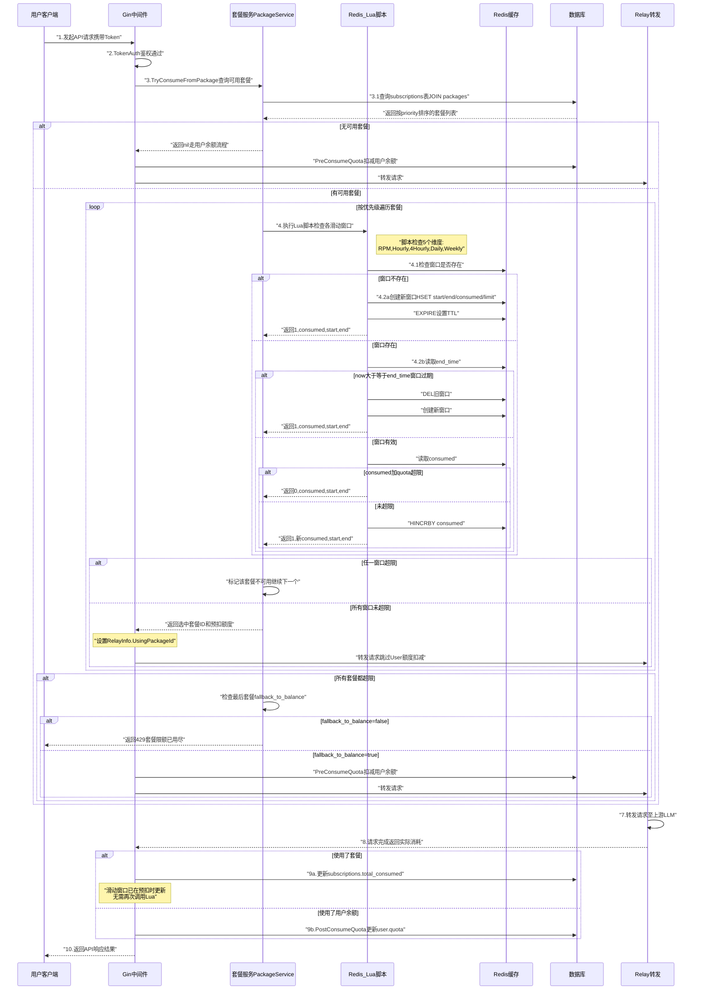
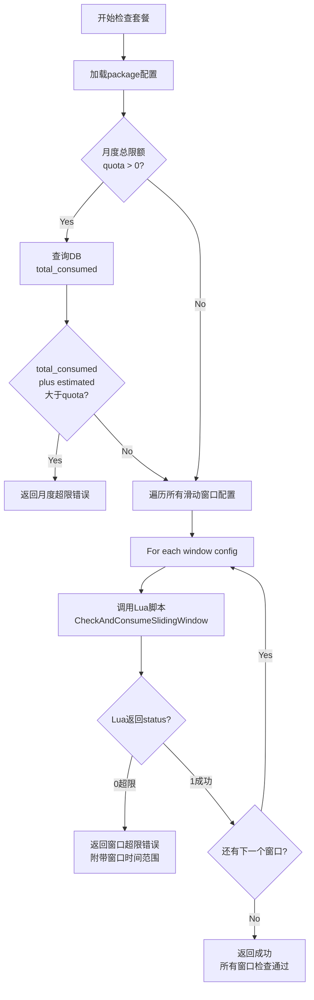
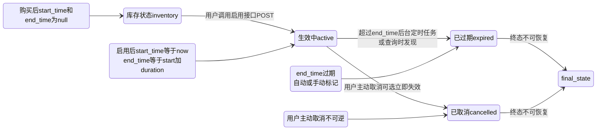
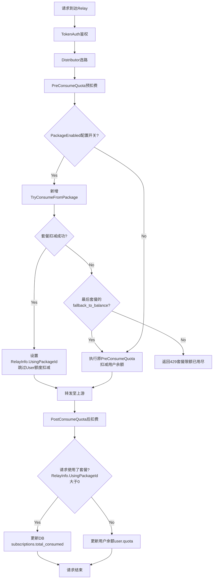
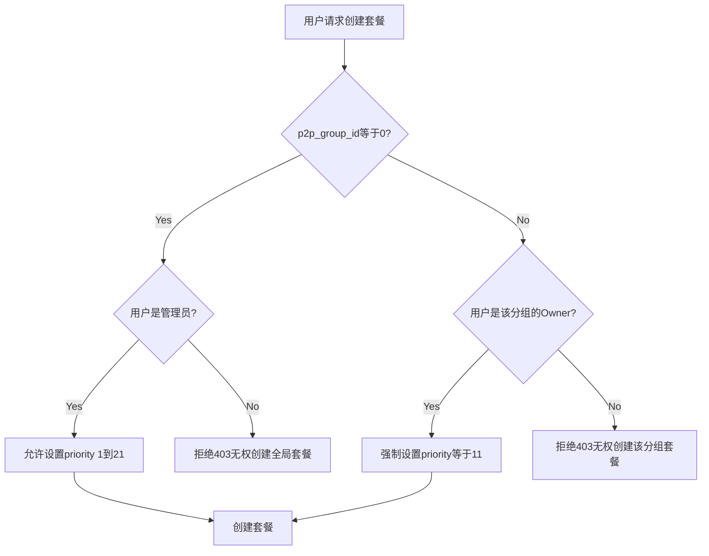
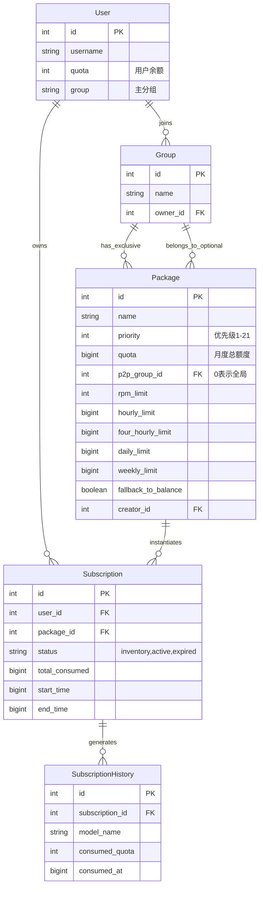
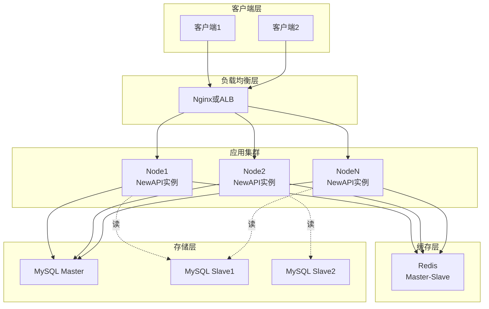

---
# New API 多种包月套餐支持 - 总体设计文档 (优化版)

| 文档属性 | 内容 |
| :--- | :--- |
| **作者** | Claude (基于架构分析) |
| **版本** | V2.1 |
| **最后更新** | 2025年12月12日 |
| **对应需求文档** | New API 支持多种包月套餐 |
| **状态** | 设计优化中 |
| **关键特性** | 滑动时间窗口（Sliding Window）按需开启机制 |

---

## 1. 业务背景与目标 (Context)

### 1.1 业务背景

当前 New API 的计费系统采用**纯按量付费（Pay-as-you-go）**的额度（Quota）体系，用户根据实际使用的 Token 数量精确消耗余额。这种模式虽然公平透明，但在以下场景存在局限性：

1. **高频用户成本优化难题**：对于日均消耗大量Token的企业用户和开发者，无法享受"批量采购"式的价格优惠，缺乏成本可预测性。
2. **用户心智负担重**：每次请求都需要关注余额，担心在关键任务中途因余额不足而中断服务。
3. **平台运营灵活性不足**：无法通过"限时优惠套餐"、"VIP会员包"等营销手段提升用户粘性和活跃度。
4. **P2P分组激励机制缺失**：P2P分组所有者希望为组员提供专属福利套餐，但现有架构不支持分组级别的套餐发布。
5. **资源浪费问题**：用户可能因预存大量余额而长期不使用，导致平台资金沉淀，无法通过"用尽作废"机制鼓励高频使用。

**引入套餐机制的核心价值**：通过在现有按量计费基础上**叠加**一个**滑动时间窗口限量预付费体系**，实现以下目标：
- **用户侧**：提供更具性价比的消费选择，降低心智负担，鼓励高频使用。
- **平台侧**：丰富计费模型，增强运营灵活性，提升资金周转效率。
- **生态侧**：赋能P2P分组所有者，激活社区运营活力。

### 1.2 核心业务目标

| 目标维度 | 具体目标 | 衡量指标 |
| :--- | :--- | :--- |
| **计费模型丰富化** | 在保留按量付费的基础上，增加包周/月/季/年四种预付费套餐类型 | 套餐类型覆盖率≥4种 |
| **用户粘性提升** | 通过时效性优惠套餐，鼓励用户持续活跃和高频使用 | 套餐用户DAU提升≥30% |
| **精细化资源管控** | 支持多维度（RPM、小时、4小时、日、周）的访问速率和额度限制，采用滑动窗口机制 | 限流维度≥5个 |
| **公平性保障** | 采用滑动窗口，保证用户获得完整的时间窗口时长 | 窗口利用率提升≥40% |
| **分层运营支持** | 允许系统管理员（全局套餐）和P2P分组所有者（分组套餐）发布不同优先级的套餐 | 优先级层级=21级 |
| **透明度保障** | 用户可实时查询套餐各滑动窗口的消耗情况和剩余额度 | 查询接口响应时间<100ms |
| **系统性能保证** | 套餐检查和扣减逻辑对请求转发性能影响<5ms | P99延迟增量<5ms |

### 1.3 关键应用场景

#### **C-1: 高频开发者完整时间窗口保障**
- **角色**：某AI应用开发者，不规律使用，但需要完整的时间窗口
- **痛点**：固定自然时间窗口不公平（15:58请求只能用2分钟）
- **解决方案**：购买"开发者月包"（每小时限额10M tokens），采用滑动窗口机制。用户在**15:58:30**首次请求时，窗口从**15:58:30**开始，持续到**16:58:29**，保证完整60分钟可用时长。如果用户在**18:30:00**再次请求，系统自动创建新窗口**18:30:00 ~ 19:29:59**。

#### **C-2: P2P分组周末加速包（按需激活）**
- **角色**：P2P分组"AI研究小组"的组长
- **场景**：发布"周末畅享包"（每日限额50M tokens，周六日有效）
- **滑动窗口优势**：
  - 用户周六**10:30:00**首次请求 → 日窗口：**10:30:00 ~ 周日10:29:59**
  - 用户周日**14:00:00**首次请求 → 日窗口：**14:00:00 ~ 周一13:59:59**（跨日）
  - 如果用户整个周末不使用，窗口不会被创建，节省Redis资源

#### **C-3: 多套餐优先级自动降级**
- **角色**：同时拥有"高级套餐"（优先级15，小时限额5M）和"基础套餐"（优先级5，小时限额20M）
- **场景**：用户在17:00:00启动任务，高频调用API
- **系统行为**：
  1. **17:00:00** ~ **17:15:00**：消耗"高级套餐"（5M用尽）→ 高级套餐小时窗口超限
  2. **17:15:01**：自动降级到"基础套餐"，创建新的小时窗口（**17:15:01 ~ 18:15:00**）
  3. 继续消耗"基础套餐"的额度

#### **C-4: 严格限额控制（无Fallback）**
- **场景**：企业为实习生分配"试用套餐"（`fallback_to_balance=false`，每日限额1M）
- **行为**：
  - 实习生在**10:00:00**首次请求 → 日窗口：**10:00:00 ~ 次日09:59:59**
  - 当日消耗达到1M后，系统返回`429 Too Many Requests`，**不会**切换到企业余额
  - 次日**10:00:00**后，实习生再次请求 → 创建新的日窗口，额度重置

---

## 2. 关键技术及解决途径

### 2.1 技术选型矩阵

| 技术维度 | 选型方案 | 核心理由 | 备选方案 |
| :--- | :--- | :--- | :--- |
| **时间窗口机制** | 滑动窗口（Sliding Window） + Redis Lua脚本 | 公平性（完整窗口）、按需开启、削峰填谷、无请求不创建Key | 固定自然窗口（不公平、整点高峰） |
| **窗口元数据存储** | Redis Hash（start_time, end_time, consumed, limit） | 单个Key存储完整窗口信息，查询高效 | 多个Key分散存储（查询慢） |
| **原子性保证** | Redis Lua脚本（检查-创建-扣减一体化） | 避免TOCTOU竞态，绝对原子性 | Go代码+Pipeline（可能微小超额） |
| **套餐信息缓存** | 三级缓存（内存+Redis+DB） | 借鉴现有User/Token缓存架构，平衡性能与一致性 | 纯DB查询（性能差） |
| **优先级机制** | 21级整型（1-21） | 兼容现有Channel Priority机制，易于理解和配置 | 字符串枚举（扩展性差） |
| **并发控制** | Redis Lua脚本原子操作 + DB乐观锁 | 无需应用层锁，性能最优 | 分布式锁（复杂度高） |

### 2.2 滑动窗口 vs 固定窗口对比

| 维度 | 固定自然时间窗口 | 滑动按需时间窗口（本方案） |
| :--- | :--- | :--- |
| **公平性** | ❌ 用户可能只使用部分窗口（15:58请求仅剩2分钟） | ✅ 保证完整窗口时长（15:58:30 ~ 16:58:29） |
| **灵活性** | ❌ 所有用户窗口对齐到自然时间点 | ✅ 按需开启，独立滑动 |
| **资源消耗** | ❌ 即使无请求也占用Redis Key | ✅ 无请求时不创建Key，节省内存 |
| **瞬时高峰** | ❌ 整点可能导致瞬时高峰 | ✅ 请求分散，削峰填谷 |
| **实现复杂度** | ✅ 简单（仅需INCRBY） | ⚠️ 需要Lua脚本，略复杂 |
| **窗口重置时间** | ✅ 可预测（整点） | ⚠️ 动态（首次请求时刻+时长） |

### 2.3 核心技术挑战与解决方案

#### **挑战 1：与现有计费系统无缝集成**
- **问题**：现有系统的`PreConsumeQuota`和`PostConsumeQuota`逻辑紧密耦合User/Token额度，如何在不破坏现有逻辑的前提下插入套餐检查？
- **解决方案**：
  1. 在`PreConsumeQuota`之前插入`TryConsumeFromPackage`（套餐额度预检和预留）。
  2. 在`PostConsumeQuota`中增加套餐消耗更新分支。
  3. 通过`RelayInfo.UsingPackageId`标记当前请求使用的套餐，确保上下文传递。

#### **挑战 2：滑动时间窗口的按需开启机制**
- **问题**：固定自然时间窗口存在不公平问题（用户在15:58首次请求，只能使用2分钟窗口）。如何实现按需开启、独立滑动的时间窗口机制？
- **解决方案**：采用**滑动窗口（Sliding Window）**设计，窗口从用户首次请求时刻开始计时，持续固定时长后自动过期：
  - **核心原则**：
    1. **按需开启**：只有当用户发起请求时，才创建时间窗口
    2. **独立滑动**：窗口从第一次请求开始计时（如 15:58:30 ~ 16:58:29）
    3. **自动过期**：窗口结束后自动失效，下次请求创建新窗口
    4. **无请求不开启**：如果用户长时间不使用，窗口不会被创建
  - **技术实现**：使用Redis Hash存储窗口元数据（start_time, end_time, consumed, limit），通过Lua脚本确保"检查窗口-创建窗口-扣减额度"的原子性
  - **优势**：公平性（完整窗口时长）、灵活性（独立滑动）、资源节省（无请求不创建）

#### **挑战 3：窗口过期与自动重置**
- **问题**：如何确保窗口过期后能自动清理，且下次请求时正确创建新窗口？
- **解决方案**：
  1. **Redis TTL自动清理**：为窗口Key设置TTL（如小时窗口70分钟），过期自动删除。
  2. **Lua脚本检测过期**：即使Key未被TTL清理，Lua脚本也会检查`end_time`，发现过期则删除旧窗口并创建新窗口。
  3. **双重保险**：确保窗口一定会被正确重置，避免"僵尸窗口"。

#### **挑战 4：多套餐并发扣费的原子性**
- **问题**：用户同时发起多个请求，可能导致同一套餐的时间窗口限额被超额扣减。
- **解决方案**：使用Redis Lua脚本封装"检查+创建/更新+扣减"为单个原子操作，彻底避免TOCTOU竞态。

#### **挑战 5：套餐优先级与P2P分组权限的协同**
- **问题**：如何确保用户只能使用自己有权访问的套餐，同时保证优先级逻辑正确？
- **解决方案**：
  1. **权限过滤**：在查询用户可用套餐时，同时检查：
     - 套餐的`p2p_group_id=0`（全局套餐）或用户是该P2P分组的活跃成员。
     - 套餐状态为`active`且在有效期内。
  2. **优先级排序**：将通过权限检查的套餐按`priority`降序排列，逐级尝试扣费。

---

## 3. 业务角色与边界 (Actors & Boundaries)

| 角色/系统 | 类型 | 职责描述 | 关键依赖/约束 | 权限边界 |
| :--- | :--- | :--- | :--- | :--- |
| **C端用户** | 人员 | 购买套餐、启用套餐、查询消耗、调用API | 依赖套餐可用范围、自身订阅状态、P2P分组成员身份 | 只能订阅全局套餐或自己所在P2P分组的套餐 |
| **系统管理员** | 人员 | 创建/编辑/删除全局套餐、设置系统级优先级（1-10, 12-21） | 需要Root权限 | 可设置所有21级优先级 |
| **P2P分组所有者** | 人员 | 为自己管理的分组创建专属套餐、设置分组级优先级（11） | 需要分组Owner权限 | 只能设置优先级11，只能为自己的分组创建套餐 |
| **New API 网关** | **本系统** | 执行套餐额度检查、扣减、限流，记录消耗历史 | Redis可用性、DB性能 | - |
| **Redis** | 基础设施 | 存储滑动窗口元数据、套餐信息缓存 | 必须启用（套餐功能强依赖） | - |
| **数据库** | 基础设施 | 持久化套餐模板、订阅记录、消耗历史 | - | - |

---

## 4. 总体业务流程全景图 (Overall Process)

### 4.1 完整计费流程（集成套餐体系与滑动窗口）



---

## 5. 详细子流程设计 (Detailed Flows)

### 5.1 套餐消耗与优先级逻辑（优化版）

#### 5.1.1 查询可用套餐

**函数**: `GetUserAvailablePackages(userId int, p2pGroupIds []int, currentTime int64) ([]*Subscription, error)`

**SQL逻辑**:
```sql
SELECT subscriptions.*, packages.*
FROM subscriptions
JOIN packages ON subscriptions.package_id = packages.id
WHERE subscriptions.user_id = ?
  AND subscriptions.status = 'active'
  AND subscriptions.start_time <= ?
  AND subscriptions.end_time > ?
  AND packages.status = 1
  AND (
    packages.p2p_group_id = 0
    OR packages.p2p_group_id IN (?)  -- 用户的P2P分组列表
  )
ORDER BY packages.priority DESC, subscriptions.id ASC;
```

#### 5.1.2 套餐额度检查与预扣（滑动窗口版）

**函数**: `CheckAndReservePackageQuota(subscription *Subscription, pkg *Package, estimatedQuota int) error`

**核心逻辑**：遍历所有时间维度，调用Lua脚本进行原子检查和扣减。



**代码实现**:
```go
func CheckAndReservePackageQuota(sub *Subscription, pkg *Package, estimatedQuota int) error {
    // 1. 检查月度总限额（DB字段）
    if pkg.Quota > 0 {
        if sub.TotalConsumed + int64(estimatedQuota) > pkg.Quota {
            return fmt.Errorf("monthly quota exceeded: %d/%d", sub.TotalConsumed, pkg.Quota)
        }
    }

    // 2. 检查所有滑动时间窗口（调用Lua脚本）
    if common.RedisEnabled {
        err := CheckAllSlidingWindows(sub, pkg, int64(estimatedQuota))
        if err != nil {
            return err
        }
    } else {
        // Redis不可用，记录警告，跳过滑动窗口检查
        common.SysLog(fmt.Sprintf("[WARN] Redis unavailable, sliding window check skipped for subscription %d", sub.Id))
    }

    return nil
}
```

#### 5.1.3 优先级遍历与降级逻辑

**函数**: `SelectAvailablePackage(packages []*Subscription, estimatedQuota int) (*Subscription, *Package, error)`

```go
func SelectAvailablePackage(packages []*Subscription, estimatedQuota int) (*Subscription, *Package, error) {
    var lastError error
    var lastPackage *Package

    // 已按priority降序排列
    for _, sub := range packages {
        pkg, _ := model.GetPackageById(sub.PackageId)

        // 尝试检查并预扣该套餐（调用滑动窗口Lua脚本）
        err := CheckAndReservePackageQuota(sub, pkg, estimatedQuota)

        if err == nil {
            // 成功，返回该套餐
            return sub, pkg, nil
        }

        // 失败，记录错误并继续下一个
        lastError = err
        lastPackage = pkg
    }

    // 所有套餐都不可用
    if lastPackage != nil && lastPackage.FallbackToBalance {
        // 允许降级到用户余额
        return nil, nil, nil  // 返回nil表示使用用户余额
    }

    // 不允许降级，返回错误
    return nil, nil, lastError
}
```

---

### 5.2 滑动时间窗口核心实现（Sliding Window）

#### 5.2.1 Redis数据结构设计

**Key命名规范**: `subscription:{subscription_id}:{period}:window`

**Value结构**: Redis Hash（包含窗口完整元数据）

| Hash字段 | 类型 | 说明 | 示例值 |
| :--- | :--- | :--- | :--- |
| `start_time` | INT64 | 窗口开始时间（Unix时间戳，秒） | 1702388310 (2025-12-12 15:58:30) |
| `end_time` | INT64 | 窗口结束时间（start_time + duration） | 1702391910 (2025-12-12 16:58:29) |
| `consumed` | INT64 | 窗口内已消耗额度或请求数 | 8500000 (quota单位) 或 45 (请求数) |
| `limit` | INT64 | 窗口限额（冗余存储，便于查询） | 20000000 (quota单位) 或 60 (RPM) |

**Redis命令示例**:
```redis
# 创建小时窗口
HSET subscription:123:hourly:window start_time 1702388310
HSET subscription:123:hourly:window end_time 1702391910
HSET subscription:123:hourly:window consumed 2500000
HSET subscription:123:hourly:window limit 20000000
EXPIRE subscription:123:hourly:window 4200  # 70分钟后自动删除

# 查询窗口状态
HGETALL subscription:123:hourly:window
```

**时间维度配置表**:

| 时间维度 | Redis Key | 窗口时长（秒） | TTL | Package字段 | 单位 |
| :--- | :--- | :--- | :--- | :--- | :--- |
| **RPM** | `subscription:123:rpm:window` | 60 | 90秒 | `rpm_limit` | 请求数 |
| **小时** | `subscription:123:hourly:window` | 3600 | 4200秒 (70分钟) | `hourly_limit` | quota |
| **4小时** | `subscription:123:4hourly:window` | 14400 | 18000秒 (5小时) | `four_hourly_limit` | quota |
| **每日** | `subscription:123:daily:window` | 86400 | 93600秒 (26小时) | `daily_limit` | quota |
| **每周** | `subscription:123:weekly:window` | 604800 | 691200秒 (8天) | `weekly_limit` | quota |

#### 5.2.2 Lua脚本原子操作（核心实现）

**脚本文件**: `service/check_and_consume_sliding_window.lua`

```lua
-- 滑动窗口检查并消耗原子操作
-- KEYS[1]: subscription:123:hourly:window
-- ARGV[1]: 当前时间戳 (now, 秒)
-- ARGV[2]: 窗口时长 (duration, 秒, 例如3600)
-- ARGV[3]: 限额 (limit, 例如20000000)
-- ARGV[4]: 预扣减额度 (quota, 例如2500000)
-- ARGV[5]: TTL (秒, 例如4200)

local key = KEYS[1]
local now = tonumber(ARGV[1])
local duration = tonumber(ARGV[2])
local limit = tonumber(ARGV[3])
local quota = tonumber(ARGV[4])
local ttl = tonumber(ARGV[5])

-- 步骤1: 检查窗口是否存在
local exists = redis.call('EXISTS', key)

if exists == 0 then
    -- 窗口不存在（首次请求或已过期被清理），创建新窗口
    redis.call('HSET', key, 'start_time', now)
    redis.call('HSET', key, 'end_time', now + duration)
    redis.call('HSET', key, 'consumed', quota)
    redis.call('HSET', key, 'limit', limit)
    redis.call('EXPIRE', key, ttl)

    -- 返回: {成功, 新消耗, 窗口开始, 窗口结束}
    return {1, quota, now, now + duration}
else
    -- 窗口存在，检查是否过期
    local end_time = tonumber(redis.call('HGET', key, 'end_time'))

    if now >= end_time then
        -- 窗口已过期（TTL未及时清理），删除旧窗口并创建新窗口
        redis.call('DEL', key)
        redis.call('HSET', key, 'start_time', now)
        redis.call('HSET', key, 'end_time', now + duration)
        redis.call('HSET', key, 'consumed', quota)
        redis.call('HSET', key, 'limit', limit)
        redis.call('EXPIRE', key, ttl)

        return {1, quota, now, now + duration}
    else
        -- 窗口有效，检查限额
        local consumed = tonumber(redis.call('HGET', key, 'consumed'))
        local start_time = tonumber(redis.call('HGET', key, 'start_time'))

        if consumed + quota > limit then
            -- 超限，返回失败（不扣减）
            return {0, consumed, start_time, end_time}
        else
            -- 未超限，扣减额度（原子递增）
            local new_consumed = redis.call('HINCRBY', key, 'consumed', quota)
            return {1, new_consumed, start_time, end_time}
        end
    end
end
```

#### 5.2.3 Go语言封装

**文件**: `service/package_sliding_window.go` (新增)

```go
package service

import (
    _ "embed"
    "context"
    "fmt"
    "time"
    "github.com/redis/go-redis/v9"
    "one-api/common"
    "one-api/model"
)

//go:embed check_and_consume_sliding_window.lua
var luaCheckAndConsumeWindow string

var scriptSHA string  // Lua脚本SHA值

// SlidingWindowConfig 滑动窗口配置
type SlidingWindowConfig struct {
    Period   string  // "rpm", "hourly", "4hourly", "daily", "weekly"
    Duration int64   // 窗口时长（秒）
    Limit    int64   // 限额
    TTL      int64   // Redis Key TTL（秒）
}

// WindowResult 窗口检查结果
type WindowResult struct {
    Success    bool    // 是否成功
    Consumed   int64   // 当前累计消耗
    StartTime  int64   // 窗口开始时间
    EndTime    int64   // 窗口结束时间
    TimeLeft   int64   // 窗口剩余时间（秒）
}

// GetSlidingWindowConfigs 获取套餐的所有滑动窗口配置
func GetSlidingWindowConfigs(pkg *model.Package) []SlidingWindowConfig {
    configs := make([]SlidingWindowConfig, 0)

    // RPM限制（单位：请求数）
    if pkg.RpmLimit > 0 {
        configs = append(configs, SlidingWindowConfig{
            Period:   "rpm",
            Duration: 60,
            Limit:    int64(pkg.RpmLimit),
            TTL:      90,
        })
    }

    // 小时限额（单位：quota）
    if pkg.HourlyLimit > 0 {
        configs = append(configs, SlidingWindowConfig{
            Period:   "hourly",
            Duration: 3600,
            Limit:    pkg.HourlyLimit,
            TTL:      4200,
        })
    }

    // 4小时限额
    if pkg.FourHourlyLimit > 0 {
        configs = append(configs, SlidingWindowConfig{
            Period:   "4hourly",
            Duration: 14400,
            Limit:    pkg.FourHourlyLimit,
            TTL:      18000,
        })
    }

    // 每日限额
    if pkg.DailyLimit > 0 {
        configs = append(configs, SlidingWindowConfig{
            Period:   "daily",
            Duration: 86400,
            Limit:    pkg.DailyLimit,
            TTL:      93600,
        })
    }

    // 每周限额
    if pkg.WeeklyLimit > 0 {
        configs = append(configs, SlidingWindowConfig{
            Period:   "weekly",
            Duration: 604800,
            Limit:    pkg.WeeklyLimit,
            TTL:      691200,
        })
    }

    return configs
}

// CheckAndConsumeSlidingWindow 检查并消耗单个滑动窗口（调用Lua脚本）
func CheckAndConsumeSlidingWindow(
    subscriptionId int,
    config SlidingWindowConfig,
    quota int64,  // 对RPM传1，对其他窗口传estimatedQuota
) (*WindowResult, error) {

    if !common.RedisEnabled {
        // Redis不可用，降级：允许通过（仅依赖月度总限额）
        return &WindowResult{Success: true}, nil
    }

    ctx := context.Background()
    rdb := common.RDB
    now := time.Now().Unix()

    // 构建Redis Key
    key := fmt.Sprintf("subscription:%d:%s:window", subscriptionId, config.Period)

    // 确保Lua脚本已加载
    if scriptSHA == "" {
        sha, err := rdb.ScriptLoad(ctx, luaCheckAndConsumeWindow).Result()
        if err != nil {
            common.SysError("failed to load Lua script: " + err.Error())
            // 降级：允许通过
            return &WindowResult{Success: true}, nil
        }
        scriptSHA = sha
    }

    // 执行Lua脚本
    result, err := rdb.EvalSha(ctx, scriptSHA, []string{key},
        now,             // ARGV[1]
        config.Duration, // ARGV[2]
        config.Limit,    // ARGV[3]
        quota,           // ARGV[4]
        config.TTL,      // ARGV[5]
    ).Result()

    if err != nil {
        // Lua执行失败，记录日志并降级
        common.SysError(fmt.Sprintf("Lua script failed for %s: %v", config.Period, err))
        return &WindowResult{Success: true}, nil
    }

    // 解析返回值
    resultArray := result.([]interface{})
    status := resultArray[0].(int64)
    consumed := resultArray[1].(int64)
    startTime := resultArray[2].(int64)
    endTime := resultArray[3].(int64)

    return &WindowResult{
        Success:   status == 1,
        Consumed:  consumed,
        StartTime: startTime,
        EndTime:   endTime,
        TimeLeft:  endTime - now,
    }, nil
}

// CheckAllSlidingWindows 检查所有时间窗口限额
func CheckAllSlidingWindows(
    subscription *model.Subscription,
    pkg *model.Package,
    estimatedQuota int64,
) error {

    configs := GetSlidingWindowConfigs(pkg)

    for _, config := range configs {
        // RPM特殊处理：每次请求increment=1（请求数）
        quota := estimatedQuota
        if config.Period == "rpm" {
            quota = 1
        }

        result, err := CheckAndConsumeSlidingWindow(
            subscription.Id,
            config,
            quota,
        )

        if err != nil {
            return fmt.Errorf("failed to check %s window: %v", config.Period, err)
        }

        if !result.Success {
            // 超限，返回详细错误信息
            return fmt.Errorf(
                "%s limit exceeded: consumed=%d, limit=%d, window=[%s ~ %s], time_left=%ds",
                config.Period,
                result.Consumed,
                config.Limit,
                time.Unix(result.StartTime, 0).Format("2006-01-02 15:04:05"),
                time.Unix(result.EndTime, 0).Format("2006-01-02 15:04:05"),
                result.TimeLeft,
            )
        }
    }

    return nil
}

// init 应用启动时预加载Lua脚本
func init() {
    common.RegisterStartupHook(func() error {
        if !common.RedisEnabled {
            return nil
        }

        ctx := context.Background()
        rdb := common.RDB

        sha, err := rdb.ScriptLoad(ctx, luaCheckAndConsumeWindow).Result()
        if err != nil {
            common.SysError("Failed to load package Lua script: " + err.Error())
            return err
        }

        scriptSHA = sha
        common.SysLog("Package sliding window Lua script loaded, SHA: " + sha)
        return nil
    })
}
```

#### 5.2.4 窗口状态查询

**函数**: `GetSlidingWindowStatus(subscriptionId int, period string) (*WindowStatus, error)`

```go
type WindowStatus struct {
    Period      string  `json:"period"`       // "hourly", "daily"...
    StartTime   int64   `json:"start_time"`   // 窗口开始时间
    EndTime     int64   `json:"end_time"`     // 窗口结束时间
    Consumed    int64   `json:"consumed"`     // 已消耗
    Limit       int64   `json:"limit"`        // 限额
    Remaining   int64   `json:"remaining"`    // 剩余
    TimeLeft    int64   `json:"time_left"`    // 剩余秒数
    IsActive    bool    `json:"is_active"`    // 窗口是否活跃
}

func GetSlidingWindowStatus(subscriptionId int, period string) (*WindowStatus, error) {
    if !common.RedisEnabled {
        return &WindowStatus{Period: period, IsActive: false}, nil
    }

    ctx := context.Background()
    rdb := common.RDB
    now := time.Now().Unix()

    key := fmt.Sprintf("subscription:%d:%s:window", subscriptionId, period)

    // 检查窗口是否存在
    exists, _ := rdb.Exists(ctx, key).Result()
    if exists == 0 {
        // 窗口不存在（未开启或已过期）
        return &WindowStatus{
            Period:   period,
            IsActive: false,
        }, nil
    }

    // 获取窗口信息
    values, err := rdb.HGetAll(ctx, key).Result()
    if err != nil {
        return nil, err
    }

    startTime, _ := strconv.ParseInt(values["start_time"], 10, 64)
    endTime, _ := strconv.ParseInt(values["end_time"], 10, 64)
    consumed, _ := strconv.ParseInt(values["consumed"], 10, 64)
    limit, _ := strconv.ParseInt(values["limit"], 10, 64)

    // 检查是否过期
    isActive := now < endTime

    return &WindowStatus{
        Period:    period,
        StartTime: startTime,
        EndTime:   endTime,
        Consumed:  consumed,
        Limit:     limit,
        Remaining: limit - consumed,
        TimeLeft:  endTime - now,
        IsActive:  isActive,
    }, nil
}

// GetAllSlidingWindowsStatus 批量查询所有窗口状态（Pipeline优化）
func GetAllSlidingWindowsStatus(subscriptionId int, pkg *model.Package) (map[string]*WindowStatus, error) {
    configs := GetSlidingWindowConfigs(pkg)
    statuses := make(map[string]*WindowStatus)

    if !common.RedisEnabled {
        for _, config := range configs {
            statuses[config.Period] = &WindowStatus{Period: config.Period, IsActive: false}
        }
        return statuses, nil
    }

    ctx := context.Background()
    rdb := common.RDB
    pipe := rdb.Pipeline()

    // 批量查询所有窗口
    cmds := make(map[string]*redis.MapStringStringCmd)
    for _, config := range configs {
        key := fmt.Sprintf("subscription:%d:%s:window", subscriptionId, config.Period)
        cmds[config.Period] = pipe.HGetAll(ctx, key)
    }

    _, err := pipe.Exec(ctx)
    if err != nil && err != redis.Nil {
        return nil, err
    }

    // 解析结果
    now := time.Now().Unix()
    for period, cmd := range cmds {
        values, _ := cmd.Result()
        if len(values) == 0 {
            statuses[period] = &WindowStatus{Period: period, IsActive: false}
            continue
        }

        startTime, _ := strconv.ParseInt(values["start_time"], 10, 64)
        endTime, _ := strconv.ParseInt(values["end_time"], 10, 64)
        consumed, _ := strconv.ParseInt(values["consumed"], 10, 64)
        limit, _ := strconv.ParseInt(values["limit"], 10, 64)

        statuses[period] = &WindowStatus{
            Period:    period,
            StartTime: startTime,
            EndTime:   endTime,
            Consumed:  consumed,
            Limit:     limit,
            Remaining: limit - consumed,
            TimeLeft:  endTime - now,
            IsActive:  now < endTime,
        }
    }

    return statuses, nil
}
```

---

### 5.3 套餐生命周期管理（状态机设计）

#### 5.3.1 套餐订阅状态机



#### 5.3.2 状态转换触发条件

| 转换路径 | 触发条件 | 执行动作 | 限制条件 |
| :--- | :--- | :--- | :--- |
| `inventory` → `active` | 用户调用启用接口 | 1. 设置`start_time = now` <br> 2. 计算`end_time = start_time + duration` <br> 3. 更新`status = 'active'` | - 用户必须是订阅所有者 <br> - 当前状态必须为`inventory` |
| `active` → `expired` | 当前时间超过`end_time` | 更新`status = 'expired'` | 由后台定时任务或查询时检测 |
| `active` → `cancelled` | 用户主动取消（可选功能） | 更新`status = 'cancelled'` | 可配置是否支持取消，取消后不退款 |

#### 5.3.3 后台定时任务：过期套餐标记

```go
// 任务: MarkExpiredSubscriptions
// 频率: 每小时执行一次
func MarkExpiredSubscriptions() {
    now := common.GetTimestamp()

    // 批量更新已过期但状态仍为active的订阅
    result := DB.Model(&Subscription{}).
        Where("status = ? AND end_time < ?", "active", now).
        Update("status", "expired")

    if result.RowsAffected > 0 {
        common.SysLog(fmt.Sprintf("marked %d expired subscriptions", result.RowsAffected))
    }
}
```

---

### 5.4 与现有计费系统集成（关键设计）

#### 5.4.1 集成点分析

NewAPI现有计费流程的关键函数（基于架构分析）：
1. **`PreConsumeQuota`** (`service/pre_consume_quota.go`): 预扣费，检查并扣减用户余额。
2. **`PostConsumeQuota`** (`service/quota.go`): 后扣费，根据实际消耗补差或退还。

**集成策略**: 在不修改核心计费逻辑的前提下，通过**前置检查**插入套餐逻辑。

#### 5.4.2 修改点与新增函数



#### 5.4.3 核心集成函数

**新增函数**: `TryConsumeFromPackage`

**文件**: `service/package_consume.go` (新增)

```go
// TryConsumeFromPackage 尝试从套餐中消耗额度
// 返回: (成功使用的套餐ID, 预扣减的额度, 错误信息)
func TryConsumeFromPackage(userId int, p2pGroupIds []int, estimatedQuota int) (int, int, error) {
    // 1. 查询用户可用套餐
    packages, err := GetUserAvailablePackages(userId, p2pGroupIds, common.GetTimestamp())
    if err != nil || len(packages) == 0 {
        return 0, 0, nil  // 无可用套餐，返回nil表示降级到用户余额
    }

    // 2. 按优先级遍历
    subscription, pkg, err := SelectAvailablePackage(packages, estimatedQuota)

    if subscription != nil {
        // 成功找到可用套餐
        return subscription.Id, estimatedQuota, nil
    }

    // 3. 所有套餐都超限，检查fallback配置
    if err != nil {
        if pkg != nil && pkg.FallbackToBalance {
            // 允许fallback
            return 0, 0, nil
        }
        // 不允许fallback，返回错误
        return 0, 0, err
    }

    return 0, 0, nil
}
```

**修改点1**: 修改`PreConsumeQuota`函数

**文件**: `service/pre_consume_quota.go`

```go
func PreConsumeQuota(c *gin.Context, preConsumedQuota int, relayInfo *relaycommon.RelayInfo) *types.NewAPIError {
    // ============ 新增：套餐检查 ============
    if common.PackageEnabled {  // 新增配置开关
        packageId, packageQuota, err := TryConsumeFromPackage(
            relayInfo.UserId,
            relayInfo.P2PGroupIDs,  // 用户的P2P分组列表
            preConsumedQuota,
        )

        if packageId > 0 {
            // 成功使用套餐，跳过User额度扣减
            relayInfo.UsingPackageId = packageId
            relayInfo.PreConsumedFromPackage = packageQuota
            return nil  // 直接返回，不执行后续逻辑
        }

        if err != nil {
            // 套餐超限且不允许fallback
            return types.OpenAIErrorWrapperLocal(err, "package_quota_exceeded", http.StatusTooManyRequests)
        }
    }
    // ========================================

    // 原有逻辑：检查用户余额
    userQuota, err := model.GetUserQuota(relayInfo.UserId, false)
    if userQuota <= 0 || userQuota-preConsumedQuota < 0 {
        return types.NewError("user quota exceeded", "insufficient_quota", http.StatusPaymentRequired)
    }

    // ... 原有的信任额度判断和扣减逻辑 ...
}
```

**修改点2**: 修改`PostConsumeQuota`函数

**文件**: `service/quota.go`

```go
func PostConsumeQuota(relayInfo *relaycommon.RelayInfo, quota int, preConsumedQuota int, sendEmail bool) (err error) {
    // ============ 新增：套餐实际消耗更新 ============
    if relayInfo.UsingPackageId > 0 {
        // 使用了套餐，仅更新DB的total_consumed
        // 注意：滑动窗口已在预扣时通过Lua脚本更新，无需再次调用

        // 异步更新DB的total_consumed
        gopool.Go(func() {
            model.IncrementSubscriptionConsumed(relayInfo.UsingPackageId, quota)
        })

        return nil  // 使用套餐时，不更新用户余额
    }
    // ================================================

    // 原有逻辑：更新用户余额
    if quota > 0 {
        err = model.DecreaseUserQuota(relayInfo.UserId, quota)
    } else {
        err = model.IncreaseUserQuota(relayInfo.UserId, -quota, false)
    }

    // ... 原有的Token额度更新和邮件通知逻辑 ...
}
```

---

### 5.5 套餐优先级实现（21级体系）

#### 5.5.1 优先级划分规则

| 优先级范围 | 可设置角色 | 用途 | 示例场景 |
| :--- | :--- | :--- | :--- |
| **1-10** | 系统管理员 | 系统级低优先级套餐 | 基础试用包、新手福利包 |
| **11** | P2P分组所有者 | P2P分组专属套餐（固定优先级） | 分组内部激励套餐 |
| **12-21** | 系统管理员 | 系统级高优先级套餐 | VIP套餐、企业套餐 |

**设计理由**:
1. **隔离系统与分组套餐**: 通过固定P2P套餐优先级为11，确保系统管理员可以在1-10和12-21范围内灵活配置，避免冲突。
2. **简化P2P管理**: P2P分组所有者无需考虑优先级设置，降低操作复杂度。
3. **兼容现有架构**: 21级与NewAPI现有的渠道优先级（Priority字段）机制一致。

#### 5.5.2 优先级校验逻辑

**场景1**: 管理员创建套餐
```go
func (controller *PackageController) CreatePackage(c *gin.Context) {
    var pkg model.Package
    c.ShouldBindJSON(&pkg)

    userId := c.GetInt("id")
    userRole := c.GetInt("role")

    if pkg.P2PGroupId == 0 {
        // 全局套餐，必须是管理员
        if userRole != common.RoleRootUser {
            c.JSON(403, gin.H{"error": "only admin can create global package"})
            return
        }
        // 管理员可设置1-21任意优先级
        if pkg.Priority < 1 || pkg.Priority > 21 {
            c.JSON(400, gin.H{"error": "priority must be between 1 and 21"})
            return
        }
    } else {
        // P2P分组套餐
        // 1. 验证用户是该分组的Owner
        group, _ := model.GetGroupById(pkg.P2PGroupId)
        if group.OwnerId != userId {
            c.JSON(403, gin.H{"error": "only group owner can create package for this group"})
            return
        }
        // 2. 强制设置优先级为11
        pkg.Priority = 11
    }

    pkg.CreatorId = userId
    model.CreatePackage(&pkg)
    c.JSON(200, pkg)
}
```

---

### 5.6 P2P分组套餐管理（权限与隔离）

#### 5.6.1 P2P套餐创建权限

**权限检查流程**:


#### 5.6.2 P2P套餐订阅权限

**订阅接口权限检查**:
```go
func (controller *SubscriptionController) Subscribe(c *gin.Context) {
    packageId := c.Param("package_id")
    userId := c.GetInt("id")

    pkg, _ := model.GetPackageById(packageId)

    if pkg.P2PGroupId > 0 {
        // P2P分组套餐，验证用户是否为该分组成员
        isMember, _ := model.IsUserInGroup(userId, pkg.P2PGroupId, 1)  // status=1表示active
        if !isMember {
            c.JSON(403, gin.H{"error": "you are not a member of this group"})
            return
        }
    }

    // 创建订阅记录
    subscription := &model.Subscription{
        UserId:       userId,
        PackageId:    pkg.Id,
        Status:       "inventory",
        SubscribedAt: common.GetTimestamp(),
    }
    model.CreateSubscription(subscription)

    c.JSON(200, subscription)
}
```

---

## 6. 核心领域对象与状态机 (Domain Objects)

### 6.1 关键实体说明

| 实体 | 说明 | 关键属性 | 生命周期 |
| :--- | :--- | :--- | :--- |
| **Package（套餐模板）** | 套餐的定义，由管理员或P2P组长创建 | `priority`（优先级）, `p2p_group_id`（分组归属）, `rpm_limit/hourly_limit`（各种限额） | 创建后可编辑，下架后不可订阅但已订阅的仍生效 |
| **Subscription（套餐订阅）** | 用户拥有的套餐实例 | `status`（状态）, `start_time/end_time`（生效时间）, `total_consumed`（累计消耗） | inventory → active → expired/cancelled |
| **SlidingWindow（滑动窗口）** | Redis中的Hash，记录单个时间维度的窗口状态 | `start_time`, `end_time`, `consumed`, `limit` | 按需创建，TTL自动过期 |

### 6.2 实体关系图



---

## 7. 关键业务规则 (Business Rules)

### 7.1 套餐额度计费公式

**场景1**: 使用套餐时的计费（与用户余额计费保持一致）

$$
\text{消耗的套餐额度} = (\text{InputTokens} + \text{OutputTokens} \times \text{CompletionRatio}) \times \text{ModelRatio} \times \text{GroupRatio}
$$

**说明**：套餐消耗应用GroupRatio，确保与用户余额计费逻辑完全一致，避免套餐与余额切换时产生价格差异。

**场景2**: Fallback到用户余额时的计费

$$
\text{用户余额扣减} = (\text{InputTokens} + \text{OutputTokens} \times \text{CompletionRatio}) \times \text{ModelRatio} \times \text{FinalGroupRatio}
$$

**说明**：此时应用`GetEffectiveGroupRatio(userGroup, billingGroup)`，包含分组倍率和反降级保护。

### 7.2 滑动窗口限额判断规则

**核心逻辑**: 任一时间窗口超限，则整个套餐不可用。

**判断顺序**（从快到慢，早失败优化）:
1. **月度总限额** → 最快失败（DB查询，缓存命中快）
2. **RPM** → 次快失败（分钟级，最细粒度）
3. **小时限额** → 中等速度
4. **4小时限额** → 较慢
5. **每日限额** → 更慢
6. **每周限额** → 最慢失败

### 7.3 滑动窗口时间范围规则

**关键原则**: 窗口从首次请求时刻开始，持续固定时长。

**示例**:
```
用户在 2025-12-12 15:58:30 首次请求：

RPM窗口:
├── start: 15:58:30
├── end:   15:59:29 (start + 60秒)
└── 下次窗口: 16:05:00 ~ 16:05:59 (下次请求时刻)

小时窗口:
├── start: 15:58:30
├── end:   16:58:29 (start + 3600秒)
└── 下次窗口: 17:30:00 ~ 18:29:59

每日窗口:
├── start: 2025-12-12 15:58:30
├── end:   2025-12-13 15:58:29 (start + 86400秒)
└── 可能跨越自然日边界，这是正常的
```

### 7.4 优先级冲突解决规则

**场景**: 用户同时拥有多个相同优先级的套餐

**解决策略**:
- 按`subscription.id ASC`排序，ID小的优先（先购买的先消耗）。
- SQL查询: `ORDER BY packages.priority DESC, subscriptions.id ASC`

### 7.5 套餐与分组路由的关系

**明确原则**:
- 套餐**仅影响额度管理**，不影响渠道选择逻辑。
- 套餐的P2P分组归属（`p2p_group_id`）决定**谁可以订阅**，而非路由逻辑。
- 路由逻辑依然基于`RelayInfo.BillingGroup`和`RelayInfo.RoutingGroups`，与套餐无关。

---

## 8. 数据一致性与并发策略 (Consistency & Concurrency)

### 8.1 Redis Lua脚本原子性保证

**核心机制**: Lua脚本在Redis中以原子方式执行，彻底避免TOCTOU竞态。

**Lua脚本的原子操作流程**:
```
单个Lua脚本执行（原子，不可中断）:
├── 1. EXISTS检查窗口是否存在
├── 2. 如果不存在 → HSET创建窗口
├── 3. 如果存在 → HGET检查end_time
├── 4. 如果过期 → DEL + HSET重新创建
├── 5. 如果有效 → HGET consumed + 检查限额
├── 6. 如果未超限 → HINCRBY扣减
└── 7. 返回结果

整个过程中，其他客户端的请求会被阻塞，确保数据一致性。
```

**并发场景示例**:
```
时间: T0
线程A: 检查hourly窗口，consumed=9000, limit=10000, 准备扣2500
线程B: 同时检查hourly窗口，consumed=9000, limit=10000, 准备扣2500

使用Lua脚本（原子执行）:
├── T1: 线程A的Lua脚本执行
│   ├── HGET consumed → 9000
│   ├── 9000 + 2500 <= 10000 → 通过
│   ├── HINCRBY consumed 2500 → 11500
│   └── 返回成功
├── T2: 线程B的Lua脚本执行（线程A执行完成后）
│   ├── HGET consumed → 11500
│   ├── 11500 + 2500 > 10000 → 超限
│   └── 返回失败（0）

结果: 线程A成功，线程B被拒绝，总消耗=11500（严格不超限）
```

### 8.2 数据库层面的一致性

**套餐总消耗更新**（使用GORM原子表达式）:
```go
// 原子递增total_consumed
DB.Model(&Subscription{}).Where("id = ?", subscriptionId).
    Update("total_consumed", gorm.Expr("total_consumed + ?", quota))
```

**套餐购买事务**:
```go
err := DB.Transaction(func(tx *gorm.DB) error {
    // 1. 扣减用户余额（如果需要付费购买）
    err := tx.Model(&User{}).Where("id = ?", userId).
        Update("quota", gorm.Expr("quota - ?", packagePrice)).Error
    if err != nil {
        return err
    }

    // 2. 创建订阅记录
    subscription := &Subscription{
        UserId:       userId,
        PackageId:    packageId,
        Status:       "inventory",
        SubscribedAt: common.GetTimestamp(),
    }
    return tx.Create(subscription).Error
})
```

### 8.3 缓存一致性策略

**套餐信息三级缓存**:
1. **L1 内存** → 进程内缓存（最快，TTL 1分钟）
2. **L2 Redis** → 共享缓存（快速，TTL 10分钟）
3. **L3 DB** → 持久化存储（权威数据源）

**Cache-Aside模式**:
```go
func GetSubscriptionById(id int, fromDB bool) (*Subscription, error) {
    if !fromDB && common.RedisEnabled {
        // 1. 尝试从Redis读取
        cached, err := cacheGetSubscription(id)
        if err == nil {
            return cached, nil
        }
    }

    // 2. 从DB读取
    var sub Subscription
    DB.First(&sub, id)

    // 3. 异步回填Redis
    if common.RedisEnabled {
        gopool.Go(func() {
            cacheSetSubscription(sub)
        })
    }

    return &sub, nil
}
```

---

## 9. 多节点部署与集群架构 (Multi-node Deployment)

### 9.1 无状态设计保证

**套餐服务的无状态特性**:
- 所有请求上下文（`RelayInfo.UsingPackageId`）在单次请求生命周期内传递，无跨请求状态。
- 滑动窗口状态存储在Redis，多节点共享，确保一致性。
- 套餐信息缓存使用Redis，避免节点间不一致。

### 9.2 集群部署架构



### 9.3 关键注意事项

1. **Redis高可用**: 套餐功能强依赖Redis，必须部署Master-Slave或Sentinel模式。
2. **Lua脚本预加载**: 应用启动时在所有节点加载Lua脚本到Redis，获取相同的SHA值。
3. **定时任务单点执行**: 过期套餐标记任务应只在一个节点（如Master节点）上执行，避免重复标记。
4. **缓存预热**: 应用启动时，预加载活跃套餐到Redis，减少冷启动查询压力。

---

## 10. 安全与防护设计 (Security & Protection)

### 10.1 套餐滥用防护

| 滥用场景 | 防护措施 | 实现方式 |
| :--- | :--- | :--- |
| **恶意订阅刷量** | 单用户订阅数限制 | 查询时检查`COUNT(*) WHERE user_id=? AND status='active'` < 限额 |
| **套餐转售** | 套餐与用户绑定，禁止转让 | 订阅记录的`user_id`不可修改 |
| **时间窗口绕过** | 服务端时间为准 | 所有时间计算基于服务器时间`time.Now()`，不信任客户端时间 |
| **并发竞态超额** | Redis Lua脚本原子检查 | Lua脚本封装检查+创建+扣减，绝对原子性 |
| **窗口泄漏** | Redis TTL自动清理 | 所有窗口Key设置TTL，过期自动删除 |

### 10.2 权限控制

**三级权限检查**:
1. **套餐创建**: 全局套餐需管理员权限，P2P套餐需分组Owner权限。
2. **套餐订阅**: 用户必须是P2P分组成员（对于分组套餐）。
3. **套餐查询**: 用户只能查询自己的订阅记录。

---

## 11. 监控与可观测性 (Monitoring & Observability)

### 11.1 关键监控指标

| 指标分类 | 指标名称 | 计算方式 | 告警阈值 |
| :--- | :--- | :--- | :--- |
| **套餐使用率** | `package_utilization_rate` | `SUM(total_consumed) / SUM(quota)` | > 80% 预警 |
| **时间窗口超限率** | `window_limit_exceeded_rate` | `超限请求数 / 总请求数` | > 5% 告警 |
| **Fallback触发率** | `fallback_to_balance_rate` | `Fallback次数 / 套餐请求总数` | > 20% 关注 |
| **套餐查询耗时** | `package_query_latency_p99` | Redis查询P99延迟 | > 50ms 告警 |
| **Redis可用性** | `redis_availability` | Redis连接成功率 | < 99.9% 告警 |
| **Lua脚本执行失败率** | `lua_script_failure_rate` | Lua执行失败次数 / 总调用次数 | > 0.1% 告警 |
| **滑动窗口平均时长利用率** | `window_duration_utilization` | 实际使用时长 / 窗口设计时长 | < 50% 关注（用户未充分利用） |

### 11.2 日志记录

**关键日志点**:
1. **窗口创建**: 记录窗口period、start_time、end_time
2. **窗口过期重建**: 记录旧窗口的消耗情况和新窗口的起始时间
3. **限额超限**: 记录超限的窗口类型、当前用量、限额值、窗口时间范围
4. **Fallback触发**: 记录触发原因、套餐ID、套餐优先级
5. **Redis降级**: 记录Redis不可用时的降级处理

**日志格式**:
```json
{
  "timestamp": 1702388310,
  "event": "sliding_window_created",
  "subscription_id": 456,
  "period": "hourly",
  "start_time": 1702388310,
  "end_time": 1702391910,
  "start_time_str": "2025-12-12 15:58:30",
  "end_time_str": "2025-12-12 16:58:29",
  "consumed": 2500000,
  "limit": 20000000
}
```

```json
{
  "timestamp": 1702390000,
  "event": "package_window_exceeded",
  "subscription_id": 456,
  "package_id": 789,
  "priority": 15,
  "period": "hourly",
  "consumed": 19500000,
  "limit": 20000000,
  "attempted": 2500000,
  "window": "15:58:30 ~ 16:58:29",
  "time_left": 3510
}
```

---

## 12. 数据库设计 (Database Schema) - 优化版

### 12.1 `packages` (套餐模板表)

```sql
CREATE TABLE `packages` (
    `id` INT AUTO_INCREMENT PRIMARY KEY,
    `name` VARCHAR(100) NOT NULL COMMENT '套餐名称',
    `description` TEXT COMMENT '套餐描述',
    `status` TINYINT DEFAULT 1 COMMENT '状态: 1=可用, 2=下架',

    -- 优先级与归属
    `priority` TINYINT NOT NULL COMMENT '优先级1-21, P2P固定11',
    `p2p_group_id` INT DEFAULT 0 COMMENT '归属P2P分组ID, 0=全局套餐',
    `creator_id` INT NOT NULL COMMENT '创建者ID, 0=系统',

    -- 套餐额度与时长
    `quota` BIGINT NOT NULL COMMENT '套餐总额度(quota单位)',
    `duration_type` VARCHAR(20) NOT NULL COMMENT 'week, month, quarter, year',
    `duration` INT DEFAULT 1 COMMENT '时长数量, 配合duration_type使用',

    -- 多维度限流（滑动窗口）
    `rpm_limit` INT DEFAULT 0 COMMENT '每分钟请求数限制, 0=不限制',
    `hourly_limit` BIGINT DEFAULT 0 COMMENT '每小时额度限制(quota单位), 0=不限制',
    `four_hourly_limit` BIGINT DEFAULT 0 COMMENT '每4小时额度限制, 0=不限制',
    `daily_limit` BIGINT DEFAULT 0 COMMENT '每日额度限制, 0=不限制',
    `weekly_limit` BIGINT DEFAULT 0 COMMENT '每周额度限制, 0=不限制',

    -- 配置选项
    `fallback_to_balance` BOOLEAN DEFAULT TRUE COMMENT '额度用尽后是否允许消耗用户余额',

    -- 时间戳
    `created_at` BIGINT NOT NULL,
    `updated_at` BIGINT NOT NULL,

    -- 索引
    INDEX `idx_p2p_group_status` (`p2p_group_id`, `status`),
    INDEX `idx_creator` (`creator_id`),
    INDEX `idx_priority` (`priority`)
) ENGINE=InnoDB DEFAULT CHARSET=utf8mb4 COMMENT='套餐模板表';
```

### 12.2 `subscriptions` (用户套餐订阅表)

```sql
CREATE TABLE `subscriptions` (
    `id` INT AUTO_INCREMENT PRIMARY KEY,
    `user_id` INT NOT NULL COMMENT '用户ID',
    `package_id` INT NOT NULL COMMENT '套餐模板ID',

    -- 状态与生命周期
    `status` VARCHAR(20) NOT NULL DEFAULT 'inventory' COMMENT 'inventory, active, expired, cancelled',
    `subscribed_at` BIGINT NOT NULL COMMENT '订阅时间(购买时间)',
    `start_time` BIGINT DEFAULT NULL COMMENT '生效开始时间, NULL表示未启用',
    `end_time` BIGINT DEFAULT NULL COMMENT '生效结束时间',

    -- 消耗追踪
    `total_consumed` BIGINT DEFAULT 0 COMMENT '累计消耗的总额度',

    -- 索引
    INDEX `idx_user_status` (`user_id`, `status`),
    INDEX `idx_package` (`package_id`),
    INDEX `idx_active_time` (`status`, `end_time`),  -- 用于定时任务查询过期套餐

    FOREIGN KEY (`user_id`) REFERENCES `users`(`id`) ON DELETE CASCADE,
    FOREIGN KEY (`package_id`) REFERENCES `packages`(`id`) ON DELETE RESTRICT
) ENGINE=InnoDB DEFAULT CHARSET=utf8mb4 COMMENT='用户套餐订阅表';
```

### 12.3 `subscription_history` (套餐消耗历史表 - 可选)

```sql
CREATE TABLE `subscription_history` (
    `id` BIGINT AUTO_INCREMENT PRIMARY KEY,
    `subscription_id` INT NOT NULL COMMENT '订阅ID',
    `model_name` VARCHAR(100) COMMENT '消耗的模型名称',
    `consumed_quota` INT NOT NULL COMMENT '本次消耗的额度',
    `consumed_at` BIGINT NOT NULL COMMENT '消耗时间',

    -- 索引
    INDEX `idx_subscription_time` (`subscription_id`, `consumed_at`),

    FOREIGN KEY (`subscription_id`) REFERENCES `subscriptions`(`id`) ON DELETE CASCADE
) ENGINE=InnoDB DEFAULT CHARSET=utf8mb4 COMMENT='套餐消耗历史表(可选)';
```

---

## 13. API接口设计 (API Endpoints) - 完整版

### 13.1 套餐管理接口 (管理员/P2P组长)

#### 13.1.1 创建套餐模板

**请求**:
```http
POST /api/packages
Authorization: Bearer <admin_token>
Content-Type: application/json

{
  "name": "开发者月包",
  "description": "包含500M tokens，滑动窗口时长保障",
  "priority": 15,
  "p2p_group_id": 0,
  "quota": 500000000,
  "duration_type": "month",
  "duration": 1,
  "rpm_limit": 60,
  "hourly_limit": 20000000,
  "four_hourly_limit": 60000000,
  "daily_limit": 150000000,
  "weekly_limit": 500000000,
  "fallback_to_balance": true
}
```

**响应**:
```json
{
  "id": 123,
  "name": "开发者月包",
  "priority": 15,
  "created_at": 1702382400,
  "status": 1
}
```

---

### 13.2 套餐订阅接口 (用户)

#### 13.2.1 订阅套餐

**请求**:
```http
POST /api/subscriptions/subscribe/123
Authorization: Bearer <user_token>
```

**响应**:
```json
{
  "subscription_id": 456,
  "package_id": 123,
  "status": "inventory",
  "subscribed_at": 1702382400,
  "message": "套餐已添加到库存，请调用启用接口激活"
}
```

#### 13.2.2 启用套餐

**请求**:
```http
POST /api/subscriptions/456/activate
Authorization: Bearer <user_token>
```

**响应**:
```json
{
  "subscription_id": 456,
  "status": "active",
  "start_time": 1702382400,
  "end_time": 1704974400,
  "message": "套餐已启用，有效期至2025-01-12，滑动窗口将在首次请求时开启"
}
```

---

### 13.3 套餐状态查询接口 (用户)

#### 13.3.1 查询单个套餐详细状态（含滑动窗口信息）

**请求**:
```http
GET /api/subscriptions/456/status
Authorization: Bearer <user_token>
```

**响应**:
```json
{
  "subscription_id": 456,
  "package_name": "开发者月包",
  "status": "active",
  "priority": 15,

  "total_quota": 500000000,
  "total_consumed": 120000000,
  "remaining_quota": 380000000,

  "start_time": 1702382400,
  "end_time": 1704974400,
  "days_remaining": 15,

  "sliding_windows": {
    "rpm": {
      "period": "rpm",
      "is_active": true,
      "start_time": 1702388310,
      "end_time": 1702388370,
      "start_time_str": "2025-12-12 15:58:30",
      "end_time_str": "2025-12-12 15:59:29",
      "consumed": 5,
      "limit": 60,
      "remaining": 55,
      "time_left": 45
    },
    "hourly": {
      "period": "hourly",
      "is_active": true,
      "start_time": 1702388310,
      "end_time": 1702391910,
      "start_time_str": "2025-12-12 15:58:30",
      "end_time_str": "2025-12-12 16:58:29",
      "consumed": 8500000,
      "limit": 20000000,
      "remaining": 11500000,
      "time_left": 3580
    },
    "4hourly": {
      "period": "4hourly",
      "is_active": false,
      "note": "窗口未开启（无请求或已过期）"
    },
    "daily": {
      "period": "daily",
      "is_active": true,
      "start_time": 1702350000,
      "end_time": 1702436400,
      "start_time_str": "2025-12-12 05:20:00",
      "end_time_str": "2025-12-13 05:19:59",
      "consumed": 50000000,
      "limit": 150000000,
      "remaining": 100000000,
      "time_left": 48090
    },
    "weekly": {
      "is_active": false,
      "note": "窗口未开启"
    }
  }
}
```

**实现逻辑**:
```go
func GetSubscriptionStatus(subscriptionId int) (*SubscriptionStatus, error) {
    // 1. 从DB加载subscription和package
    sub, _ := model.GetSubscriptionById(subscriptionId, false)
    pkg, _ := model.GetPackageById(sub.PackageId)

    status := &SubscriptionStatus{
        SubscriptionId: sub.Id,
        PackageName:    pkg.Name,
        Status:         sub.Status,
        Priority:       pkg.Priority,
        TotalQuota:     pkg.Quota,
        TotalConsumed:  sub.TotalConsumed,
        RemainingQuota: pkg.Quota - sub.TotalConsumed,
        StartTime:      sub.StartTime,
        EndTime:        sub.EndTime,
        DaysRemaining:  int((sub.EndTime - common.GetTimestamp()) / 86400),
    }

    // 2. 批量查询所有滑动窗口状态（Pipeline优化）
    status.SlidingWindows, _ = GetAllSlidingWindowsStatus(sub.Id, pkg)

    return status, nil
}
```

---

## 14. 实施计划 (Implementation Plan) - 详细任务拆解

### 14.1 Phase 1: 数据库与模型层 (周期: 3天)

| 任务ID | 任务描述 | 文件路径 | 验收标准 |
| :--- | :--- | :--- | :--- |
| P1-1 | 创建`packages`表迁移 | `model/package.go` | 执行`AutoMigrate`成功，表结构符合设计 |
| P1-2 | 创建`subscriptions`表迁移 | `model/subscription.go` | 表结构包含所有字段，索引生效 |
| P1-3 | 定义`Package`和`Subscription`模型 | `model/package.go`, `model/subscription.go` | GORM Tag正确，支持JSON序列化 |
| P1-4 | 实现Package的CRUD函数 | `model/package.go` | `CreatePackage`, `UpdatePackage`, `GetPackageById`, `DeletePackage` |
| P1-5 | 实现Subscription的CRUD函数 | `model/subscription.go` | `CreateSubscription`, `UpdateSubscriptionStatus`, `GetUserSubscriptions` |

### 14.2 Phase 2: 滑动窗口Lua脚本与Go封装 (周期: 5天) - 核心阶段

| 任务ID | 任务描述 | 文件路径 | 验收标准 |
| :--- | :--- | :--- | :--- |
| P2-1 | 编写Lua脚本 | `service/check_and_consume_sliding_window.lua` | Lua逻辑正确，覆盖创建、过期、扣减三种场景 |
| P2-2 | 实现滑动窗口配置函数 | `service/package_sliding_window.go` | `GetSlidingWindowConfigs`返回正确配置 |
| P2-3 | 实现Lua脚本调用封装 | `service/package_sliding_window.go` | `CheckAndConsumeSlidingWindow`正确解析Lua返回值 |
| P2-4 | 实现Lua脚本预加载 | `service/package_sliding_window.go` | 应用启动时成功加载脚本到Redis |
| P2-5 | 实现窗口状态查询函数 | `service/package_sliding_window.go` | `GetAllSlidingWindowsStatus`支持Pipeline批量查询 |
| P2-6 | 单元测试：Lua脚本边界条件 | `service/package_sliding_window_test.go` | 覆盖首次创建、窗口内扣减、窗口过期、超限拒绝四种场景 |

### 14.3 Phase 3: 套餐查询与优先级逻辑 (周期: 3天)

| 任务ID | 任务描述 | 文件路径 | 验收标准 |
| :--- | :--- | :--- | :--- |
| P3-1 | 实现用户可用套餐查询 | `model/subscription.go` | `GetUserAvailablePackages`支持P2P分组过滤和优先级排序 |
| P3-2 | 实现套餐选择逻辑 | `service/package_selector.go` | `SelectAvailablePackage`逐级尝试，调用滑动窗口检查 |
| P3-3 | 实现Fallback逻辑 | `service/package_selector.go` | 根据`fallback_to_balance`决策 |
| P3-4 | 集成测试：多套餐优先级 | `test/package_priority_test.go` | 验证优先级降级逻辑正确 |

### 14.4 Phase 4: 计费系统集成 (周期: 5天) - 关键阶段

| 任务ID | 任务描述 | 文件路径 | 验收标准 |
| :--- | :--- | :--- | :--- |
| P4-1 | 扩展`RelayInfo`结构体 | `relay/common/relay_info.go` | 增加`UsingPackageId`, `PreConsumedFromPackage`字段 |
| P4-2 | 实现`TryConsumeFromPackage`函数 | `service/package_consume.go` | 完整的套餐查询、检查、扣减流程 |
| P4-3 | 修改`PreConsumeQuota`插入套餐检查 | `service/pre_consume_quota.go` | 套餐优先，余额兜底，逻辑清晰 |
| P4-4 | 修改`PostConsumeQuota`更新套餐消耗 | `service/quota.go` | 更新DB的total_consumed |
| P4-5 | 集成测试：完整请求流程 | `test/package_integration_test.go` | 模拟请求，验证套餐扣减、窗口创建、过期重建 |

### 14.5 Phase 5: 管理接口开发 (周期: 4天)

| 任务ID | 任务描述 | 文件路径 | 验收标准 |
| :--- | :--- | :--- | :--- |
| P5-1 | 实现套餐管理Controller | `controller/package.go` | `CreatePackage`, `UpdatePackage`, `GetPackages`, `DeletePackage` |
| P5-2 | 实现套餐订阅Controller | `controller/subscription.go` | `Subscribe`, `GetMySubscriptions`, `Activate` |
| P5-3 | 实现套餐状态查询Controller | `controller/subscription.go` | `GetSubscriptionStatus`返回滑动窗口详细状态 |
| P5-4 | 权限检查中间件 | `middleware/package_auth.go` | 验证管理员、P2P Owner权限 |
| P5-5 | 路由注册 | `router/api-router.go` | 所有接口可通过Postman测试 |

### 14.6 Phase 6: 套餐生命周期管理 (周期: 2天)

| 任务ID | 任务描述 | 文件路径 | 验收标准 |
| :--- | :--- | :--- | :--- |
| P6-1 | 实现套餐启用逻辑 | `service/package_lifecycle.go` | 状态转换`inventory -> active`，计算end_time |
| P6-2 | 实现过期套餐标记定时任务 | `service/package_lifecycle.go` | `MarkExpiredSubscriptions`每小时执行 |
| P6-3 | 实现套餐取消逻辑（可选） | `service/package_lifecycle.go` | 状态转换`active -> cancelled` |

### 14.7 Phase 7: 前端界面开发 (周期: 5天)

| 任务ID | 任务描述 | 文件路径 | 验收标准 |
| :--- | :--- | :--- | :--- |
| P7-1 | 管理后台：套餐管理页面 | `web/src/pages/Package/` | 创建、编辑、删除套餐 |
| P7-2 | 用户界面：套餐市场页面 | `web/src/pages/Subscription/Market.js` | 展示可订阅的套餐 |
| P7-3 | 用户界面：我的套餐页面 | `web/src/pages/Subscription/MyPackages.js` | 展示已订阅套餐，支持启用 |
| P7-4 | 用户界面：套餐详情页面 | `web/src/pages/Subscription/Detail.js` | 实时展示各滑动窗口状态，可视化窗口时间范围 |

### 14.8 Phase 8: 测试与优化 (周期: 6天)

| 任务ID | 任务描述 | 文件路径 | 验收标准 |
| :--- | :--- | :--- | :--- |
| P8-1 | 单元测试：Lua脚本逻辑 | `service/package_sliding_window_test.go` | 覆盖率>90%，所有边界条件通过 |
| P8-2 | 集成测试：滑动窗口流程 | `test/package_sliding_window_integration_test.go` | 验证创建、扣减、过期、重建 |
| P8-3 | 性能测试：并发扣减 | `test/package_performance_test.go` | 1000 QPS下无竞态，Lua执行延迟<2ms |
| P8-4 | Redis故障演练 | `test/package_redis_failover_test.go` | Redis不可用时正确降级到仅月度限额 |
| P8-5 | 窗口泄漏检测脚本 | `bin/check_window_leak.sh` | 检测已过期但未删除的窗口Key |
| P8-6 | 监控指标接入 | `controller/monitor.go` | Prometheus指标暴露 |

### 14.9 Phase 9: 文档与运维 (周期: 2天)

| 任务ID | 任务描述 | 文件路径 | 验收标准 |
| :--- | :--- | :--- | :--- |
| P9-1 | 运维文档：滑动窗口Redis Key管理 | `docs/ops/package_sliding_window_ops.md` | 包含查询、重置、泄漏检测命令 |
| P9-2 | 运维文档：套餐监控指标说明 | `docs/ops/package_monitoring.md` | 文档完整 |
| P9-3 | 用户文档：套餐使用指南 | `docs/user/package_guide.md` | 说明滑动窗口机制 |

**总周期**: 约35天（含测试与缓冲）

---

## 15. 运维支持 (Operations Support)

### 15.1 Redis Key监控命令

**查看某个订阅的所有滑动窗口**:
```bash
redis-cli --scan --pattern "subscription:123:*:window"
```

**查看窗口详情**:
```bash
redis-cli HGETALL subscription:123:hourly:window
```

**预期输出**:
```
1) "start_time"
2) "1702388310"
3) "end_time"
4) "1702391910"
5) "consumed"
6) "8500000"
7) "limit"
8) "20000000"
```

### 15.2 手动重置窗口

**场景**：用户反馈窗口限额异常，需要手动重置。

**操作命令**:
```bash
# 删除特定窗口（下次请求时会重新创建）
redis-cli DEL subscription:123:hourly:window

# 删除所有窗口
redis-cli --scan --pattern "subscription:123:*:window" | xargs redis-cli DEL
```

### 15.3 窗口泄漏检测脚本

**文件**: `bin/check_window_leak.sh`

```bash
#!/bin/bash
# 检测已过期但未删除的窗口Key

now=$(date +%s)
leaked_count=0

for key in $(redis-cli --scan --pattern "subscription:*:window"); do
    end_time=$(redis-cli HGET $key end_time)

    if [ -n "$end_time" ] && [ $end_time -lt $now ]; then
        echo "[LEAKED] $key (expired at $(date -d @$end_time '+%Y-%m-%d %H:%M:%S'))"
        leaked_count=$((leaked_count + 1))

        # 可选：自动删除
        # redis-cli DEL $key
    fi
done

echo "Total leaked windows: $leaked_count"
```

---

## 16. 待定问题与后续优化 (Open Issues & Future Improvements)

### 16.1 当前设计的待定问题

| 问题ID | 问题描述 | 影响范围 | 建议解决方案 | 优先级 |
| :--- | :--- | :--- | :--- | :--- |
| Q1 | 套餐与现有分组倍率的关系 | 套餐消耗是否应用GroupRatio？ | **决策**：套餐消耗**应用**GroupRatio，确保计费一致性 | 高 |
| Q2 | 多套餐`fallback_to_balance`的逻辑 | 所有套餐超限时的行为 | **明确**：检查最后一个遍历的套餐的fallback配置 | 高 |
| Q3 | 滑动窗口跨自然边界的用户理解 | 每日窗口可能从15:58:30到次日15:58:29 | **文档说明**：在用户指南中明确解释滑动窗口概念 | 中 |
| Q4 | Lua脚本加载失败的降级策略 | Redis支持Lua但脚本加载失败 | **降级**：允许请求通过，仅依赖月度总限额 | 中 |
| Q5 | 套餐消耗历史表的写入性能 | 高QPS下可能成为瓶颈 | **可选实现**：采用异步消息队列（Kafka/RabbitMQ） | 低 |
| Q6 | Redis TTL与Lua end_time检查的优先级 | 可能出现TTL已过期但Lua仍检测到的情况 | **双重检查**：Lua脚本中也检查过期，确保正确性 | 低 |

### 16.2 后续优化方向

1. **套餐推荐算法**: 根据用户历史消耗量和使用模式，智能推荐最适合的套餐类型和时长。
2. **套餐自动续费**: 支持套餐到期前自动续订（需集成支付系统）。
3. **窗口预测告警**: 基于滑动窗口的消耗速率，预测何时会超限，提前通知用户。
4. **套餐组合优化**: 允许用户同时购买多个不同时间维度的套餐（如"小时包+日包+周包"），系统自动选择最优组合。
5. **分层定价**: 套餐价格根据用户VIP等级和历史消耗浮动。

---

## 17. 附录：参考资料与依赖文档

| 文档标题 | 文件路径 | 关键引用点 |
| :--- | :--- | :--- |
| NewAPI总体设计文档 | `docs/NewAPI-总体设计.md` | 计费流程、分组机制、路由逻辑 |
| P2P分组改动详细设计 | `docs/07-NEW-API-分组改动详细设计.md` | P2P分组权限、RoutingGroups构建 |
| 渠道粘性和限量方案 | `docs/01-NewAPI数据面转发渠道粘性和限量问题解决方案.md` | 时间窗口限流的Redis实现参考 |
| 渠道监控统计设计 | `docs/01-P2P共享分组与用户创建渠道的状态信息监控统计与展示.md` | 监控指标定义、Redis Key设计 |

---

## 18. 修订历史 (Revision History)

| 版本 | 日期 | 修改人 | 主要变更 |
| :--- | :--- | :--- | :--- |
| V1.0 | 2025-12-11 | Gemini | 初版，基础设计 |
| V2.0 | 2025-12-12 | Claude | 全面优化，增加详细的集成方案、固定时间窗口实现、并发控制、监控设计 |
| V2.1 | 2025-12-12 | Claude | **关键变更**：从固定自然时间窗口改为滑动按需时间窗口，增加Lua脚本原子操作设计 |

---

**文档结束**
