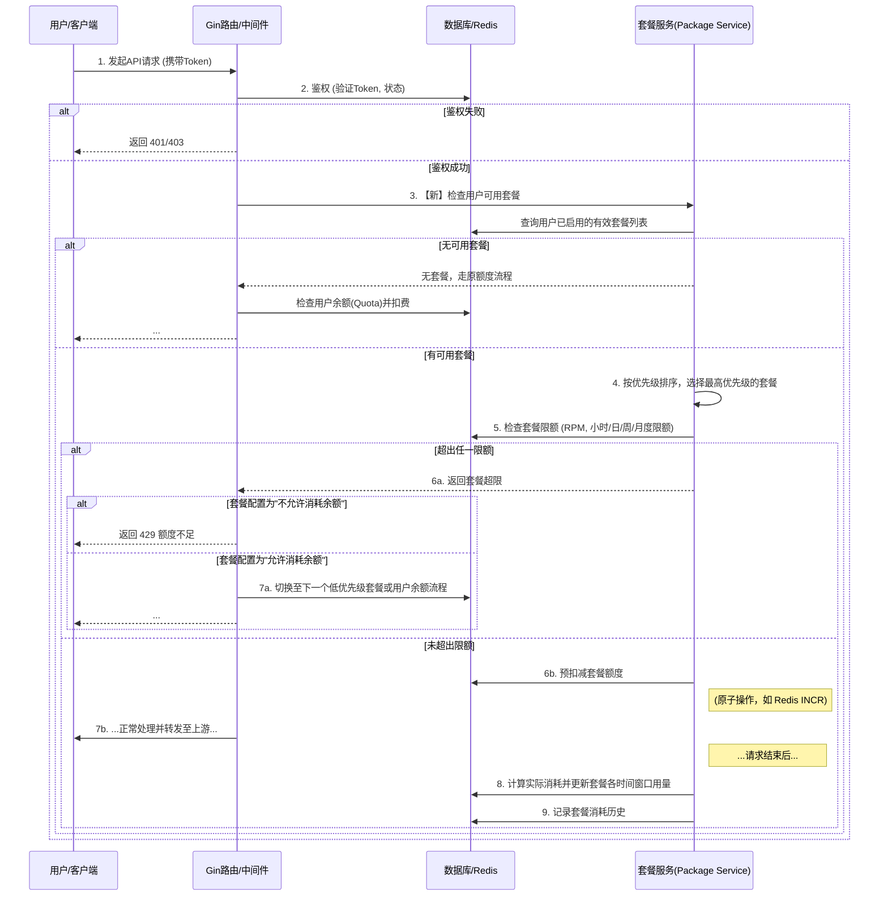

---
# New API 多种包月套餐支持 - 总体设计文档

| 文档属性 | 内容 |
| :--- | :--- |
| **作者** | [Gemini] |
| **版本** | V1.0 |
| **最后更新** | 2025年12月11日 |
| **对应需求文档** | New API 支持多种包月套餐 |

---

## 1. 业务背景与目标 (Context)

### 1.1 业务背景
当前 New API 的计费系统主要基于按量付费的额度（Quota）体系，用户根据实际使用的 Token 数量进行消耗。为了满足不同消费模式用户的需求，特别是对于使用频率高、消耗量大的用户，平台计划引入一种更具性价比的预付费套餐机制。这种机制允许用户在特定时间窗口内以优惠价格获得大量额度，但额度会定期重置或作废，旨在鼓励用户在套餐周期内充分使用服务。

### 1.2 核心业务目标
*   **丰富计费模型**: 在现有按量计费基础上，增加包周/月/季度/年等多种预付费套餐选项，为用户提供更灵活、更多样化的消费选择。
*   **提升用户粘性**: 通过提供有时效性的优惠套餐，鼓励用户在平台内保持持续活跃和高频使用。
*   **精细化资源管理**: 套餐可设置多维度、多时间窗口的访问速率（RPM）和使用额度限制（如每小时、每日、每月限额），实现对资源的精细化管控。
*   **支持分层运营**: 允许系统管理员和P2P分组所有者发布不同范围（全局/分组内）和不同优先级的套餐，满足差异化运营需求。
*   **提供透明度**: 用户可以清晰地查询到套餐的消耗历史、各时间窗口的剩余额度，并理解消费优先级规则。

### 1.3 关键应用场景
*   **C-1: 高频使用者优惠**: 某开发者每日需要进行大量API调用用于测试和调试。他可以购买一个包月套餐，在月度总限额内，享受每小时/每日的调用额度，相比按量付费成本更低。若当天额度未使用完，则自动作废。
*   **C-2: P2P分组专属福利**: 一个P2P分组的组长为了激励组员，发布了一个仅限该组使用的“周末畅享包”，提供周末两天内的高额度。只有该组的成员才能订阅和使用此套餐。
*   **C-3: 多套餐叠加使用**: 用户同时拥有一个由系统管理员发布的“基础套餐”和一个由P2P分组发布的“高级套餐”。当他调用API时，系统会根据套餐优先级（例如，高级套餐优先），首先消耗“高级套餐”的额度，待其用尽后再消耗“基础套餐”。
*   **C-4: 灵活的额度消耗策略**: 用户购买了一个套餐，当套餐额度（例如，当日限额）用尽后，系统会根据套餐的配置决定是直接拒绝请求（提示额度不足），还是自动切换到消耗用户的常规余额（Quota）。

---

## 2. 关键技术及解决途径

*   **数据库扩展 (DB Extension)**: 需要新增表来存储“套餐模板”（Packages）和用户的“套餐订阅实例”（Subscriptions）。
*   **鉴权与计费逻辑改造 (Auth & Billing Logic Enhancement)**: 修改现有的请求鉴权和计费流程，在扣减用户`Quota`之前，优先检查并扣减有效的套餐额度。
*   **优先级与多套餐管理 (Priority & Multi-Package Management)**: 引入优先级字段，在用户拥有多个套餐时，确保高优先级的套餐被优先消耗。
*   **时间窗口限流 (Time-window Rate Limiting)**: 利用 Redis 的原子计数和过期时间特性，高效地实现套餐的 RPM、每小时、每4小时、每日、每周等多维度限流。
*   **套餐生命周期管理 (Lifecycle Management)**: 引入套餐状态（库存 -> 启用 -> 过期），并提供启用接口，确保套餐从用户指定的时刻开始生效。
*   **API扩展 (API Extension)**: 新增用于创建、订阅、查询套餐及消耗历史的API端点。

## 3. 业务角色与边界 (Actors & Boundaries)

| 角色/系统 | 类型 | 职责描述 | 关键依赖/约束 |
| :--- | :--- | :--- | :--- |
| **C端用户** | 人员 | 购买、启用、查询自己的套餐；在API调用时消耗套餐额度。 | 依赖套餐的可用范围和自身的订阅状态。 |
| **系统管理员** | 人员 | 创建、配置全局套餐；设置系统级套餐的优先级。 | 需要最高权限，可设置最高/最低优先级。 |
| **P2P分组所有者** | 人员 | 为自己管理的分组创建专属套餐。 | 只能在限定的优先级范围内创建套餐。 |
| **New API 网关** | **本系统** | 在请求处理时，执行套餐额度的检查、扣减和限流逻辑。 | 需要低延迟地访问套餐数据和消耗记录。 |
| **数据库/Redis** | 基础设施 | 存储套餐模板、订阅记录；缓存各时间窗口的消耗数据。 | Redis用于高性能的实时计数。 |

---

## 4. 总体业务流程全景图 (Overall Process)

### 4.1 核心计费流程（集成套餐体系）



---

## 5. 详细子流程设计 (Detailed Flows)

### 5.1 套餐消耗与优先级逻辑

1.  **查询可用套餐**: 当一个请求到达时，系统首先查询该用户所有**已启用且在有效期内**的套餐订阅记录。
2.  **过滤与排序**:
    *   如果请求指定了P2P分组，则过滤出全局套餐和该P2P分组的专属套餐。
    *   将筛选出的套餐按`priority`字段**降序**排列。
3.  **逐级消耗**:
    *   从优先级最高的套餐开始尝试扣费。
    *   检查该套餐的所有时间窗口限制（RPM、小时、4小时、日、周、月）。
    *   **任一限制超限**，则此套餐不可用，尝试下一个较低优先级的套餐。
    *   如果找到一个所有限制都未超出的套餐，则消耗该套餐的额度。
4.  **余额 fallback**: 如果遍历完所有可用套餐都因超限而无法使用，系统将检查最后一个超限套餐的`fallback_to_balance`开关。
    *   若为`true`，则流程继续，尝试扣减用户的常规余额（`users.quota`）。
    *   若为`false`，则请求被拒绝，返回额度不足的错误。

### 5.2 时间窗口限流实现

*   **技术选型**: 使用 **Redis** 实现高性能的限流计数。
*   **Key设计**: 采用 `套餐订阅ID:时间窗口类型:时间戳` 的格式。
    *   `subscription_id:rpm:20251211150401`
    *   `subscription_id:hourly:2025121115`
    *   `subscription_id:4hourly:2025121112` (每4小时一个桶，取整)
    *   `subscription_id:daily:20251211`
    *   `subscription_id:weekly:2025W50`
    *   `subscription_id:monthly:202512`
*   **原子操作**: 使用 `INCR` 或 `INCRBY` 命令来原子性地增加消耗量。
*   **自动过期**: 为每个Key设置一个略长于其时间窗口的TTL（例如，小时Key设置65分钟过期），以自动清理历史数据。

### 5.3 套餐生命周期管理

1.  **创建 (`packages` 表)**: 管理员或P2P组长定义套餐模板，包括名称、额度、各种限流、价格、时长（周/月/季/年）、优先级等。此时套餐对用户不可见。
2.  **订阅 (`subscriptions` 表)**: 用户购买或被赠予一个套餐，此时会在`subscriptions`表中创建一条记录，状态为 `inventory` (库存)。`start_time`和`end_time`为空。
3.  **启用**: 用户在需要时，调用“启用套餐”接口。
    *   系统将该订阅记录的状态更新为 `active`。
    *   `start_time` 设置为当前时间。
    *   `end_time` 设置为 `start_time + 套餐时长`。
4.  **过期**: 任何查询或计费逻辑在处理套餐时，都必须检查 `end_time` 是否已超过当前时间。对于已过期的套餐，系统可以将其状态更新为`expired`。

---

## 6. 数据库设计 (Database Schema)

### 6.1 `packages` (套餐模板表)

存储可供订阅的套餐的定义。

| 字段名 | 类型 | 描述 |
| :--- | :--- | :--- |
| `id` | INT, PK, AI | 套餐模板ID |
| `name` | VARCHAR(100) | 套餐名称，如“月度畅享包” |
| `description` | TEXT | 套餐描述 |
| `status` | INT | 状态 (1: 可用, 2: 下架) |
| `priority` | INT | 优先级 (1-21)，数字越大优先级越高 |
| `quota` | BIGINT | 套餐包含的总额度 |
| `duration_type` | VARCHAR(20) | 时长类型: `week`, `month`, `quarter`, `year` |
| `duration` | INT | 时长数量，配合`duration_type`使用 (例如1个月) |
| `rpm_limit` | INT | 每分钟请求数限制 |
| `hourly_limit` | BIGINT | 每小时额度限制 |
| `four_hourly_limit`| BIGINT | 每4小时额度限制 |
| `daily_limit` | BIGINT | 每日额度限制 |
| `weekly_limit` | BIGINT | 每周额度限制 |
| `fallback_to_balance` | BOOLEAN | 额度用尽后是否允许消耗用户余额 |
| `creator_id` | INT | 创建者ID (系统管理员为0) |
| `p2p_group_id`| INT | 绑定的P2P分组ID (0表示全局套餐) |
| `created_at` | BIGINT | 创建时间 |
| `updated_at` | BIGINT | 更新时间 |

### 6.2 `subscriptions` (用户套餐订阅表)

存储用户拥有或使用中的套餐实例。

| 字段名 | 类型 | 描述 |
| :--- | :--- | :--- |
| `id` | INT, PK, AI | 订阅记录ID |
| `user_id` | INT, Index | 用户ID |
| `package_id` | INT, Index | 关联的套餐模板ID |
| `status` | VARCHAR(20) | 状态: `inventory`(库存), `active`(生效中), `expired`(已过期) |
| `total_consumed` | BIGINT | 此订阅实例累计消耗的总额度 |
| `start_time` | BIGINT | 生效开始时间 (Unix时间戳) |
| `end_time` | BIGINT | 生效结束时间 (Unix时间戳) |
| `subscribed_at`| BIGINT | 订阅(购买)时间 |

### 6.3 `subscription_history` (套餐消耗历史表 - 可选)

如果需要记录每一次消耗的详细历史，可以增加此表。为避免写入性能瓶颈，可考虑写入消息队列后异步入库。

| 字段名 | 类型 | 描述 |
| :--- | :--- | :--- |
| `id` | INT, PK, AI | 记录ID |
| `subscription_id` | INT, Index | 订阅记录ID |
| `model_name` | VARCHAR(100) | 消耗的模型名称 |
| `consumed_quota`| INT | 本次消耗的额度 |
| `consumed_at` | BIGINT | 消耗时间 |

---

## 7. API 接口设计 (API Endpoints)

### 7.1 套餐管理 (管理员/P2P组长)

*   `POST /api/packages`: 创建套餐模板。
*   `PUT /api/packages/{id}`: 更新套餐模板。
*   `GET /api/packages`: 获取套餐模板列表（支持按`p2p_group_id`筛选）。
*   `DELETE /api/packages/{id}`: 删除套餐模板。

### 7.2 套餐订阅 (用户)

*   `POST /api/subscriptions/subscribe/{package_id}`: 用户订阅一个套餐（购买流程）。
*   `GET /api/subscriptions/my`: 获取当前用户的所有套餐订阅记录（包括库存、生效中、已过期）。
*   `POST /api/subscriptions/{id}/activate`: 启用一个处于“库存”状态的套餐。

### 7.3 套餐查询 (用户)

*   `GET /api/subscriptions/{id}/status`: 查询单个订阅实例的详细状态，包括各时间窗口的限额与余量。
    *   **响应体示例**:
        ```json
        {
          "subscription_id": 123,
          "package_name": "月度畅享包",
          "status": "active",
          "total_quota": 5000000,
          "total_consumed": 1200000,
          "start_time": 1732500000,
          "end_time": 1735094400,
          "limits": {
            "rpm": { "limit": 60, "remaining": 58 },
            "hourly": { "limit": 100000, "remaining": 85000 },
            "4hourly": { "limit": 300000, "remaining": 250000 },
            "daily": { "limit": 800000, "remaining": 680000 },
            "weekly": { "limit": 2000000, "remaining": 1500000 },
            "monthly": { "limit": 5000000, "remaining": 3800000 }
          }
        }
        ```

---

## 8. 待定问题 (Open Issues)

*   **套餐叠加的复杂情况**: 如果用户同时拥有多个`fallback_to_balance=true`的套餐，且都已超限，请求是否应被拒绝，还是继续尝试用户余额？（建议：只要有任一套餐允许fallback，就继续尝试用户余额）。
*   **优先级冲突**: P2P分组所有者设置的套餐优先级是否可能与系统管理员的意图冲突？（当前设计通过21级优先级划分解决了大部分冲突，但仍需细化边界情况）。
*   **数据清理**: 套餐消耗的Redis Key和历史记录表（如果实现）需要有定期清理机制，防止数据无限增长。
---
